<body>
    <div style="text-align: center; font-weight: bolder">
        <p>Universidad Peruana de Ciencias Aplicadas - Ingeniería de Software - 7 Ciclo</p>
        
        <p>1ASI0572 - Desarrollo de Soluciones IOT</p>
        <p>Sección - 3414</p>
        <p>Docente: Ing. Marco Antonio Leon Baca</p>   
        <p>Informe de Trabajo Final<p>
        <p>Startup: EcoLutions</p>
        <p>Producto: WasteTrack</p>
    </div>
    <div style="text-align: center; display: flex; flex-direction: column; align-items: center">
        <h3 style="font-weight: bolder">Integrantes del equipo:</h3>
        <table style="width: fit-content">
            <tr>
                <th style="text-align:start;">Estudiante</th>
                <th style="text-align:center;">Código</th>
            </tr>
            <tr>
                <td style="text-align:start;">Gutiérrez Soto, Jhosepmyr Orlando</td>
                <td>202317638</td>
            </tr>
            <tr>
                <td style="text-align:start;">Hernández Tuiro, Eric Ernesto</td>
                <td>20221C857</td>
            </tr>
            <tr>
                <td style="text-align:start;">Rivadeneyra Ramos, Joaquin David</td>
                <td>202211846</td>
            </tr>
            <tr>
                <td style="text-align:start;">Riva Rodríguez, Elmer Augusto</td>
                <td>202220829</td>
            <tr>
              <td style="text-align:start;">Rojas Ccama, Carlos Andrés</td>
              <td>202114657</td>
            </tr>
        </table>
    </div>
    <p style="text-align: center">Septiembre 2025</p>
</body>

<div style="page-break-before: always"></div>


# Registro de Versiones del Informe

| Versión | Fecha      | Autor                          | Descripción de modificación                                                                           |
|---------|------------|--------------------------------|-------------------------------------------------------------------------------------------------------|
| v1.7.0  | 20/09/2025 | Jhosepmyr, Eric, Andrés, Elmer | Agregado context mapping, nuevos Bounded Contexts, sección de entrevistas, arquitectura DDD           |
| v1.6.0  | 19/09/2025 | Elmer Riva                     | Agregados mockups y wireframes para apps móviles y web, guías de estilo y arquitectura de información |
| v1.5.0  | 18/09/2025 | Jhosepmyr                      | Documentación de contextos, flujos de mensajes, y Event Storming de nivel táctico                     |
| v1.4.0  | 17/09/2025 | Jhosepmyr, Elmer, Joaquin      | Big Picture Event Storming, historias de usuario, wireframes de landing page                          |
| v1.3.0  | 16/09/2025 | Jhosepmyr, Andrés              | Definición de Lean UX Canvas, segmentos objetivo, competencia, y análisis del problema                |
| v1.2.0  | 12/09/2025 | Jhosepmyr                      | Diseño de entrevistas, estrategia competitiva, referencias y mejoras menores                          |
| v1.1.0  | 09/09/2025 | Jhosepmyr                      | Estructura base del repositorio, portada y archivos iniciales                                         |
| v1.0.0  | 05/09/2025 | Jhosepmyr                      | Commit inicial, configuración de gitignore y base del proyecto                                        |


<div style="page-break-before: always"></div>

# Project Report Collaboration Insights

En esta sección se documenta la colaboración del equipo en la elaboración del informe, mostrando evidencias gráficas de la actividad en GitHub y su coherencia con el registro de versiones.

* URL del repositorio del Project Report en la organización de GitHub del equipo:
* [https://github.com/EcoLutions/Report-Desarrollo-de-Soluciones-IoT](https://github.com/EcoLutions/Report-Desarrollo-de-Soluciones-IoT)

<div style="page-break-before: always"></div>

# Contenido

<!-- TOC -->
* [Registro de Versiones del Informe](#registro-de-versiones-del-informe)
* [Project Report Collaboration Insights](#project-report-collaboration-insights)
* [Contenido](#contenido)
* [Student Outcome](#student-outcome)
* [Capítulo I: Introducción](#capítulo-i-introducción)
  * [1.1. Startup Profile](#11-startup-profile)
    * [1.1.1. Descripción de la Startup](#111-descripción-de-la-startup)
    * [1.1.2. Perfiles de integrantes del equipo](#112-perfiles-de-integrantes-del-equipo)
  * [1.2. Solution Profile](#12-solution-profile)
    * [1.2.1. Antecedentes y problemática](#121-antecedentes-y-problemática)
    * [1.2.2. Lean UX Process](#122-lean-ux-process)
      * [1.2.2.1. Lean UX Problem Statements](#1221-lean-ux-problem-statements)
      * [1.2.2.2. Lean UX Assumptions](#1222-lean-ux-assumptions)
      * [1.2.2.3. Lean UX Hypothesis Statements](#1223-lean-ux-hypothesis-statements)
      * [1.2.2.4. Lean UX Canvas](#1224-lean-ux-canvas)
  * [1.3. Segmentos objetivos](#13-segmentos-objetivos)
* [Capítulo II: Requirements Elicitation & Analysis](#capítulo-ii-requirements-elicitation--analysis)
  * [2.1. Competidores](#21-competidores)
    * [2.1.1. Análisis competitivo](#211-análisis-competitivo)
    * [2.1.2. Estrategias y tácticas frente a competidores](#212-estrategias-y-tácticas-frente-a-competidores)
  * [2.2. Entrevistas](#22-entrevistas)
    * [2.2.1. Diseño de entrevistas](#221-diseño-de-entrevistas)
    * [2.2.2. Registro de entrevistas](#222-registro-de-entrevistas)
    * [Conductor de Recolección](#conductor-de-recolección)
    * [Ciudadano Residente](#ciudadano-residente)
    * [2.2.3. Análisis de entrevistas](#223-análisis-de-entrevistas)
    * [Segmento 1: Administradores de Residuos Municipales](#segmento-1-administradores-de-residuos-municipales)
      * [1. Perfil y Herramientas Actuales](#1-perfil-y-herramientas-actuales)
      * [2. Principales Frustraciones y Problemas](#2-principales-frustraciones-y-problemas)
      * [3. Métricas de Éxito e Indicadores Clave](#3-métricas-de-éxito-e-indicadores-clave)
      * [4. Soluciones Deseadas y Visión de Futuro](#4-soluciones-deseadas-y-visión-de-futuro)
    * [Segmento 2: Conductores de Recolección](#segmento-2-conductores-de-recolección)
      * [1. Perfil y Dispositivos](#1-perfil-y-dispositivos)
      * [2. Gestión del Trabajo y Herramientas](#2-gestión-del-trabajo-y-herramientas)
      * [3. Principales Frustraciones y Problemas](#3-principales-frustraciones-y-problemas)
      * [4. Motivación y Sentido del Valor](#4-motivación-y-sentido-del-valor)
      * [5. Soluciones Deseadas](#5-soluciones-deseadas)
    * [Segmento 3: Ciudadanos Residentes](#segmento-3-ciudadanos-residentes)
      * [1. Perfil y Dispositivos](#1-perfil-y-dispositivos-1)
      * [2. Experiencia con los Servicios Públicos](#2-experiencia-con-los-servicios-públicos)
      * [3. Comunicación y Quejas](#3-comunicación-y-quejas)
      * [4. Soluciones Deseadas](#4-soluciones-deseadas)
  * [2.3. Need finding](#23-need-finding)
    * [2.3.1. User personas](#231-user-personas)
    * [Administrador Municipal](#administrador-municipal)
    * [Conductor de Recoleccion](#conductor-de-recoleccion)
    * [Ciudadano Residente](#ciudadano-residente-1)
    * [2.3.2. User Task Matrix](#232-user-task-matrix)
    * [2.3.3. User Journey Mapping](#233-user-journey-mapping)
    * [Administrador Municipal](#administrador-municipal-1)
    * [Conductor de Recoleccion](#conductor-de-recoleccion-1)
    * [Ciudadano Residente](#ciudadano-residente-2)
    * [2.3.4. Empathy Mapping](#234-empathy-mapping)
    * [Conductor de Recoleccion](#conductor-de-recoleccion-2)
    * [Ciudadano Residente](#ciudadano-residente-3)
  * [2.4. Big Picture EventStorming](#24-big-picture-eventstorming)
    * [2.4.1. Introduction and Methodology](#241-introduction-and-methodology)
    * [2.4.2. Session Process](#242-session-process)
    * [2.4.3. Resultados Obtenidos](#243-resultados-obtenidos)
  * [2.5. Ubiquitous Language](#25-ubiquitous-language)
    * [Términos del Dominio](#términos-del-dominio)
* [Capítulo III: Requirements Specification](#capítulo-iii-requirements-specification)
  * [3.1. User Stories](#31-user-stories)
  * [3.2. Impact Mapping](#32-impact-mapping)
  * [3.3. Product Backlog](#33-product-backlog)
* [Capítulo IV: Solution Software Design](#capítulo-iv-solution-software-design)
  * [4.1. Strategic-Level Domain-Driven Design](#41-strategic-level-domain-driven-design)
    * [4.1.1. Design-Level EventStorming](#411-design-level-eventstorming)
      * [4.1.1.1. Candidate Context Discovery](#4111-candidate-context-discovery)
      * [4.1.1.2. Domain Message Flows Modeling](#4112-domain-message-flows-modeling)
      * [4.1.1.3. Bounded Context Canvases](#4113-bounded-context-canvases)
    * [4.1.2. Context Mapping](#412-context-mapping)
    * [4.1.3. Software Architecture](#413-software-architecture)
      * [4.1.3.1. Software Architecture System Landscape Diagram](#4131-software-architecture-system-landscape-diagram)
      * [4.1.3.2. Software Architecture Context Level Diagrams](#4132-software-architecture-context-level-diagrams)
      * [4.1.3.3. Software Architecture Container Level Diagrams](#4133-software-architecture-container-level-diagrams)
      * [4.1.3.4. Software Architecture Deployment Diagrams](#4134-software-architecture-deployment-diagrams)
  * [4.2. Tactical-Level Domain-Driven Design](#42-tactical-level-domain-driven-design)
    * [4.2.1. Bounded Context: Container Monitoring](#421-bounded-context-container-monitoring)
      * [4.2.1.1. Domain Layer](#4211-domain-layer)
      * [4.2.1.2. Interface Layer](#4212-interface-layer)
      * [4.2.1.3. Application Layer](#4213-application-layer)
      * [4.2.1.4. Infrastructure Layer](#4214-infrastructure-layer)
      * [4.2.1.5. Bounded Context Software Architecture Component Level Diagrams](#4215-bounded-context-software-architecture-component-level-diagrams)
      * [4.2.1.6. Bounded Context Software Architecture Code Level Diagrams](#4216-bounded-context-software-architecture-code-level-diagrams)
        * [4.2.1.6.1. Bounded Context Domain Layer Class Diagrams](#42161-bounded-context-domain-layer-class-diagrams)
        * [4.2.1.6.2. Bounded Context Database Design Diagram](#42162-bounded-context-database-design-diagram)
    * [4.2.2. Bounded Context: Route Planning](#422-bounded-context-route-planning)
      * [4.2.2.1. Domain Layer](#4221-domain-layer)
      * [4.2.2.2. Interface Layer](#4222-interface-layer)
      * [4.2.2.3. Application Layer](#4223-application-layer)
      * [4.2.2.4. Infrastructure Layer](#4224-infrastructure-layer)
      * [4.2.2.5. Bounded Context Software Architecture Component Level Diagrams](#4225-bounded-context-software-architecture-component-level-diagrams)
      * [4.2.2.6. Bounded Context Software Architecture Code Level Diagrams](#4226-bounded-context-software-architecture-code-level-diagrams)
        * [4.2.2.6.1. Bounded Context Domain Layer Class Diagrams](#42261-bounded-context-domain-layer-class-diagrams)
        * [4.2.2.6.2. Bounded Context Database Design Diagram](#42262-bounded-context-database-design-diagram)
    * [4.2.3. Bounded Context: Municipal Operations](#423-bounded-context-municipal-operations)
      * [4.2.3.1. Domain Layer](#4231-domain-layer)
      * [4.2.3.2. Interface Layer](#4232-interface-layer)
      * [4.2.3.3. Application Layer](#4233-application-layer)
      * [4.2.3.4. Infrastructure Layer](#4234-infrastructure-layer)
      * [4.2.3.5. Bounded Context Software Architecture Component Level Diagrams](#4235-bounded-context-software-architecture-component-level-diagrams)
      * [4.2.3.6. Bounded Context Software Architecture Code Level Diagrams](#4236-bounded-context-software-architecture-code-level-diagrams)
        * [4.2.3.6.1. Bounded Context Domain Layer Class Diagrams](#42361-bounded-context-domain-layer-class-diagrams)
        * [4.2.3.6.2. Bounded Context Database Design Diagram](#42362-bounded-context-database-design-diagram)
    * [4.2.4. Bounded Context: Community Relations](#424-bounded-context-community-relations)
      * [4.2.4.1. Domain Layer](#4241-domain-layer)
      * [4.2.4.2. Interface Layer](#4242-interface-layer)
      * [4.2.4.3. Application Layer](#4243-application-layer)
      * [4.2.4.4. Infrastructure Layer](#4244-infrastructure-layer)
      * [4.2.4.5. Bounded Context Software Architecture Component Level Diagrams](#4245-bounded-context-software-architecture-component-level-diagrams)
      * [4.2.4.6. Bounded Context Software Architecture Code Level Diagrams](#4246-bounded-context-software-architecture-code-level-diagrams)
        * [4.2.4.6.1. Bounded Context Domain Layer Class Diagrams](#42461-bounded-context-domain-layer-class-diagrams)
        * [4.2.4.6.2. Bounded Context Database Design Diagram](#42462-bounded-context-database-design-diagram)
    * [4.2.5. Bounded Context: Payment & Subscriptions](#425-bounded-context-payment--subscriptions)
      * [4.2.5.1. Domain Layer](#4251-domain-layer)
      * [4.2.5.2. Interface Layer](#4252-interface-layer)
      * [4.2.5.3. Application Layer](#4253-application-layer)
      * [4.2.5.4. Infrastructure Layer](#4254-infrastructure-layer)
      * [4.2.5.5. Bounded Context Software Architecture Component Level Diagrams](#4255-bounded-context-software-architecture-component-level-diagrams)
      * [4.2.5.6. Bounded Context Software Architecture Code Level Diagrams](#4256-bounded-context-software-architecture-code-level-diagrams)
        * [4.2.5.6.1. Bounded Context Domain Layer Class Diagrams](#42561-bounded-context-domain-layer-class-diagrams)
        * [4.2.5.6.2. Bounded Context Database Design Diagram](#42562-bounded-context-database-design-diagram)
    * [4.2.6. Bounded Context: Communication Hub](#426-bounded-context-communication-hub)
      * [4.2.6.1. Domain Layer](#4261-domain-layer)
      * [4.2.6.2. Interface Layer](#4262-interface-layer)
      * [4.2.6.3. Application Layer](#4263-application-layer)
      * [4.2.6.4. Infrastructure Layer](#4264-infrastructure-layer)
      * [4.2.6.5. Bounded Context Software Architecture Component Level Diagrams](#4265-bounded-context-software-architecture-component-level-diagrams)
      * [4.2.6.6. Bounded Context Software Architecture Code Level Diagrams](#4266-bounded-context-software-architecture-code-level-diagrams)
        * [4.2.6.6.1. Bounded Context Domain Layer Class Diagrams](#42661-bounded-context-domain-layer-class-diagrams)
        * [4.2.6.6.2. Bounded Context Database Design Diagram](#42662-bounded-context-database-design-diagram)
    * [4.2.7. Bounded Context: Profile](#427-bounded-context-profile)
      * [4.2.7.1. Domain Layer](#4271-domain-layer)
      * [4.2.7.2. Interface Layer](#4272-interface-layer)
      * [4.2.7.3. Application Layer](#4273-application-layer)
      * [4.2.7.4. Infrastructure Layer](#4274-infrastructure-layer)
      * [4.2.7.5. Bounded Context Software Architecture Component Level Diagrams](#4275-bounded-context-software-architecture-component-level-diagrams)
      * [4.2.7.6. Bounded Context Software Architecture Code Level Diagrams](#4276-bounded-context-software-architecture-code-level-diagrams)
        * [4.2.7.6.1. Bounded Context Domain Layer Class Diagrams](#42761-bounded-context-domain-layer-class-diagrams)
        * [4.2.7.6.2. Bounded Context Database Design Diagram](#42762-bounded-context-database-design-diagram)
    * [4.2.8. Bounded Context: IAM](#428-bounded-context-iam)
      * [4.2.8.1. Domain Layer](#4281-domain-layer)
      * [4.2.8.2. Interface Layer](#4282-interface-layer)
      * [4.2.8.3. Application Layer](#4283-application-layer)
      * [4.2.8.4. Infrastructure Layer](#4284-infrastructure-layer)
      * [4.2.8.5. Bounded Context Software Architecture Component Level Diagrams](#4285-bounded-context-software-architecture-component-level-diagrams)
      * [4.2.8.6. Bounded Context Software Architecture Code Level Diagrams](#4286-bounded-context-software-architecture-code-level-diagrams)
        * [4.2.8.6.1. Bounded Context Domain Layer Class Diagrams](#42861-bounded-context-domain-layer-class-diagrams)
        * [4.2.8.6.2. Bounded Context Database Design Diagram](#42862-bounded-context-database-design-diagram)
* [Capítulo V: Solution UI/UX Design](#capítulo-v-solution-uiux-design)
  * [5.1. Style Guidelines](#51-style-guidelines)
    * [5.1.1. General Style Guidelines](#511-general-style-guidelines)
    * [Branding](#branding)
      * [Descripción general de la marca](#descripción-general-de-la-marca)
      * [Misión:](#misión)
      * [Visión:](#visión)
      * [Producto](#producto)
      * [Nombre del producto](#nombre-del-producto)
      * [Logo del producto](#logo-del-producto)
      * [Color](#color)
      * [Tipografía](#tipografía)
      * [Tono de comunicación](#tono-de-comunicación)
    * [5.1.2. Web, Mobile and IoT Style Guidelines](#512-web-mobile-and-iot-style-guidelines)
    * [Web Style Guidelines](#web-style-guidelines)
      * [Componentes](#componentes)
      * [Tipografía](#tipografía-1)
      * [Botones](#botones)
      * [Campos de formulario](#campos-de-formulario)
      * [Barra lateral (Administrador)](#barra-lateral-administrador)
      * [Encabezado de página](#encabezado-de-página)
      * [Tabla de datos](#tabla-de-datos)
      * [Ventana modal](#ventana-modal)
      * [Notificación toast](#notificación-toast)
      * [Tarjeta de métrica](#tarjeta-de-métrica)
      * [Tarjeta de gráfico](#tarjeta-de-gráfico)
      * [Tarjeta de estado vacío](#tarjeta-de-estado-vacío)
    * [Mobile Style Guidelines](#mobile-style-guidelines)
      * [iOS Mobile Style Guidelines](#ios-mobile-style-guidelines)
      * [Android Mobile Style Guidelines](#android-mobile-style-guidelines)
    * [IoT Style Guidelines](#iot-style-guidelines)
      * [Diseño físico y carcasa](#diseño-físico-y-carcasa)
      * [Componentes visuales en campo](#componentes-visuales-en-campo)
      * [Montaje e instalación](#montaje-e-instalación)
  * [5.2. Information Architecture](#52-information-architecture)
    * [5.2.1. Organization Systems](#521-organization-systems)
      * [Ciudadanos](#ciudadanos)
      * [Administradores municipales](#administradores-municipales)
      * [Choferes de camión de basura](#choferes-de-camión-de-basura)
      * [Organización visual del contenido](#organización-visual-del-contenido)
      * [Esquemas de categorización de contenido](#esquemas-de-categorización-de-contenido)
    * [5.2.2. Labeling Systems](#522-labeling-systems)
      * [**Etiquetas de navegación principal**](#etiquetas-de-navegación-principal)
      * [**Etiquetas de acciones (Botones y enlaces)**](#etiquetas-de-acciones-botones-y-enlaces)
      * [**Etiquetas de contenido y datos**](#etiquetas-de-contenido-y-datos)
    * [Etiquetas del Dispositivo Físico (IoT)](#etiquetas-del-dispositivo-físico-iot)
      * [**Identificador Único (QR / ID Numérico)**](#identificador-único-qr--id-numérico)
      * [**Indicadores de Estado (LED)**](#indicadores-de-estado-led)
    * [5.2.3. SEO Tags and Meta Tags](#523-seo-tags-and-meta-tags)
      * [1. Landing Page](#1-landing-page)
      * [2. Aplicación Web](#2-aplicación-web)
    * [5.2.4. Searching Systems](#524-searching-systems)
      * [**1. Aplicación Web del Ciudadano**](#1-aplicación-web-del-ciudadano)
      * [**2. Aplicación Web de Administración**](#2-aplicación-web-de-administración)
    * [5.2.5. Navigation Systems](#525-navigation-systems)
      * [**Sistemas de Navegación Global**](#sistemas-de-navegación-global)
      * [**Sistemas de Navegación Local y Contextual**](#sistemas-de-navegación-local-y-contextual)
      * [**Navegación en el Landing Page**](#navegación-en-el-landing-page)
  * [5.3. Landing Page UI Design](#53-landing-page-ui-design)
    * [5.3.1. Landing Page Wireframe](#531-landing-page-wireframe)
    * [5.3.2. Landing Page Mock-up](#532-landing-page-mock-up)
  * [5.4. Applications UX/UI Design](#54-applications-uxui-design)
    * [5.4.1. Applications Wireframes](#541-applications-wireframes)
    * [Mobile Applications Wireframes](#mobile-applications-wireframes)
    * [Flujo de usuario: Ciudadano](#flujo-de-usuario-ciudadano)
      * [Pantallas de bienvenida e integración (Onboarding)](#pantallas-de-bienvenida-e-integración-onboarding)
      * [Vista principal (Mapa)](#vista-principal-mapa)
      * [Menú de municipalidad](#menú-de-municipalidad)
      * [Reporte de incidencia](#reporte-de-incidencia)
      * [Centro de notificaciones](#centro-de-notificaciones)
    * [Flujo de usuario: Colaborador municipal (Chofer)](#flujo-de-usuario-colaborador-municipal-chofer)
      * [Pantallas de bienvenida e integración (Onboarding)](#pantallas-de-bienvenida-e-integración-onboarding-1)
      * [Acceso de colaborador](#acceso-de-colaborador)
      * [Estado de acceso](#estado-de-acceso)
      * [Hoja de ruta del día](#hoja-de-ruta-del-día)
      * [Detalle de parada](#detalle-de-parada)
      * [Navegación GPS](#navegación-gps)
      * [Reporte de incidencia (Conductor)](#reporte-de-incidencia-conductor)
      * [Pantalla de confirmación](#pantalla-de-confirmación)
      * [Perfil y opciones del Conductor](#perfil-y-opciones-del-conductor)
      * [Resumen de jornada](#resumen-de-jornada)
      * [Pantalla "Todo en Orden"](#pantalla-todo-en-orden)
    * [Web Applications Wireframes](#web-applications-wireframes)
    * [Flujo de Super Administrador](#flujo-de-super-administrador)
      * [Acceso de Super Administrador](#acceso-de-super-administrador)
      * [Dashboard de Municipalidades](#dashboard-de-municipalidades)
      * [Creación de Cuenta Municipal](#creación-de-cuenta-municipal)
      * [Gestión de Cuenta Municipal](#gestión-de-cuenta-municipal)
      * [Modal de Confirmación](#modal-de-confirmación)
      * [Notificación toast](#notificación-toast-1)
    * [Flujo de Colaborador Municipal (Administrador)](#flujo-de-colaborador-municipal-administrador)
      * [Acceso de Administrador Municipal](#acceso-de-administrador-municipal)
      * [Dashboard Principal](#dashboard-principal)
      * [Gestión de Flota (Vehículos)](#gestión-de-flota-vehículos)
      * [Gestión de Colaboradores](#gestión-de-colaboradores)
      * [Gestión de Dispositivos IoT](#gestión-de-dispositivos-iot)
      * [Gestión de Rutas (Multi-Conductor)](#gestión-de-rutas-multi-conductor)
      * [Reportes Ciudadanos](#reportes-ciudadanos)
      * [Perfil y Configuración](#perfil-y-configuración)
      * [Notificación toast](#notificación-toast-2)
    * [5.4.2. Applications Wire flow Diagrams](#542-applications-wire-flow-diagrams)
    * [5.4.3. Applications Mock-ups](#543-applications-mock-ups)
    * [Mobile Applications Mock-ups](#mobile-applications-mock-ups)
    * [Flujo de usuario: Ciudadano](#flujo-de-usuario-ciudadano-1)
      * [Pantallas de bienvenida e integración (Onboarding)](#pantallas-de-bienvenida-e-integración-onboarding-2)
      * [Vista principal (Mapa)](#vista-principal-mapa-1)
      * [Menú de municipalidad](#menú-de-municipalidad-1)
      * [Reporte de incidencia](#reporte-de-incidencia-1)
      * [Centro de notificaciones](#centro-de-notificaciones-1)
    * [Flujo de usuario: Colaborador municipal (Chofer)](#flujo-de-usuario-colaborador-municipal-chofer-1)
      * [Pantallas de bienvenida e integración (Onboarding)](#pantallas-de-bienvenida-e-integración-onboarding-3)
      * [Acceso de colaborador](#acceso-de-colaborador-1)
      * [Estado de acceso](#estado-de-acceso-1)
      * [Hoja de ruta del día](#hoja-de-ruta-del-día-1)
      * [Detalle de parada](#detalle-de-parada-1)
      * [Navegación GPS](#navegación-gps-1)
      * [Reporte de incidencia (Conductor)](#reporte-de-incidencia-conductor-1)
      * [Pantalla de confirmación](#pantalla-de-confirmación-1)
      * [Perfil y opciones del Conductor](#perfil-y-opciones-del-conductor-1)
      * [Resumen de jornada](#resumen-de-jornada-1)
      * [Pantalla "Todo en Orden"](#pantalla-todo-en-orden-1)
    * [Web Applications Mock-ups](#web-applications-mock-ups)
    * [Flujo de Super Administrador](#flujo-de-super-administrador-1)
      * [Acceso de Super Administrador](#acceso-de-super-administrador-1)
      * [Dashboard de Municipalidades](#dashboard-de-municipalidades-1)
      * [Creación de Cuenta Municipal](#creación-de-cuenta-municipal-1)
      * [Gestión de Cuenta Municipal](#gestión-de-cuenta-municipal-1)
      * [Modal de Confirmación](#modal-de-confirmación-1)
      * [Notificación toast](#notificación-toast-3)
    * [Flujo de Colaborador Municipal (Administrador)](#flujo-de-colaborador-municipal-administrador-1)
      * [Acceso de Administrador Municipal](#acceso-de-administrador-municipal-1)
      * [Dashboard Principal](#dashboard-principal-1)
      * [Gestión de Flota (Vehículos)](#gestión-de-flota-vehículos-1)
      * [Gestión de Colaboradores](#gestión-de-colaboradores-1)
      * [Gestión de Dispositivos IoT](#gestión-de-dispositivos-iot-1)
      * [Gestión de Rutas (Multi-Conductor)](#gestión-de-rutas-multi-conductor-1)
      * [Reportes Ciudadanos](#reportes-ciudadanos-1)
      * [Perfil y Configuración](#perfil-y-configuración-1)
      * [Notificación toast](#notificación-toast-4)
    * [5.4.4. Applications User Flow Diagrams](#544-applications-user-flow-diagrams)
  * [5.5. Applications Prototyping](#55-applications-prototyping)
    * [Mobile Applications Prototyping](#mobile-applications-prototyping)
    * [Web Applications Prototyping](#web-applications-prototyping)
* [Conclusiones](#conclusiones)
* [Bibliografía](#bibliografía)
* [Anexos](#anexos)
  * [Anexo A: Enlaces de Herramientas Colaborativas](#anexo-a-enlaces-de-herramientas-colaborativas)
    * [A.1 Big Picture Event Storming - Workspace Figma](#a1-big-picture-event-storming---workspace-figma)
    * [A.2 Design-Level Event Storming - Workspace Miro](#a2-design-level-event-storming---workspace-miro)
    * [A.3 Domain Message Flows Modeling - Workspace Miro](#a3-domain-message-flows-modeling---workspace-miro)
    * [A.4 Bounded Context Canvases - Workspace Miro](#a4-bounded-context-canvases---workspace-miro)
<!-- TOC -->

<div style="page-break-before: always"></div>

# Student Outcome

El curso contribuye al cumplimiento del Student Outcome ABET:

****ABET - EAC - Student Outcome 5****

**Criterio:** La capacidad de funcionar efectivamente en un equipo cuyos miembros juntos proporcionan liderazgo, crean un entorno de colaboración e inclusivo, establecen objetivos, planifican tareas y cumplen objetivos.

En el siguiente cuadro se describe las acciones realizadas y enunciados de conclusiones por parte del grupo, que permiten sustentar el haber alcanzado el logro del ABET – EAC - Student Outcome 5.

| **Criterio específico**                                                                             | **Acciones realizadas**                                                                                                                                                                                                                                                                                                                                                                                                                                                                                                                                                                                                                                                                                                                                                                                                                                                                                                                                                                                                                                                                                                                                                                                                                                                                                                                                                                                                                                                                                                                                                                                                                                                                                                                                                                                                                                                                                                                                                                                                                                                                                                                                                                                                                                                                                                                                                                                                                                                                                                                                                                                                      | **Conclusiones**                                                                                                                                                                                                                                                                                                                                                                                                                                                           |
|:----------------------------------------------------------------------------------------------------|:-----------------------------------------------------------------------------------------------------------------------------------------------------------------------------------------------------------------------------------------------------------------------------------------------------------------------------------------------------------------------------------------------------------------------------------------------------------------------------------------------------------------------------------------------------------------------------------------------------------------------------------------------------------------------------------------------------------------------------------------------------------------------------------------------------------------------------------------------------------------------------------------------------------------------------------------------------------------------------------------------------------------------------------------------------------------------------------------------------------------------------------------------------------------------------------------------------------------------------------------------------------------------------------------------------------------------------------------------------------------------------------------------------------------------------------------------------------------------------------------------------------------------------------------------------------------------------------------------------------------------------------------------------------------------------------------------------------------------------------------------------------------------------------------------------------------------------------------------------------------------------------------------------------------------------------------------------------------------------------------------------------------------------------------------------------------------------------------------------------------------------------------------------------------------------------------------------------------------------------------------------------------------------------------------------------------------------------------------------------------------------------------------------------------------------------------------------------------------------------------------------------------------------------------------------------------------------------------------------------------------------|:---------------------------------------------------------------------------------------------------------------------------------------------------------------------------------------------------------------------------------------------------------------------------------------------------------------------------------------------------------------------------------------------------------------------------------------------------------------------------|
| **Trabaja en equipo para proporcionar liderazgo en forma conjunta.**                                | **TB1** - **Gutiérrez Soto, Jhosepmyr**: Lideró el análisis de la problemática y la formulación de los Lean UX Problem Statements, guiando al equipo en la definición inicial del proyecto.<br>**TP1** - **Gutiérrez Soto, Jhosepmyr**: Lideró la ejecución técnica del Sprint 1, asegurando la integración de los componentes de backend y frontend. Diseñó y desarrolló la arquitectura de seguridad (autenticación con JWT) y supervisó el despliegue de la infraestructura en Azure, configurando las bases para el pipeline de CI/CD.<br><br>**TB1** - **Hernández Tuiro, Eric**: Asumió el liderazgo en la sección de Entrevistas, coordinando la grabación, transcripción y el análisis de los datos para obtener insights clave.<br>**TP1** - **Hernández Tuiro, Eric**: Asumió el desarrollo de endpoints cruciales de la API RESTful, implementando la lógica de negocio para la gestión de Distritos, Contenedores y Vehículos, asegurando la correcta persistencia de los datos.<br><br>**TB1** - **Riva Rodríguez, Elmer**: Dirigió la fase de Diseño de Software, tomando decisiones cruciales sobre la arquitectura, el diseño de la base de datos y la implementación del Domain-Driven Design.<br>**TP1** - **Riva Rodríguez, Elmer**: Dirigió y ejecutó el desarrollo completo de la interfaz de usuario para la aplicación web de administración y la Landing Page, implementando vistas para la gestión de dispositivos y colaboradores, así como los componentes de UI reutilizables.<br><br>**TB1** - **Rivadeneyra Ramos, Joaquín**: Lideró la fase de Diseño de Entrevistas, creando la estructura de las preguntas para cada segmento objetivo. Además, guió al equipo en la definición de los User Personas y el User Journey Mapping.<br>**TP1** - **Rivadeneyra Ramos, Joaquín**: Lideró el desarrollo de la aplicación móvil para ciudadanos en Flutter, implementando el flujo de onboarding, el mapa interactivo y el reporte de incidencias. Además, colaboró en la ejecución de pruebas End-to-End con Postman.<br><br>**TB1** - **Rojas Ccama, Carlos**: Lideró la sección de Análisis Competitivo, identificando a los principales actores y sus estrategias. También guió la creación de los artefactos de UI/UX, asegurando un diseño coherente y funcional.<br>**TP1** - **Rojas Ccama, Carlos**: Desarrolló funcionalidades específicas del backend, como la lógica para las alertas de contenedores, y fue responsable de la creación y ejecución de las pruebas de comportamiento (BDD) con Cucumber, garantizando que la lógica de negocio cumpliera con los escenarios definidos. | El equipo demostró un liderazgo rotativo y compartido a lo largo del proyecto. Cada miembro asumió la responsabilidad de guiar una fase específica, mostrando iniciativa, experiencia y autonomía. Este enfoque de liderazgo conjunto fue fundamental para el progreso del proyecto, permitiendo que cada fase fuera completada con eficiencia y altos estándares de calidad.                                                                                              |
| **Crea un entorno colaborativo e inclusivo, establece metas, planifica tareas y cumple objetivos.** | **TB1** - **Gutiérrez Soto, Jhosepmyr**: Contribuyó activamente a las sesiones de EventStorming, asegurando que el flujo de eventos del sistema fuera claro para todos y que cada miembro comprendiera las interdependencias del proyecto.<br>**TP1** - **Gutiérrez Soto, Jhosepmyr**: Definió y gestionó los artefactos de Scrum para el Sprint 1, incluyendo el Sprint Backlog y el desglose de tareas, facilitando la planificación y el seguimiento del progreso del equipo.<br><br>**TB1** - **Hernández Tuiro, Eric**: Se encargó de la coordinación logística de las entrevistas, facilitando la comunicación con los participantes y gestionando los registros, lo que garantizó la inclusión de las voces de los usuarios en la etapa de análisis.<br>**TP1** - **Hernández Tuiro, Eric**: Fue responsable de la implementación y prueba unitaria de varias entidades del dominio (`District`, `Container`), cumpliendo con las tareas asignadas en el Sprint Backlog y asegurando la calidad del código del backend.<br><br>**TB1** - **Rivadeneyra Ramos, Joaquín**: Participó en la elaboración del Product Backlog, traduciendo los requisitos en tareas técnicas y estimando el esfuerzo, lo que permitió una planificación de tareas realista y eficiente.<br>**TP1** - **Rivadeneyra Ramos, Joaquín**: Colaboró en la definición de las tareas para la aplicación móvil y ejecutó su desarrollo de acuerdo con el Sprint Goal, logrando un prototipo funcional del flujo ciudadano.<br><br>**TB1** - **Rojas Ccama, Carlos**: Mantuvo una comunicación constante a través de plataformas digitales, organizando reuniones de seguimiento y asegurando que las metas semanales se revisaran y ajustaran según fuera necesario.<br>**TP1** - **Rojas Ccama, Carlos**: Participó activamente en la fase de pruebas, desarrollando los escenarios BDD y comunicando los resultados al equipo para validar la implementación del backend, contribuyendo al cumplimiento de los criterios de aceptación.<br><br>**TB1** - **Riva Rodríguez, Elmer**: Colaboró en la creación de los User Stories y el Impact Mapping, asegurando que las tareas planificadas estuvieran directamente alineadas con los objetivos de negocio y las necesidades de los usuarios.<br>**TP1** - **Riva Rodríguez, Elmer**: Cumplió con los objetivos de desarrollo de frontend para el Sprint 1, entregando la Landing Page completa y las vistas funcionales de la aplicación de administración, y manteniendo una comunicación constante sobre el avance de la UI.                                                                   | El equipo estableció una metodología de trabajo clara y transparente desde el inicio. La planificación conjunta y la distribución equitativa de las tareas aseguraron que los objetivos fueran alcanzados en los plazos establecidos. La comunicación abierta y las herramientas colaborativas permitieron crear un entorno inclusivo donde cada integrante pudo contribuir significativamente, lo que resultó en el cumplimiento exitoso de todos los hitos del proyecto. |
<div style="page-break-before: always"></div>

# Capítulo I: Introducción

## 1.1. Startup Profile

### 1.1.1. Descripción de la Startup

EcoLutions es una startup peruana especializada en el desarrollo de soluciones IoT inteligentes para la optimización de la gestión de residuos sólidos urbanos. Fundada en 2025, nuestro enfoque se centra en revolucionar los sistemas tradicionales de recolección de basura mediante la implementación de tecnología de sensores avanzados, análisis de datos en tiempo real y algoritmos de optimización de rutas.
Nuestra misión es transformar la gestión de residuos sólidos en las ciudades peruanas, comenzando por Lima Metropolitana, a través de soluciones tecnológicas innovadoras que reduzcan costos operativos, mejoren la eficiencia del servicio y contribuyan a ciudades más limpias y sostenibles.

**Propuesta de Valor**

* Optimización inteligente: Algoritmos que combinan nivel de llenado y tiempo de permanencia para priorizar recolecciones
* Arquitectura híbrida: Procesamiento Edge para alertas inmediatas y Cloud para análisis avanzados
* Modelo B2B sostenible: Licencia anual fija que permite presupuestación municipal predecible
* Enfoque local: Soluciones adaptadas específicamente a las necesidades y regulaciones de distritos peruanos

**Visión**

Ser la empresa líder en soluciones IoT para gestión inteligente de residuos en Latinoamérica, contribuyendo al desarrollo de ciudades más eficientes, limpias y sostenibles.
Valores

* Innovación responsable: Tecnología que genera impacto social positivo
* Sostenibilidad: Compromiso con el medio ambiente y la eficiencia de recursos
* Transparencia: Datos abiertos que generen confianza en la gestión pública
* Colaboración: Trabajo conjunto con municipalidades y ciudadanía

### 1.1.2. Perfiles de integrantes del equipo

| Foto del participante                                                                       | Nombres y apellidos              | Código de estudiante | Carrera                | Conocimientos técnicos y habilidades                                                                                                                                                                                                                                                                                                |
|---------------------------------------------------------------------------------------------|----------------------------------|----------------------|------------------------|-------------------------------------------------------------------------------------------------------------------------------------------------------------------------------------------------------------------------------------------------------------------------------------------------------------------------------------|
|          | Eric Ernesto Hernández Tuiro     | 20221C857            | Ingeniería de Software | Especialista en desarrollo backend con Java/Spring Boot y diseño de arquitecturas de sistemas. Enfocado en tecnologías empresariales y soluciones eficientes. Será responsable de los servicios web, procesamiento de datos y desarrollo de APIs para la plataforma WasteTrack.                                                     |
|          | Elmer Augusto Riva Rodríguez     | 202220829            | Ingeniería de Software | Desarrollador con experiencia en Angular/Spring Boot y Vue.js/ASP.NET, enfocado en arquitecturas monolíticas y desarrollo de aplicaciones. Liderará el desarrollo de aplicaciones móviles para conductores y ciudadanos, garantizando interfaces intuitivas y funcionales.                                                          | 
|  | Jhosepmyr Orlando Gutiérrez Soto | 202317638            | Ingeniería de Software | Especialista en desarrollo full-stack con Java/Spring Boot y frameworks frontend como Angular y Vue.js. Experiencia en microservicios y servicios cloud (AWS, Azure, GCP). Aporta habilidades de liderazgo técnico, toma de decisiones y coordinación de equipos de desarrollo para la arquitectura general del sistema WasteTrack. | 
|      | Joaquin David Rivadeneyra Ramos  | 202211846            | Ingeniería de Software | Desarrollador con dominio de múltiples tecnologías: Java, JavaScript, TypeScript, C#, Dart, y frameworks como Angular y Vue. Habilidades comunicativas y colaborativas. Se encargará de la integración entre componentes del sistema y desarrollo de funcionalidades multiplataforma.                                               |
|        | Carlos Andres Rojas Ccama        | 202114657            | Ingeniería de Software | Durante mi formación, he desarrollado habilidades en diversos lenguajes de programación como C++, Python así como experiencia en desarrollo web con Angular para el frontend y Spring Boot para el backend                                                                                                                          |

## 1.2. Solution Profile

### 1.2.1. Antecedentes y problemática

Esta sección presenta un análisis de la situación actual de la gestión de residuos sólidos en Lima Metropolitana. Se utiliza la técnica de las 5 W's y 2 H's para desglosar el problema, identificar a los actores involucrados, el contexto y, fundamentalmente, cuantificar su magnitud. El propósito es establecer una base fáctica sólida que justifique la necesidad y el enfoque de WasteTrack, nuestra solución tecnológica diseñada para abordar estas deficiencias.

**Análisis mediante la técnica de las 5 W's y 2 H's:**

* WHO - ¿Quién está afectado?: 
El problema impacta directamente a los habitantes de Lima Metropolitana, quienes generan más de 8,000 toneladas de residuos sólidos diariamente (Actualidad Ambiental, 2018). Involucra también a las 43 municipalidades distritales, responsables de la gestión, y a su personal operativo. De forma secundaria, afecta a recicladores y a las autoridades regulatorias como el Organismo de Evaluación y Fiscalización Ambiental (OEFA) y el Ministerio del Ambiente (MINAM).


* WHAT - ¿Cuál es el problema?:
El problema central es la gestión ineficiente y reactiva de los residuos sólidos, caracterizada por rutas de recolección no optimizadas, una cobertura deficiente del servicio que deja puntos críticos de acumulación y altos costos operativos para los municipios. Esto deriva en un serio problema de salud pública y contaminación ambiental.


* WHERE - ¿Dónde ocurre?: 
El problema se manifiesta en toda Lima Metropolitana. Las zonas más críticas se concentran en distritos con alta densidad poblacional como Villa El Salvador (368.3 ton/día), San Juan de Lurigancho (1,026.5 ton/día) y Villa María del Triunfo (357.2 ton/día) (Infobae Perú, 2024b).


* WHEN - ¿Cuándo sucede?: 
La generación de residuos es continua (24/7), con picos durante fines de semana y temporadas festivas. La recolección se realiza principalmente en horarios nocturnos para evitar el tráfico, pero la falta de planificación provoca que los problemas de acumulación sean recurrentes y visibles durante el día.


* WHY - ¿Por qué persiste?: 
La persistencia del problema se debe a una combinación de factores:
_Tecnológicos_: Ausencia de sistemas de monitoreo en tiempo real y planificación de rutas basada en métodos manuales obsoletos.
_Administrativos_: Presupuestos insuficientes, una deficiente recaudación de arbitrios que afecta la sostenibilidad financiera del servicio (PUCP, 2022) y una limitada coordinación interdistrital.
_Estructurales_: Crecimiento urbano no planificado y una cultura ciudadana con bajos índices de reciclaje, donde solo el 1% del material disponible se recicla formalmente (Actualidad Ambiental, 2018).


* HOW - ¿Cómo se manifiesta el problema?: 
El problema se evidencia a través de indicadores concretos. Lima Metropolitana genera más de 8,000 toneladas de residuos sólidos cada día (Actualidad Ambiental, 2018), y cerca del 35% de la población considera la acumulación de basura como el segundo problema ambiental que más los afecta (Infobae Perú, 2024b). Operativamente, se manifiesta en rutas de recolección redundantes y la existencia de 35 puntos críticos de acumulación tan solo en el Cercado de Lima (Infobae Perú, 2024a).


* HOW MUCH - ¿Cuál es la magnitud del impacto?: 
El impacto económico es masivo. El costo por tonelada recolectada varía entre S/120 y S/180 (PUCP, 2022). Sin optimización, se pierden recursos significativos; estudios de optimización de rutas sugieren un potencial de ahorro en costos de combustible de entre 20% y 40% (Zeo Route Planner, 2025). Adicionalmente, el 40% de los residuos de la capital terminan en botaderos informales (SNI, 2024), lo que agrava el costo ambiental y de salud pública.

**Diagrama de Ishikawa: Causas Raíz del Problema**


### 1.2.2. Lean UX Process

Esta sección aplica el Proceso Lean UX para estructurar la visión del negocio del proyecto WasteTrack. Se inicia con la formulación del problema, se desglosan las suposiciones fundamentales que sostienen el modelo de negocio y de producto, y finalmente se traducen estas suposiciones en hipótesis comprobables que guiarán el ciclo de desarrollo y validación.

#### 1.2.2.1. Lean UX Problem Statements

El estado actual de la gestión de residuos sólidos en Lima Metropolitana se basa en rutas de recolección fijas y procesos reactivos, los cuales no se adaptan a la dinámica diaria de generación de basura en una urbe de más de 10 millones de habitantes.

Lo que los métodos de gestión existentes no logran abordar es la falta de visibilidad y data en tiempo real sobre el estado de los contenedores. Esta carencia genera rutas ineficientes, desborde de basura en puntos críticos, un uso excesivo de recursos (combustible, personal, tiempo) y una creciente insatisfacción ciudadana.

Nuestro producto, WasteTrack, abordará esta brecha mediante el desarrollo de una plataforma IoT integral que monitorea el nivel de llenado y el tiempo de permanencia de los residuos en los contenedores, permitiendo a las municipalidades optimizar sus rutas de recolección de forma dinámica y proactiva.

El enfoque inicial del equipo serán las municipalidades de Lima Metropolitana, que enfrentan alta presión para mejorar la eficiencia de sus servicios públicos y reducir costos operativos, comenzando con un proyecto piloto en un distrito representativo para validar el modelo.

El equipo sabrá que ha tenido éxito cuando observe una reducción de al menos un 15% en los costos operativos de recolección, un incremento del 20% en la cobertura efectiva del servicio y una disminución del 50% en las quejas ciudadanas relacionadas con contenedores desbordados en las zonas de intervención.

#### 1.2.2.2. Lean UX Assumptions

Esta sección presenta las suposiciones fundamentales del proyecto, estructuradas en resultados de negocio, perfiles de usuario y resultados de usuario. Las suposiciones están ordenadas de manera implícita, priorizando las más críticas y riesgosas.

**Business Outcomes (Resultados de Negocio):**

Los resultados de negocio se establecen utilizando el framework AARRR (Pirate Metrics) para medir el éxito del producto y guiar las decisiones estratégicas. Se asume que se podrán alcanzar las siguientes métricas:
* Acquisition (Adquisición): El 30% de las municipalidades contactadas aceptarán una demostración del producto.
* Activation (Activación): El 50% de las municipalidades que reciban una demo firmarán un contrato para un proyecto piloto de 3 meses.
* Retention (Retención): El 75% de las municipalidades que completen el piloto se convertirán en clientes con un contrato anual.
* Revenue (Ingresos): Se logrará un Ingreso Anual por Contrato (ACV) promedio de S/ 60,000 por distrito.
* Referral (Recomendación): 1 de cada 3 municipalidades satisfechas referirá activamente la solución a otros distritos.

**Users (Usuarios):**

La identificación de usuarios se basa en el análisis del problema. Estas proto-personas representan los segmentos objetivo:

| Usuario               | Perfil                                     | Objetivos                                                                             | Obstáculos                                                                      |
|-----------------------|--------------------------------------------|---------------------------------------------------------------------------------------|---------------------------------------------------------------------------------|
| Jorge (Administrador) | 45 años, Gerente de Servicios a la Ciudad. | Reducir costos, eliminar quejas ciudadanas, modernizar la gestión.                    | Falta de datos, presión política, procesos burocráticos, resistencia al cambio. |
| Carlos (Conductor)    | 38 años, Conductor de camión recolector.   | Completar su ruta de forma eficiente, evitar sobrecargas, terminar su turno a tiempo. | Rutas ineficientes, tráfico impredecible, contenedores desbordados o vacíos.    |
| Maria (Ciudadana)     | 32 años, Vecina y madre de familia.        | Tener calles limpias, saber cuándo sacar la basura, sentirse segura en su comunidad.  | Servicio de recolección impredecible, falta de canales de información.          |

**User Outcomes (Resultados de Usuario)**

Estos son los resultados que los usuarios clave esperan lograr, categorizados en funcional, emocional y aspiracional.
* Administrador: Reducir costos y optimizar recursos (funcional), sentirse en control y proactivo (emocional), ser visto como un gestor público innovador (aspiracional).
* Conductor: Completar la ruta más rápido (funcional), sentirse menos frustrado y más eficiente (emocional), ser reconocido como un servidor público valioso (aspiracional).

#### 1.2.2.3. Lean UX Hypothesis Statements

Las hipótesis transforman las suposiciones más críticas en declaraciones testeables, priorizadas según su impacto y nivel de riesgo.

**Test (Alto valor, alto riesgo)**
* Hipótesis 1 (Riesgo de Valor):
El equipo cree que implementando sensores en 20 contenedores y un dashboard de optimización para los administradores municipales se logrará una reducción significativa de los costos operativos. Se sabrá que esto es cierto cuando, al finalizar un piloto de 3 meses, se observe una disminución medible del 15% en el tiempo y combustible utilizados para la recolección en esos puntos específicos.


* Hipótesis 2 (Riesgo de Negocio):
El equipo cree que presentando los resultados positivos del piloto a los decisores municipales se logrará demostrar un ROI claro que justifique la contratación del servicio. Se sabrá que esto es cierto cuando al menos 2 de 5 municipalidades contactadas firmen una carta de intención para un contrato anual post-piloto.

**Ship & Measure (Alto valor, bajo riesgo)**
* Hipótesis 3 (Riesgo de Adopción de Usuario):
El equipo cree que diseñando una aplicación móvil intuitiva con rutas guiadas para los conductores de recolección se logrará una alta tasa de adopción de la nueva metodología. Se sabrá que esto es cierto cuando en pruebas de usabilidad, el 90% de los conductores completen sus tareas principales sin asistencia y califiquen la herramienta con un 4/5 o superior en facilidad de uso.


* Hipótesis 4 (Riesgo de Valor para el Ciudadano):
El equipo cree que ofreciendo una aplicación móvil informativa a los ciudadanos se logrará mejorar su percepción sobre el servicio de limpieza. Se sabrá que esto es cierto cuando una encuesta post-lanzamiento muestre un aumento del 25% en el índice de satisfacción ciudadana en las zonas donde opera WasteTrack.

#### 1.2.2.4. Lean UX Canvas

El Lean UX Canvas sintetiza visualmente todos los elementos del proceso Lean UX en una sola página, facilitando la comprensión compartida del equipo y la toma de decisiones ágiles. A continuación se presenta la información condensada para cada sección del canvas:


## 1.3. Segmentos objetivos

Esta sección describe los perfiles de los tres segmentos de usuarios clave identificados en el dominio del problema de la gestión de residuos sólidos en Lima Metropolitana. La caracterización de cada segmento se respalda con datos estadísticos para contextualizar sus necesidades, desafíos y el entorno en el que operan.

**Segmento 1: Administrador de Limpieza Municipal**

**Descripción:**  
Este segmento representa al cliente principal y usuario estratégico de la plataforma WasteTrack. Son funcionarios o gestores públicos de nivel medio a alto, responsables de la planificación, ejecución y supervisión de los servicios de limpieza pública en uno de los 43 distritos de Lima.  
Su principal motivación es cumplir con los objetivos de gestión (eficiencia, cobertura, presupuesto) mientras manejan la presión política y las quejas ciudadanas. Actualmente, su toma de decisiones es mayormente reactiva debido a la falta de datos en tiempo real, lo que les genera frustración y limita su capacidad para innovar.

**Características Demográficas (Perfil Inferido):**

| Aspecto                  | Detalle                                                                |
|--------------------------|------------------------------------------------------------------------|
| Rango de Edad            | 40 - 60 años                                                           |
| Nivel Educativo          | Universitario o superior (Ingeniería, Administración Pública u afines) |
| Entorno Laboral          | Oficinas municipales, ambiente burocrático con procesos establecidos   |
| Familiaridad Tecnológica | Manejo avanzado de ofimática; limitada experiencia con analítica e IoT |

**Datos Estadísticos de Sustento:**
- El 40% de los residuos de la capital terminan en botaderos informales (SNI, 2024).
- Costo por tonelada de basura recolectada: entre S/ 120 y S/ 180 (PUCP, 2022).
- El 35% de los ciudadanos considera la acumulación de basura como el 2º problema ambiental más grave (Infobae Perú, 2024b).

---

**Segmento 2: Conductor de Recolección**

**Descripción:**  
Este segmento corresponde al usuario final operativo, pieza clave en la ejecución del servicio. Son trabajadores de primera línea que operan los vehículos recolectores y siguen las rutas diarias.  
Su principal objetivo es completar la jornada de trabajo de forma eficiente y segura. Se sienten frustrados por rutas ineficientes, tráfico de la ciudad, fallas mecánicas y contenedores desbordados o vacíos.

**Características Demográficas (Perfil Inferido):**

| Aspecto                  | Detalle                                                                                                            |
|--------------------------|--------------------------------------------------------------------------------------------------------------------|
| Rango de Edad            | 25 - 50 años                                                                                                       |
| Nivel Educativo          | Secundaria completa o educación técnica                                                                            |
| Entorno Laboral          | Trabajo de campo, operando vehículos pesados, a menudo en turnos nocturnos                                         |
| Familiaridad Tecnológica | Uso cotidiano de smartphones y apps (WhatsApp, Facebook, Waze). Capacidad de adopción de apps laborales intuitivas |

**Datos Estadísticos de Sustento:**
- Responsables de manejar más de 8,000 toneladas de residuos diarios en Lima (Actualidad Ambiental, 2018).
- Enfrentan puntos críticos de acumulación, como los 35 identificados en el Cercado de Lima (Infobae Perú, 2024a).

---

**Segmento 3: Ciudadano / Vecino Residente**

**Descripción:**  
Este segmento representa al beneficiario final del servicio y la principal fuente de validación social del proyecto.  
Abarca a toda la población residente de Lima Metropolitana, con la necesidad de vivir en un entorno limpio, seguro y saludable.  
Desean un servicio predecible y con canales de información transparentes, pero sienten desconfianza hacia la gestión municipal por la irregularidad del servicio.

**Características Demográficas (Generales de Lima):**

| Aspecto                  | Detalle                                                    |
|--------------------------|------------------------------------------------------------|
| Rango de Edad            | Todos los rangos                                           |
| Nivel Socioeconómico     | Diverso, todos los niveles de la capital                   |
| Entorno                  | Alta densidad poblacional, diversidad de contextos urbanos |
| Familiaridad Tecnológica | Alta penetración de smartphones en todos los segmentos     |

**Datos Estadísticos de Sustento:**
- Generan los miles de toneladas de residuos diarios y son los más afectados por una mala gestión (Actualidad Ambiental, 2018).
- El 35% de los ciudadanos ya considera la basura un problema prioritario en su vida diaria (Infobae Perú, 2024b).


# Capítulo II: Requirements Elicitation & Analysis

## 2.1. Competidores

En esta sección se realiza la identificación y descripción de los principales competidores en el mercado de la gestión inteligente de residuos. Dado el carácter emergente del mercado peruano, el análisis se centra en los líderes globales cuya tecnología y modelo de negocio representan el estándar de la industria y la competencia potencial en la región.

### 2.1.1. Análisis competitivo

A continuación, se presenta el "Competitive Analysis Landscape" para EcoLutions y sus tres competidores principales.

<table style="border-collapse:collapse; width:100%; text-align:left; font-size:14px; border: 1px solid #e6f0ff;">
  <tr>
    <th colspan="5" style="text-align:center;">Competitive Analysis Landscape</th>
  </tr>
  <tr>
    <td colspan="2"><strong>¿Por qué llevar a cabo este análisis?</strong></td>
    <td colspan="3">
      El objetivo de este análisis es identificar las fortalezas, debilidades y estrategias de los actores clave en el mercado global de gestión inteligente de residuos. 
      Esto permitirá a EcoLutions definir con precisión su propuesta de valor única, anticipar desafíos y diseñar una estrategia de entrada efectiva y diferenciada para el mercado peruano y latinoamericano.
    </td>
  </tr>

  <tr>
    <th></th>
    <th>EcoLutions </th>
    <th>Competidor 1: Bigbelly </th>
    <th>Competidor 2: Sensoneo </th>
    <th>Competidor 3: Ecube Labs </th>
  </tr>

  <!-- Perfil -->
  <tr>
    <td colspan="5"><strong>Perfil</strong></td>
  </tr>
  <tr>
    <td>Overview</td>
    <td>Startup peruana enfocada en una solución SaaS y hardware-agnóstico para optimizar la recolección de residuos en municipios de mercados emergentes.</td>
    <td>Líder mundial con sede en EE.UU. Famoso por sus estaciones de compactación solar que reducen la frecuencia de recolección.</td>
    <td>Empresa europea (Eslovaquia) especializada en sensores inteligentes para modernizar contenedores existentes y un potente software de análisis y optimización de rutas.</td>
    <td>Compañía surcoreana que ofrece una solución de extremo a extremo, incluyendo sensores, contenedores inteligentes y una plataforma de software en la nube.</td>
  </tr>
  <tr>
    <td>Ventaja Competitiva</td>
    <td>Hiperlocalización y flexibilidad: Modelo de negocio y soporte adaptado a la realidad económica y burocrática de los municipios peruanos. Enfoque en software y datos.</td>
    <td>Tecnología de compactación y marca: Su tecnología patentada de compactación solar es única. Tienen una fuerte presencia de marca y reputación global.</td>
    <td>Software avanzado y flexibilidad: Su plataforma de software es una de las más robustas del mercado. Su modelo permite modernizar la infraestructura existente sin reemplazarla.</td>
    <td>Solución integral (One-Stop-Shop): Ofrecen un ecosistema completo de hardware y software de un solo proveedor, simplificando la adquisición para el cliente.</td>
  </tr>
  <tr>
    <td>Valor para Clientes</td>
    <td>Reducción de costos operativos (15-25%) con una inversión inicial baja y un modelo de pago flexible (SaaS anual). Soporte local y rápido.</td>
    <td>Reducción drástica de la frecuencia de recolección (hasta 80%), eliminando desbordamientos en zonas de alto tráfico y mejorando la estética urbana.</td>
    <td>Optimización de rutas basada en datos precisos, resultando en ahorros de hasta un 30% en costos de recolección. Alta visibilidad y control sobre la operación.</td>
    <td>Una solución integrada que cubre todas las necesidades de gestión inteligente de residuos, desde el sensor hasta el análisis de datos, con un único punto de contacto.</td>
  </tr>

  <!-- Marketing -->
  <tr>
    <td colspan="5"><strong>Perfil de Marketing</strong></td>
  </tr>
  <tr>
    <td>Mercado Objetivo</td>
    <td>Municipios de Lima Metropolitana como mercado inicial, con foco en distritos con problemas de gestión críticos y presupuestos limitados.</td>
    <td>Municipios, universidades, parques temáticos y grandes corporaciones en ciudades de alto perfil que buscan soluciones de alta visibilidad y eficiencia.</td>
    <td>Municipios y empresas privadas de gestión de residuos que buscan optimizar sus operaciones existentes y tomar decisiones basadas en datos.</td>
    <td>Ciudades y empresas que buscan implementar un sistema de gestión inteligente desde cero y prefieren un único proveedor para todo.</td>
  </tr>
  <tr>
    <td>Estrategias</td>
    <td>Enfoque B2G (Business-to-Government) con una estrategia de "aterrizaje y expansión" a través de proyectos piloto. Marketing de contenidos enfocado en casos de estudio locales.</td>
    <td>Modelo de venta directa y a través de distribuidores. Fuerte énfasis en el marketing de casos de éxito y presencia en ferias de smart cities.</td>
    <td>Venta directa y a través de socios (resellers, empresas de telecomunicaciones). Marketing digital muy técnico, enfocado en las capacidades de su software.</td>
    <td>Red global de distribuidores y venta directa. Participación activa en eventos de tecnología y sostenibilidad.</td>
  </tr>

  <!-- Producto -->
  <tr>
    <td colspan="5"><strong>Perfil de Producto</strong></td>
  </tr>
  <tr>
    <td>Productos & Servicios</td>
    <td>- Sensores de llenado (adaptables).<br>- Plataforma web SaaS (dashboard, analítica, optimización de rutas).<br>- App móvil para conductores.<br>- App informativa para ciudadanos.</td>
    <td>- Estaciones de compactación solar (hardware).<br>- Estaciones de reciclaje.<br>- Plataforma de software CLEAN para la gestión de los contenedores.</td>
    <td>- Sensores ultrasónicos (para adaptar a cualquier contenedor).<br>- Software de optimización de rutas.<br>- Software de gestión de activos.<br>- App para ciudadanos.</td>
    <td>- Sensores ultrasónicos.<br>- Contenedores de compactación solar.<br>- Papeleras inteligentes.<br>- Plataforma de software (EcubeNet).</td>
  </tr>
  <tr>
    <td>Precios & Costos</td>
    <td>Modelo SaaS con suscripción anual (bajo costo inicial). El hardware se vende o se arrienda por separado para dar flexibilidad.</td>
    <td>Modelo de venta de hardware (CAPEX). Muy alto costo de inversión inicial por unidad, con costos de software recurrentes.</td>
    <td>Modelo SaaS (OPEX) para el software, con un costo único por la compra de los sensores. Flexible y escalable.</td>
    <td>Modelo mixto: venta de hardware (CAPEX) combinado con una licencia de software recurrente (OPEX).</td>
  </tr>
  <tr>
    <td>Canales</td>
    <td>Venta directa y sitio web. El piloto inicial servirá como principal canal de validación y adquisición.</td>
    <td>Red de distribuidores globales y equipo de ventas directas. Página web muy corporativa.</td>
    <td>Sitio web, equipo de ventas directas y red de socios tecnológicos.</td>
    <td>Distribuidores en más de 50 países y equipo de ventas regional.</td>
  </tr>

  <!-- SWOT -->
  <tr>
    <td colspan="5"><strong>Análisis SWOT</strong></td>
  </tr>
  <tr>
    <td>Fortalezas</td>
    <td>F:<br>- Agilidad y bajo costo operativo.<br>- Modelo de negocio adaptado al mercado local (SaaS).<br>- Soporte técnico cercano y en español.<br>- Enfoque en software y datos.</td>
    <td>F:<br>- Marca líder y reconocida mundialmente.<br>- Tecnología de compactación patentada y probada.<br>- Alta calidad y durabilidad del hardware.</td>
    <td>F:<br>- Software de optimización de rutas muy potente y avanzado.<br>- Flexibilidad (moderniza contenedores existentes).<br>- Modelo de negocio escalable (SaaS).</td>
    <td>F:<br>- Portafolio de productos diversificado (solución integral).<br>- Proveedor único simplifica la compra.<br>- Experiencia en despliegues globales.</td>
  </tr>
  <tr>
    <td>Debilidades</td>
    <td>D:<br>- Sin marca ni reputación inicial.<br>- Dependencia de hardware de terceros.<br>- Recursos financieros limitados.<br>- Equipo pequeño.</td>
    <td>D:<br>- Costo inicial extremadamente alto (barrera de entrada).<br>- Poca flexibilidad (solución cerrada de hardware).<br>- No optimiza contenedores existentes.</td>
    <td>D:<br>- Menor reconocimiento de marca que Bigbelly.<br>- Dependencia de la calidad de la infraestructura existente del cliente.<br>- No fabrican su propio hardware de compactación.</td>
    <td>D:<br>- Puede ser "un maestro de nada" al no especializarse en un solo área.<br>- Complejidad logística al ofrecer tantos productos.<br>- Menos flexible que las soluciones solo de software.</td>
  </tr>
  <tr>
    <td>Oportunidades</td>
    <td>O:<br>- Mercado peruano y LATAM poco explotado.<br>- Necesidad de soluciones de bajo costo en municipios.<br>- Posibilidad de alianzas con empresas de telecomunicaciones locales.</td>
    <td>O:<br>- Expansión a mercados emergentes de alto perfil en LATAM.<br>- Proyectos de "Smart City" impulsados por gobiernos.</td>
    <td>O:<br>- Gran mercado de contenedores existentes que pueden ser modernizados.<br>- Creciente demanda de soluciones basadas en datos y eficiencia.</td>
    <td>O:<br>- Contratos gubernamentales a gran escala para ciudades enteras.<br>- Venta cruzada de su amplio portafolio de productos.</td>
  </tr>
  <tr>
    <td>Amenazas</td>
    <td>A:<br>- Entrada de un líder global (como los competidores) con precios agresivos.<br>- Lentos procesos de licitación pública.<br>- Desconfianza en startups locales por parte del gobierno.</td>
    <td>A:<br>- Soluciones de bajo costo basadas en sensores (como WasteTrack) que ofrecen "suficiente valor" por mucho menos dinero.<br>- Crisis económicas que reducen los presupuestos públicos para grandes inversiones.</td>
    <td>A:<br>- Competidores con soluciones de hardware integrado que ofrecen una experiencia más controlada.<br>- Commoditización de los sensores IoT.</td>
    <td>A:<br>- Competidores especializados (Bigbelly en compactación, Sensoneo en software) pueden ofrecer mejores soluciones en sus nichos.<br>- Fluctuaciones en los costos de hardware.</td>
  </tr>
</table>

Tabla 1: Análisis Competitivo. Elaborado a partir de la información pública de los sitios web de Bigbelly (2025), Sensoneo (2025), y Ecube Labs (2025).

### 2.1.2. Estrategias y tácticas frente a competidores

A partir del análisis competitivo y el FODA, se ha diseñado un conjunto de estrategias y tácticas preliminares para posicionar a WasteTrack en el mercado peruano. El enfoque se centra en explotar las debilidades de los competidores globales, neutralizar sus fortalezas y construir una ventaja competitiva sostenible basada en el conocimiento y la agilidad local.

**1. Estrategia de Diferenciación por Modelo de Negocio y Accesibilidad**

   Esta estrategia busca contrarrestar la principal fortaleza de los competidores (tecnología robusta y probada) atacando su mayor debilidad: el alto costo y la rigidez de su modelo de negocio, que no se ajusta a la realidad económica de los municipios peruanos.

* Táctica 1.1: Ofrecer un Modelo SaaS (OPEX) de Bajo Riesgo: 
Frente a Bigbelly: Se enfatizará la eliminación de la barrera de entrada que representa su altísimo costo de hardware (CAPEX). WasteTrack se posicionará como una solución que no requiere una inversión inicial millonaria, sino un pago por servicio (OPEX) predecible y alineado con los presupuestos anuales municipales.

* Táctica 1.2: Precios Localizados y Transparentes: 
Frente a Sensoneo y Ecube Labs: Se ofrecerá una estructura de precios en moneda local (Soles) y adaptada a la escala de los distritos de Lima. Esto contrasta con los precios en Euros/Dólares de los competidores, que están sujetos a la volatilidad del tipo de cambio y a estructuras de costos de mercados desarrollados.

* Táctica 1.3: Flexibilidad en el Hardware: 
Se aprovechará la debilidad de Bigbelly (solución cerrada) y la dependencia de Sensoneo de la infraestructura existente. WasteTrack ofrecerá una solución de sensores adaptable a los contenedores que los municipios ya poseen, maximizando la inversión previa del cliente y reduciendo el costo total del proyecto.

**2. Estrategia de Ventaja Competitiva por Hiper-Localización**

   Esta estrategia capitaliza la principal fortaleza de EcoLutions: su presencia y profundo entendimiento del mercado peruano, una ventaja que los competidores globales no pueden replicar fácilmente.

* Táctica 2.1: Soporte Técnico Presencial, Rápido y en Español: 
Se establecerá un centro de soporte local que garantice tiempos de respuesta en horas, no días. Esto será un diferenciador clave frente a competidores que ofrecen soporte desde otras zonas horarias y a través de intermediarios, lo cual es crítico para un servicio público que no puede detenerse.

* Táctica 2.2: Adaptación del Producto a la Realidad Peruana: 
A diferencia de las soluciones "enlatadas" de los competidores, WasteTrack adaptará su software y hardware a desafíos locales. Esto incluye desde el diseño de carcasas de sensores más resistentes al vandalismo hasta la personalización de reportes para cumplir con las normativas de la contraloría peruana y sistemas de gestión gubernamentales.

* Táctica 2.3: Construcción de un Ecosistema de Alianzas Locales: 
Se buscarán alianzas estratégicas con empresas de telecomunicaciones peruanas para ofrecer paquetes de conectividad IoT, con universidades locales para proyectos de investigación y desarrollo, y con proveedores locales para el ensamblaje de componentes, fortaleciendo la cadena de valor nacional.

**3. Estrategia de Entrada al Mercado Basada en Confianza y Datos Locales**

   Esta estrategia está diseñada para mitigar la principal amenaza para una startup local (la desconfianza del sector público) y capitalizar la oportunidad de un mercado emergente.

* Táctica 3.1: Implementar el "Modelo Piloto de Rápida Demostración de Valor": 
Para superar los largos ciclos de venta y la aversión al riesgo, se ofrecerán proyectos piloto de 3 a 6 meses, de bajo costo o cofinanciados, en un área acotada de un distrito. El objetivo es generar un caso de éxito con datos 100% peruanos y tangibles (ej. "En 3 meses, redujimos los costos en la zona X de Villa El Salvador en un 18%").

* Táctica 3.2: Marketing de Contenidos Basado en Evidencia Local: 
Mientras los competidores muestran casos de éxito en Dublín o Seúl, EcoLutions utilizará los datos de sus pilotos en Lima para crear contenido (informes, webinars, notas de prensa) que resuene directamente con los desafíos de otros alcaldes y gerentes municipales del país.

* Táctica 3.3: Convertirse en el Estándar de Datos del Sector: 
Al ser los primeros en desplegar una red de sensores y recolectar datos a nivel local, EcoLutions puede posicionarse como el líder de opinión y la principal fuente de inteligencia sobre la gestión de residuos en el Perú, creando una barrera de entrada basada en el conocimiento y los datos que es difícil de superar para un competidor que recién llega.

## 2.2. Entrevistas

### 2.2.1. Diseño de entrevistas

Esta sección presenta el diseño estructurado de entrevistas para los tres segmentos objetivo identificados. Las entrevistas están diseñadas con un enfoque exploratorio y abierto, priorizando preguntas que permitan comprender los comportamientos actuales, motivaciones profundas y contexto real de cada usuario. La información recolectada será fundamental para la construcción de User Persona(s), User Journey Maps, Empathy Maps y otros artefactos de UX.

**Objetivos de Investigación**

_Objetivo Principal:_ 
Comprender necesidades, comportamientos y motivaciones de los actores clave en la gestión de residuos sólidos urbanos para validar la propuesta de valor de WasteTrack.

_Objetivos Específicos:_ 
Identificar procesos actuales, herramientas utilizadas y puntos de dolor específicos
* Explorar relaciones con tecnología y receptividad a soluciones digitales
* Validar funcionalidades propuestas y recolectar feedback sobre prioridades
* Descubrir motivaciones, frustraciones y barreras para adopción de nuevas tecnologías

**Perfil de Entrevistados**

| Segmento                 | Criterios                                                                                        | Cantidad      |
|--------------------------|--------------------------------------------------------------------------------------------------|---------------|
| Administrador Municipal  | Funcionario con responsabilidades en gestión de servicios urbanos o limpieza pública, 35-60 años | 3 entrevistas |
| Conductor de Recolección | Conductor profesional con experiencia en rutas urbanas o transporte público, 20-50 años          | 3 entrevistas |
| Ciudadano Residente      | Residente de Lima Metropolitana, responsable del hogar, usuario de smartphone, 20-55 años        | 3 entrevistas |

**Guía de Entrevista - Administrador Municipal**

| Sección                                  | Categoría / Área      | Preguntas Principales                                                                                                                                                                           | Follow-up                                             |
|------------------------------------------|-----------------------|-------------------------------------------------------------------------------------------------------------------------------------------------------------------------------------------------|-------------------------------------------------------|
| A. Información Demográfica y de Contexto | Datos Básicos         | • ¿Cuál es su nombre, edad y cargo actual?<br>• ¿En qué área de la municipalidad trabaja?<br>• ¿Cuántos años lleva en gestión pública?                                                          | -                                                     |
|                                          | Contexto Laboral      | • ¿En qué distrito trabaja y en cuál vive?<br>• ¿Cuáles son sus principales responsabilidades?<br>• ¿Maneja presupuestos o equipos de trabajo?                                                  | -                                                     |
|                                          | Perfil Digital        | • ¿Qué dispositivo usa más: Android o iPhone?<br>• ¿Usa Excel, sistemas municipales específicos?<br>• ¿Cómo se mantiene informado sobre el trabajo diario?                                      | -                                                     |
| B. Procesos Actuales y Herramientas      | Rutina Diaria         | ¿Cómo es un día típico en su trabajo? ¿Qué decisiones toma regularmente relacionadas con servicios públicos?                                                                                    | ¿Qué información necesita para tomar esas decisiones? |
|                                          | Planificación         | Cuando debe planificar rutas de recolección o supervisar servicios, ¿qué datos utiliza y cómo los obtiene?                                                                                      | ¿Qué tan actualizados están esos datos?               |
|                                          | Herramientas          | ¿Qué sistemas o herramientas digitales usa en su trabajo diario? ¿Cuáles funcionan bien y cuáles le dan problemas?                                                                              | ¿Cómo se entera de problemas en terreno?              |
| C. Frustraciones y Desafíos              | Problemas Principales | ¿Cuál es su mayor frustración en el trabajo diario? ¿Qué le quita más tiempo o recursos?                                                                                                        | ¿Puede contarme la última vez que esto pasó?          |
|                                          | Presiones Externas    | ¿Recibe quejas de ciudadanos? ¿Cómo las maneja y qué tipo son más frecuentes?                                                                                                                   | ¿Qué le gustaría poder resolver inmediatamente?       |
| D. Objetivos y Métricas                  | Indicadores de Éxito  | ¿Cómo mide el éxito en su gestión? ¿Qué indicadores son más importantes para usted?                                                                                                             | ¿Cuánto del presupuesto se va en estos servicios?     |
|                                          | Mejoras Deseadas      | Si tuviera recursos ilimitados, ¿qué cambiaría primero en la gestión de servicios?                                                                                                              | ¿Qué impacto tendría ese cambio?                      |
| E. Presentación de Solución              | Receptividad          | Si existiera una herramienta que le diera información en tiempo real sobre contenedores de basura - cuáles están llenos, cuáles necesitan mantenimiento - ¿cómo cambiaría su forma de trabajar? | ¿Qué tipo de información sería más valiosa?           |

**Guía de Entrevista - Conductor de Recolección**

| Sección                                  | Categoría / Área         | Preguntas Principales                                                                                                            | Follow-up                                            |
|------------------------------------------|--------------------------|----------------------------------------------------------------------------------------------------------------------------------|------------------------------------------------------|
| A. Información Demográfica y de Contexto | Datos Básicos            | • ¿Cuál es su nombre, edad y a qué se dedica?<br>• ¿En qué distrito vive?<br>• ¿Cuántos años lleva manejando profesionalmente?   | -                                                    |
|                                          | Experiencia Laboral      | • ¿Trabaja en rutas fijas o variables?<br>• ¿Conoce bien Lima o hay zonas complicadas?<br>• ¿Trabaja solo o con ayudantes?       | -                                                    |
|                                          | Perfil Digital           | • ¿Qué dispositivo usa: Android o iPhone?<br>• ¿Usa Waze, Google Maps para manejar?<br>• ¿Qué apps usa más en el día a día?      | -                                                    |
| B. Rutina Diaria y Procesos              | Jornada Laboral          | ¿Cómo es un día normal de trabajo? ¿Cómo comienza su turno?                                                                      | ¿A qué hora empieza y termina normalmente?           |
|                                          | Planificación de Rutas   | ¿Cómo sabe a dónde ir cada día? ¿Quién le dice la ruta o ya la tiene memorizada?                                                 | ¿La ruta cambia o es siempre igual?                  |
|                                          | Herramientas Actuales    | ¿Usa alguna herramienta para orientarse o comunicarse durante el trabajo?                                                        | ¿Cómo reporta si hay problemas?                      |
| C. Frustraciones y Desafíos              | Problemas Diarios        | ¿Qué es lo más complicado de su trabajo? ¿Qué situaciones lo estresan o frustran?                                                | ¿Qué hace cuando encuentra un contenedor desbordado? |
|                                          | Eficiencia               | ¿Ha tenido días donde siente que pierde tiempo innecesariamente?                                                                 | ¿Qué lo ayudaría a ser más eficiente?                |
| D. Motivaciones y Satisfacción           | Motivación Laboral       | ¿Qué lo motiva en su trabajo? ¿Qué hace que se sienta bien al final del día?                                                     | ¿Se siente valorado en su trabajo?                   |
|                                          | Mejoras Deseadas         | Si pudiera cambiar algo para hacer su trabajo más fácil, ¿qué sería?                                                             | ¿Qué herramienta le gustaría tener?                  |
| E. Presentación de Solución              | Receptividad Tecnológica | Si tuviera una app que le mostrara la mejor ruta del día y le avisara sobre contenedores llenos o problemas, ¿le parecería útil? | ¿Qué información sería más importante ver?           |

**Guía de Entrevista - Ciudadano Residente**

| Sección                                  | Categoría / Área         | Preguntas Principales                                                                                                                        | Follow-up                                 |
|------------------------------------------|--------------------------|----------------------------------------------------------------------------------------------------------------------------------------------|-------------------------------------------|
| A. Información Demográfica y de Contexto | Datos Básicos            | • ¿Cuál es su nombre, edad y en qué distrito vive?<br>• ¿Con quién vive? (familia, solo, compañeros)<br>• ¿Cuánto tiempo lleva viviendo ahí? | -                                         |
|                                          | Contexto del Hogar       | • ¿Trabaja o estudia? ¿Tiene hijos?<br>• ¿Cómo describiría su barrio?<br>• ¿Está activo en temas vecinales?                                  | -                                         |
|                                          | Perfil Digital           | • ¿Qué dispositivo usa más: Android o iPhone?<br>• ¿Está en grupos de WhatsApp del barrio?<br>• ¿Qué apps usa más frecuentemente?            | -                                         |
| B. Experiencia con Servicios Públicos    | Manejo de Residuos       | ¿Cómo manejan la basura en su casa? ¿Quién se encarga y cómo se organizan?                                                                   | ¿Saben cuándo pasa el camión recolector?  |
|                                          | Calidad del Servicio     | ¿Cómo es el servicio de recojo de basura en su zona? ¿Pasa regular?                                                                          | ¿Ha notado mejoras o empeoramientos?      |
|                                          | Problemas Comunes        | ¿Ha tenido problemas con basura acumulada, contenedores llenos o malos olores?                                                               | ¿Qué hace cuando hay estos problemas?     |
| C. Comunicación y Quejas                 | Canales de Comunicación  | Cuando hay problemas en el barrio, ¿a quién acude? ¿Cómo reporta quejas?                                                                     | ¿Le responden? ¿Qué tan rápido?           |
|                                          | Información Disponible   | ¿Qué información le gustaría tener sobre los servicios municipales que no tiene ahora?                                                       | ¿Cómo prefiere recibir información?       |
| D. Expectativas y Frustraciones          | Mejoras Deseadas         | ¿Qué es lo que más le molesta de los servicios públicos en su distrito?                                                                      | ¿Qué cambio notaría inmediatamente?       |
|                                          | Participación Ciudadana  | ¿Le gustaría tener más información o mayor participación en temas municipales?                                                               | ¿Qué tipo de información sería útil?      |
| E. Presentación de Solución              | Interés en Transparencia | Si existiera una app donde pudiera ver cuándo pasa el camión de basura, reportar problemas y ver el estado de su distrito, ¿la usaría?       | ¿Qué funcionalidad le parecería más útil? |

### 2.2.2. Registro de entrevistas

##Administrador Municipal

Entrevistado #1: Alejandro Becerril Puerta


●	Sexo: Masculino

●	Edad: 28 años

●	Distrito en el que vive: Totora

Entrevista:

●	Link: [https://upcedupe-my.sharepoint.com/:v:/g/personal/u20221c857_upc_edu_pe/EcLoufJBVgZInloqogQ1dqYBH4hcBazz7gJ0tQpkIScUhQ?e=aIR1Yu&nav=eyJyZWZlcnJhbEluZm8iOnsicmVmZXJyYWxBcHAiOiJTdHJlYW1XZWJBcHAiLCJyZWZlcnJhbFZpZXciOiJTaGFyZURpYWxvZy1MaW5rIiwicmVmZXJyYWxBcHBQbGF0Zm9ybSI6IldlYiIsInJlZmVycmFsTW9kZSI6InZpZXcifSwicGxheWJhY2tPcHRpb25zIjp7fX0%3D](https://upcedupe-my.sharepoint.com/:v:/g/personal/u20221c857_upc_edu_pe/EcLoufJBVgZInloqogQ1dqYBH4hcBazz7gJ0tQpkIScUhQ?e=aIR1Yu&nav=eyJyZWZlcnJhbEluZm8iOnsicmVmZXJyYWxBcHAiOiJTdHJlYW1XZWJBcHAiLCJyZWZlcnJhbFZpZXciOiJTaGFyZURpYWxvZy1MaW5rIiwicmVmZXJyYWxBcHBQbGF0Zm9ybSI6IldlYiIsInJlZmVycmFsTW9kZSI6InZpZXcifSwicGxheWJhY2tPcHRpb25zIjp7fX0%3D)

●	Momento en el que inicia: 0:00

●	Duración: 05:54

●	Entrevistador: Riva Rodríguez, Elmer Augusto

Resumen:

<p align="justify">
Alejandro Becerril, un administrador de 28 años, gestiona los residuos sólidos en la Municipalidad de Totora, donde vive y trabaja. Con 5 años de experiencia, sus responsabilidades incluyen la recolección de basura y la concientización de los ciudadanos para que separen sus residuos. Su mayor frustración es que el relleno sanitario actual está casi lleno y no hay planes para uno nuevo. Para optimizar su trabajo, él y su pequeño equipo planifican rutas semanales utilizando Excel, y él considera que una herramienta digital que proporcione información en tiempo real sobre el estado de los contenedores, como su nivel de llenado o si requieren mantenimiento, le sería de gran ayuda para mejorar la eficiencia de la recolección.
</p>


Entrevistado #2: Angie Vivian


●	Sexo: Femenino

●	Edad: 30 años

●	Distrito en el que vive: Chachapoyas

Entrevista:

●	Link:  [https://upcedupe-my.sharepoint.com/:v:/g/personal/u20221c857_upc_edu_pe/EcLoufJBVgZInloqogQ1dqYBH4hcBazz7gJ0tQpkIScUhQ?e=G7h82v&nav=eyJyZWZlcnJhbEluZm8iOnsicmVmZXJyYWxBcHAiOiJTdHJlYW1XZWJBcHAiLCJyZWZlcnJhbFZpZXciOiJTaGFyZURpYWxvZy1MaW5rIiwicmVmZXJyYWxBcHBQbGF0Zm9ybSI6IldlYiIsInJlZmVycmFsTW9kZSI6InZpZXcifSwicGxheWJhY2tPcHRpb25zIjp7InN0YXJ0VGltZUluU2Vjb25kcyI6MzU1LjQ2fX0%3D](https://upcedupe-my.sharepoint.com/:v:/g/personal/u20221c857_upc_edu_pe/EcLoufJBVgZInloqogQ1dqYBH4hcBazz7gJ0tQpkIScUhQ?e=G7h82v&nav=eyJyZWZlcnJhbEluZm8iOnsicmVmZXJyYWxBcHAiOiJTdHJlYW1XZWJBcHAiLCJyZWZlcnJhbFZpZXciOiJTaGFyZURpYWxvZy1MaW5rIiwicmVmZXJyYWxBcHBQbGF0Zm9ybSI6IldlYiIsInJlZmVycmFsTW9kZSI6InZpZXcifSwicGxheWJhY2tPcHRpb25zIjp7InN0YXJ0VGltZUluU2Vjb25kcyI6MzU1LjQ2fX0%3D)

●	Momento en el que inicia: 5:55

●	Duración: 05:47

●	Entrevistador: Riva Rodríguez, Elmer Augusto

Resumen:

<p align="justify">
Angie Vivian Yancás Celada, administradora de 30 años en la Municipalidad de Chachapoyas, se encarga de coordinar la recolección de residuos y la limpieza pública. Su principal desafío es la falta de un relleno sanitario, lo que encarece y retrasa la gestión. Aunque toma decisiones basándose en reportes y llamadas de ciudadanos, la información no siempre está actualizada en tiempo real, lo que dificulta la priorización de zonas con alta acumulación de basura y la respuesta a las quejas. Por ello, Angie cree que una herramienta que le proporcione datos en tiempo real sobre el nivel de llenado y las necesidades de mantenimiento de los contenedores sería fundamental para optimizar las rutas y mejorar la eficiencia del servicio.
</p>


Entrevistado #3: Pamela Rojas Aramburu


●	Sexo: Femenino

●	Edad: 31 años

●	Distrito en el que vive: Santiago de Surco

Entrevista:

●	Link: [https://upcedupe-my.sharepoint.com/:v:/g/personal/u20221c857_upc_edu_pe/EcLoufJBVgZInloqogQ1dqYBH4hcBazz7gJ0tQpkIScUhQ?e=IaV0vM&nav=eyJyZWZlcnJhbEluZm8iOnsicmVmZXJyYWxBcHAiOiJTdHJlYW1XZWJBcHAiLCJyZWZlcnJhbFZpZXciOiJTaGFyZURpYWxvZy1MaW5rIiwicmVmZXJyYWxBcHBQbGF0Zm9ybSI6IldlYiIsInJlZmVycmFsTW9kZSI6InZpZXcifSwicGxheWJhY2tPcHRpb25zIjp7InN0YXJ0VGltZUluU2Vjb25kcyI6NzAyLjkxfX0%3D](https://upcedupe-my.sharepoint.com/:v:/g/personal/u20221c857_upc_edu_pe/EcLoufJBVgZInloqogQ1dqYBH4hcBazz7gJ0tQpkIScUhQ?e=IaV0vM&nav=eyJyZWZlcnJhbEluZm8iOnsicmVmZXJyYWxBcHAiOiJTdHJlYW1XZWJBcHAiLCJyZWZlcnJhbFZpZXciOiJTaGFyZURpYWxvZy1MaW5rIiwicmVmZXJyYWxBcHBQbGF0Zm9ybSI6IldlYiIsInJlZmVycmFsTW9kZSI6InZpZXcifSwicGxheWJhY2tPcHRpb25zIjp7InN0YXJ0VGltZUluU2Vjb25kcyI6NzAyLjkxfX0%3D)

●	Momento en el que inicia: 11:44

●	Duración: 06:50

●	Entrevistador: Riva Rodríguez, Elmer Augusto

Resumen:

<p align="justify">
Pamela Rojas, coordinadora de operaciones de limpieza pública en Santiago de Surco, gestiona la planificación de rutas y un equipo de 15 personas. Aunque utiliza un sistema municipal para la data oficial, su trabajo diario depende de Excel y WhatsApp debido a que la información oficial está desactualizada. Su principal desafío es el constante fallo de la flota de vehículos, que son antiguos y causan retrasos, obligándola a ser reactiva ante las quejas de los ciudadanos. Pamela mide su éxito por el porcentaje de rutas cumplidas a tiempo y desearía tener recursos para renovar la flota y adquirir un software de gestión logística avanzado. Ella cree que una herramienta que le brinde información en tiempo real sobre los contenedores de basura le permitiría pasar de ser reactiva a proactiva, mejorando la eficiencia y reduciendo drásticamente las quejas.
</p>


### Conductor de Recolección

Entrevistado #1: Irving Allca


●	Sexo: Masculino

●	Edad: 26 años

●	Distrito en el que vive: San Juan de Lurigancho

Entrevista:

●	Link: [https://upcedupe-my.sharepoint.com/:v:/g/personal/u20221c857_upc_edu_pe/EcLoufJBVgZInloqogQ1dqYBH4hcBazz7gJ0tQpkIScUhQ?e=Qk0CuZ&nav=eyJyZWZlcnJhbEluZm8iOnsicmVmZXJyYWxBcHAiOiJTdHJlYW1XZWJBcHAiLCJyZWZlcnJhbFZpZXciOiJTaGFyZURpYWxvZy1MaW5rIiwicmVmZXJyYWxBcHBQbGF0Zm9ybSI6IldlYiIsInJlZmVycmFsTW9kZSI6InZpZXcifSwicGxheWJhY2tPcHRpb25zIjp7InN0YXJ0VGltZUluU2Vjb25kcyI6MTExMy42fX0%3D](https://upcedupe-my.sharepoint.com/:v:/g/personal/u20221c857_upc_edu_pe/EcLoufJBVgZInloqogQ1dqYBH4hcBazz7gJ0tQpkIScUhQ?e=Qk0CuZ&nav=eyJyZWZlcnJhbEluZm8iOnsicmVmZXJyYWxBcHAiOiJTdHJlYW1XZWJBcHAiLCJyZWZlcnJhbFZpZXciOiJTaGFyZURpYWxvZy1MaW5rIiwicmVmZXJyYWxBcHBQbGF0Zm9ybSI6IldlYiIsInJlZmVycmFsTW9kZSI6InZpZXcifSwicGxheWJhY2tPcHRpb25zIjp7InN0YXJ0VGltZUluU2Vjb25kcyI6MTExMy42fX0%3D)

●	Momento en el que inicia: 18:35

●	Duración: 08:02

●	Entrevistador: Hernández Tuiro, Eric Ernesto

Resumen:

<p align="justify">
Irving Alca, un conductor de camión de basura de 26 años, describe su jornada laboral en San Juan de Lurigancho. Su día comienza temprano, inspeccionando el camión antes de seguir rutas fijas que, aunque las tiene memorizadas, pueden cambiar debido al tráfico, que es la parte más estresante de su trabajo. Aunque usa aplicaciones como Waze para navegar, cree que una aplicación diseñada específicamente para su trabajo sería muy útil. Una herramienta que le muestre rutas optimizadas en tiempo real, junto con alertas sobre el tráfico y el estado de los contenedores de basura, le permitiría ser más eficiente y reducir las pérdidas de tiempo. A pesar de los desafíos, se siente motivado por la importancia de su trabajo para mantener la comunidad limpia.
</p>

Entrevistado #2: Mateo Sanchez


●	Sexo: Masculino

●	Edad: 21 años

●	Distrito en el que vive: Lince

Entrevista:

●	Link: [https://upcedupe-my.sharepoint.com/:v:/g/personal/u20221c857_upc_edu_pe/EcLoufJBVgZInloqogQ1dqYBH4hcBazz7gJ0tQpkIScUhQ?e=s3Fii3&nav=eyJyZWZlcnJhbEluZm8iOnsicmVmZXJyYWxBcHAiOiJTdHJlYW1XZWJBcHAiLCJyZWZlcnJhbFZpZXciOiJTaGFyZURpYWxvZy1MaW5rIiwicmVmZXJyYWxBcHBQbGF0Zm9ybSI6IldlYiIsInJlZmVycmFsTW9kZSI6InZpZXcifSwicGxheWJhY2tPcHRpb25zIjp7InN0YXJ0VGltZUluU2Vjb25kcyI6MTU5NS45MX19](https://upcedupe-my.sharepoint.com/:v:/g/personal/u20221c857_upc_edu_pe/EcLoufJBVgZInloqogQ1dqYBH4hcBazz7gJ0tQpkIScUhQ?e=s3Fii3&nav=eyJyZWZlcnJhbEluZm8iOnsicmVmZXJyYWxBcHAiOiJTdHJlYW1XZWJBcHAiLCJyZWZlcnJhbFZpZXciOiJTaGFyZURpYWxvZy1MaW5rIiwicmVmZXJyYWxBcHBQbGF0Zm9ybSI6IldlYiIsInJlZmVycmFsTW9kZSI6InZpZXcifSwicGxheWJhY2tPcHRpb25zIjp7InN0YXJ0VGltZUluU2Vjb25kcyI6MTU5NS45MX19)

●	Momento en el que inicia: 26:35

●	Duración: 05:00

●	Entrevistador: Hernández Tuiro, Eric Ernesto

Resumen:

<p align="justify">
Mateo Sánchez, un conductor de camión de basura de 21 años, describe su jornada laboral que empieza a las 3 de la mañana en rutas fijas de Lima. Lo más estresante de su trabajo es el tráfico pesado y los contenedores desbordados, que le hacen perder tiempo y le obligan a bajar para solucionar los problemas. Para ser más eficiente, le gustaría tener una mejor comunicación e información actualizada, y considera que una aplicación que le muestre la mejor ruta, el estado de los contenedores y las alertas de tráfico en tiempo real sería de gran ayuda. Aunque a veces no se siente valorado, se motiva por la importancia de su trabajo en mantener la ciudad limpia.
</p>


Entrevistado #3: Giancarlo Dávila


●	Sexo: Masculino

●	Edad: 21 años

●	Distrito en el que vive: Santiago de Surco

Entrevista:

●	Link: [https://upcedupe-my.sharepoint.com/:v:/g/personal/u20221c857_upc_edu_pe/EcLoufJBVgZInloqogQ1dqYBH4hcBazz7gJ0tQpkIScUhQ?e=BXkoco&nav=eyJyZWZlcnJhbEluZm8iOnsicmVmZXJyYWxBcHAiOiJTdHJlYW1XZWJBcHAiLCJyZWZlcnJhbFZpZXciOiJTaGFyZURpYWxvZy1MaW5rIiwicmVmZXJyYWxBcHBQbGF0Zm9ybSI6IldlYiIsInJlZmVycmFsTW9kZSI6InZpZXcifSwicGxheWJhY2tPcHRpb25zIjp7InN0YXJ0VGltZUluU2Vjb25kcyI6MTg5Ni42NX19](https://upcedupe-my.sharepoint.com/:v:/g/personal/u20221c857_upc_edu_pe/EcLoufJBVgZInloqogQ1dqYBH4hcBazz7gJ0tQpkIScUhQ?e=BXkoco&nav=eyJyZWZlcnJhbEluZm8iOnsicmVmZXJyYWxBcHAiOiJTdHJlYW1XZWJBcHAiLCJyZWZlcnJhbFZpZXciOiJTaGFyZURpYWxvZy1MaW5rIiwicmVmZXJyYWxBcHBQbGF0Zm9ybSI6IldlYiIsInJlZmVycmFsTW9kZSI6InZpZXcifSwicGxheWJhY2tPcHRpb25zIjp7InN0YXJ0VGltZUluU2Vjb25kcyI6MTg5Ni42NX19)

●	Momento en el que inicia: 31:36

●	Duración: 05:27

●	Entrevistador: Hernández Tuiro, Eric Ernesto

Resumen:

<p align="justify">
Giancarlo Dávila, un conductor de 21 años con dos años de experiencia, describe su trabajo de recolección de residuos, que se desarrolla entre las 7 a.m. y las 2 p.m. en el distrito de Surco. Aunque conoce sus rutas de memoria, el tráfico, los contenedores bloqueados y las calles cerradas son las situaciones más estresantes que le hacen perder tiempo. Para ser más eficiente, le gustaría tener acceso a información en tiempo real, como el estado de los contenedores o alertas de tráfico, y cree que una aplicación con estas funciones sería de gran utilidad. A pesar de los desafíos, se siente motivado al final del día por saber que su trabajo es importante y ayuda a mantener la ciudad más limpia.
</p>


### Ciudadano Residente

Entrevistado #1: Leonardo Meléndez Álvarez


●	Sexo: Masculino

●	Edad: 21 años

●	Distrito en el que vive: San Borja

Entrevista:

●	Link: [https://upcedupe-my.sharepoint.com/:v:/g/personal/u20221c857_upc_edu_pe/EcLoufJBVgZInloqogQ1dqYBH4hcBazz7gJ0tQpkIScUhQ?e=Xm2wlO&nav=eyJyZWZlcnJhbEluZm8iOnsicmVmZXJyYWxBcHAiOiJTdHJlYW1XZWJBcHAiLCJyZWZlcnJhbFZpZXciOiJTaGFyZURpYWxvZy1MaW5rIiwicmVmZXJyYWxBcHBQbGF0Zm9ybSI6IldlYiIsInJlZmVycmFsTW9kZSI6InZpZXcifSwicGxheWJhY2tPcHRpb25zIjp7InN0YXJ0VGltZUluU2Vjb25kcyI6MjIyMy43OH19](https://upcedupe-my.sharepoint.com/:v:/g/personal/u20221c857_upc_edu_pe/EcLoufJBVgZInloqogQ1dqYBH4hcBazz7gJ0tQpkIScUhQ?e=Xm2wlO&nav=eyJyZWZlcnJhbEluZm8iOnsicmVmZXJyYWxBcHAiOiJTdHJlYW1XZWJBcHAiLCJyZWZlcnJhbFZpZXciOiJTaGFyZURpYWxvZy1MaW5rIiwicmVmZXJyYWxBcHBQbGF0Zm9ybSI6IldlYiIsInJlZmVycmFsTW9kZSI6InZpZXcifSwicGxheWJhY2tPcHRpb25zIjp7InN0YXJ0VGltZUluU2Vjb25kcyI6MjIyMy43OH19)

●	Momento en el que inicia: 37:03

●	Duración: 06:35

●	Entrevistador: Riva Rodríguez, Elmer Augusto

Resumen:

<p align="justify">
Leonardo Meléndez, un estudiante de 21 años de San Borja, considera que su barrio es tranquilo, pero se siente frustrado con la ineficiencia del servicio de recolección de basura, que a menudo no pasa, lo que lleva a la acumulación y a que los mismos vecinos deban limpiar las calles. Siente que sus quejas no son escuchadas por las autoridades y le gustaría tener más participación e información sobre la gestión de residuos a través de su celular. Por ello, considera que una aplicación móvil que le permitiera ver el estado del camión recolector en tiempo real y reportar problemas de forma inmediata sería una solución muy útil, ya que le daría el control y la información que actualmente no tiene.
</p>


Entrevistado #2: Miguel Angel Lopez Sandoval


●	Sexo: Masculino

●	Edad: 24 años

●	Distrito en el que vive: Santiago de Surco

Entrevista:

●	Link: [https://upcedupe-my.sharepoint.com/:v:/g/personal/u20221c857_upc_edu_pe/EcLoufJBVgZInloqogQ1dqYBH4hcBazz7gJ0tQpkIScUhQ?e=x1oWIg&nav=eyJyZWZlcnJhbEluZm8iOnsicmVmZXJyYWxBcHAiOiJTdHJlYW1XZWJBcHAiLCJyZWZlcnJhbFZpZXciOiJTaGFyZURpYWxvZy1MaW5rIiwicmVmZXJyYWxBcHBQbGF0Zm9ybSI6IldlYiIsInJlZmVycmFsTW9kZSI6InZpZXcifSwicGxheWJhY2tPcHRpb25zIjp7InN0YXJ0VGltZUluU2Vjb25kcyI6MjYxOC42OH19](https://upcedupe-my.sharepoint.com/:v:/g/personal/u20221c857_upc_edu_pe/EcLoufJBVgZInloqogQ1dqYBH4hcBazz7gJ0tQpkIScUhQ?e=x1oWIg&nav=eyJyZWZlcnJhbEluZm8iOnsicmVmZXJyYWxBcHAiOiJTdHJlYW1XZWJBcHAiLCJyZWZlcnJhbFZpZXciOiJTaGFyZURpYWxvZy1MaW5rIiwicmVmZXJyYWxBcHBQbGF0Zm9ybSI6IldlYiIsInJlZmVycmFsTW9kZSI6InZpZXcifSwicGxheWJhY2tPcHRpb25zIjp7InN0YXJ0VGltZUluU2Vjb25kcyI6MjYxOC42OH19)

●	Momento en el que inicia: 43:38

●	Duración: 06:37

●	Entrevistador: Riva Rodríguez, Elmer Augusto

Resumen:

<p align="justify">
Miguel Ángel López, un estudiante de 24 años que vive en Surco, percibe el servicio de recolección de basura como frecuente, pero se siente frustrado con la falta de limpieza cuando las bolsas se rompen o cuando la gente deja basura en las calles. No tiene una comunicación directa con las autoridades municipales y depende de una vecina para reportar problemas, lo que a menudo resulta en respuestas lentas. Miguel usaría una aplicación que le permita rastrear el camión de basura y reportar problemas directamente, ya que esto le daría una forma más efectiva de lidiar con las fallas del servicio y la falta de civismo de otros, y le gustaría que se le notificara de posibles incidentes con el servicio.
</p>


Entrevistado #3: Viviana Caballero


●	Sexo: Femenino

●	Edad: 39 años

●	Distrito en el que vive: Ate

Entrevista:

●	Link: [https://upcedupe-my.sharepoint.com/:v:/g/personal/u20221c857_upc_edu_pe/EcLoufJBVgZInloqogQ1dqYBH4hcBazz7gJ0tQpkIScUhQ?e=buu97n&nav=eyJyZWZlcnJhbEluZm8iOnsicmVmZXJyYWxBcHAiOiJTdHJlYW1XZWJBcHAiLCJyZWZlcnJhbFZpZXciOiJTaGFyZURpYWxvZy1MaW5rIiwicmVmZXJyYWxBcHBQbGF0Zm9ybSI6IldlYiIsInJlZmVycmFsTW9kZSI6InZpZXcifSwicGxheWJhY2tPcHRpb25zIjp7InN0YXJ0VGltZUluU2Vjb25kcyI6MzAxNi4yNH19](https://upcedupe-my.sharepoint.com/:v:/g/personal/u20221c857_upc_edu_pe/EcLoufJBVgZInloqogQ1dqYBH4hcBazz7gJ0tQpkIScUhQ?e=buu97n&nav=eyJyZWZlcnJhbEluZm8iOnsicmVmZXJyYWxBcHAiOiJTdHJlYW1XZWJBcHAiLCJyZWZlcnJhbFZpZXciOiJTaGFyZURpYWxvZy1MaW5rIiwicmVmZXJyYWxBcHBQbGF0Zm9ybSI6IldlYiIsInJlZmVycmFsTW9kZSI6InZpZXcifSwicGxheWJhY2tPcHRpb25zIjp7InN0YXJ0VGltZUluU2Vjb25kcyI6MzAxNi4yNH19)

●	Momento en el que inicia: 50:16

●	Duración: 07:35

●	Entrevistador: Rojas Ccama, Carlos Andrés

Resumen:

<p align="justify">
Viviana Caballero, una residente de 39 años en el distrito de Ate, describe su barrio como tranquilo aunque con problemas de seguridad. Aunque valora el servicio puntual de recolección de basura, su principal frustración es la falta de comunicación sobre otros servicios municipales, como el regado de plantas o la seguridad. Siente que no hay información clara sobre las estrategias para abordar los problemas de inseguridad y la delincuencia. Viviana se comunica activamente a través de un grupo de WhatsApp vecinal, pero desearía tener una herramienta, como una aplicación, que le permitiera ver los puntos de inseguridad del distrito, la presencia de serenazgo o policía, y a quién contactar en caso de una emergencia o para reportar un problema.
</p>

### 2.2.3. Análisis de entrevistas

### Segmento 1: Administradores de Residuos Municipales

#### 1. Perfil y Herramientas Actuales

- **Alejandro:** Usa Android.
- **Angie:** Usa iPhone.
- **Pamela:** Usa Android.

**Sistemas Digitales:**  
Los tres administradores coinciden en que usan **Excel** como su principal herramienta de trabajo para control, reportes y análisis. Los sistemas municipales oficiales son percibidos como antiguos, lentos y poco amigables.

**Comunicación:**  
Se basa en métodos manuales, como reuniones, reportes de campo y grupos de **WhatsApp** para emergencias.

**Información y Desactualización:**  
La información con la que trabajan **no está en tiempo real**. Pamela menciona un desfase de **24 a 48 horas**, lo que los obliga a depender de llamadas y mensajes para gestionar urgencias.

#### 2. Principales Frustraciones y Problemas

**Infraestructura Deficiente:**
- Alejandro y Angie comparten una frustración común: la **falta de un relleno sanitario adecuado** en sus distritos.
    - *Totora (Alejandro):* Está al 75% de su capacidad sin un plan de reemplazo.
    - *Chachapoyas (Angie):* No tener relleno encarece la gestión y genera retrasos.

**Flota Vehicular Antigua:**
- Pamela señala que el **mantenimiento de la flota** es su mayor "dolor de cabeza".
    - Los camiones son antiguos y fallan constantemente.
    - Obliga a alquilar unidades de emergencia a **alto costo**.

#### 3. Métricas de Éxito e Indicadores Clave

- **Satisfacción Ciudadana:** Alejandro mide el éxito en la satisfacción de la población con el servicio.
- **Cumplimiento de Rutas:** Pamela usa el porcentaje de cumplimiento de rutas a tiempo.
- **Reducción de Quejas:** Angie y Pamela se enfocan en este indicador.
- **Eficiencia:** Pamela también mide el **tonelaje de residuos recogidos**.

#### 4. Soluciones Deseadas y Visión de Futuro

**Monitoreo en Tiempo Real:**
- Los tres administradores desean una herramienta digital con información en tiempo real.
- Alejandro y Angie: Quieren saber cuándo los contenedores están llenos para optimizar recolección.
- Pamela: Afirma que sería un *"cambio radical"* que permitiría pasar de ser reactivos a proactivos.

**Mantenimiento Predictivo:**
- Pamela propone un sistema de mantenimiento predictivo para la flota vehicular.

**Inversión Prioritaria (recursos ilimitados):**
- **Angie:** Relleno sanitario provincial + modernización de la flota.
- **Alejandro:** Construcción de un nuevo relleno sanitario.
- **Pamela:** Renovación completa de la flota con unidades modernas y ecológicas + software de gestión logística.

---

### Segmento 2: Conductores de Recolección

#### 1. Perfil y Dispositivos

- **Irving Allca:** 26 años, 4 años de experiencia, San Juan de Lurigancho. Usa Android.
- **Mateo Sánchez:** 21 años, 1 año de experiencia, vive en Lince, trabaja en Lima. Usa Android.
- **Giancarlo Dávila:** 21 años, 2 años de experiencia, Santiago de Surco. Usa Android.

> Se observa una clara preferencia por **Android** entre los tres conductores.

#### 2. Gestión del Trabajo y Herramientas

- **Rutas:** Tienen rutas fijas que conocen de memoria, pero pueden cambiar por tráfico o desvíos.
- **Comunicación:** Principalmente por llamadas o WhatsApp.
- **Navegación:** Usan apps genéricas como **Waze** o **Google Maps**. No cuentan con una herramienta específica para su trabajo.

#### 3. Principales Frustraciones y Problemas

- **Tráfico:**
    - Principal fuente de estrés y pérdida de tiempo.
    - Lo describen como "demasiado", "pesado" y "bullicioso".

- **Contenedores:**
    - Desbordados, bloqueados o inaccesibles.
    - Obliga a desviarse, reportar, y perder tiempo.
    - Mateo: A veces tiene que bajarse él mismo a solucionar el problema.

- **Falta de Información en Tiempo Real:**
    - Giancarlo y Mateo lo identifican como causa de ineficiencia.

#### 4. Motivación y Sentido del Valor

- Se sienten motivados al saber que están **ayudando a la comunidad**.
- Mateo: A veces no se siente valorado porque su trabajo pasa desapercibido.

#### 5. Soluciones Deseadas

Todos coinciden en que una **aplicación (APP)** sería útil.

**Funcionalidades más deseadas:**
- Rutas optimizadas en tiempo real.
- Alertas de tráfico y desvíos.
- Información sobre el estado de los contenedores (llenos/vacíos).
- Irving y Mateo: La información debe ser en **tiempo real** para ser más eficientes.

---

### Segmento 3: Ciudadanos Residentes

#### 1. Perfil y Dispositivos

- **Leonardo Meléndez:** 21 años, estudiante, San Borja. Usa iPhone.
- **Miguel López:** 24 años, estudiante, Surco. Usa iPhone.
- **Viviana Caballero:** 39 años, trabaja, Ate. Usa iPhone.

> Todos usan **iPhone**.  
> Ninguno participa en grupos de WhatsApp barriales, salvo Viviana en uno vecinal directo.

#### 2. Experiencia con los Servicios Públicos

**Percepción del Servicio de Basura:**
- **Leonardo:** Ineficiente; el camión "a veces no pasa".
- **Miguel:** Frecuente y regular, pero frustrado por basura en las calles.
- **Viviana:** Satisfecha; el camión pasa puntualmente a las 7 p.m.

**Falta de Información sobre Otros Servicios:**
- Viviana quiere saber sobre riego de plantas, seguridad y presencia policial/serenazgo.

#### 3. Comunicación y Quejas

**Canales Inefectivos:**
- **Leonardo:** “No nos hacen caso.”
- **Miguel:** Se comunica por una vecina, pero la respuesta puede tardar más de un día.
- **Viviana:** Usa WhatsApp vecinal; quejas generales no son atendidas.

**Preferencias de Comunicación:**
- **Leonardo y Viviana:** Prefieren recibir información por **WhatsApp, Facebook, Instagram** o una app dedicada.
- **Miguel:** Prefiere alertas por mensaje de texto.

#### 4. Soluciones Deseadas

Estarían dispuestos a usar una **aplicación informativa ciudadana**.

**Funcionalidades más útiles:**

- **Información en Tiempo Real:**
    - Leonardo y Miguel: Saber cuándo pasa el camión.
    - Viviana: Ver puntos de inseguridad, presencia de serenazgo/policía, contactos de emergencia.

- **Reporte Directo de Problemas:**
    - Miguel: Reportar directamente con una persona.
    - Leonardo: Función para que visitantes sepan dónde botar basura.
    - Viviana: Saber dónde quejarse sobre delincuencia o basura arrojada por terceros.

## 2.3. Need finding

### 2.3.1. User personas

### Administrador Municipal


### Conductor de Recoleccion


### Ciudadano Residente


### 2.3.2. User Task Matrix

<table>
  <tr>
    <th rowspan="2">Tarea</th>
    <th colspan="2">Administrador Municipal</th>
    <th colspan="2">Conductor de Recolección</th>
    <th colspan="2">Ciudadano Residente</th>
  </tr>
  <tr>
    <th>Frecuencia</th>
    <th>Importancia</th>
    <th>Frecuencia</th>
    <th>Importancia</th>
    <th>Frecuencia</th>
    <th>Importancia</th>
  </tr>
  <tr>
    <td>Reportar Contenedores Llenos</td>
    <td>DIARIO</td><td>ALTA</td>
    <td>DIARIO</td><td>ALTA</td>
    <td>OCACIONAL</td><td>BAJA</td>
  </tr>
  <tr>
    <td>Reportar Problemas de Recolección</td>
    <td>DIARIO</td><td>ALTA</td>
    <td>DIARIO</td><td>MEDIA</td>
    <td>OCACIONAL</td><td>ALTA</td>
  </tr>
  <tr>
    <td>Monitorear el Progreso de la Recolección</td>
    <td>DIARIO</td><td>BAJA</td>
    <td>DIARIO</td><td>ALTA</td>
    <td>OCACIONAL</td><td>BAJA</td>
  </tr>
  <tr>
    <td>Acceder a Información de Servicios Municipales</td>
    <td>DIARIO</td><td>BAJA</td>
    <td>DIARIO</td><td>BAJA</td>
    <td>OCACIONAL</td><td>ALTA</td>
  </tr>
  <tr>
    <td>Reportar Problemas de Seguridad</td>
    <td>OCACIONAL</td><td>BAJA</td>
    <td>OCACIONAL</td><td>ALTA</td>
    <td>DIARIO</td><td>ALTA</td>
  </tr>
  <tr>
    <td>Enviar y recibir quejas de la comunidad</td>
    <td>OCACIONAL</td><td>MEDIA</td>
    <td>DIARIO</td><td>ALTA</td>
    <td>DIARIO</td><td>ALTA</td>
  </tr>
  <tr>
    <td>Analizar y Generar Informes</td>
    <td>DIARIO</td><td>BAJA</td>
    <td>DIARIO</td><td>ALTA</td>
    <td>OCACIONAL</td><td>BAJA</td>
  </tr>
  <tr>
    <td>Comunicarse con el equipo o municipalidad</td>
    <td>DIARIO</td><td>ALTA</td>
    <td>DIARIO</td><td>ALTA</td>
    <td>DIARIO</td><td>ALTA</td>
  </tr>
</table>

### 2.3.3. User Journey Mapping

### Administrador Municipal


### Conductor de Recoleccion


### Ciudadano Residente


### 2.3.4. Empathy Mapping


### Conductor de Recoleccion


### Ciudadano Residente


## 2.4. Big Picture EventStorming

### 2.4.1. Introduction and Methodology

**Propósito de la Sesión**

El Big Picture EventStorming para WasteTrack tiene como objetivo mapear de manera colaborativa todo el dominio de la gestión de residuos sólidos en Lima Metropolitana. Esta técnica permite al equipo comprender el landscape completo del negocio, identificar procesos clave y exponer potenciales problemas u oportunidades donde la solución IoT puede generar valor.

**Configuración de la Sesión**

* **Participantes**: 5 miembros del equipo EcoLutions
* **Duración**: 2 horas distribuidas en múltiples fases
* **Herramientas**: Figma para colaboración visual en tiempo real
* **Comunicación**: Discord para coordinación durante el proceso
* **Enfoque**: Mapeo completo del ecosistema de gestión de residuos desde generación hasta disposición final

### 2.4.2. Session Process

**Fase 1: Chaotic Exploration - Identificación de Eventos del Dominio**

En esta fase inicial, el equipo identificó de manera colaborativa todos los eventos significativos que ocurren en el dominio de gestión de residuos sólidos. Se aplicó la técnica de lluvia de ideas estructurada, donde cada miembro contribuyó con eventos desde su perspectiva del problema.

**Eventos identificados por categorías:**
* **Generación y Disposición**: Household Waste Generated, Commercial Waste Generated, Hospital Waste Generated, Industrial Waste Generated, Organic Waste Generated
* **Pre-Disposición Ciudadana**: Waste Segregated at Source, Container Location Searched, Container Availability Checked, Waste Type Identified
* **Acumulación**: Container Filled, Container Overflowed, Container Saturated, Waste Deposited in Container, Waste Left Beside Container, Waste Disposed Out Off-Schedule
* **Detección y Comunicación**: Problem Detected by Citizen, Citizen Complaint Registered, Call Received at Call Center
* **Planificación Operativa**: Weekly Schedule Defined, Budget Approved, Route Planned, Staff Assigned
* **Ejecución**: Truck Dispatched, Route Started, Collection Point Reached, Container Emptied, Route Modified Due to Traffic
* **Transporte y Disposición**: Waste Transported, Transfer Station Reached, Landfill Reached, Waste Finally Disposed
* **Mantenimiento**: Maintenance Scheduled, Vehicle Repaired, Container Replaced, Fuel Supplied
* **Regulación**: Report Sent to MINAM

Total de eventos identificados: 61 eventos únicos

**Fase 2: Enforcing the Timeline - Organización Temporal**

Para organizar los eventos temporalmente, el equipo aplicó la estrategia **Combining Multiple Strategies**, utilizando:

**Temporal Milestones** como estructura principal:
* **Milestone 1**: "Waste Accumulation" (Generación → Llenado de contenedores)
* **Milestone 2**: "Problem Detection & Response" (Detección → Respuesta de emergencia)
* **Milestone 3**: "Collection Execution" (Planificación → Recolección completada)
* **Milestone 4**: "Final Disposal & Reporting" (Transporte → Reportes)

**Swimlanes** para procesos paralelos:
* Maintenance Operations (continuo)

**Fase 3: People and Systems - Identificación de Actores**

El equipo identificó los actores humanos y sistemas que participan en los eventos:

**People (8 actores principales):**
* Waste Generator, Citizen Reporter, Municipal Administrator, Collection Supervisor
* Emergency Dispatcher, Truck Driver, Maintenance Technician

**Systems (5 sistemas identificados):**
* Municipal Management System, Fleet Management System, Call Center System
* MINAM Reporting System, Social Media Platforms

**Fase 4: Explicit Walkthrough - Validación del Flujo**

Durante esta fase, el equipo validó la secuencia temporal completa, asegurando que:
* Los eventos fluyan lógicamente de un milestone al siguiente
* Los actores estén correctamente asignados a sus eventos respectivos
* Los sistemas soporten adecuadamente los procesos identificados
* Las disrupciones se integren coherentemente con el flujo principal

**Fase 5: Problems and Opportunities - Identificación de Hot Spots**

Se identificaron Hot Spots críticos que representan ineficiencias, gaps o oportunidades de mejora:

**Hot Spots principales:**
* **Citizen Education Gap**: Not knowing how to segregate correctly
* **Container Discovery Problem**: No information on container location/availability
* **Visibility Gap**: There is no real-time visibility of the fill level
* **Behavioral Issues**: Citizens do not respect schedules or locations
* **Detection Dependency**: Dependencia de detección manual ciudadana
* **Route Planning Inefficiency**: Planificación manual sin datos reales
* **Communication Fragmentation**: Múltiples canales descoordinados
* **Resource Coordination Gap**: Falta de sincronización entre recursos
* **Manual Data Collection**: Reportes propensos a errores
* **Reactive Maintenance**: Mantenimiento no predictivo
* **Overflow Management**: Gestión inadecuada de contenedores desbordados

### 2.4.3. Resultados Obtenidos

**Big Picture Event Storm Completo**

El resultado final del Big Picture Event Storming presenta una vista panorámica integral del dominio de gestión de residuos sólidos en Lima Metropolitana. El Event Storm completo organiza 61 eventos únicos en un timeline horizontal que abarca desde la generación inicial de residuos hasta la disposición final y cumplimiento regulatorio.


La visualización muestra claramente la estructura temporal organizada en 4 milestones principales, con actores humanos (amarillo) y sistemas tecnológicos (rosa) distribuidos estratégicamente en sus puntos de interacción correspondientes. El timeline principal se complementa con una swimlane paralela que contiene los procesos continuos de mantenimiento, demostrando la complejidad operativa del dominio.

Los hot spots identificados revelan 11 oportunidades críticas donde WasteTrack puede intervenir para optimizar procesos, eliminar ineficiencias y agregar valor medible a las operaciones municipales de gestión de residuos.

Para acceder al Event Storm interactivo y explorar los detalles completos de la sesión colaborativa, consulte el Anexo A.1 donde se encuentra el enlace al workspace de Figma utilizado durante el proceso.

**Procesos Core Identificados**
1. **Waste Accumulation Management**: Gestión de acumulación y detección de problemas
2. **Citizen Behavior Optimization**: Optimización de comportamientos ciudadanos en disposición de residuos
3. **Emergency Response Coordination**: Coordinación de respuestas a incidencias
4. **Route Planning and Execution**: Planificación y ejecución de rutas de recolección
5. **Compliance and Reporting**: Cumplimiento regulatorio y reportes

**Bounded Contexts Candidatos Identificados**

El Big Picture Event Storming reveló 5 bounded contexts naturales para el diseño de la solución:
1. **Container Monitoring**: Monitoreo y gestión de contenedores
2. **Route Optimization**: Planificación y optimización de rutas
3. **Fleet Management**: Gestión de vehículos y recursos
4. **Citizen Communication**: Comunicación con ciudadanos
5. **Regulatory Compliance**: Cumplimiento y reportes regulatorios

**Oportunidades Estratégicas para WasteTrack**

Los Hot Spots identificados representan oportunidades de valor cuantificables:
* Reducción de 35-45% en tiempo de detección de problemas mediante sensores IoT y educación ciudadana
* Optimización de rutas con potencial de 25-30% ahorro en combustible mediante datos en tiempo real
* Automatización de reportes regulatorios eliminando errores manuales
* Integración de comunicación ciudadana reduciendo tiempo de respuesta en 60%
* Mejora del 40% en comportamientos ciudadanos apropiados mediante gamificación y educación
* Reducción del 50% en incidentes de desbordamiento mediante monitoreo predictivo

## 2.5. Ubiquitous Language

Esta sección presenta el glosario de términos y conceptos fundamentales utilizados en el dominio de gestión de residuos sólidos urbanos, estableciendo un vocabulario común y sin ambigüedades para todos los miembros del equipo y stakeholders del proyecto WasteTrack. Los términos han sido identificados durante el proceso de Big Picture Event Storming y representan conceptos clave del negocio.

### Términos del Dominio

**Budget Approval** (Aprobación de Presupuesto)  
Proceso administrativo mediante el cual la municipalidad asigna y autoriza recursos financieros específicos para las operaciones de recolección de residuos sólidos durante un período determinado.

**Collection Point** (Punto de Recolección)  
Ubicación específica donde se encuentran contenedores de residuos sólidos y donde los vehículos recolectores deben detenerse para realizar el vaciado y carga de residuos.

**Collection Route** (Ruta de Recolección)  
Secuencia planificada de puntos de recolección que debe seguir un vehículo recolector durante una jornada de trabajo, optimizada para maximizar la eficiencia operativa.

**Collection Supervisor** (Supervisor de Recolección)  
Funcionario municipal responsable de coordinar y supervisar las operaciones diarias de recolección de residuos, incluyendo asignación de personal, vehículos y rutas.

**Container** (Contenedor)  
Recipiente destinado al almacenamiento temporal de residuos sólidos, ubicado en espacios públicos o privados, con capacidad variable según su tipo y ubicación.

**Container Capacity** (Capacidad del Contenedor)  
Volumen máximo de residuos sólidos que puede almacenar un contenedor específico, medido generalmente en metros cúbicos o litros.

**Container Overflow** (Desbordamiento del Contenedor)  
Situación en la que el volumen de residuos depositados supera la capacidad física del contenedor, causando acumulación de residuos fuera del mismo.

**Container Saturation** (Saturación del Contenedor)  
Estado crítico del contenedor cuando alcanza su capacidad máxima sin desbordarse, requiriendo recolección inmediata para evitar problemas operativos.

**Disposal Fee** (Tasa de Disposición)  
Tarifa cobrada por las instalaciones de disposición final (rellenos sanitarios, plantas de tratamiento) por recibir y procesar residuos sólidos, calculada generalmente por tonelada.

**Emergency Collection** (Recolección de Emergencia)  
Servicio extraordinario de recolección activado fuera de los horarios regulares para atender situaciones críticas como desbordamientos o acumulaciones problemáticas.

**Emergency Dispatcher** (Despachador de Emergencias)  
Funcionario responsable de coordinar y activar servicios de recolección de emergencia en respuesta a reportes ciudadanos o situaciones críticas detectadas.

**Fleet Management** (Gestión de Flota)  
Administración integral de los vehículos recolectores incluyendo mantenimiento, asignación, seguimiento operativo y control de recursos asociados.

**Household Waste** (Residuos Domiciliarios)  
Residuos sólidos generados en viviendas como resultado de actividades domésticas cotidianas, incluyendo restos orgánicos, envases y materiales diversos.

**Commercial Waste** (Residuos Comerciales)  
Residuos sólidos producidos por establecimientos comerciales, oficinas y servicios, caracterizados por mayor volumen y composición específica según el tipo de negocio.

**Hospital Waste** (Residuos Hospitalarios)  
Residuos sólidos generados en establecimientos de salud, que pueden incluir materiales biocontaminados y requieren manejo especializado según normativas sanitarias.

**Industrial Waste** (Residuos Industriales)  
Residuos sólidos producidos por procesos industriales y manufactureros, que pueden requerir tratamiento especializado según su composición y características.

**Informal Recycler** (Reciclador Informal)  
Persona que se dedica a la recolección, separación y comercialización de materiales reciclables de manera independiente, operando fuera del sistema formal de gestión de residuos.

**Landfill** (Relleno Sanitario)  
Instalación de ingeniería diseñada para la disposición final segura de residuos sólidos, con sistemas de control ambiental y cumplimiento de normativas técnicas específicas.

**Maintenance Schedule** (Cronograma de Mantenimiento)  
Planificación sistemática de actividades de mantenimiento preventivo y correctivo para vehículos, contenedores y equipos del sistema de gestión de residuos.

**Municipal Administrator** (Administrador Municipal)  
Funcionario de alto nivel responsable de la planificación estratégica y gestión general del servicio municipal de limpieza pública y gestión de residuos sólidos.

**Organic Waste** (Residuos Orgánicos)  
Fracción de residuos sólidos de origen biológico, principalmente restos de alimentos y materiales vegetales, susceptibles de ser compostados o tratados biológicamente.

**Recyclable Material** (Material Reciclable)  
Componentes de los residuos sólidos que pueden ser reprocesados para la fabricación de nuevos productos, incluyendo papel, cartón, plásticos, metales y vidrio.

**Regulatory Compliance** (Cumplimiento Regulatorio)  
Adherencia a las normativas ambientales y sanitarias establecidas por entidades como MINAM, OEFA y otras autoridades competentes en materia de gestión de residuos.

**Route Optimization** (Optimización de Rutas)  
Proceso de planificación que busca determinar la secuencia más eficiente de puntos de recolección para minimizar tiempo, distancia y consumo de recursos operativos.

**Shift Schedule** (Cronograma de Turnos)  
Organización temporal de las jornadas de trabajo del personal operativo, definiendo horarios, responsabilidades y asignaciones específicas para cada turno.

**Transfer Station** (Estación de Transferencia)  
Instalación intermedia donde los residuos recolectados son consolidados y transferidos a vehículos de mayor capacidad para su transporte hacia la disposición final.

**Truck Driver** (Conductor de Camión)  
Operario especializado responsable de conducir vehículos recolectores y ejecutar las rutas de recolección siguiendo los protocolos establecidos.

**Waste Disposal** (Disposición de Residuos)  
Acto de colocar residuos sólidos en contenedores o ubicaciones designadas por parte de generadores (ciudadanos, comercios, instituciones).

**Waste Generation** (Generación de Residuos)  
Proceso mediante el cual las actividades humanas producen materiales que se descartan como residuos sólidos, variando según el tipo de generador y actividad.

**Waste Generator** (Generador de Residuos)  
Persona natural o jurídica cuyas actividades producen residuos sólidos, incluyendo hogares, comercios, industrias e instituciones públicas.

**Waste Segregation** (Segregación de Residuos)  
Separación de residuos sólidos en diferentes categorías (orgánicos, reciclables, no reciclables) en el punto de generación para facilitar su manejo posterior.

**Waste Transportation** (Transporte de Residuos)  
Traslado de residuos sólidos desde los puntos de recolección hacia estaciones de transferencia, plantas de tratamiento o sitios de disposición final.

**Waste Weighing** (Pesaje de Residuos)  
Proceso de medición del peso de residuos sólidos transportados, realizado en básculas especializadas para control operativo y facturación de servicios.

**Weekly Schedule** (Cronograma Semanal)  
Planificación operativa que define días, horarios y frecuencias de recolección para diferentes sectores del distrito, estableciendo la regularidad del servicio.

# Capítulo III: Requirements Specification

## 3.1. User Stories

Esta sección presenta la especificación completa de requisitos del sistema WasteTrack mediante User Stories organizadas por Epics. Las User Stories han sido desarrolladas basándose en el análisis del Big Picture Event Storming, los segmentos objetivos identificados (Administrador de Limpieza Municipal, Conductor de Recolección y Ciudadano/Vecino Residente), y la arquitectura de productos digitales que incluye Landing Page, Web Application, Mobile Applications, RESTful API, Edge API y Embedded Applications.

Las User Stories incluyen criterios de aceptación siguiendo la estructura Gherkin (Given-When-Then) y abarcan tanto funcionalidades de interacción directa con usuarios como Technical Stories para APIs y Spike Stories para investigación técnica. La priorización está diseñada para un desarrollo en 3 sprints, priorizando las funcionalidades core de Container Monitoring y Route Optimization en los primeros sprints.

| Epic / Story ID | Título                                           | Descripción                                                                                                                                                                                                                                                        | Criterios de Aceptación                                                                                                                                                                                                                                                        | Relacionado con (Epic ID) |
|:----------------|:-------------------------------------------------|:-------------------------------------------------------------------------------------------------------------------------------------------------------------------------------------------------------------------------------------------------------------------|:-------------------------------------------------------------------------------------------------------------------------------------------------------------------------------------------------------------------------------------------------------------------------------|:--------------------------|
| **EP01**        | **User Management & Authentication**             | Gestión completa de usuarios, roles y autenticación para el sistema WasteTrack, incluyendo la creación controlada de distritos municipales, asignación de administradores y gestión de accesos según subscripciones activas.                                       | --                                                                                                                                                                                                                                                                             | --                        |
| US01            | Creación de distrito municipal                   | Como superusuario de EcoLutions, quiero crear un nuevo distrito municipal en el sistema para habilitarlo como cliente de WasteTrack con su respectiva subscripción.                                                                                                | Given el superusuario está autenticado en el sistema<br>When ingresa datos válidos del distrito (nombre, región, contacto administrativo)<br>Then el sistema crea el distrito con subscripción activa<br>And genera credenciales para el primer administrador municipal        | EP01                      |
| US02            | Registro de administrador municipal              | Como administrador municipal designado, quiero acceder al sistema con las credenciales proporcionadas para comenzar a gestionar el servicio de residuos de mi distrito.                                                                                            | Given el administrador recibe credenciales válidas por email<br>When accede por primera vez al sistema<br>Then es redirigido a completar perfil y cambiar contraseña<br>And accede al dashboard administrativo correspondiente                                                 | EP01                      |
| US03            | Autenticación de usuarios                        | Como usuario registrado, quiero iniciar sesión en la plataforma para acceder a mis funcionalidades correspondientes según mi rol.                                                                                                                                  | Given el usuario tiene credenciales válidas<br>When ingresa email y contraseña correctos<br>Then el sistema autentica y redirige al dashboard correspondiente a su rol<br>And establece sesión activa con token JWT                                                            | EP01                      |
| US04            | Gestión de conductores por administrador         | Como administrador municipal, quiero crear y gestionar cuentas de conductores de mi distrito para que puedan acceder a la aplicación móvil de rutas.                                                                                                               | Given el administrador está autenticado<br>When crea cuenta de conductor con datos básicos<br>Then el sistema genera credenciales para el conductor<br>And el conductor puede acceder a la aplicación móvil                                                                    | EP01                      |
| US05            | Registro libre de ciudadanos                     | Como ciudadano, quiero registrarme libremente en la aplicación móvil para acceder a información y reportar problemas de contenedores en mi distrito.                                                                                                               | Given el ciudadano descarga la app móvil<br>When completa registro con email y ubicación<br>Then el sistema crea cuenta de ciudadano<br>And permite acceso a funcionalidades de consulta y reporte                                                                             | EP01                      |
| US06            | Recuperación de contraseña                       | Como usuario registrado, quiero recuperar mi contraseña cuando la olvide para poder acceder nuevamente al sistema.                                                                                                                                                 | Given el usuario ha olvidado su contraseña<br>When solicita recuperación con email válido<br>Then el sistema envía enlace de restablecimiento<br>And permite crear nueva contraseña segura                                                                                     | EP01                      |
| **EP02**        | **Container Monitoring**                         | Sistema integral de monitoreo de contenedores de residuos que incluye visualización en tiempo real, alertas automatizadas, análisis histórico de llenado y gestión de estados críticos para optimizar la recolección de residuos sólidos urbanos.                  | --                                                                                                                                                                                                                                                                             | --                        |
| US07            | Visualización de contenedores en mapa            | Como administrador municipal, quiero ver todos los contenedores de mi distrito en un mapa interactivo para monitorear su ubicación y estado actual.                                                                                                                | Given el administrador está autenticado<br>When accede al dashboard de contenedores<br>Then el sistema muestra mapa con todos los contenedores del distrito<br>And cada contenedor muestra su estado actual (vacío/medio/lleno/crítico)                                        | EP02                      |
| US08            | Alertas de contenedores críticos                 | Como administrador municipal, quiero recibir alertas automáticas cuando un contenedor esté crítico para programar recolección de emergencia.                                                                                                                       | Given un contenedor supera el 90% de capacidad o 5 días sin recolección<br>When el sistema detecta estado crítico<br>Then envía alerta inmediata al administrador<br>And marca el contenedor como prioridad alta en el dashboard                                               | EP02                      |
| US09            | Historial de llenado de contenedores             | Como administrador municipal, quiero consultar el historial de llenado de contenedores para analizar patrones y optimizar frecuencias de recolección.                                                                                                              | Given el administrador selecciona un contenedor específico<br>When solicita ver historial de llenado<br>Then el sistema muestra gráfico de llenado por fechas<br>And incluye estadísticas de tiempo promedio de llenado                                                        | EP02                      |
| US10            | Estado de contenedores para ciudadanos           | Como ciudadano, quiero consultar el estado de llenado del contenedor más cercano a mi ubicación para saber si puedo depositar mi basura.                                                                                                                           | Given el ciudadano abre la app móvil<br>When consulta contenedores cercanos<br>Then la app muestra contenedores en radio de 500m<br>And indica nivel de llenado y disponibilidad para depositar residuos                                                                       | EP02                      |
| US11            | Configuración de parámetros de contenedores      | Como administrador municipal, quiero configurar parámetros específicos de cada contenedor para personalizar alertas según su ubicación y tipo.                                                                                                                     | Given el administrador accede a configuración de contenedor<br>When modifica parámetros (capacidad, umbrales de alerta, tipo de residuo)<br>Then el sistema actualiza configuración<br>And aplica nuevos umbrales para alertas futuras                                         | EP02                      |
| **EP03**        | **Route Optimization**                           | Sistema de optimización inteligente de rutas de recolección que utiliza algoritmos avanzados para minimizar tiempo, distancia y costos operativos, considerando estados de contenedores, restricciones de tráfico y capacidad de vehículos.                        | --                                                                                                                                                                                                                                                                             | --                        |
| US12            | Generación automática de rutas optimizadas       | Como administrador municipal, quiero que el sistema genere automáticamente rutas optimizadas de recolección basadas en el estado actual de contenedores.                                                                                                           | Given existen contenedores con diferentes niveles de llenado<br>When el administrador solicita generar ruta optimizada<br>Then el sistema calcula ruta que minimiza tiempo y distancia<br>And prioriza contenedores con mayor nivel de llenado y tiempo de permanencia         | EP03                      |
| US13            | Visualización de rutas en conductor móvil        | Como conductor de recolección, quiero ver la ruta asignada en mi dispositivo móvil con navegación paso a paso para seguir la secuencia optimizada.                                                                                                                 | Given el conductor está autenticado en app móvil<br>When inicia su turno de trabajo<br>Then la app muestra ruta asignada con navegación GPS<br>And indica orden de contenedores a recolectar con direcciones específicas                                                       | EP03                      |
| US14            | Modificación dinámica de rutas                   | Como supervisor de recolección, quiero modificar rutas en tiempo real cuando surgen emergencias o contenedores críticos para mantener eficiencia operativa.                                                                                                        | Given existe una ruta en ejecución<br>When surge contenedor crítico no incluido<br>Then el sistema recalcula ruta incluyendo nuevo punto<br>And notifica al conductor sobre cambio de ruta                                                                                     | EP03                      |
| US15            | Reporte de eficiencia de rutas                   | Como administrador municipal, quiero consultar reportes de eficiencia de rutas ejecutadas para evaluar mejoras y optimizar futuras planificaciones.                                                                                                                | Given se han ejecutado rutas durante un período<br>When el administrador solicita reporte de eficiencia<br>Then el sistema genera reporte con métricas de tiempo, distancia y combustible<br>And compara con rutas anteriores mostrando mejoras porcentuales                   | EP03                      |
| US16            | Confirmación de recolección por conductor        | Como conductor de recolección, quiero confirmar la recolección de cada contenedor para actualizar el sistema y mantener información precisa del estado.                                                                                                            | Given el conductor llega a un punto de recolección<br>When completa recolección del contenedor<br>Then confirma en la app móvil la recolección exitosa<br>And el sistema actualiza estado del contenedor a "vacío"                                                             | EP03                      |
| **EP04**        | **Citizen Communication**                        | Plataforma de comunicación bidireccional entre ciudadanos y municipalidades que facilita reportes de problemas, seguimiento de incidencias, notificaciones de servicio y educación ambiental para fomentar participación ciudadana activa.                         | --                                                                                                                                                                                                                                                                             | --                        |
| US17            | Reporte de problemas por ciudadanos              | Como ciudadano, quiero reportar problemas con contenedores (desbordamiento, daños, mal olor) para que sean atendidos oportunamente.                                                                                                                                | Given el ciudadano identifica problema en contenedor<br>When envía reporte con descripción y foto<br>Then el sistema registra reporte con ubicación y timestamp<br>And notifica al administrador municipal correspondiente                                                     | EP04                      |
| US18            | Seguimiento de reportes ciudadanos               | Como ciudadano, quiero consultar el estado de mis reportes enviados para conocer si han sido atendidos y las acciones tomadas.                                                                                                                                     | Given el ciudadano ha enviado reportes previos<br>When consulta estado de sus reportes<br>Then la app muestra lista de reportes con estados<br>And indica acciones tomadas y fecha de resolución                                                                               | EP04                      |
| US19            | Notificaciones de recolección programada         | Como ciudadano, quiero recibir notificaciones sobre horarios de recolección en mi zona para sacar la basura en tiempo apropiado.                                                                                                                                   | Given el sistema programa recolección en zona del ciudadano<br>When se acerca horario de recolección (30 min antes)<br>Then envía notificación push al ciudadano<br>And incluye información sobre tipo de residuos a recolectar                                                | EP04                      |
| US20            | Información educativa sobre reciclaje            | Como ciudadano, quiero acceder a información educativa sobre separación de residuos y reciclaje para contribuir mejor con la gestión ambiental.                                                                                                                    | Given el ciudadano accede a sección educativa<br>When consulta información sobre reciclaje<br>Then la app muestra guías de separación por tipo de residuo<br>And incluye tips de reducción de residuos y beneficios ambientales                                                | EP04                      |
| US21            | Sistema de puntos por buen comportamiento        | Como ciudadano, quiero acumular puntos por reportes útiles y buen comportamiento ambiental para canjear por beneficios municipales.                                                                                                                                | Given el ciudadano realiza acciones positivas<br>When envía reporte válido o sigue prácticas recomendadas<br>Then el sistema otorga puntos correspondientes<br>And permite canjear puntos por descuentos en servicios municipales                                              | EP04                      |
| **EP05**        | **Fleet Management**                             | Sistema integral de gestión de flota de vehículos recolectores que incluye monitoreo GPS en tiempo real, programación de mantenimiento predictivo, control de gastos operativos y asignación optimizada de recursos vehiculares.                                   | --                                                                                                                                                                                                                                                                             | --                        |
| US22            | Monitoreo de flota de vehículos                  | Como administrador municipal, quiero monitorear en tiempo real la ubicación y estado de todos los vehículos de recolección para optimizar operaciones.                                                                                                             | Given los vehículos están equipados con GPS<br>When el administrador accede al panel de flota<br>Then el sistema muestra ubicación en tiempo real de cada vehículo<br>And indica estado operativo (en ruta, mantenimiento, disponible)                                         | EP05                      |
| US23            | Programación de mantenimiento preventivo         | Como administrador municipal, quiero programar mantenimiento preventivo de vehículos basado en kilometraje y horas de operación para evitar fallas.                                                                                                                | Given los vehículos registran kilometraje y horas operativas<br>When se acerca fecha de mantenimiento programado<br>Then el sistema genera alerta de mantenimiento<br>And sugiere agenda de mantenimiento sin afectar rutas críticas                                           | EP05                      |
| US24            | Control de combustible y gastos operativos       | Como administrador municipal, quiero controlar consumo de combustible y gastos operativos de cada vehículo para optimizar costos del servicio.                                                                                                                     | Given se registran datos de combustible y gastos<br>When el administrador consulta gastos operativos<br>Then el sistema muestra consumo por vehículo y ruta<br>And compara con promedios históricos identificando anomalías                                                    | EP05                      |
| US25            | Asignación automática de vehículos               | Como supervisor de recolección, quiero que el sistema asigne automáticamente el vehículo más apropiado para cada ruta según capacidad y disponibilidad.                                                                                                            | Given existen rutas planificadas y vehículos disponibles<br>When se requiere asignar vehículos a rutas<br>Then el sistema asigna vehículo óptimo considerando capacidad y ubicación<br>And evita conflictos de programación entre rutas                                        | EP05                      |
| **EP06**        | **Regulatory Compliance**                        | Sistema de cumplimiento regulatorio automatizado que genera reportes oficiales para MINAM, mantiene trazabilidad de residuos peligrosos y proporciona dashboards de indicadores ambientales para asegurar adherencia a normativas peruanas de gestión de residuos. | --                                                                                                                                                                                                                                                                             | --                        |
| US26            | Generación automática de reportes MINAM          | Como administrador municipal, quiero generar automáticamente reportes de gestión de residuos requeridos por MINAM para cumplir obligaciones regulatorias.                                                                                                          | Given el sistema tiene datos completos de recolección<br>When se requiere generar reporte MINAM<br>Then el sistema compila datos según formato oficial<br>And genera reporte descargable en formato requerido                                                                  | EP06                      |
| US27            | Dashboard de cumplimiento regulatorio            | Como administrador municipal, quiero consultar dashboard de cumplimiento con indicadores clave para asegurar que cumplo todas las normativas ambientales.                                                                                                          | Given el sistema monitorea métricas de cumplimiento<br>When el administrador accede al dashboard regulatorio<br>Then muestra indicadores de cumplimiento en tiempo real<br>And alerta sobre métricas que se aproximan a límites regulatorios                                   | EP06                      |
| US28            | Trazabilidad de residuos peligrosos              | Como administrador municipal, quiero mantener trazabilidad completa de residuos hospitalarios y peligrosos para cumplir normativas específicas de manejo.                                                                                                          | Given se recolectan residuos clasificados como peligrosos<br>When se registra recolección de residuos peligrosos<br>Then el sistema mantiene cadena de custodia completa<br>And genera documentación requerida para disposición final                                          | EP06                      |
| **EP07**        | **Advanced Analytics**                           | Sistema de análisis avanzado e inteligencia de negocios que utiliza machine learning para predicción de llenado, análisis de patrones de generación y dashboards ejecutivos con KPIs estratégicos para toma de decisiones basada en datos.                         | --                                                                                                                                                                                                                                                                             | --                        |
| US29            | Predicción de llenado de contenedores            | Como administrador municipal, quiero que el sistema prediga cuándo se llenarán contenedores específicos para optimizar programación preventiva.                                                                                                                    | Given el sistema tiene historial de llenado de contenedores<br>When se solicita predicción de llenado<br>Then el algoritmo calcula tiempo estimado de llenado<br>And considera factores estacionales y eventos especiales                                                      | EP07                      |
| US30            | Análisis de patrones de generación               | Como administrador municipal, quiero analizar patrones de generación de residuos por zonas y temporadas para optimizar recursos y planificación.                                                                                                                   | Given existe historial de datos de recolección<br>When se solicita análisis de patrones<br>Then el sistema muestra tendencias por zona geográfica<br>And identifica picos estacionales y correlaciones con eventos                                                             | EP07                      |
| US31            | Dashboard ejecutivo con KPIs                     | Como alcalde o gerente municipal, quiero consultar dashboard ejecutivo con KPIs clave del servicio de limpieza para tomar decisiones estratégicas.                                                                                                                 | Given el sistema procesa datos operativos continuamente<br>When se accede al dashboard ejecutivo<br>Then muestra KPIs principales (eficiencia, costos, satisfacción ciudadana)<br>And permite comparación con períodos anteriores y metas establecidas                         | EP07                      |
| **EP08**        | **Landing Page Experience**                      | Sitio web estático optimizado para conversión que presenta la propuesta de valor de WasteTrack a diferentes segmentos municipales, incluye casos de estudio, testimonios y funcionalidades específicas para generar leads calificados y demos del producto.        | --                                                                                                                                                                                                                                                                             | --                        |
| US32            | Página principal con propuesta de valor          | Como visitante, quiero entender inmediatamente los beneficios de WasteTrack para evaluarlo como solución para mi municipalidad.                                                                                                                                    | Given el visitante accede a la landing page<br>When visualiza la sección hero<br>Then comprende la propuesta de valor principal<br>And identifica beneficios específicos para gestión de residuos                                                                              | EP08                      |
| US33            | Sección específica para administradores          | Como visitante del segmento administrativo municipal, quiero ver información relevante sobre funcionalidades de gestión para evaluar la herramienta.                                                                                                               | Given el visitante navega a sección administrativa<br>When revisa funcionalidades presentadas<br>Then encuentra información sobre dashboard, reportes y optimización<br>And tiene call-to-action para solicitar demo                                                           | EP08                      |
| US34            | Sección específica para conductores              | Como visitante conductor de recolección, quiero entender cómo la app móvil facilitará mi trabajo diario para estar interesado en usar la herramienta.                                                                                                              | Given el visitante navega a sección de conductores<br>When revisa funcionalidades móviles<br>Then encuentra información sobre navegación GPS y confirmación de recolecciones<br>And ve screenshots de la app móvil                                                             | EP08                      |
| US35            | Sección específica para ciudadanos               | Como visitante ciudadano, quiero conocer cómo puedo participar en mejorar el servicio de limpieza de mi distrito a través de la plataforma.                                                                                                                        | Given el visitante navega a sección ciudadana<br>When revisa opciones de participación<br>Then encuentra información sobre reportes y notificaciones<br>And comprende beneficios de participar activamente                                                                     | EP08                      |
| US36            | Sección de casos de éxito y testimonios          | Como visitante municipal interesado, quiero conocer casos de éxito de otros distritos para evaluar el impacto real de WasteTrack.                                                                                                                                  | Given el visitante busca validación social<br>When navega a sección de casos de éxito<br>Then encuentra testimonios de municipalidades usuarias<br>And ve métricas de mejora cuantificables                                                                                    | EP08                      |
| US37            | Formulario de contacto y solicitud de demo       | Como visitante interesado, quiero solicitar información adicional o demo del producto para evaluar implementación en mi municipalidad.                                                                                                                             | Given el visitante está interesado en conocer más<br>When completa formulario de contacto<br>Then el sistema registra solicitud con datos del municipio<br>And envía confirmación y planifica seguimiento comercial                                                            | EP08                      |
| **EP09**        | **REST ful API Development**                     | Desarrollo de API REST robusta y escalable que proporciona todos los servicios backend necesarios para las aplicaciones web y móviles, incluyendo autenticación, gestión de datos, algoritmos de optimización y integración con servicios externos.                | --                                                                                                                                                                                                                                                                             | --                        |
| TS01            | API de autenticación y autorización              | Como developer, quiero implementar endpoints de autenticación seguros para proteger acceso a funcionalidades del sistema.                                                                                                                                          | Given se recibe request de login con credenciales<br>When las credenciales son válidas<br>Then el endpoint retorna JWT token con rol de usuario<br>And el token permite acceso a endpoints autorizados según rol                                                               | EP09                      |
| TS02            | API de gestión de contenedores                   | Como developer, quiero implementar CRUD completo para contenedores para permitir gestión integral desde aplicaciones cliente.                                                                                                                                      | Given se recibe request de gestión de contenedor<br>When los datos son válidos y usuario autorizado<br>Then el endpoint ejecuta operación correspondiente<br>And retorna respuesta estructurada con estado de operación                                                        | EP09                      |
| TS03            | API de optimización de rutas                     | Como developer, quiero implementar endpoint de cálculo de rutas optimizadas para proporcionar algoritmos de optimización a las aplicaciones.                                                                                                                       | Given se recibe request con parámetros de optimización<br>When existen contenedores válidos para optimizar<br>Then el algoritmo calcula ruta óptima considerando restricciones<br>And retorna secuencia ordenada de puntos de recolección                                      | EP09                      |
| TS04            | API de datos de sensores IoT                     | Como developer, quiero implementar endpoints para recibir y procesar datos de sensores IoT para mantener información actualizada de contenedores.                                                                                                                  | Given se reciben datos de sensores IoT<br>When los datos tienen formato válido y autenticación correcta<br>Then el endpoint procesa y almacena datos de telemetría<br>And actualiza estado de contenedores en tiempo real                                                      | EP09                      |
| TS05            | API de reportes y analytics                      | Como developer, quiero implementar endpoints de generación de reportes para proporcionar datos analíticos a las aplicaciones administrativas.                                                                                                                      | Given se solicita reporte específico con parámetros<br>When el usuario tiene permisos para el tipo de reporte<br>Then el endpoint procesa datos según filtros solicitados<br>And retorna reporte en formato JSON o PDF según requerido                                         | EP09                      |
| **EP10**        | **Edge API Development**                         | Desarrollo de API Edge para procesamiento local en dispositivos IoT que permite respuesta inmediata a eventos críticos, sincronización eficiente con servicios cloud y operación offline para asegurar continuidad del servicio de monitoreo.                      | --                                                                                                                                                                                                                                                                             | --                        |
| TS08            | Edge API para procesamiento local                | Como developer, quiero implementar API edge para procesamiento local inmediato de datos críticos de sensores sin depender de conectividad cloud.                                                                                                                   | Given sensor IoT envía datos críticos a Edge API<br>When los datos indican situación de emergencia<br>Then la Edge API procesa localmente y genera alerta inmediata<br>And sincroniza con Cloud API cuando hay conectividad                                                    | EP10                      |
| TS09            | Sincronización Edge-Cloud                        | Como developer, quiero implementar mecanismo de sincronización bidireccional entre Edge y Cloud APIs para mantener coherencia de datos.                                                                                                                            | Given Edge API tiene datos pendientes de sincronización<br>When se establece conectividad con Cloud API<br>Then ejecuta sincronización de datos locales al cloud<br>And recibe actualizaciones de configuración desde cloud                                                    | EP10                      |
| **EP11**        | **Technical Research**                           | Investigaciones técnicas y spikes necesarios para validar viabilidad de componentes críticos, evaluar tecnologías IoT, algoritmos de optimización y arquitecturas de sistema antes de la implementación de funcionalidades core del producto.                      | --                                                                                                                                                                                                                                                                             | --                        |
| SP01            | Investigar bibliotecas de optimización de rutas  | Como developer, quiero investigar algoritmos y bibliotecas disponibles para optimización de rutas para seleccionar la más adecuada para WasteTrack.                                                                                                                | Given se requiere implementar optimización de rutas<br>When se evalúan criterios de compatibilidad, rendimiento y licenciamiento<br>Then se selecciona biblioteca con documentación de evaluación<br>And se crea prototipo funcional mínimo de prueba                          | EP11                      |
| SP02            | Investigar protocolos de comunicación IoT        | Como developer, quiero investigar protocolos IoT disponibles en Lima (LoRaWAN, NB-IoT, WiFi) para seleccionar el más apropiado según cobertura y costos.                                                                                                           | Given se requiere comunicación confiable con sensores IoT<br>When se evalúan opciones de conectividad disponibles en Lima<br>Then se documenta análisis comparativo de protocolos<br>And se recomienda protocolo óptimo con justificación técnica                              | EP11                      |
| SP03            | Investigar integración con servicios municipales | Como developer, quiero investigar APIs y sistemas existentes en municipalidades limeñas para evaluar posibilidades de integración directa.                                                                                                                         | Given se requiere integración con sistemas municipales<br>When se contactan municipalidades para evaluar APIs disponibles<br>Then se documenta estado de sistemas municipales existentes<br>And se define estrategia de integración factible                                   | EP11                      |
| SP04            | Investigar estrategias de gestión de energía IoT | Como developer, quiero investigar opciones de alimentación y gestión de energía para sensores IoT para maximizar autonomía operativa.                                                                                                                              | Given los sensores IoT requieren operación continua<br>When se evalúan opciones de baterías, paneles solares y optimización energética<br>Then se documenta estrategia de alimentación recomendada<br>And se estima autonomía operativa esperada                               | EP11                      |
| SP05            | Investigar cumplimiento de privacidad de datos   | Como developer, quiero investigar regulaciones de privacidad y protección de datos ciudadanos aplicables en Perú para asegurar cumplimiento legal.                                                                                                                 | Given el sistema procesará datos de ubicación y comportamiento ciudadano<br>When se analizan regulaciones locales e internacionales aplicables<br>Then se documenta marco regulatorio y requisitos de cumplimiento<br>And se definen políticas de privacidad y manejo de datos | EP11                      |

## 3.2. Impact Mapping

- Conductor Recolector 


- Ciudadano Residente 


- Admin Municipal 


## 3.3. Product Backlog

Esta sección presenta el Product Backlog completo de WasteTrack, donde las User Stories han sido priorizadas según su valor para el negocio y organizadas considerando dependencias técnicas. La priorización sigue la estrategia de entregar valor inmediato a través del Landing Page para captación de leads, seguido por las funcionalidades core de Container Monitoring, Route Optimization y Citizen Communication que constituyen la propuesta de valor diferenciada del producto.

El Product Backlog ha sido gestionado en Jira Software y está disponible públicamente para seguimiento del progreso del proyecto. Las estimaciones utilizan la escala de Fibonacci modificada (1, 2, 3, 5) donde cada story point representa la complejidad relativa de implementación, considerando factores técnicos, de integración y de incertidumbre.

| Orden | User Story ID | Título                                           | Descripción                                                                                                                                                             | Story Points |
|-------|---------------|--------------------------------------------------|-------------------------------------------------------------------------------------------------------------------------------------------------------------------------|--------------|
| 1     | US32          | Página principal con propuesta de valor          | Como visitante, quiero entender inmediatamente los beneficios de WasteTrack para evaluarlo como solución para mi municipalidad.                                         | 2            |
| 2     | US33          | Sección específica para administradores          | Como visitante del segmento administrativo municipal, quiero ver información relevante sobre funcionalidades de gestión para evaluar la herramienta.                    | 3            |
| 3     | US34          | Sección específica para conductores              | Como visitante conductor de recolección, quiero entender cómo la app móvil facilitará mi trabajo diario para estar interesado en usar la herramienta.                   | 3            |
| 4     | US35          | Sección específica para ciudadanos               | Como visitante ciudadano, quiero conocer cómo puedo participar en mejorar el servicio de limpieza de mi distrito a través de la plataforma.                             | 3            |
| 5     | US36          | Sección de casos de éxito y testimonios          | Como visitante municipal interesado, quiero conocer casos de éxito de otros distritos para evaluar el impacto real de WasteTrack.                                       | 2            |
| 6     | US37          | Formulario de contacto y solicitud de demo       | Como visitante interesado, quiero solicitar información adicional o demo del producto para evaluar implementación en mi municipalidad.                                  | 3            |
| 7     | SP02          | Investigar protocolos de comunicación IoT        | Como developer, quiero investigar protocolos IoT disponibles en Lima (LoRaWAN, NB-IoT, WiFi) para seleccionar el más apropiado según cobertura y costos.                | 3            |
| 8     | SP04          | Investigar estrategias de gestión de energía IoT | Como developer, quiero investigar opciones de alimentación y gestión de energía para sensores IoT para maximizar autonomía operativa.                                   | 3            |
| 9     | US07          | Visualización de contenedores en mapa            | Como administrador municipal, quiero ver todos los contenedores de mi distrito en un mapa interactivo para monitorear su ubicación y estado actual.                     | 5            |
| 10    | US08          | Alertas de contenedores críticos                 | Como administrador municipal, quiero recibir alertas automáticas cuando un contenedor esté crítico para programar recolección de emergencia.                            | 3            |
| 11    | US09          | Historial de llenado de contenedores             | Como administrador municipal, quiero consultar el historial de llenado de contenedores para analizar patrones y optimizar frecuencias de recolección.                   | 3            |
| 12    | US10          | Estado de contenedores para ciudadanos           | Como ciudadano, quiero consultar el estado de llenado del contenedor más cercano a mi ubicación para saber si puedo depositar mi basura.                                | 3            |
| 13    | US11          | Configuración de parámetros de contenedores      | Como administrador municipal, quiero configurar parámetros específicos de cada contenedor para personalizar alertas según su ubicación y tipo.                          | 3            |
| 14    | SP01          | Investigar bibliotecas de optimización de rutas  | Como developer, quiero investigar algoritmos y bibliotecas disponibles para optimización de rutas para seleccionar la más adecuada para WasteTrack.                     | 3            |
| 15    | US12          | Generación automática de rutas optimizadas       | Como administrador municipal, quiero que el sistema genere automáticamente rutas optimizadas de recolección basadas en el estado actual de contenedores.                | 5            |
| 16    | US13          | Visualización de rutas en conductor móvil        | Como conductor de recolección, quiero ver la ruta asignada en mi dispositivo móvil con navegación paso a paso para seguir la secuencia optimizada.                      | 5            |
| 17    | US14          | Modificación dinámica de rutas                   | Como supervisor de recolección, quiero modificar rutas en tiempo real cuando surgen emergencias o contenedores críticos para mantener eficiencia operativa.             | 5            |
| 18    | US15          | Reporte de eficiencia de rutas                   | Como administrador municipal, quiero consultar reportes de eficiencia de rutas ejecutadas para evaluar mejoras y optimizar futuras planificaciones.                     | 3            |
| 19    | US16          | Confirmación de recolección por conductor        | Como conductor de recolección, quiero confirmar la recolección de cada contenedor para actualizar el sistema y mantener información precisa del estado.                 | 2            |
| 20    | US17          | Reporte de problemas por ciudadanos              | Como ciudadano, quiero reportar problemas con contenedores (desbordamiento, daños, mal olor) para que sean atendidos oportunamente.                                     | 3            |
| 21    | US18          | Seguimiento de reportes ciudadanos               | Como ciudadano, quiero consultar el estado de mis reportes enviados para conocer si han sido atendidos y las acciones tomadas.                                          | 3            |
| 22    | US19          | Notificaciones de recolección programada         | Como ciudadano, quiero recibir notificaciones sobre horarios de recolección en mi zona para sacar la basura en tiempo apropiado.                                        | 3            |
| 23    | US20          | Información educativa sobre reciclaje            | Como ciudadano, quiero acceder a información educativa sobre separación de residuos y reciclaje para contribuir mejor con la gestión ambiental.                         | 2            |
| 24    | US21          | Sistema de puntos por buen comportamiento        | Como ciudadano, quiero acumular puntos por reportes útiles y buen comportamiento ambiental para canjear por beneficios municipales.                                     | 3            |
| 25    | US22          | Monitoreo de flota de vehículos                  | Como administrador municipal, quiero monitorear en tiempo real la ubicación y estado de todos los vehículos de recolección para optimizar operaciones.                  | 5            |
| 26    | US23          | Programación de mantenimiento preventivo         | Como administrador municipal, quiero programar mantenimiento preventivo de vehículos basado en kilometraje y horas de operación para evitar fallas.                     | 3            |
| 27    | US24          | Control de combustible y gastos operativos       | Como administrador municipal, quiero controlar consumo de combustible y gastos operativos de cada vehículo para optimizar costos del servicio.                          | 3            |
| 28    | US25          | Asignación automática de vehículos               | Como supervisor de recolección, quiero que el sistema asigne automáticamente el vehículo más apropiado para cada ruta según capacidad y disponibilidad.                 | 3            |
| 29    | US26          | Generación automática de reportes MINAM          | Como administrador municipal, quiero generar automáticamente reportes de gestión de residuos requeridos por MINAM para cumplir obligaciones regulatorias.               | 3            |
| 30    | US27          | Dashboard de cumplimiento regulatorio            | Como administrador municipal, quiero consultar dashboard de cumplimiento con indicadores clave para asegurar que cumplo todas las normativas ambientales.               | 3            |
| 31    | US28          | Trazabilidad de residuos peligrosos              | Como administrador municipal, quiero mantener trazabilidad completa de residuos hospitalarios y peligrosos para cumplir normativas específicas de manejo.               | 5            |
| 32    | US29          | Predicción de llenado de contenedores            | Como administrador municipal, quiero que el sistema prediga cuándo se llenarán contenedores específicos para optimizar programación preventiva.                         | 5            |
| 33    | US30          | Análisis de patrones de generación               | Como administrador municipal, quiero analizar patrones de generación de residuos por zonas y temporadas para optimizar recursos y planificación.                        | 3            |
| 34    | US31          | Dashboard ejecutivo con KPIs                     | Como alcalde o gerente municipal, quiero consultar dashboard ejecutivo con KPIs clave del servicio de limpieza para tomar decisiones estratégicas.                      | 3            |
| 35    | SP03          | Investigar integración con servicios municipales | Como developer, quiero investigar APIs y sistemas existentes en municipalidades limeñas para evaluar posibilidades de integración directa.                              | 2            |
| 36    | TS02          | API de gestión de contenedores                   | Como developer, quiero implementar CRUD completo para contenedores para permitir gestión integral desde aplicaciones cliente.                                           | 3            |
| 37    | TS03          | API de optimización de rutas                     | Como developer, quiero implementar endpoint de cálculo de rutas optimizadas para proporcionar algoritmos de optimización a las aplicaciones.                            | 5            |
| 38    | TS04          | API de datos de sensores IoT                     | Como developer, quiero implementar endpoints para recibir y procesar datos de sensores IoT para mantener información actualizada de contenedores.                       | 5            |
| 39    | TS05          | API de reportes y analytics                      | Como developer, quiero implementar endpoints de generación de reportes para proporcionar datos analíticos a las aplicaciones administrativas.                           | 3            |
| 40    | TS08          | Edge API para procesamiento local                | Como developer, quiero implementar API edge para procesamiento local inmediato de datos críticos de sensores sin depender de conectividad cloud.                        | 5            |
| 41    | TS09          | Sincronización Edge-Cloud                        | Como developer, quiero implementar mecanismo de sincronización bidireccional entre Edge y Cloud APIs para mantener coherencia de datos.                                 | 3            |
| 42    | SP05          | Investigar cumplimiento de privacidad de datos   | Como developer, quiero investigar regulaciones de privacidad y protección de datos ciudadanos aplicables en Perú para asegurar cumplimiento legal.                      | 3            |
| 43    | US01          | Creación de distrito municipal                   | Como superusuario de EcoLutions, quiero crear un nuevo distrito municipal en el sistema para habilitarlo como cliente de WasteTrack con su respectiva subscripción.     | 5            |
| 44    | US02          | Registro de administrador municipal              | Como administrador municipal designado, quiero acceder al sistema con las credenciales proporcionadas para comenzar a gestionar el servicio de residuos de mi distrito. | 3            |
| 45    | US03          | Autenticación de usuarios                        | Como usuario registrado, quiero iniciar sesión en la plataforma para acceder a mis funcionalidades correspondidades según mi rol.                                       | 3            |
| 46    | US04          | Gestión de conductores por administrador         | Como administrador municipal, quiero crear y gestionar cuentas de conductores de mi distrito para que puedan acceder a la aplicación móvil de rutas.                    | 3            |
| 47    | US05          | Registro libre de ciudadanos                     | Como ciudadano, quiero registrarme libremente en la aplicación móvil para acceder a información y reportar problemas de contenedores en mi distrito.                    | 2            |
| 48    | US06          | Recuperación de contraseña                       | Como usuario registrado, quiero recuperar mi contraseña cuando la olvide para poder acceder nuevamente al sistema.                                                      | 2            |
| 49    | TS01          | API de autenticación y autorización              | Como developer, quiero implementar endpoints de autenticación seguros para proteger acceso a funcionalidades del sistema.                                               | 5            |

**Product Backlog - Jira Dashboard**

[//]: <> (TODO: Insertar imagen del dashboard de Jira aquí)

URL público del proyecto:

El Product Backlog está configurado en Jira con estimaciones en story points, labels por Epic, y seguimiento de progreso por Sprint. La herramienta permite visibilidad completa del avance del proyecto y facilita la colaboración del equipo durante el desarrollo ágil.

# Capítulo IV: Solution Software Design

## 4.1. Strategic-Level Domain-Driven Design

### 4.1.1. Design-Level EventStorming

El Design-Level EventStorming se llevó a cabo en una sesión colaborativa con la participación de cinco miembros del equipo EcoLutions, incluyendo un facilitador y un relator. Durante la sesión, se utilizó Miro como herramienta de colaboración visual en tiempo real, empleando notas adhesivas de colores para representar eventos de dominio, comandos, actores, políticas y otros elementos clave del sistema. El objetivo principal fue profundizar en el modelado detallado del dominio identificado en el Big Picture EventStorming, estableciendo una aproximación revisada y mejorada que permita identificar el mayor nivel de detalle posible para el diseño del sistema WasteTrack.

La sesión tuvo una duración de 2 horas, distribuidas en múltiples fases metodológicas que siguieron la agenda establecida por Alberto Brandolini para Design-Level EventStorming, adaptada específicamente para abordar el dominio crítico de gestión de residuos sólidos urbanos.

_**Configuración de la Sesión**_

* **Participantes:** 5 miembros del equipo EcoLutions
* **Duración:** 2 horas distribuidas en múltiples fases metodológicas
* **Herramientas:** Miro para colaboración visual en tiempo real
* **Comunicación:** Discord para coordinación durante el proceso
* **Enfoque:** Modelado detallado de eventos, comandos y reglas de negocio para diseño de software

_**Proceso de la Sesión**_

**Antes de la sesión:**


Se preparó el espacio de trabajo digital en Miro estableciendo tableros organizados para el modelado detallado. Se definieron las convenciones de colores y se establecieron las reglas básicas para la participación colaborativa, enfatizando que el objetivo era fomentar la discusión técnica detallada y la identificación precisa de elementos de diseño.

**Durante la sesión:**

**1. The Target Design**

Se presentó a todos los participantes el patrón objetivo del Design-Level EventStorming, explicando cómo las notas adhesivas se encadenan secuencialmente (Actor/Policy → Command → Business Rule/External System → Event → Read Model → UX Mock-up). Esta fase estableció el entendimiento común del vocabulario y la metodología a seguir, asegurando que todos los miembros del equipo comprendieran el flujo de trabajo y los resultados esperados.


**2. Domain Events**

Se trasladaron los eventos de dominio identificados en el Big Picture EventStorming y se generaron eventos adicionales necesarios para el nivel de detalle requerido. Se utilizaron notas adhesivas naranjas para representar todos los eventos de dominio, organizándolos temporalmente según los flujos de procesos identificados. Esta fase construyó sobre el trabajo previo del Big Picture para establecer una base sólida de eventos.


**3. Commands**

Se agregaron comandos (notas azules) como prefijo de cada evento de dominio identificado. Esta fase fue principalmente mecánica, donde cada evento fue precedido por el comando que lo desencadena. En casos donde el comando no era evidente directamente del nombre del evento, se discutió entre los participantes para establecer la acción apropiada que genera el cambio de estado representado por el evento. Cada comando agregado enriqueció la comprensión del flujo de procesos.


**4. Actors and Policies**

Se identificaron y clasificaron los originadores de cada comando, distinguiendo entre actores humanos (representados en notas pequeñas amarillas) y políticas automatizadas (representadas en notas lilas). Las políticas fueron formuladas siguiendo el patrón "Whenever [Event X], then [Command Y]", mientras que los actores fueron identificados con roles específicos del dominio. Esta fase construyó sobre la identificación de commands para revelar la naturaleza automatizada versus manual de las operaciones del sistema.


**5. Blank Stickies for Read Models and UX Mock-ups**
Se agregaron notas en blanco (verdes para read models, blancas para mock-ups) entre los eventos de dominio y los actores para establecer los lugares donde se definirá la información necesaria para la toma de decisiones. Esta fase fue mecánica pero crítica para establecer la estructura que permita posteriormente definir las necesidades de información y experiencia de usuario. Cada nota en blanco representó un placeholder que sería completado en la siguiente fase.


**6. Read Models and UX Mock-ups**
Se completaron las notas verdes con los modelos de lectura necesarios, especificando qué información requieren los actores para ejecutar sus comandos y creando bocetos conceptuales en las notas blancas de cómo se presentará esta información en las interfaces. Esta fase construyó directamente sobre los placeholders establecidos anteriormente para generar discusiones valiosas sobre la experiencia de usuario y los requisitos de información.


**7. External Systems**

Se identificaron y mapearon los sistemas externos (representados en notas rosas) que interactúan con el dominio. Esto incluyó tanto servicio de terceros (Email Service, Payment Gateway, Maps API) como otros sistemas que actúan como dependencias externas. Esta fase construyó sobre los elementos previos para clarificar las dependencias y puntos de integración del sistema, estableciendo el panorama completo de interacciones.


**8. Business Rules and Aggregates**

Se identificaron las reglas de negocio (notas amarillas) que gobiernan las transiciones entre comandos y eventos, documentando precondiciones, postcondiciones e invariantes para cada regla. Posteriormente, se agruparon estas reglas por similitud de datos que manejan, formando los agregados del diseño Domain-Driven Design y asignándoles nombres representativos. Esta fase final integró todo el trabajo anterior, culminando con la identificación de 11 agregados que encapsulan las reglas de negocio críticas del dominio.


_**Resultados del Proceso**_

La sesión de Design-Level EventStorming resultó en el modelado detallado de flujos de eventos, comandos, políticas y reglas de negocio para el dominio de gestión de residuos sólidos urbanos. El proceso permitió establecer una comprensión profunda de las responsabilidades y reveló los agregados que encapsulan las reglas de negocio críticas del sistema WasteTrack.

El trabajo realizado proporcionó las bases necesarias para proceder con la identificación formal de contextos candidatos y el posterior diseño táctico del sistema, estableciendo una transición natural hacia el análisis detallado de la arquitectura del software.

Para ver el Design-Level EventStorming interactivo completo con mayor detalle, consulte el Anexo A.2 donde se encuentra el enlace al workspace de Miro utilizado durante el proceso.

#### 4.1.1.1. Candidate Context Discovery

En esta sección se documenta el proceso de identificación de **bounded contexts candidatos** desarrollado por el equipo **EcoLutions** mediante la aplicación de heurísticas de descubrimiento sobre el **Design-Level EventStorming** previamente elaborado. El proceso se ejecutó con el objetivo de establecer límites coherentes del dominio que reflejen las verdaderas separaciones de responsabilidad del negocio y faciliten la posterior implementación arquitectónica del sistema **WasteTrack**.

**Configuración de la Sesión de Discovery**
- Duración: 1 hora 45 minutos
- Participantes: 5 miembros del equipo EcoLutions
- Herramienta: Miro (extensión del workspace de Design-Level EventStorming)
- Enfoque metodológico: Heurística de *Pivotal Events* con validación por cohesión de responsabilidades

Recursos de entrada:
- Timeline completo del Design-Level EventStorming con flujos de comando-evento-policy
- Reglas de negocio documentadas con precondiciones, postcondiciones e invariantes
- Agregados identificados y sus responsabilidades de consistencia
- Mapeo de sistemas externos y puntos de integración

**Metodología: Heurística de Pivotal Events**  
La identificación de bounded contexts se fundamentó en la heurística de *Pivotal Events*, que establece que eventos que marcan cambios significativos en la *ownership* de datos o responsabilidades del negocio típicamente señalan fronteras naturales entre contextos delimitados.

Criterios aplicados para identificación de pivotal events:
- Eventos que transfieren ownership de entidades entre diferentes *stakeholders*
- Transiciones donde cambia el lenguaje ubiquo del dominio
- Puntos donde las reglas de negocio pertenecen a áreas de *expertise* distintas
- Momentos que separan preocupaciones estratégicas de operacionales

**Proceso de Discovery Iterativo**  
Iteración 1: Marcado de Pivotal Events  
El equipo analizó sistemáticamente el timeline identificando eventos que actúan como puntos de separación contextual. Se utilizaron líneas verticales para marcar las divisiones naturales del flujo de negocio.


Pivotal events fundamentales identificados:
- *Container Marked as Critical* → Separación entre monitoreo pasivo y respuesta operacional activa
- *Citizen Registration Validated* → Transición de gestión de identidad a capacidades de *engagement* comunitario
- *Payment Method Stored* → División entre procesamiento de pagos y gestión del ciclo de vida de suscripciones
- *Municipal District Created* → Separación entre operaciones de EcoLutions y operaciones específicas del cliente municipal
- *Route Optimization Requested* → Transición de planificación estratégica a ejecución operacional
- *Administrator Account Activated* → División entre autenticación de usuarios y gestión de perfiles operacionales
- *Device Token Registered* → Separación entre gestión de perfiles de usuario y infraestructura de entrega de comunicaciones
- *Emergency Collection Scheduled* → Transición de operaciones rutinarias a manejo de situaciones críticas

Iteración 2: Agrupación por Cohesión de Responsabilidades  
Utilizando los pivotal events como guías de demarcación, se agruparon eventos, comandos y políticas aplicando principios de:
- Cohesión funcional: Elementos que contribuyen a la misma capacidad de negocio
- Ownership de datos: Elementos que gestionan el mismo conjunto de entidades del dominio
- Autonomía de evolución: Elementos que pueden cambiar independientemente sin afectar otros grupos
- Consistencia de lenguaje: Elementos que comparten terminología y significado específico del subdominio


Iteración 3: Nomenclatura Orientada a Capacidades de Negocio  
Se estableció nomenclatura que refleja capacidades específicas del dominio de gestión de residuos sólidos urbanos, evitando *antipatterns* técnicos. La validación se realizó con la pregunta:  
*"¿Este nombre describe una capacidad de negocio distintiva y comprensible para los stakeholders del dominio?"*


**Bounded Contexts Identificados**  
El proceso de discovery estableció 8 bounded contexts candidatos con límites justificados por separación de responsabilidades:

| **Bounded Context**            | **Agregado Principal**          | **Responsabilidad Central**                   | **Justificación de Boundary**                                                                                            |
|--------------------------------|---------------------------------|-----------------------------------------------|--------------------------------------------------------------------------------------------------------------------------|
| **IAM**                        | User                            | Autenticación y control de acceso             | Separado por *Account Activated* - ownership distinto entre seguridad y operaciones                                      |
| **Profile**                    | Profile, NotificationPreference | Gestión de perfiles y preferencias personales | Separado por *Device Token Registered* - diferente ciclo de vida entre identidad y personalización                       |
| **Municipal Operations**       | District                        | Gestión integral de operaciones municipales   | Separado por *Municipal District Created*  - ownership distinto entre EcoLutions y operaciones del cliente               |
| **Communication Hub**          | NotificationMessage             | Orquestación de entrega multi-canal           | Separado por *Device Token Registered* - responsabilidad distinta entre contenido y infraestructura de entrega           |
| **Payment & Subscriptions**    | Subscription, PaymentMethod     | Gestión de revenue y facturación              | Separado por *Payment Method Stored* - diferentes ciclos de vida entre procesamiento y facturación                       |
| **Container Monitoring**       | Container                       | Inteligencia de activos IoT                   | Separado por *Container Marked as Critical* - responsabilidad distinta entre monitoreo y respuesta operacional           |
| **Route Planning & Execution** | Route                           | Optimización algorítmica y ejecución de rutas | Separado por *Route Optimization Requested* - ownership distinto entre planificación estratégica y ejecución operacional |
| **Community Relations**        | CitizenReport, CitizenRewards   | *Engagement* y participación ciudadana        | Separado por *Citizen Registration Validated* - ownership distinto entre gestión de identidad y gestión comunitaria      |

**Clasificación Estratégica por Valor de Negocio**  
Para establecer prioridades de inversión en diseño e implementación, se aplicó el framework de Eric Evans para clasificación de subdominios:


Core Domain (2 contexts):
- **Container Monitoring** → La capacidad de inteligencia IoT para contenedores representa la ventaja competitiva técnica única de WasteTrack
- **Route Planning & Execution** → Los algoritmos de optimización constituyen el diferenciador fundamental que justifica el desarrollo interno

Supporting Subdomain (4 contexts):
- Municipal Operations → Necesario para el modelo de negocio B2B, pero utiliza patrones conocidos de gestión de clientes
- Payment & Subscriptions → Crítico para sostenibilidad del revenue, pero basado en modelos SaaS estándar
- Community Relations → Importante para diferenciación de servicio, pero no constituye ventaja competitiva central
- Profile → Facilita experiencia de usuario, pero no representa capacidad única del dominio

Generic Subdomain (2 contexts):
- IAM → Completamente tercerizable con soluciones como Auth0, AWS Cognito o similares
- Communication Hub →  Puede implementarse completamente con servicios como SendGrid, Firebase o plataformas equivalentes

**Validación de Boundaries y Resultados**  
El proceso de Candidate Context Discovery estableció 8 bounded contexts con separaciones justificadas por análisis de pivotal events y cohesión de responsabilidades.

La clasificación estratégica identifica que **Container Monitoring** y **Route Planning & Execution** constituyen el **core diferenciador** de WasteTrack, representando aproximadamente el **20% del valor total del sistema** según los principios de Eric Evans.

Estos boundaries proporcionan la base arquitectónica para el **Context Mapping** posterior y aseguran que los esfuerzos de diseño táctico se concentren en las capacidades que generan **ventaja competitiva real** en el dominio de gestión inteligente de residuos sólidos urbanos.

#### 4.1.1.2. Domain Message Flows Modeling

En esta sección se documenta el proceso seguido para visualizar cómo los bounded contexts identificados deben colaborar para resolver casos específicos que se presentan en el negocio para los usuarios del sistema WasteTrack. La técnica aplicada permite evidenciar los flujos de mensajes (commands, events, queries) entre contextos delimitados, asegurando que la arquitectura soporte adecuadamente los escenarios críticos del dominio de gestión de residuos sólidos urbanos.

**_1. Metodología de Domain Message Flow Modeling_**

**Objetivo:** Modelar la colaboración inter-contextual necesaria para resolver casos de negocio completos desde la perspectiva del usuario final.

**Elementos del modelado:**
- **Actores:** Usuarios que inician los casos de negocio (Citizen, Municipal Administrator, Driver, IoT Sensor, System)
- **Bounded Contexts:** Representados como nubes que procesan y responden a mensajes
- **External Systems:** Sistemas de terceros representados como engranajes
- **Messages:** Commands (azul), Events (naranja), Queries/Responses (verde) con datos específicos
- **Sequence:** Numeración temporal del flujo de mensajes

**Herramienta utilizada:** Miro para elaboración de diagramas de Domain Message Flow con notación estándar para bounded contexts y sistemas distribuidos.

**_Casos de Negocio Modelados_**

Se seleccionaron 6 escenarios representativos que requieren colaboración entre múltiples bounded contexts y demuestran la arquitectura distribuida del sistema:

**Escenario 1: Container Emergency Response**

**Narrativa del usuario:** Un ciudadano encuentra un contenedor desbordado en su vecindario y lo reporta a través de la aplicación móvil. El sistema debe procesar el reporte, evaluar la criticidad, programar una recolección de emergencia y notificar a todos los actores relevantes.


**Bounded contexts involucrados:** Community Relations, Container Monitoring, Route Planning & Execution, Municipal Operations, Communication Hub

**Flujo de mensajes clave:**
1. Citizen reporta problema mediante comando "Report Container Problem"
2. Community Relations procesa y escalada prioridad del contenedor
3. Container Monitoring marca contenedor como crítico
4. Route Planning programa recolección de emergencia
5. Communication Hub notifica a stakeholders mediante sistemas externos

**Escenario 2: Municipal Operations Setup**

**Narrativa del usuario:** Un nuevo distrito municipal ha sido vendido y necesita configurar sus operaciones iniciales. El administrador debe completar el onboarding, configurar horarios de trabajo y activar el servicio.


**Bounded contexts involucrados:** IAM, Profile, Municipal Operations, Payment & Subscriptions, Communication Hub

**Flujo de mensajes clave:**
1. Municipal Administrator realiza primer login
2. IAM autentica y Profile gestiona configuración inicial
3. Municipal Operations configura operaciones del distrito
4. Payment & Subscriptions activa suscripción post-setup
5. Communication Hub confirma configuración exitosa

**Escenario 3: Smart Collection Optimization**

**Narrativa del usuario:** El sistema detecta múltiples contenedores con niveles altos de llenado y debe optimizar automáticamente las rutas de recolección, asignar conductores disponibles y notificar sobre los cambios de programación.


**Bounded contexts involucrados:** Container Monitoring, Route Planning & Execution, Municipal Operations, Communication Hub

**Flujo de mensajes clave:**
1. IoT Sensors envían datos de nivel de llenado
2. Container Monitoring detecta contenedores críticos
3. Route Planning consulta recursos disponibles y calcula ruta óptima
4. Municipal Operations valida asignación de recursos
5. Communication Hub notifica cambios de ruta a conductores

**Escenario 4: Subscription Lifecycle Management**

**Narrativa del usuario:** El sistema debe procesar la facturación mensual automática de un distrito, manejar fallos de pago, aplicar políticas de gracia y potencialmente suspender servicios mientras mantiene comunicación apropiada.


**Bounded contexts involucrados:** Payment & Subscriptions, Municipal Operations, Container Monitoring, Route Planning & Execution, Communication Hub

**Flujo de mensajes clave:**
1. System ejecuta ciclo de facturación mensual automático
2. Payment & Subscriptions procesa pagos con gateway externo
3. En caso de fallo, Municipal Operations suspende servicios
4. Container Monitoring y Route Planning restringen acceso
5. Communication Hub maneja notificaciones de suspensión

**Escenario 5: Route Execution and Real-Time Adaptation**

**Narrativa del usuario:** Un conductor inicia su ruta de recolección y durante la ejecución surge un contenedor de emergencia que requiere modificar la ruta en tiempo real manteniendo eficiencia operativa.


**Bounded contexts involucrados:** Route Planning & Execution, Container Monitoring, Municipal Operations, Communication Hub

**Flujo de mensajes clave:**
1. Driver inicia ruta de recolección asignada
2. Route Planning activa navegación y tracking
3. Container Monitoring detecta emergencia durante ejecución
4. Municipal Operations valida modificación de ruta
5. Route Planning recalcula y Communication Hub notifica cambios

**Escenario 6: Citizen Engagement and Rewards Cycle**

**Narrativa del usuario:** Un ciudadano consulta el estado de sus reportes, accede a contenido educativo, acumula puntos por buen comportamiento y los canjea por beneficios municipales.


**Bounded contexts involucrados:** Community Relations, Profile, Municipal Operations, Communication Hub

**Flujo de mensajes clave:**
1. Citizen consulta estado de reportes y accede a contenido educativo
2. Community Relations otorga puntos por comportamiento positivo
3. Profile rastrea progreso de milestones de recompensas
4. Municipal Operations procesa canje de beneficios
5. Communication Hub confirma otorgamiento de recompensas

**_Análisis de Patrones de Colaboración_**

Los diagramas de Domain Message Flow revelan patrones de colaboración críticos en la arquitectura:

**Patrones identificados:**

- **Hub Communication Pattern:** Communication Hub actúa como orquestador central de notificaciones multi-canal
- **Event-Driven Cascade:** Eventos en un contexto disparan cadenas de acciones coordinadas en contextos relacionados
- **Query-Response Validation:** Múltiples contextos validan diferentes aspectos antes de ejecutar operaciones críticas
- **State Synchronization:** Cambios de estado se propagan consistentemente entre contextos que comparten responsabilidades

**Implicaciones arquitectónicas:**

- **Message Bus:** Necesidad de infraestructura robusta para comunicación asíncrona entre contextos
- **Saga Patterns:** Requerimiento de coordinación de transacciones distribuidas para casos complejos
- **Circuit Breakers:** Manejo de fallos en comunicación inter-contextual para mantener resilience
- **Distributed Tracing:** Observabilidad necesaria para rastrear flujos completos end-to-end

**_Resultados del Modelado_**

Los 6 escenarios modelados demuestran que la separación de bounded contexts propuesta facilita:

- **Evolución independiente** de cada contexto según su dominio específico
- **Colaboración efectiva** para resolver casos de negocio complejos
- **Escalabilidad** mediante distribución de responsabilidades
- **Mantenibilidad** a través de interfaces bien definidas entre contextos

Los flujos de mensajes identificados proporcionan la base para el diseño de APIs, definición de contratos entre servicios y establecimiento de patrones de integración en la implementación del sistema WasteTrack.

#### 4.1.1.3. Bounded Context Canvases

En esta sección se documenta el proceso de diseño detallado de los bounded contexts candidatos identificados para el sistema WasteTrack. El equipo aplicó un enfoque iterativo siguiendo la metodología del Bounded Context Canvas para definir criterios de diseño, responsabilidades, y dependencias de cada contexto delimitado, priorizándolos según su importancia estratégica para el dominio de gestión de residuos sólidos urbanos.

**Metodología de Diseño de Bounded Context Canvas**

**Proceso iterativo aplicado:**
- **Context Overview Definition:** Establecimiento del propósito y clasificación estratégica de cada contexto
- **Business Rules Distillation & Ubiquitous Language Capture:** Identificación de reglas de negocio y términos específicos del dominio
- **Capability Analysis:** Análisis de capacidades y roles que cada contexto desempeña en la arquitectura
- **Dependencies Capture:** Mapeo de comunicación entrante y saliente con otros contextos y sistemas externos
- **Design Critique:** Validación de assumptions, métricas de verificación, y identificación de questions abiertas

**Herramienta utilizada:** Miro con plantillas estandarizadas de Bounded Context Canvas para asegurar consistencia en el diseño de todos los contextos.

**Criterios de priorización:** Los bounded contexts se ordenaron según su clasificación estratégica, comenzando con contexts Core que representan la ventaja competitiva del sistema, seguidos por contexts Supporting que habilitan las operaciones del negocio, y finalmente contexts Generic que proporcionan capacidades estándar.

**Bounded Contexts Diseñados**

**Contextos Core (Ventaja Competitiva)**

**Container Monitoring**


**Propósito:** Proporcionar inteligencia en tiempo real e insights predictivos sobre el estado de contenedores de residuos mediante integración con sensores IoT, habilitando programación proactiva de recolecciones y prevención de situaciones de desbordamiento.

**Clasificación estratégica:** Core Domain, Revenue Generator, Custom Built - Representa la capacidad técnica diferenciadora que justifica el desarrollo interno sobre soluciones comerciales existentes.

**Capacidades principales:**
- Procesamiento y análisis de datos de sensores IoT en tiempo real
- Generación de alertas predictivas basadas en algoritmos de llenado
- Validación y limpieza de datos de sensores para asegurar calidad
- Generación de analytics de utilización y patrones de uso

**Comunicación clave:** Recibe datos de sensores IoT externos y reportes ciudadanos, genera eventos críticos hacia Route Planning y Municipal Operations para activar respuestas operacionales.

**Route Planning & Execution**


**Propósito:** Optimizar rutas de recolección de residuos mediante planificación algorítmica y gestionar ejecución de rutas en tiempo real, asegurando utilización eficiente de recursos mientras se adapta a condiciones dinámicas.

**Clasificación estratégica:** Core Domain, Revenue Generator, Custom Built - Los algoritmos de optimización constituyen el diferenciador fundamental que justifica el desarrollo interno.

**Capacidades principales:**
- Cálculo de rutas optimizadas considerando múltiples constraints
- Gestión de ejecución de rutas con adaptación en tiempo real
- Coordinación de asignaciones de conductores y vehículos
- Manejo de inserciones de emergencia en rutas activas

**Comunicación clave:** Colabora estrechamente con Container Monitoring para responder a alertas críticas, coordina con Municipal Operations para validar recursos, y notifica cambios via Communication Hub.

**Contextos Supporting (Habilitadores del Negocio)**

**Municipal Operations**


**Propósito:** Gestionar operaciones integrales de distritos municipales incluyendo asignación de recursos, programación operacional, y configuración de servicios específicos del distrito.

**Clasificación estratégica:** Supporting Domain, Engagement Creator, Product - Necesario para el modelo B2B pero utiliza patrones conocidos de gestión de clientes.

**Capacidades principales:**
- Configuración de parámetros operacionales específicos por distrito
- Gestión de recursos (vehículos, conductores) asignados al distrito
- Coordinación de operaciones cross-funcionales dentro del distrito
- Aplicación de políticas y regulaciones locales

**Payment & Subscriptions**


**Propósito:** Gestionar el ciclo completo de revenue para clientes municipales mediante facturación de suscripciones, procesamiento de pagos, y administración del lifecycle de servicios.

**Clasificación estratégica:** Supporting Domain, Revenue Generator, Product - Crítico para sostenibilidad pero basado en modelos SaaS estándar.

**Capacidades principales:**
- Gestión de ciclos de facturación y cálculo de cargos
- Procesamiento de pagos y manejo de fallos transaccionales
- Administración de estados de suscripción y continuidad de servicio
- Aplicación de políticas de gracia y suspensión de servicios

**Community Relations**


**Propósito:** Fomentar engagement y participación ciudadana en gestión de residuos mediante mecanismos de reporte, contenido educativo, y sistemas de recompensas gamificados.

**Clasificación estratégica:** Supporting Domain, Engagement Creator, Custom Built - Importante para diferenciación de servicio pero no constituye ventaja competitiva central.

**Capacidades principales:**
- Procesamiento de reportes y feedback ciudadano
- Gestión de contenido educativo y programas de engagement
- Operación de sistema de recompensas y gamificación
- Tracking de métricas de participación comunitaria

**Profile**


**Propósito:** Administrar perfiles de usuario, preferencias personales, y configuraciones de notificación para proporcionar experiencias personalizadas manteniendo privacidad de datos.

**Clasificación estratégica:** Supporting Domain, Engagement Creator, Product - Facilita experiencia de usuario pero no representa capacidad única del dominio.

**Capacidades principales:**
- Gestión de información personal y preferencias de usuario
- Configuración de preferencias de notificación y comunicación
- Personalización de experiencia basada en datos de perfil
- Validación de elegibilidad de área de servicio

**Contextos Generic (Capacidades Estándar)**

**Communication Hub**


**Propósito:** Orquestar entrega de mensajes multi-canal a través de email, push notifications, y SMS asegurando comunicación confiable y oportuna con tracking de entrega.

**Clasificación estratégica:** Generic Domain, Compliance Enforcer, Commodity - Completamente tercerizable con servicios como SendGrid, Firebase.

**Capacidades principales:**
- Orquestación de entrega de mensajes across múltiples canales
- Tracking y reporte de estado de entrega de mensajes
- Gestión de integraciones con servicios de comunicación externos
- Implementación de políticas de retry y fallback entre canales

**IAM**


**Propósito:** Proporcionar servicios seguros de gestión de identidad, autenticación, y autorización para todos los usuarios de la plataforma con control de acceso basado en roles.

**Clasificación estratégica:** Generic Domain, Compliance Enforcer, Commodity - Completamente tercerizable con Auth0, AWS Cognito o soluciones similares.

**Capacidades principales:**
- Verificación de identidad de usuario y gestión de sesiones de login
- Aplicación de control de acceso basado en roles y permisos
- Gestión de lifecycle de identidad (creación, actualización, desactivación)
- Implementación de políticas de seguridad y compliance

**Alineación con Subdominios SaaS Estándar**

Los bounded contexts identificados se alinean coherentemente con los subdominios típicos de plataformas SaaS orientadas a servicios:

- **Subscriptions and Payment Management:** Payment & Subscriptions BC
- **Identity and Access Management:** IAM BC
- **Profiles and Preferences Management:** Profile BC
- **Service Design and Planning:** Route Planning & Execution BC
- **Resource and Asset Management:** Municipal Operations BC + Container Monitoring BC
- **Service Execution and Monitoring:** Route Planning & Execution BC + Container Monitoring BC
- **Loyalty and Engagement:** Community Relations BC

**Criterios de Diseño Aplicados**

- **Separación de responsabilidades:** Cada bounded context tiene una responsabilidad claramente definida sin solapamiento de capacidades con otros contexts.
- **Autonomía de evolución:** Los contexts pueden evolucionar independientemente según las necesidades específicas de su subdominio.
- **Cohesión de lenguaje:** Cada context mantiene su propio ubiquitous language específico del área de responsabilidad.
- **Acoplamiento mínimo:** Las dependencias entre contexts se limitan a interfaces bien definidas mediante message passing.

**Resultados del Diseño**

El proceso de diseño de Bounded Context Canvas resultó en la definición detallada de 8 contexts con responsabilidades claramente delimitadas, dependencies mapeadas, y criteria de verificación establecidos. La clasificación estratégica confirma que 2 contexts constituyen el core diferenciador de WasteTrack (Container Monitoring y Route Planning & Execution), mientras que 6 contexts proporcionan capacidades de soporte y genéricas necesarias para operación completa del sistema.

Los canvases diseñados proporcionan la base arquitectónica para proceder con el Context Mapping detallado y el diseño táctico de cada bounded context, asegurando que la implementación refleje las verdaderas separaciones de responsabilidad del dominio de gestión inteligente de residuos sólidos urbanos.

### 4.1.2. Context Mapping

En esta sección se documenta el proceso de elaboración del Context Mapping para el sistema WasteTrack, donde el equipo analizó y diseñó las relaciones estructurales entre los bounded contexts identificados. El proceso aplicó un enfoque iterativo de evaluación de alternativas arquitectónicas mediante preguntas estratégicas, culminando en la selección de patrones de relación apropiados basados en los principios de Domain-Driven Design.

**Metodología de Context Mapping**

**Enfoque aplicado:** Análisis iterativo mediante preguntas de diseño estratégico para evaluar múltiples alternativas arquitectónicas antes de seleccionar los patrones de relación definitivos.

**Principios guía:**
- Minimizar acoplamiento entre bounded contexts
- Maximizar autonomía de equipos y evolución independiente
- Seleccionar patrones que reflejen las verdaderas relaciones de poder y dependencia
- Evitar duplicación innecesaria de funcionalidades
- Proteger la integridad de modelos de dominio

**Herramienta utilizada:** Miro con plantillas de Context Mapping para visualizar relaciones y patrones entre bounded contexts.

**Proceso Iterativo de Análisis de Alternativas**

**Iteración 1: Evaluación de Communication Hub como Shared Service**

**Pregunta estratégica:** "¿Qué pasaría si creamos un shared service para reducir la duplicación entre múltiples bounded contexts?"

**Análisis:** Inicialmente cada bounded context manejaba sus propias notificaciones, resultando en duplicación de lógica de email, push notifications, y SMS en múltiples contexts.

**Alternativas evaluadas:**
- Mantener notificaciones distribuidas en cada context
- Crear Communication Hub como shared service
- Fusionar notificaciones con otro context existente

**Decisión:** Implementar Communication Hub como Open-Host Service
**Justificación:** Elimina duplicación de funcionalidad de comunicación, expone protocolo consistente que todos los contexts pueden usar, centraliza gestión de templates y delivery tracking.

**Iteración 2: Análisis de Separación Profile vs IAM**

**Pregunta estratégica:** "¿Qué pasaría si partimos el bounded context en múltiples bounded contexts?"

**Análisis:** Profile inicialmente incluía tanto gestión de identidad como personalización de usuario, creando responsabilidades mixtas.

**Alternativas evaluadas:**
- Fusionar Profile con IAM en un solo Identity Management context
- Mantener separación actual entre IAM y Profile
- Crear tercer context para preferencias de usuario

**Decisión:** Mantener IAM y Profile como contexts separados con relación Customer/Supplier
**Justificación:** IAM enfocado en autenticación y autorización, Profile enfocado en personalización y preferencias. Responsabilidades claramente diferenciadas con dependencia unidireccional apropiada.

**Iteración 3: Evaluación de Dependencias Core Domain**

**Pregunta estratégica:** "¿Qué pasaría si duplicamos una funcionalidad para romper la dependencia?"

**Análisis:** Route Planning & Execution depende significativamente de Container Monitoring para alertas críticas y priorización de contenedores.

**Alternativas evaluadas:**
- Duplicar lógica de priorización en Route Planning para independencia
- Mantener dependencia Customer/Supplier
- Crear Shared Kernel entre ambos contexts

**Decisión:** Mantener relación Customer/Supplier sin duplicación
**Justificación:** Container Monitoring es core domain para inteligencia de contenedores. Duplicar lógica violaría principio DRY y crearía inconsistencias. La dependencia refleja correctamente la autoridad de Container Monitoring sobre criticidad de contenedores.

**Iteración 4: Análisis de Community Relations**

**Pregunta estratégica:** "¿Qué pasaría si descomponemos este capability y movemos uno de los sub-capabilities a otro bounded context?"

**Análisis:** Community Relations maneja reportes ciudadanos, sistema de rewards, y contenido educativo. Se evaluó mover rewards a Profile.

**Alternativas evaluadas:**
- Mover rewards system a Profile context
- Crear nuevo context específico para gamificación
- Mantener todo en Community Relations con colaboración estrecha

**Decisión:** Mantener rewards en Community Relations, establecer Partnership con Profile
**Justificación:** Rewards son parte integral del engagement ciudadano. Partnership permite colaboración bidireccional para gestión de puntos y milestones sin fragmentar la responsabilidad de engagement.

**Iteración 5: Evaluación de Control de Acceso por Pagos**

**Pregunta estratégica:** "¿Qué pasaría si movemos este capability a otro bounded context?"

**Análisis:** Payment & Subscriptions controla suspensión de servicios, pero la ejecución ocurre en Municipal Operations.

**Alternativas evaluadas:**
- Mover control de suspensión a Municipal Operations
- Crear shared service para gestión de acceso
- Mantener autoridad en Payment con ejecución delegada

**Decisión:** Relación Customer/Supplier con Payment como Upstream
**Justificación:** Payment & Subscriptions tiene autoridad sobre decisiones de facturación y acceso. Municipal Operations ejecuta consecuencias operacionales. Separación apropiada de responsabilidades financieras vs operacionales.

**Iteración 6: Evaluación de Incident Management**

**Pregunta estratégica:** "¿Qué pasaría si tomamos este capability de estos 3 contexts y lo usamos para formar un nuevo context?"

**Análisis:** Reportes ciudadanos (Community Relations) impactan estado de contenedores (Container Monitoring) y pueden generar rutas de emergencia (Route Planning).

**Alternativas evaluadas:**
- Crear nuevo "Incident Management" context
- Mantener colaboración entre contexts existentes
- Centralizar gestión de emergencias en un context

**Decisión:** Mantener Partnership entre Community Relations y Container Monitoring
**Justificación:** Reportes ciudadanos son inherentemente parte del engagement (Community Relations), pero requieren validación técnica (Container Monitoring). Partnership permite colaboración bidireccional sin crear context artificial.

**Iteración 7: Análisis de Patrones de Comunicación**

**Pregunta estratégica:** "¿Qué pasaría si aislamos los core capabilities y movemos los otros a un context aparte?"

**Análisis:** Todos los contexts requieren capacidades de notificación, pero no es core para ninguno excepto Communication Hub.

**Alternativas evaluadas:**
- Implementar Anti-Corruption Layers para cada context
- Usar patrón Conformist para simplificar integración
- Crear interfaces específicas por context

**Decisión:** Patrón Conformist para todos los contexts que consumen Communication Hub
**Justificación:** Communication Hub tiene modelo simple y apropiado para notificaciones. Conformist reduce complejidad de integración significativamente. No hay riesgo de corrupción del modelo porque notificaciones son capacidad genérica.

**Context Mapping Resultante**


**Patrones de Relación Implementados**

**Open-Host Service:**
- **Communication Hub** expone servicios de notificación multi-canal como protocolo abierto
- Todos los bounded contexts pueden integrar usando interfaz consistente
- Maneja email, push notifications, SMS de forma unificada

**Customer/Supplier Relationships:**
- **IAM (U) → Profile (D):** IAM provee identidad validada, Profile consume para gestión de perfiles
- **Container Monitoring (U) → Route Planning & Execution (D):** Container Monitoring provee alertas críticas, Route Planning consume para optimización
- **Route Planning & Execution (U) → Municipal Operations (D):** Route Planning provee rutas optimizadas, Municipal Operations valida y ejecuta
- **Payment & Subscriptions (U) → Municipal Operations (D):** Payment controla estado de suscripción, Municipal Operations ejecuta consecuencias

**Partnership Relationships:**
- **Community Relations ↔ Container Monitoring:** Colaboración bidireccional para gestión de reportes ciudadanos e impacto en estado de contenedores
- **Community Relations ↔ Profile:** Colaboración para gestión de rewards system y datos de usuario

**Conformist Relationships:**
- **Container Monitoring → Communication Hub**
- **Route Planning & Execution → Communication Hub**
- **Municipal Operations → Communication Hub**
- **Payment & Subscriptions → Communication Hub**
- **Community Relations → Communication Hub**

**Justificación de Patrones Seleccionados**

**Open-Host Service para Communication Hub:**
Communication Hub expone protocolo simple y consistente para notificaciones. Todos los contexts pueden usar la misma interfaz sin complejidad de traducción. Centraliza gestión de templates, retry logic, y delivery tracking.

**Customer/Supplier sin Anti-Corruption Layer:**
Todos los bounded contexts fueron diseñados utilizando el mismo lenguaje ubiquo del dominio de gestión de residuos sólidos. Comparten terminología consistente (container_id, district_id, urgency_level) eliminando necesidad de traducción conceptual entre contexts.

**Partnership para Colaboración Bidireccional:**
Community Relations requiere colaboración estrecha con Container Monitoring y Profile debido a la naturaleza bidireccional de reportes ciudadanos y gestión de rewards. Partnership permite evolución coordinada sin crear dependencias rígidas.

**Conformist para Simplificación:**
Communication Hub tiene responsabilidad específica y modelo apropiado para notificaciones. Conformist elimina overhead de Anti-Corruption Layers innecesarios mientras mantiene simplicidad de integración.

**Impacto Arquitectónico del Context Mapping**

**Autonomía de Equipos:** Cada bounded context puede evolucionar independientemente dentro de los contratos establecidos por los patrones de relación.

**Gestión de Dependencias:** Las relaciones Customer/Supplier clarifican dirección de influencia y responsabilidad de cambios en interfaces.

**Escalabilidad:** Open-Host Service permite agregar nuevos consumers a Communication Hub sin modificar implementación existente.

**Mantenibilidad:** Partnership relationships habilitan evolución coordinada donde la colaboración bidireccional es esencial para el negocio.

**Resultados del Context Mapping**

El proceso iterativo de Context Mapping resultó en la definición de 8 relaciones estructurales entre bounded contexts utilizando 4 patrones diferentes de Domain-Driven Design. Las decisiones arquitectónicas priorizan autonomía de equipos, simplicidad de integración, y reflejo fiel de las relaciones de negocio reales del dominio de gestión de residuos sólidos urbanos.

El Context Map resultante proporciona la base para implementación de APIs, definición de contratos entre servicios, y establecimiento de governance policies para evolución coordinada del sistema WasteTrack.

### 4.1.3. Software Architecture

En esta sección se presenta la representación de la Arquitectura de Software para WasteTrack aplicando el modelo C4 y utilizando Structurizr como herramienta de modelado. La arquitectura refleja las decisiones de diseño estratégico identificadas en los bounded contexts y context mapping, proporcionando una vista técnica detallada de la implementación del sistema IoT de gestión inteligente de residuos sólidos urbanos.

**Enfoque Arquitectónico**

La arquitectura de WasteTrack implementa un enfoque híbrido que combina edge computing para el procesamiento local de datos IoT con servicios cloud para la gestión centralizada y análisis a gran escala. Las decisiones arquitectónicas priorizan escalabilidad, disponibilidad, y eficiencia operacional mientras mantienen costos controlados para el modelo de negocio SaaS municipal.

**Herramientas y Metodología**

- **Modelado:** Structurizr con notación C4 Model
- **Documentación:** Diagramas generados automáticamente desde código DSL
- **Versionado:** Arquitectura como código para facilitar evolución y mantenimiento

#### 4.1.3.1. Software Architecture System Landscape Diagram

El System Landscape Diagram presenta la vista de más alto nivel, mostrando cómo WasteTrack se integra dentro del ecosistema completo de sistemas municipales y urbanos de Lima Metropolitana. Esta vista proporciona contexto sobre las integraciones futuras y el valor estratégico del sistema dentro de una iniciativa de ciudad inteligente más amplia.


**Elementos del Landscape:**

**People:**
- Citizens of Lima: Residentes que interactúan con servicios municipales de gestión de residuos
- Municipal Administrators: Administradores distritales responsables de operaciones de recolección
- EcoLutions Support Staff: Equipo técnico de soporte y gestión de la plataforma

**Software Systems dentro del ecosistema municipal:**
- WasteTrack System: Plataforma central de gestión inteligente de residuos
- SEACE System: Sistema electrónico de contrataciones del Estado
- SIAF System: Sistema integrado de administración financiera municipal
- RENIEC System: Registro nacional de identificación y estado civil
- SIAT System: Sistema de administración tributaria municipal
- Metropolitan Traffic Management System: Sistema de gestión de tráfico de Lima
- Environmental Monitoring System: Sistema de monitoreo ambiental municipal

**External Services:**
- Email Service Provider, Payment Gateway (Culqi), Google Maps API, Firebase Cloud Messaging, Weather Service API, IoT Container Sensors

**Integraciones Estratégicas:**
El diagrama muestra integraciones bidireccionales clave como WasteTrack ↔ SIAF para datos de facturación, WasteTrack ↔ Traffic System para optimización de rutas considerando tráfico, y WasteTrack ↔ Environmental System para reportes de cumplimiento ambiental.

#### 4.1.3.2. Software Architecture Context Level Diagrams

El Context Level Diagram se enfoca específicamente en WasteTrack como sistema central, mostrando sus usuarios directos y sistemas externos con los que interactúa, presentando el sistema como una caja negra sin detalles internos.


**Usuarios Principales:**
- **Citizen:** Residentes de Lima que reportan problemas de contenedores, acceden a contenido educativo, y participan en programa de recompensas
- **Municipal Administrator:** Administradores distritales que gestionan operaciones, configuran horarios, y monitorean métricas de rendimiento
- **Collection Driver:** Operadores de vehículos que reciben asignaciones de rutas, navegan rutas optimizadas, y reportan estado de recolección
- **EcoLutions Support Staff:** Equipo de soporte técnico que monitorea salud del sistema y proporciona soporte al cliente

**Sistemas Externos:**
- **IoT Container Sensors:** Sensores físicos que monitorean niveles de llenado y reportan estado
- **Payment Gateway (Culqi):** Servicio de procesamiento de pagos para facturación de suscripciones municipales
- **Email Service Provider:** Servicio cloud para emails transaccionales y comunicaciones administrativas
- **Google Maps API:** Servicio de mapas y navegación para cálculo de rutas y datos de tráfico
- **Push Notification Service:** Firebase Cloud Messaging para notificaciones móviles y alertas
- **Weather Service API:** Proveedor de datos meteorológicos para adaptación de planificación de rutas

**Interacciones Clave:**
Las interacciones muestran flujos bidireccionales donde WasteTrack recibe datos de sensores IoT y envía comandos de optimización, procesa pagos de suscripciones municipales, y orquesta comunicaciones multi-canal con stakeholders.

#### 4.1.3.3. Software Architecture Container Level Diagrams

El Container Level Diagram revela la estructura interna de WasteTrack, mostrando los contenedores de alto nivel, decisiones tecnológicas principales, y cómo se distribuyen las responsabilidades arquitectónicas.


**Decisiones Tecnológicas Principales:**

**Frontend Applications:**
- **Citizen Mobile App:** React Native para experiencia nativa cross-platform
- **Admin Web Application:** React + TypeScript para dashboard administrativo responsivo
- **Driver Mobile App:** React Native optimizada para uso en campo con capacidades offline

**Backend Architecture:**
- **API Gateway:** AWS API Gateway para routing de requests y manejo de cross-cutting concerns
- **WasteTrack Backend Service:** Java Spring Boot como servicio principal monolítico
- **PostgreSQL Database:** Base de datos relacional única para simplicidad operacional
- **Redis Cache:** Cache distribuido para datos de alta frecuencia de acceso
- **Message Queue:** Apache Kafka para ingesta de datos IoT y comunicación asíncrona

**Edge Computing Layer:**
- **IoT Gateway Application:** Python para procesamiento local de datos de sensores
- **Edge SQLite Database:** Almacenamiento local de datos de sensores para operación offline

**Arquitectura de Comunicación:**
- **Frontend → Backend:** HTTPS/REST API calls via API Gateway
- **IoT → Cloud:** MQTT/HTTP para transmisión de datos de sensores
- **Backend → External:** REST APIs para integración con servicios de terceros
- **Internal:** Kafka para eventos asíncronos, Redis para caching, SQL para persistencia

**Distribución de Responsabilidades:**
Cada container maneja responsabilidades específicas alineadas con los bounded contexts identificados: IoT Gateway procesa datos de sensores, Backend Service implementa lógica de negocio core, Mobile Apps proporcionan interfaces optimizadas por tipo de usuario.

#### 4.1.3.4. Software Architecture Deployment Diagrams

El Deployment Diagram muestra cómo los containers se despliegan en infraestructura física y cloud, incluyendo decisiones de escalabilidad, disponibilidad, y distribución geográfica.


**Infraestructura de Deployment:**

**Edge Computing Layer:**
- **IoT Field Deployment:** Raspberry Pi 4 con 4GB RAM desplegados cerca de clusters de contenedores
- **Edge Gateway Device:** ARM64 con 32GB storage para procesamiento local y cache de datos
- **Conectividad:** MQTT/LoRaWAN para comunicación con sensores IoT físicos

**Cloud Infrastructure (AWS South America - São Paulo):**
- **Application Load Balancer:** AWS ALB para distribución de tráfico y terminación SSL
- **ECS Fargate Cluster:** Orquestación serverless de containers con auto-scaling 2-10 instancias
- **Backend Service Tasks:** ECS Tasks con 2 vCPU, 4GB RAM para el servicio principal
- **Managed Database Services:** RDS PostgreSQL Multi-AZ (db.t3.large) para alta disponibilidad
- **ElastiCache:** Redis cluster (cache.t3.medium) para rendimiento de cache distribuido
- **MSK Cluster:** Managed Kafka (kafka.t3.small, 3 brokers) para streaming de datos IoT

**Client Infrastructure:**
- **Mobile Devices:** Android/iOS smartphones ejecutando React Native runtime
- **Admin Workstations:** PC/Laptop con browsers modernos para dashboard web

**Conectividad y Protocolos:**
- **Edge → Cloud:** HTTPS para datos procesados de sensores
- **Clients → Cloud:** HTTPS REST API calls a través de Load Balancer
- **Internal Cloud:** SQL connection pooling, Redis protocol, Kafka streaming
- **External Services:** REST APIs para payment, email, maps, weather, push notifications

**Características de Deployment:**
- **High Availability:** Multi-AZ deployment para base de datos y servicios críticos
- **Scalability:** Auto-scaling automático basado en métricas de CPU y requests
- **Security:** VPC isolation, security groups, IAM roles, SSL/TLS encryption
- **Monitoring:** CloudWatch integration para métricas y alertas operacionales
- **Cost Optimization:** Serverless containers y managed services para optimizar costos operacionales

La arquitectura de deployment asegura disponibilidad del 99.9%, escalabilidad automática para picos de demanda municipal, y distribución geográfica apropiada para latencia óptima en el mercado peruano.

## 4.2. Tactical-Level Domain-Driven Design

### 4.2.1. Bounded Context: Container Monitoring

En esta sección se presenta el análisis detallado del bounded context Container Monitoring, que encapsula toda la lógica de negocio relacionada con el monitoreo de contenedores de residuos mediante sensores IoT, la gestión de su estado operacional, y la generación de análisis predictivo para optimizar las operaciones de recolección municipal.

#### 4.2.1.1. Domain Layer

Esta capa contiene las reglas de negocio fundamentales del dominio de monitoreo de contenedores, implementando patrones DDD y de diseño para asegurar un código mantenible y escalable.

**Aggregate Roots:**

1. **`Container` (Aggregate Root)**

Representa el agregado principal del dominio, encapsulando toda la información y comportamiento relacionado con un contenedor de residuos y sus sensores asociados.

**Atributos principales:**

| Atributo             | Tipo                  | Visibilidad | Descripción                                         |
|----------------------|-----------------------|-------------|-----------------------------------------------------|
| `id`                 | `Long`                | `private`   | Identificador único del contenedor en base de datos |
| `containerId`        | `ContainerId`         | `private`   | Identificador de dominio del contenedor             |
| `location`           | `Location`            | `private`   | Ubicación geográfica del contenedor                 |
| `capacity`           | `ContainerCapacity`   | `private`   | Capacidad máxima del contenedor                     |
| `currentFillLevel`   | `FillLevel`           | `private`   | Nivel actual de llenado del contenedor              |
| `status`             | `ContainerStatus`     | `private`   | Estado operacional del contenedor                   |
| `type`               | `ContainerType`       | `private`   | Tipo de residuos que almacena                       |
| `lastCollectionDate` | `LocalDateTime`       | `private`   | Fecha de la última recolección                      |
| `sensorReadings`     | `List<SensorReading>` | `private`   | Historial de lecturas de sensores                   |
| `version`            | `Long`                | `private`   | Control de versión para optimistic locking          |

**Métodos principales:**

| Método                                | Tipo de Retorno | Visibilidad | Descripción                                                   |
|---------------------------------------|-----------------|-------------|---------------------------------------------------------------|
| `Container()`                         | `Constructor`   | `protected` | Constructor protegido para repositorio                        |
| `Container(location, capacity, type)` | `Constructor`   | `public`    | Constructor con parámetros esenciales                         |
| `Container(command)`                  | `Constructor`   | `public`    | Constructor desde comando usando Factory pattern              |
| `addSensorReading(reading)`           | `void`          | `public`    | Agrega nueva lectura de sensor validando reglas de negocio    |
| `updateFillLevel(newLevel)`           | `void`          | `public`    | Actualiza nivel de llenado y publica eventos de dominio       |
| `markAsCollected()`                   | `void`          | `public`    | Marca contenedor como recolectado y resetea métricas          |
| `isOverflowing()`                     | `boolean`       | `public`    | Verifica si el contenedor está desbordándose                  |
| `needsCollection()`                   | `boolean`       | `public`    | Determina si requiere recolección basado en reglas de negocio |
| `calculateFillRate()`                 | `double`        | `public`    | Calcula tasa de llenado para análisis predictivo              |

2. **`SensorReading` (Entity)**

Entidad que representa una lectura individual de los sensores IoT instalados en los contenedores.

**Atributos principales:**

| Atributo       | Tipo              | Visibilidad | Descripción                            |
|----------------|-------------------|-------------|----------------------------------------|
| `id`           | `Long`            | `private`   | Identificador único de la lectura      |
| `readingId`    | `SensorReadingId` | `private`   | Identificador de dominio de la lectura |
| `containerId`  | `ContainerId`     | `private`   | Referencia al contenedor asociado      |
| `sensorId`     | `SensorId`        | `private`   | Identificador del sensor físico        |
| `timestamp`    | `LocalDateTime`   | `private`   | Momento de la lectura                  |
| `fillLevel`    | `FillLevel`       | `private`   | Nivel de llenado registrado            |
| `temperature`  | `Temperature`     | `private`   | Temperatura ambiente registrada        |
| `sensorHealth` | `SensorHealth`    | `private`   | Estado de salud del sensor             |
| `isValidated`  | `boolean`         | `private`   | Indica si la lectura ha sido validada  |

**Métodos principales:**

| Método          | Tipo de Retorno    | Visibilidad | Descripción                                    |
|-----------------|--------------------|-------------|------------------------------------------------|
| `validate()`    | `ValidationResult` | `public`    | Valida la lectura usando Specification pattern |
| `isAnomalous()` | `boolean`          | `public`    | Detecta anomalías en los datos del sensor      |

**Value Objects:**

Los value objects implementan inmutabilidad y encapsulan validaciones de dominio específicas:

- **`ContainerId`**: Identificador único con validaciones de formato
- **`FillLevel`**: Porcentaje de llenado con métodos `isCritical()`, `isNearFull()`
- **`ContainerCapacity`**: Volumen y peso máximo con cálculo de utilización
- **`ContainerStatus`**: Estado operacional con transiciones válidas
- **`SensorHealth`**: Estado de salud del sensor con indicadores de mantenimiento
- **`Temperature`**: Temperatura con conversiones y validaciones de rango

**Factories (Creational Pattern):**

1. **`ContainerFactory`**: Implementa Factory pattern para crear contenedores con configuraciones predeterminadas y validaciones complejas
2. **`SensorReadingFactory`**: Crea lecturas de sensores desde mensajes IoT raw, aplicando transformaciones y validaciones

**Strategies (Behavioral Pattern):**

1. **`FillLevelPredictionStrategy`**: Interface para algoritmos de predicción
  - **`LinearPredictionStrategy`**: Predicción basada en tendencias lineales
  - **`MachineLearningPredictionStrategy`**: Predicción usando modelos de ML

**Observers (Behavioral Pattern):**

1. **`ContainerEventObserver`**: Interface para observadores de eventos de contenedores
2. **`AlertNotificationObserver`**: Implementa notificaciones automáticas para eventos críticos

**Domain Services:**

1. **`ContainerCommandService`**: Orquesta operaciones CQRS de escritura
2. **`ContainerQueryService`**: Maneja consultas CQRS de lectura
3. **`ContainerAnalyticsService`**: Genera análisis predictivos usando Strategy pattern
4. **`SensorValidationService`**: Valida lecturas de sensores y detecta anomalías

**Commands (CQRS Write Side):**

- `CreateContainerCommand`: Creación de nuevos contenedores
- `UpdateFillLevelCommand`: Actualización de niveles de llenado
- `MarkContainerCollectedCommand`: Marcado de recolección completada
- `ScheduleMaintenanceCommand`: Programación de mantenimiento

**Queries (CQRS Read Side):**

- `GetContainerByIdQuery`: Consulta individual por ID
- `GetContainersByLocationQuery`: Consulta por ubicación geográfica
- `GetContainersByFillLevelQuery`: Consulta por nivel de llenado
- `GetContainerAnalyticsQuery`: Generación de análisis específicos
- `GetAllOverflowingContainersQuery`: Contenedores en estado crítico

**Domain Events:**

- `ContainerOverflowEvent`: Publicado cuando un contenedor se desborda
- `SensorMalfunctionEvent`: Publicado cuando un sensor falla
- `MaintenanceRequiredEvent`: Publicado cuando se requiere mantenimiento

#### 4.2.1.2. Interface Layer

Esta capa expone las funcionalidades del bounded context a través de controladores REST y consumidores de eventos, implementando patrones de presentación para separar la lógica de interfaz del dominio.

**Controllers:**

1. **`Container Controller`**: Endpoints REST para operaciones CRUD de contenedores, consultas de estado y generación de análisis. Implementa MVC pattern y maneja requests desde dashboard administrativo y aplicaciones móviles.

2. **`Sensor Data Controller`**: Endpoints especializados para recibir datos IoT desde message queue. Implementa Validation pattern para asegurar integridad de datos de sensores.

3. **`Event Consumer`**: Consumidor Kafka que maneja eventos desde otros bounded contexts (Route Planning BC para eventos de recolección, Community Relations BC para reportes ciudadanos). Implementa Consumer pattern para procesamiento asíncrono.

#### 4.2.1.3. Application Layer

Esta capa coordina las operaciones del dominio y orquesta los flujos de trabajo, implementando patrones de aplicación para gestionar la complejidad de las operaciones de negocio.

**Application Services:**

1. **`Container Service`**: Servicio principal que orquesta operaciones de contenedores incluyendo creación, actualizaciones y gestión de estado. Implementa Facade pattern para simplificar interacciones complejas entre agregados.

2. **`Analytics Service`**: Genera análisis de niveles de llenado, patrones de uso e insights predictivos. Implementa Builder pattern para construcción de reportes complejos y Template Method pattern para diferentes tipos de análisis.

3. **`Alert Service`**: Gestiona alertas de contenedores para advertencias de desbordamiento y fallas de sensores. Implementa Observer pattern para manejo reactivo de eventos críticos y State pattern para gestión de escalamiento de alertas.

#### 4.2.1.4. Infrastructure Layer

Esta capa proporciona implementaciones técnicas para persistencia, comunicación externa y servicios de infraestructura, aplicando patrones estructurales para desacoplar el dominio de detalles técnicos.

**Repositories:**

1. **`Container Repository`**: Implementación JPA para persistencia de contenedores con consultas personalizadas para análisis. Implementa Repository pattern con optimizaciones para consultas geoespaciales y análisis de tendencias.

2. **`Sensor Repository`**: Repositorio JPA para lecturas de sensores con optimizaciones time-series para manejo eficiente de grandes volúmenes de datos IoT.

**External Services:**

1. **`Event Publisher`**: Publica eventos de contenedores a otros bounded contexts vía Kafka. Implementa Publisher pattern y Adapter pattern para abstracción de detalles de messaging.

2. **`Cache Service`**: Servicio de caché Redis para datos de contenedores frecuentemente accedidos. Implementa Cache-Aside pattern para optimización de rendimiento.

3. **`Notification Service`**: Envía alertas vía email y push notifications usando servicios externos. Implementa Adapter pattern para integración con múltiples proveedores de notificaciones.

#### 4.2.1.5. Bounded Context Software Architecture Component Level Diagrams


El diagrama de componentes muestra la arquitectura interna del Container Monitoring bounded context, ilustrando la separación por capas DDD y las interacciones entre componentes. Se observa claramente:

- **Interface Layer** (verde claro): Controllers y event consumers que manejan comunicación externa
- **Application Layer** (verde medio): Services que coordinan operaciones de negocio
- **Infrastructure Layer** (verde oscuro): Repositories y servicios externos
- **Integraciones externas**: Base de datos PostgreSQL (rojo), Redis Cache (naranja), y Kafka Message Queue (morado)

La arquitectura implementa el patrón de dependencias hacia adentro, donde las capas externas dependen de las internas, asegurando que el dominio permanezca puro y testeable.

#### 4.2.1.6. Bounded Context Software Architecture Code Level Diagrams

##### 4.2.1.6.1. Bounded Context Domain Layer Class Diagrams

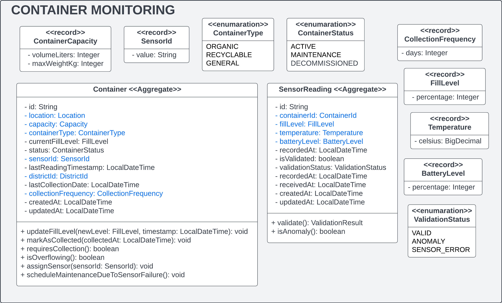

El diagrama de clases del Domain Layer presenta la estructura completa del dominio Container Monitoring, mostrando:

**Elementos DDD implementados:**
- **Aggregate Root**: Container como raíz del agregado con invariantes de negocio
- **Entities**: SensorReading con identidad propia dentro del agregado
- **Value Objects**: Objetos inmutables para conceptos del dominio
- **Domain Services**: Servicios para lógica compleja que no pertenece a una entidad específica
- **Domain Events**: Eventos para comunicación eventual consistency

**Patrones de diseño aplicados:**
- **Factory Pattern**: ContainerFactory y SensorReadingFactory para creación compleja
- **Strategy Pattern**: FillLevelPredictionStrategy para algoritmos intercambiables
- **Observer Pattern**: ContainerEventObserver para manejo reactivo de eventos
- **Repository Pattern**: Interfaces para abstracción de persistencia

**CQRS Implementation:**
- **Commands**: Operaciones de escritura con validaciones de negocio
- **Queries**: Operaciones de lectura optimizadas por caso de uso
- **Command/Query Services**: Separación clara de responsabilidades

**Shared Kernel:**
- Value Objects compartidos entre bounded contexts (Location, MunicipalityId, ContainerType)
- Contratos estables para integración entre contextos

##### 4.2.1.6.2. Bounded Context Database Design Diagram

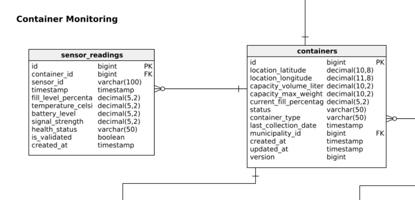

El diseño de base de datos implementa el modelo de dominio con las siguientes características técnicas:

**Tablas principales:**
- **containers**: Aggregate root con datos principales y metadatos de auditoría
- **sensor_readings**: Entity con optimizaciones para datos time-series
- **maintenance_events**: Gestión de eventos de mantenimiento
- **container_events**: Almacenamiento de domain events para procesamiento asíncrono
- **container_analytics_cache**: Cache de análisis para optimización de rendimiento

**Optimizaciones implementadas:**
- **Índices geoespaciales**: GIST indexes para consultas por ubicación
- **Índices temporales**: Optimización para consultas de series de tiempo
- **Triggers automáticos**: Actualización de timestamps y control de versiones
- **Constraints robustos**: Validación de integridad a nivel de base de datos
- **Funciones de limpieza**: Retención automática de datos con políticas configurables

**Características técnicas:**
- **JSONB**: Para datos flexibles de eventos y validaciones
- **Optimistic locking**: Control de concurrencia con campo version
- **Auditoría completa**: Timestamps automáticos para trazabilidad
- **Vistas materializadas**: Para consultas comunes de análisis y reportes

El esquema está optimizado para las operaciones identificadas en el dominio, incluyendo consultas geoespaciales, análisis de tendencias, y procesamiento de grandes volúmenes de datos IoT.

### 4.2.2. Bounded Context: Route Planning

En esta sección se presenta el análisis detallado del bounded context Route Planning, que encapsula toda la lógica de negocio relacionada con la optimización de rutas de recolección, la planificación inteligente de recorridos, y el seguimiento en tiempo real de la ejecución de rutas para maximizar la eficiencia operacional y minimizar costos ambientales.

#### 4.2.2.1. Domain Layer

Esta capa contiene las reglas de negocio fundamentales del dominio de planificación de rutas, implementando algoritmos de optimización avanzados y patrones de diseño para asegurar flexibilidad y escalabilidad en las operaciones de recolección.

**Aggregate Roots:**

1. **`Route` (Aggregate Root)**

Representa el agregado principal del dominio, encapsulando toda la información y comportamiento relacionado con una ruta de recolección, sus waypoints, y métricas de optimización.

**Atributos principales:**

| Atributo              | Tipo                  | Visibilidad | Descripción                                     |
|-----------------------|-----------------------|-------------|-------------------------------------------------|
| `id`                  | `Long`                | `private`   | Identificador único de la ruta en base de datos |
| `routeId`             | `RouteId`             | `private`   | Identificador de dominio de la ruta             |
| `name`                | `String`              | `private`   | Nombre descriptivo de la ruta                   |
| `municipalityId`      | `MunicipalityId`      | `private`   | Municipalidad propietaria de la ruta            |
| `driverId`            | `DriverId`            | `private`   | Conductor asignado a la ruta                    |
| `vehicleId`           | `VehicleId`           | `private`   | Vehículo asignado para la ejecución             |
| `routeType`           | `RouteType`           | `private`   | Tipo de ruta (regular, emergencia, especial)    |
| `status`              | `RouteStatus`         | `private`   | Estado actual de la ruta                        |
| `scheduledDate`       | `LocalDateTime`       | `private`   | Fecha programada de ejecución                   |
| `waypoints`           | `List<Waypoint>`      | `private`   | Lista ordenada de puntos de recolección         |
| `optimizationMetrics` | `OptimizationMetrics` | `private`   | Métricas de optimización y rendimiento          |
| `version`             | `Long`                | `private`   | Control de versión para optimistic locking      |

**Métodos principales:**

| Método                                   | Tipo de Retorno | Visibilidad | Descripción                                           |
|------------------------------------------|-----------------|-------------|-------------------------------------------------------|
| `Route()`                                | `Constructor`   | `protected` | Constructor protegido para repositorio                |
| `Route(name, municipalityId, routeType)` | `Constructor`   | `public`    | Constructor con parámetros esenciales                 |
| `addWaypoint(waypoint)`                  | `void`          | `public`    | Agrega waypoint validando restricciones de capacidad  |
| `removeWaypoint(waypointId)`             | `void`          | `public`    | Elimina waypoint y recalcula secuencia                |
| `startExecution()`                       | `void`          | `public`    | Inicia ejecución publicando eventos de dominio        |
| `completeExecution()`                    | `void`          | `public`    | Marca ruta como completada y calcula métricas finales |
| `optimizeWaypoints(strategy)`            | `void`          | `public`    | Optimiza orden de waypoints usando Strategy pattern   |
| `updateProgress(currentLocation)`        | `void`          | `public`    | Actualiza progreso de ejecución en tiempo real        |
| `isExecutable()`                         | `boolean`       | `public`    | Verifica si la ruta puede ser ejecutada               |
| `canBeModified()`                        | `boolean`       | `public`    | Determina si la ruta permite modificaciones           |

2. **`Waypoint` (Entity)**

Entidad que representa un punto individual de recolección dentro de una ruta, con información específica del contenedor y métricas de servicio.

**Atributos principales:**

| Atributo               | Tipo             | Visibilidad | Descripción                           |
|------------------------|------------------|-------------|---------------------------------------|
| `id`                   | `Long`           | `private`   | Identificador único del waypoint      |
| `waypointId`           | `WaypointId`     | `private`   | Identificador de dominio del waypoint |
| `containerId`          | `ContainerId`    | `private`   | Referencia al contenedor a recolectar |
| `location`             | `Location`       | `private`   | Ubicación geográfica del waypoint     |
| `priority`             | `Priority`       | `private`   | Nivel de prioridad para optimización  |
| `estimatedArrivalTime` | `LocalDateTime`  | `private`   | Hora estimada de llegada              |
| `actualArrivalTime`    | `LocalDateTime`  | `private`   | Hora real de llegada registrada       |
| `sequenceOrder`        | `Integer`        | `private`   | Orden en la secuencia de la ruta      |
| `waypointStatus`       | `WaypointStatus` | `private`   | Estado actual del waypoint            |

**Métodos principales:**

| Método                        | Tipo de Retorno | Visibilidad | Descripción                                |
|-------------------------------|-----------------|-------------|--------------------------------------------|
| `markAsVisited()`             | `void`          | `public`    | Marca waypoint como visitado con timestamp |
| `updateServiceTime(duration)` | `void`          | `public`    | Actualiza tiempo de servicio real          |
| `canBeVisited()`              | `boolean`       | `public`    | Verifica si el waypoint puede ser visitado |
| `isCompleted()`               | `boolean`       | `public`    | Determina si el waypoint está completado   |

3. **`OptimizationResult` (Entity)**

Entidad que almacena los resultados de algoritmos de optimización aplicados a rutas, permitiendo análisis comparativo y mejora continua.

**Atributos principales:**

| Atributo                   | Tipo                    | Visibilidad | Descripción                              |
|----------------------------|-------------------------|-------------|------------------------------------------|
| `algorithmUsed`            | `OptimizationAlgorithm` | `private`   | Algoritmo utilizado para optimización    |
| `executionTime`            | `Duration`              | `private`   | Tiempo de ejecución del algoritmo        |
| `optimizationScore`        | `Double`                | `private`   | Puntuación de calidad de la optimización |
| `totalDistance`            | `Distance`              | `private`   | Distancia total de la ruta optimizada    |
| `estimatedFuelConsumption` | `Double`                | `private`   | Consumo estimado de combustible          |
| `co2Emissions`             | `Double`                | `private`   | Emisiones de CO2 estimadas               |

**Value Objects:**

Los value objects implementan inmutabilidad y encapsulan validaciones específicas del dominio:

- **`RouteId`**: Identificador único con validaciones de formato
- **`RouteStatus`**: Estado con transiciones válidas y restricciones de modificación
- **`WaypointStatus`**: Estado del waypoint con validaciones de progreso
- **`Priority`**: Nivel de prioridad comparable para algoritmos de optimización
- **`Distance`**: Distancia con operaciones matemáticas y conversiones
- **`OptimizationMetrics`**: Métricas complejas con cálculos de eficiencia

**Factories (Creational Pattern):**

1. **`RouteFactory`**: Implementa Factory pattern para crear rutas con diferentes configuraciones (regular, emergencia, optimizada) aplicando validaciones complejas y configuraciones predeterminadas.

2. **`WaypointFactory`**: Crea waypoints desde datos de contenedores, aplicando transformaciones de prioridad y cálculos de tiempo estimado.

**Strategies (Behavioral Pattern):**

El patrón Strategy permite intercambiar algoritmos de optimización dinámicamente:

1. **`TravelingSalesmanStrategy`**: Implementa algoritmo TSP para optimización exacta en rutas pequeñas
2. **`NearestNeighborStrategy`**: Algoritmo heurístico rápido para rutas grandes
3. **`GeneticAlgorithmStrategy`**: Optimización evolutiva para problemas complejos
4. **`HybridOptimizationStrategy`**: Combina múltiples estrategias para resultados óptimos

**State Pattern:**

Gestiona los diferentes estados de una ruta con comportamientos específicos:

1. **`DraftRouteState`**: Permite modificaciones completas y optimización
2. **`OptimizedRouteState`**: Permite asignación pero restricciones de modificación
3. **`ExecutingRouteState`**: Solo permite actualizaciones de progreso
4. **`CompletedRouteState`**: Estado inmutable con métricas finales

**Domain Services:**

1. **`RouteCommandService`**: Orquesta operaciones CQRS de escritura con validaciones complejas
2. **`RouteQueryService`**: Maneja consultas CQRS optimizadas por caso de uso específico
3. **`RouteOptimizationService`**: Coordina algoritmos de optimización usando Strategy pattern
4. **`RouteValidationService`**: Valida restricciones complejas de rutas y capacidades

**Commands (CQRS Write Side):**

- `CreateRouteCommand`: Creación de rutas con validación de recursos
- `OptimizeRouteCommand`: Optimización con parámetros configurables
- `StartRouteExecutionCommand`: Inicio de ejecución con validaciones previas
- `UpdateRouteProgressCommand`: Actualización de progreso en tiempo real
- `CompleteRouteCommand`: Finalización con cálculo de métricas

**Queries (CQRS Read Side):**

- `GetRouteByIdQuery`: Consulta individual con datos completos
- `GetRoutesByDriverQuery`: Rutas asignadas a conductor específico
- `GetOptimizedRoutesQuery`: Rutas optimizadas por criterios específicos
- `GetRouteOptimizationHistoryQuery`: Historial de optimizaciones para análisis
- `GetActiveRoutesQuery`: Rutas en ejecución para monitoring

**Domain Events:**

- `RouteOptimizationCompletedEvent`: Publicado al completar optimización exitosa
- `RouteExecutionStartedEvent`: Publicado al iniciar ejecución de ruta
- `WaypointCompletedEvent`: Publicado al completar cada waypoint
- `RouteDeviationDetectedEvent`: Publicado al detectar desviaciones significativas

#### 4.2.2.2. Interface Layer

Esta capa expone las funcionalidades del bounded context a través de controladores REST especializados y consumidores de eventos, implementando patrones de presentación para manejar la complejidad de las operaciones de optimización.

**Controllers:**

1. **`Route Controller`**: Endpoints REST para operaciones CRUD de rutas, optimización bajo demanda, y actualizaciones de progreso en tiempo real. Implementa MVC pattern y maneja requests desde aplicaciones móviles de conductores y dashboard administrativo.

2. **`Optimization Controller`**: Endpoints especializados para algoritmos de optimización y métricas de rendimiento. Proporciona interfaz de configuración de parámetros de optimización y análisis comparativo de resultados.

3. **`Event Consumer`**: Consumidor Kafka que maneja eventos desde Container Monitoring BC (actualizaciones de fill level) y Municipal Operations BC (disponibilidad de vehículos). Implementa Consumer pattern para procesamiento asíncrono y actualización automática de prioridades.

#### 4.2.2.3. Application Layer

Esta capa coordina las operaciones complejas del dominio y orquesta los flujos de trabajo de optimización, implementando patrones de aplicación para gestionar la complejidad algorítmica y operacional.

**Application Services:**

1. **`Route Service`**: Servicio principal que orquesta operaciones de rutas incluyendo creación, asignaciones, y seguimiento de ejecución. Implementa Command pattern para operaciones de ruta y Facade pattern para simplificar interacciones complejas entre agregados.

2. **`Optimization Service`**: Genera rutas optimizadas usando múltiples algoritmos y datos en tiempo real. Implementa Strategy pattern para diferentes enfoques de optimización y Builder pattern para construcción de configuraciones complejas de optimización.

3. **`Tracking Service`**: Gestiona seguimiento en tiempo real de ejecución de rutas, monitoreo de progreso, y manejo de desviaciones. Implementa State pattern para gestión de estados de ruta y Observer pattern para notificaciones automáticas de eventos críticos.

#### 4.2.2.4. Infrastructure Layer

Esta capa proporciona implementaciones técnicas para persistencia de algoritmos, integración con servicios de mapas, y comunicación con otros bounded contexts, aplicando patrones estructurales para optimizar rendimiento.

**Repositories:**

1. **`Route Repository`**: Implementación JPA para persistencia de rutas con consultas geoespaciales y optimizaciones para histórico de rutas. Implementa Repository pattern con índices especializados para consultas de optimización.

2. **`Optimization Repository`**: Repositorio especializado para resultados de algoritmos con métricas de rendimiento para análisis comparativo y mejora continua de algoritmos.

**External Services:**

1. **`Event Publisher`**: Publica eventos de rutas a otros bounded contexts vía Kafka. Implementa Publisher pattern y Adapter pattern para abstracción de detalles de messaging.

2. **`Cache Service`**: Servicio de caché Redis para cálculos de rutas y datos de optimización frecuentemente accedidos. Implementa Cache-Aside pattern para optimización de rendimiento de algoritmos.

3. **`External Maps Service`**: Integración con Google Maps API para cálculo de rutas reales y datos de tráfico. Implementa Adapter pattern para abstracción de proveedores de mapas y Circuit Breaker pattern para resiliencia.

#### 4.2.2.5. Bounded Context Software Architecture Component Level Diagrams


El diagrama de componentes muestra la arquitectura interna del Route Planning bounded context, ilustrando la separación por capas DDD y las integraciones especializadas para optimización de rutas. Se observa claramente:

- **Interface Layer** (verde claro): Controllers especializados para rutas y optimización, plus event consumers para datos en tiempo real
- **Application Layer** (verde medio): Services que coordinan algoritmos de optimización y seguimiento de ejecución
- **Infrastructure Layer** (verde oscuro): Repositories optimizados para consultas geoespaciales y servicios externos especializados
- **Integraciones críticas**: Google Maps API para cálculos reales, Weather Service para adaptación climática

La arquitectura implementa patrones avanzados como Strategy para algoritmos intercambiables, State para gestión de estados de ruta, y Circuit Breaker para integraciones externas resilientes.

#### 4.2.2.6. Bounded Context Software Architecture Code Level Diagrams

##### 4.2.2.6.1. Bounded Context Domain Layer Class Diagrams

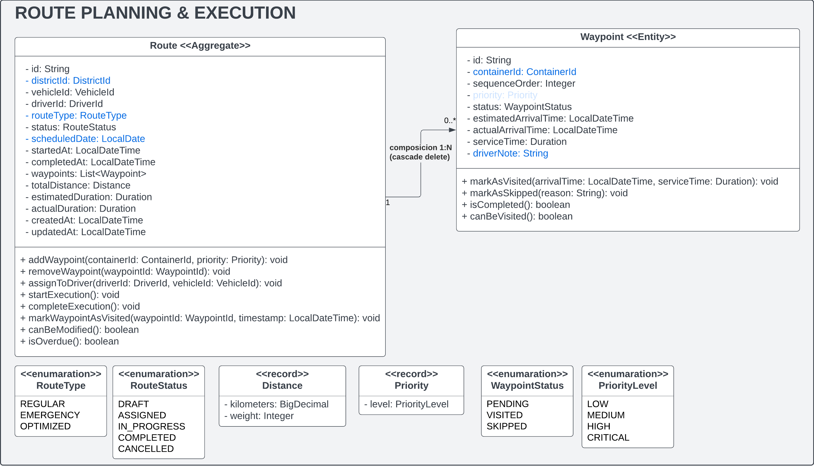

El diagrama de clases del Domain Layer presenta la estructura completa del dominio Route Planning, mostrando:

**Elementos DDD implementados:**
- **Aggregate Root**: Route como raíz del agregado con invariantes de optimización
- **Entities**: Waypoint y OptimizationResult con identidad y ciclo de vida propios
- **Value Objects**: Objetos inmutables para conceptos de optimización y geolocalización
- **Domain Services**: Servicios para algoritmos complejos de optimización
- **Domain Events**: Eventos para coordinación con otros BCs y tracking en tiempo real

**Patrones de diseño aplicados:**
- **Factory Pattern**: RouteFactory y WaypointFactory para creación con validaciones complejas
- **Strategy Pattern**: OptimizationStrategy con múltiples algoritmos (TSP, Genetic, Hybrid)
- **State Pattern**: RouteState para gestión de estados con transiciones válidas
- **Repository Pattern**: Interfaces para abstracción de persistencia geoespacial

**CQRS Implementation:**
- **Commands**: Operaciones de escritura con validaciones de optimización
- **Queries**: Operaciones de lectura optimizadas para análisis y reporting
- **Command/Query Services**: Separación clara con especialización en algoritmos

**Algoritmos de optimización:**
- **Traveling Salesman**: Para rutas pequeñas con solución exacta
- **Genetic Algorithm**: Para optimización evolutiva en problemas complejos
- **Hybrid Strategy**: Combinación inteligente de múltiples enfoques

##### 4.2.2.6.2. Bounded Context Database Design Diagram

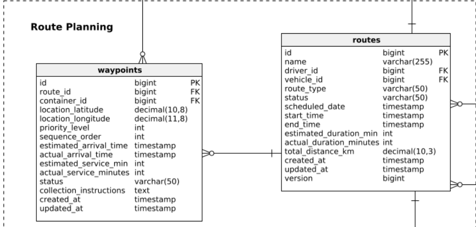

El diseño de base de datos implementa el modelo de dominio con optimizaciones específicas para algoritmos de rutas:

**Tablas principales:**
- **routes**: Aggregate root con métricas de optimización y control de ejecución
- **waypoints**: Entity con índices geoespaciales para consultas de proximidad
- **optimization_results**: Histórico de algoritmos con métricas de rendimiento
- **route_progress**: Seguimiento en tiempo real con actualizaciones frecuentes
- **algorithm_performance_cache**: Cache de rendimiento para selección automática de algoritmos

**Optimizaciones especializadas:**
- **Índices geoespaciales**: GIST indexes para consultas de ubicación y proximidad
- **Índices compuestos**: Para consultas de secuencia y optimización
- **Triggers de progreso**: Actualización automática de métricas de ejecución
- **Funciones de eficiencia**: Cálculos complejos de rendimiento de rutas
- **Particionamiento temporal**: Para datos históricos de optimización

**Características técnicas:**
- **JSONB**: Para parámetros complejos de algoritmos y métricas detalladas
- **Geolocalización avanzada**: Con validaciones de coordenadas y cálculos de distancia
- **Cache de algoritmos**: Para optimización de selección de estrategias
- **Limpieza inteligente**: Retención de mejores resultados por algoritmo

El esquema está optimizado para las operaciones algorítmicas identificadas en el dominio, incluyendo cálculos de rutas óptimas, análisis de rendimiento de algoritmos, y seguimiento GPS en tiempo real con alta frecuencia de actualizaciones.

### 4.2.3. Bounded Context: Municipal Operations

En esta sección se presenta el análisis detallado del bounded context Municipal Operations, que encapsula toda la lógica de negocio relacionada con la gestión de operaciones municipales, administración de distritos, gestión de flotas vehiculares, y coordinación de recursos humanos para optimizar la eficiencia operacional y el control presupuestario municipal.

#### 4.2.3.1. Domain Layer

Esta capa contiene las reglas de negocio fundamentales del dominio de operaciones municipales, implementando patrones avanzados de gestión de recursos y estrategias de mantenimiento para asegurar eficiencia operacional y control de costos.

**Aggregate Roots:**

1. **`District` (Aggregate Root)**

Representa el agregado principal del dominio, encapsulando toda la información y comportamiento relacionado con un distrito municipal, sus recursos asignados, presupuesto, y métricas de rendimiento operacional.

**Atributos principales:**

| Atributo             | Tipo                 | Visibilidad | Descripción                                       |
|----------------------|----------------------|-------------|---------------------------------------------------|
| `id`                 | `Long`               | `private`   | Identificador único del distrito en base de datos |
| `districtId`         | `DistrictId`         | `private`   | Identificador de dominio del distrito             |
| `name`               | `String`             | `private`   | Nombre oficial del distrito municipal             |
| `municipalityId`     | `MunicipalityId`     | `private`   | Municipalidad a la que pertenece                  |
| `administratorId`    | `AdministratorId`    | `private`   | Administrador responsable del distrito            |
| `boundaries`         | `GeographicBoundary` | `private`   | Límites geográficos del distrito                  |
| `population`         | `Population`         | `private`   | Datos demográficos del distrito                   |
| `budget`             | `Budget`             | `private`   | Presupuesto asignado con categorías               |
| `operationalStatus`  | `OperationalStatus`  | `private`   | Estado operacional actual                         |
| `resources`          | `List<Resource>`     | `private`   | Recursos asignados al distrito                    |
| `performanceMetrics` | `PerformanceMetrics` | `private`   | Métricas de rendimiento operacional               |

**Métodos principales:**

| Método                                 | Tipo de Retorno       | Visibilidad | Descripción                                            |
|----------------------------------------|-----------------------|-------------|--------------------------------------------------------|
| `allocateResource(resource)`           | `void`                | `public`    | Asigna recurso validando disponibilidad presupuestaria |
| `deallocateResource(resourceId)`       | `void`                | `public`    | Libera recurso y actualiza utilización                 |
| `updateBudget(newBudget)`              | `void`                | `public`    | Actualiza presupuesto con validaciones fiscales        |
| `assignAdministrator(administratorId)` | `void`                | `public`    | Asigna administrador con verificación de autorización  |
| `calculateOperationalCost()`           | `MonetaryAmount`      | `public`    | Calcula costo operacional total del distrito           |
| `isWithinBoundaries(location)`         | `boolean`             | `public`    | Verifica si ubicación está dentro de límites           |
| `hasAvailableCapacity()`               | `boolean`             | `public`    | Determina si hay capacidad para nuevos recursos        |
| `getResourceUtilization()`             | `ResourceUtilization` | `public`    | Calcula utilización actual de recursos                 |

2. **`Vehicle` (Aggregate Root)**

Representa un vehículo de la flota municipal con capacidades de tracking GPS, historial de mantenimiento, y métricas operacionales para optimización de costos.

**Atributos principales:**

| Atributo              | Tipo                      | Visibilidad | Descripción                                      |
|-----------------------|---------------------------|-------------|--------------------------------------------------|
| `vehicleId`           | `VehicleId`               | `private`   | Identificador de dominio del vehículo            |
| `registrationNumber`  | `String`                  | `private`   | Número de placa único                            |
| `vehicleType`         | `VehicleType`             | `private`   | Tipo de vehículo (recolector, compactador, etc.) |
| `capacity`            | `VehicleCapacity`         | `private`   | Capacidad de carga del vehículo                  |
| `status`              | `VehicleStatus`           | `private`   | Estado operacional actual                        |
| `maintenanceHistory`  | `List<MaintenanceRecord>` | `private`   | Historial completo de mantenimiento              |
| `operationalMetrics`  | `OperationalMetrics`      | `private`   | Métricas de eficiencia y costo                   |
| `gpsTracker`          | `GPSTracker`              | `private`   | Sistema de tracking GPS                          |
| `nextMaintenanceDate` | `LocalDateTime`           | `private`   | Fecha programada de próximo mantenimiento        |

**Métodos principales:**

| Método                            | Tipo de Retorno  | Visibilidad | Descripción                                     |
|-----------------------------------|------------------|-------------|-------------------------------------------------|
| `assignToDistrict(districtId)`    | `void`           | `public`    | Asigna vehículo a distrito específico           |
| `assignDriver(driverId)`          | `void`           | `public`    | Asigna conductor validando certificaciones      |
| `scheduleMaintenance(type, date)` | `void`           | `public`    | Programa mantenimiento usando Strategy pattern  |
| `recordMaintenance(record)`       | `void`           | `public`    | Registra mantenimiento completado               |
| `isAvailableForRoute()`           | `boolean`        | `public`    | Verifica disponibilidad para asignación de ruta |
| `requiresMaintenance()`           | `boolean`        | `public`    | Determina si requiere mantenimiento             |
| `calculateOperationalCost()`      | `MonetaryAmount` | `public`    | Calcula costo operacional por período           |
| `updateLocation(location)`        | `void`           | `public`    | Actualiza ubicación GPS en tiempo real          |

3. **`Driver` (Aggregate Root)**

Representa un conductor municipal con información personal, certificaciones, horarios de trabajo, y métricas de rendimiento para gestión de recursos humanos.

**Atributos principales:**

| Atributo            | Tipo                  | Visibilidad | Descripción                            |
|---------------------|-----------------------|-------------|----------------------------------------|
| `driverId`          | `DriverId`            | `private`   | Identificador de dominio del conductor |
| `personalInfo`      | `PersonalInfo`        | `private`   | Información personal y documentos      |
| `licenseInfo`       | `LicenseInfo`         | `private`   | Información de licencia de conducir    |
| `employmentStatus`  | `EmploymentStatus`    | `private`   | Estado laboral actual                  |
| `workSchedule`      | `WorkSchedule`        | `private`   | Horario de trabajo detallado           |
| `performanceRecord` | `PerformanceRecord`   | `private`   | Registro de rendimiento laboral        |
| `certifications`    | `List<Certification>` | `private`   | Certificaciones y capacitaciones       |

**Métodos principales:**

| Método                           | Tipo de Retorno | Visibilidad | Descripción                                  |
|----------------------------------|-----------------|-------------|----------------------------------------------|
| `assignToDistrict(districtId)`   | `void`          | `public`    | Asigna conductor a distrito específico       |
| `assignVehicle(vehicleId)`       | `void`          | `public`    | Asigna vehículo verificando compatibilidad   |
| `updateWorkSchedule(schedule)`   | `void`          | `public`    | Actualiza horario con validaciones laborales |
| `recordPerformance(metrics)`     | `void`          | `public`    | Registra métricas de rendimiento             |
| `isAvailableForAssignment()`     | `boolean`       | `public`    | Verifica disponibilidad para asignación      |
| `canOperateVehicle(vehicleType)` | `boolean`       | `public`    | Verifica si puede operar tipo de vehículo    |
| `calculateWorkingHours(period)`  | `Duration`      | `public`    | Calcula horas trabajadas en período          |

**Entities:**

4. **`Resource` (Entity)**

Entidad que representa recursos asignados a distritos con seguimiento de utilización y costos operacionales.

5. **`MaintenanceRecord` (Entity)**

Entidad que registra eventos de mantenimiento vehicular con costos, técnicos, y resultados.

**Value Objects:**

Los value objects implementan inmutabilidad y encapsulan validaciones específicas del dominio municipal:

- **`GeographicBoundary`**: Límites geográficos con validaciones de contención
- **`Budget`**: Presupuesto con categorías y validaciones fiscales
- **`VehicleCapacity`**: Capacidad con validaciones de carga
- **`WorkSchedule`**: Horarios con validaciones laborales
- **`PerformanceMetrics`**: Métricas con cálculos de eficiencia

**Factories (Creational Pattern):**

1. **`DistrictFactory`**: Implementa Factory pattern para crear distritos con configuraciones específicas (urbanos con alta densidad, rurales con grandes áreas) aplicando validaciones presupuestarias.

2. **`VehicleFactory`**: Crea diferentes tipos de vehículos (recolectores, compactadores, mantenimiento) con configuraciones específicas y equipamiento.

3. **`ResourceAllocationFactory`**: Gestiona creación de asignaciones de recursos con validaciones de capacidad y presupuesto.

**Strategies (Behavioral Pattern):**

El patrón Strategy permite intercambiar políticas de mantenimiento dinámicamente:

1. **`PreventiveMaintenanceStrategy`**: Mantenimiento programado basado en tiempo/kilometraje
2. **`CorrectiveMaintenanceStrategy`**: Mantenimiento reactivo para reparaciones
3. **`PredictiveMaintenanceStrategy`**: Mantenimiento basado en análisis de datos IoT

**Builder Pattern:**

1. **`DistrictBuilder`**: Construcción compleja de distritos con múltiples recursos y configuraciones
2. **`VehicleConfigurationBuilder`**: Configuración detallada de vehículos con equipamiento especializado

**Domain Services:**

1. **`MunicipalCommandService`**: Orquesta operaciones CQRS de escritura para entidades municipales
2. **`MunicipalQueryService`**: Maneja consultas CQRS optimizadas para reportes municipales
3. **`ResourceAllocationService`**: Optimiza distribución de recursos entre distritos
4. **`FleetManagementService`**: Coordina operaciones de flota usando Strategy pattern
5. **`PerformanceAnalysisService`**: Genera análisis de rendimiento operacional

**Commands (CQRS Write Side):**

- `CreateDistrictCommand`: Creación de distritos con validaciones geográficas
- `RegisterVehicleCommand`: Registro de vehículos con validaciones técnicas
- `RegisterDriverCommand`: Registro de conductores con verificación de certificaciones
- `AllocateResourceCommand`: Asignación de recursos con validaciones presupuestarias
- `ScheduleMaintenanceCommand`: Programación de mantenimiento vehicular

**Queries (CQRS Read Side):**

- `GetDistrictsByMunicipalityQuery`: Consulta de distritos por municipalidad
- `GetVehiclesByDistrictQuery`: Consulta de vehículos por distrito y estado
- `GetAvailableDriversQuery`: Consulta de conductores disponibles por turno
- `GetMaintenanceScheduleQuery`: Cronograma de mantenimiento por período
- `GetResourceUtilizationQuery`: Análisis de utilización de recursos

**Domain Events:**

- `DistrictCreatedEvent`: Publicado al crear nuevos distritos municipales
- `VehicleAssignedEvent`: Publicado al asignar vehículos a distritos o conductores
- `MaintenanceScheduledEvent`: Publicado al programar mantenimiento vehicular
- `ResourceAllocatedEvent`: Publicado al asignar recursos a distritos

#### 4.2.3.2. Interface Layer

Esta capa expone las funcionalidades del bounded context a través de controladores REST especializados en gestión municipal y consumidores de eventos para coordinación operacional.

**Controllers:**

1. **`District Controller`**: Endpoints REST para operaciones CRUD de distritos, asignación de recursos, y monitoreo de rendimiento. Maneja requests desde dashboard administrativo con validaciones de autorización municipal.

2. **`Vehicle Controller`**: Endpoints especializados para gestión de flota vehicular, programación de mantenimiento, y seguimiento de disponibilidad. Proporciona interfaces para tracking GPS y gestión de asignaciones.

3. **`Driver Controller`**: Endpoints para gestión de conductores, programación de turnos, y seguimiento de rendimiento. Implementa validaciones de certificaciones y horarios laborales.

4. **`Event Consumer`**: Consumidor Kafka que maneja eventos desde Route Planning BC (finalización de rutas) y Payment & Subscriptions BC (actualizaciones de facturación municipal). Implementa Consumer pattern para procesamiento asíncrono.

#### 4.2.3.3. Application Layer

Esta capa coordina las operaciones municipales complejas y orquesta los flujos de trabajo de gestión de recursos, implementando patrones para optimizar eficiencia operacional.

**Application Services:**

1. **`Municipal Service`**: Servicio principal que orquesta operaciones municipales incluyendo gestión de distritos, coordinación de recursos, y coordinación operacional. Implementa Command pattern para operaciones municipales y Facade pattern para simplificar interacciones complejas.

2. **`Fleet Service`**: Gestiona operaciones de flota vehicular, programación de mantenimiento, y optimización de disponibilidad. Implementa Strategy pattern para políticas de mantenimiento y Template Method pattern para diferentes tipos de análisis de flota.

3. **`Resource Service`**: Maneja asignación de recursos, planificación de capacidad, y optimización de eficiencia operacional. Implementa Factory pattern para creación de recursos y Builder pattern para configuraciones complejas de asignación.

#### 4.2.3.4. Infrastructure Layer

Esta capa proporciona implementaciones técnicas para persistencia de datos municipales, notificaciones operacionales, y comunicación con otros bounded contexts.

**Repositories:**

1. **`District Repository`**: Implementación JPA para persistencia de distritos con consultas jerárquicas y límites geográficos. Implementa Repository pattern con optimizaciones para consultas geoespaciales complejas.

2. **`Vehicle Repository`**: Repositorio especializado para datos de flota con historial de mantenimiento y seguimiento de disponibilidad. Incluye optimizaciones para consultas de tracking GPS.

3. **`Driver Repository`**: Repositorio para datos de conductores con métricas de rendimiento y gestión de horarios. Optimizado para consultas de disponibilidad y certificaciones.

**External Services:**

1. **`Event Publisher`**: Publica eventos de operaciones municipales a otros bounded contexts vía Kafka. Implementa Publisher pattern y Adapter pattern para abstracción de messaging.

2. **`Cache Service`**: Servicio de caché Redis para datos municipales frecuentemente accedidos y disponibilidad de recursos. Implementa Cache-Aside pattern para optimización de consultas geográficas.

3. **`Notification Service`**: Envía notificaciones operacionales vía email y SMS para alertas de mantenimiento y actualizaciones de horarios. Implementa Adapter pattern para múltiples proveedores de notificaciones.

#### 4.2.3.5. Bounded Context Software Architecture Component Level Diagrams


El diagrama de componentes muestra la arquitectura interna del Municipal Operations bounded context, ilustrando la separación por capas DDD y las especializaciones para gestión municipal. Se observa claramente:

- **Interface Layer** (verde claro): Controllers especializados para distritos, vehículos y conductores, plus event consumers para coordinación operacional
- **Application Layer** (verde medio): Services que coordinan operaciones municipales, gestión de flotas, y asignación de recursos
- **Infrastructure Layer** (verde oscuro): Repositories optimizados para datos geográficos y servicios de notificación especializados
- **Integraciones operacionales**: Email y SMS services para notificaciones críticas, comunicación con Route Planning BC y Payment BC

La arquitectura implementa patrones avanzados como Strategy para políticas de mantenimiento, Builder para configuraciones complejas, y Factory para diferentes tipos de recursos municipales.

#### 4.2.3.6. Bounded Context Software Architecture Code Level Diagrams

##### 4.2.3.6.1. Bounded Context Domain Layer Class Diagrams

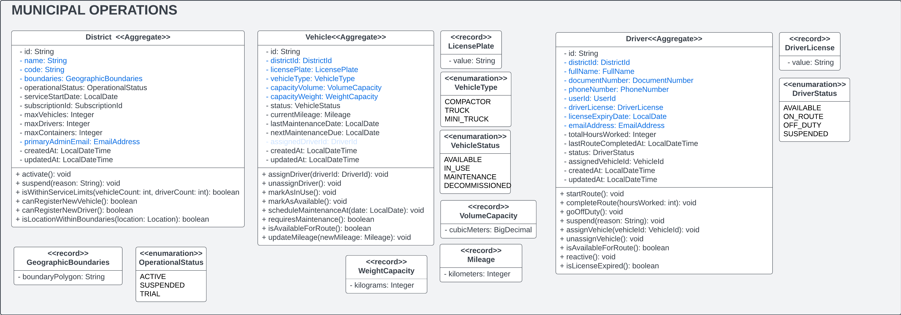

El diagrama de clases del Domain Layer presenta la estructura completa del dominio Municipal Operations, mostrando:

**Elementos DDD implementados:**
- **Aggregate Roots**: District, Vehicle, Driver como raíces con invariantes municipales
- **Entities**: Resource y MaintenanceRecord con identidad y ciclo de vida específicos
- **Value Objects**: Objetos inmutables para conceptos municipales complejos
- **Domain Services**: Servicios para operaciones municipales complejas
- **Domain Events**: Eventos para coordinación operacional entre distritos

**Patrones de diseño aplicados:**
- **Factory Pattern**: DistrictFactory, VehicleFactory, ResourceAllocationFactory para creación especializada
- **Strategy Pattern**: MaintenanceStrategy con múltiples políticas (Preventivo, Correctivo, Predictivo)
- **Builder Pattern**: DistrictBuilder y VehicleConfigurationBuilder para construcción compleja
- **Repository Pattern**: Interfaces para abstracción de persistencia municipal

**CQRS Implementation:**
- **Commands**: Operaciones de escritura con validaciones municipales
- **Queries**: Operaciones de lectura optimizadas para reportes y análisis
- **Command/Query Services**: Separación clara con especialización municipal

**Gestión de recursos:**
- **Resource allocation**: Algoritmos de asignación con validaciones presupuestarias
- **Fleet management**: Gestión completa de flotas con mantenimiento predictivo
- **Performance tracking**: Métricas operacionales con análisis temporal

##### 4.2.3.6.2. Bounded Context Database Design Diagram


El diseño de base de datos implementa el modelo de dominio con optimizaciones específicas para operaciones municipales:

**Tablas principales:**
- **districts**: Aggregate root con límites geográficos, presupuestos y métricas de rendimiento
- **vehicles**: Aggregate root con tracking GPS, historial de mantenimiento y asignaciones
- **drivers**: Aggregate root con certificaciones, horarios de trabajo y rendimiento
- **resources**: Entity para gestión de recursos con utilización y costos
- **maintenance_records**: Historial completo de mantenimiento con técnicos y costos

**Tablas auxiliares especializadas:**
- **driver_certifications**: Gestión de certificaciones con fechas de vencimiento
- **work_schedules**: Horarios detallados por día de la semana
- **performance_history**: Historial temporal de métricas operacionales

**Optimizaciones municipales:**
- **Índices geoespaciales**: GIST indexes para límites distritales y tracking vehicular
- **Índices GIN**: Para consultas complejas en datos JSONB de límites geográficos
- **Triggers bidireccionales**: Sincronización automática entre conductores y vehículos
- **Funciones de eficiencia**: Cálculos operacionales complejos por distrito
- **Constraints municipales**: Validaciones específicas para operaciones municipales

**Características técnicas:**
- **JSONB avanzado**: Para límites geográficos complejos y configuraciones vehiculares
- **Tracking GPS completo**: Con validaciones de coordenadas y historial de ubicaciones
- **Gestión de horarios**: Sistema completo de turnos y disponibilidad
- **Análisis de rendimiento**: Métricas temporales con agregaciones optimizadas

El esquema está optimizado para las operaciones municipales identificadas en el dominio, incluyendo gestión de flotas con GPS en tiempo real, programación de mantenimiento predictivo, análisis de eficiencia operacional, y gestión presupuestaria con validaciones fiscales.

### 4.2.4. Bounded Context: Community Relations

En esta sección se presenta el análisis detallado del bounded context Community Relations, que encapsula toda la lógica de negocio relacionada con el engagement ciudadano, gestión de reportes comunitarios, sistemas de recompensas gamificados, y comunicación omnicanal para fomentar la participación activa de los ciudadanos en la gestión municipal de residuos.

#### 4.2.4.1. Domain Layer

Esta capa contiene las reglas de negocio fundamentales del dominio de relaciones comunitarias, implementando patrones avanzados de gamificación y engagement para maximizar la participación ciudadana y mejorar la calidad del servicio municipal.

**Aggregate Roots:**

1. **`Citizen` (Aggregate Root)**

Representa el agregado principal del dominio, encapsulando toda la información y comportamiento relacionado con un ciudadano, su nivel de engagement, historial de participación, y acumulación de recompensas en el sistema gamificado.

**Atributos principales:**

| Atributo            | Tipo                 | Visibilidad | Descripción                                            |
|---------------------|----------------------|-------------|--------------------------------------------------------|
| `id`                | `Long`               | `private`   | Identificador único del ciudadano en base de datos     |
| `citizenId`         | `CitizenId`          | `private`   | Identificador de dominio del ciudadano                 |
| `personalInfo`      | `PersonalInfo`       | `private`   | Información personal y documentos de identidad         |
| `contactInfo`       | `ContactInfo`        | `private`   | Información de contacto y preferencias de comunicación |
| `membershipLevel`   | `MembershipLevel`    | `private`   | Nivel de membresía en programa de recompensas          |
| `engagementLevel`   | `EngagementLevel`    | `private`   | Nivel de participación ciudadana calculado             |
| `engagementScore`   | `EngagementScore`    | `private`   | Puntuación numérica de engagement                      |
| `totalRewardPoints` | `RewardPoints`       | `private`   | Puntos acumulados en sistema de recompensas            |
| `preferences`       | `CitizenPreferences` | `private`   | Preferencias de notificación y privacidad              |
| `registrationDate`  | `LocalDateTime`      | `private`   | Fecha de registro en la plataforma                     |
| `lastActivity`      | `LocalDateTime`      | `private`   | Timestamp de última actividad                          |

**Métodos principales:**

| Método                             | Tipo de Retorno   | Visibilidad | Descripción                                         |
|------------------------------------|-------------------|-------------|-----------------------------------------------------|
| `submitReport(report)`             | `void`            | `public`    | Envía reporte ciudadano validando reglas de negocio |
| `earnRewardPoints(points, reason)` | `void`            | `public`    | Acumula puntos de recompensa con auditoría          |
| `redeemRewards(redemption)`        | `void`            | `public`    | Canjea recompensas validando disponibilidad         |
| `updateEngagementLevel()`          | `void`            | `public`    | Recalcula nivel de engagement basado en actividad   |
| `canSubmitReport()`                | `boolean`         | `public`    | Verifica si puede enviar reportes según reglas      |
| `calculateEngagementScore()`       | `EngagementScore` | `public`    | Calcula puntuación de engagement actual             |
| `getActiveReports()`               | `List<Report>`    | `public`    | Obtiene reportes pendientes del ciudadano           |
| `updatePreferences(preferences)`   | `void`            | `public`    | Actualiza preferencias de comunicación              |

2. **`Report` (Aggregate Root)**

Representa un reporte ciudadano con workflow de estados, geolocalización, y sistema de feedback para asegurar resolución efectiva de problemas comunitarios.

**Atributos principales:**

| Atributo         | Tipo                | Visibilidad | Descripción                             |
|------------------|---------------------|-------------|-----------------------------------------|
| `reportId`       | `ReportId`          | `private`   | Identificador de dominio del reporte    |
| `citizenId`      | `CitizenId`         | `private`   | Ciudadano que envió el reporte          |
| `reportType`     | `ReportType`        | `private`   | Tipo de problema reportado              |
| `title`          | `String`            | `private`   | Título descriptivo del reporte          |
| `description`    | `String`            | `private`   | Descripción detallada del problema      |
| `location`       | `Location`          | `private`   | Ubicación geográfica del problema       |
| `priority`       | `Priority`          | `private`   | Nivel de prioridad del reporte          |
| `status`         | `ReportStatus`      | `private`   | Estado actual en workflow               |
| `images`         | `List<ReportImage>` | `private`   | Evidencia fotográfica del problema      |
| `feedback`       | `CitizenFeedback`   | `private`   | Feedback del ciudadano sobre resolución |
| `resolutionTime` | `Duration`          | `private`   | Tiempo total de resolución              |

**Métodos principales:**

| Método                      | Tipo de Retorno | Visibilidad | Descripción                                   |
|-----------------------------|-----------------|-------------|-----------------------------------------------|
| `acknowledge()`             | `void`          | `public`    | Marca reporte como reconocido por autoridades |
| `startProcessing()`         | `void`          | `public`    | Inicia procesamiento usando State pattern     |
| `resolve(resolution)`       | `void`          | `public`    | Resuelve reporte con descripción de solución  |
| `addFeedback(feedback)`     | `void`          | `public`    | Agrega feedback ciudadano sobre resolución    |
| `calculateResolutionTime()` | `Duration`      | `public`    | Calcula tiempo total de resolución            |
| `canBeResolved()`           | `boolean`       | `public`    | Verifica si reporte puede ser resuelto        |
| `isOverdue()`               | `boolean`       | `public`    | Determina si reporte excede tiempo esperado   |

3. **`RewardsProgram` (Aggregate Root)**

Representa un programa de recompensas configurable con reglas específicas, opciones de canje, y métricas de participación para incentivar engagement ciudadano.

**Atributos principales:**

| Atributo             | Tipo                     | Visibilidad | Descripción                                    |
|----------------------|--------------------------|-------------|------------------------------------------------|
| `programId`          | `ProgramId`              | `private`   | Identificador del programa de recompensas      |
| `name`               | `String`                 | `private`   | Nombre del programa                            |
| `rules`              | `RewardRules`            | `private`   | Reglas configurables de otorgamiento de puntos |
| `redemptionOptions`  | `List<RedemptionOption>` | `private`   | Opciones disponibles para canje                |
| `isActive`           | `boolean`                | `private`   | Estado de activación del programa              |
| `participants`       | `Integer`                | `private`   | Número total de participantes                  |
| `totalPointsAwarded` | `Long`                   | `private`   | Puntos totales otorgados                       |

**Entities:**

4. **`ReportImage` (Entity)**

Entidad que representa evidencia fotográfica adjunta a reportes ciudadanos con validaciones de formato y tamaño.

5. **`Notification` (Entity)**

Entidad que gestiona comunicaciones dirigidas a ciudadanos con soporte multi-canal y tracking de entrega.

**Value Objects:**

Los value objects implementan inmutabilidad y encapsulan validaciones específicas del dominio de engagement:

- **`PersonalInfo`**: Información personal con validaciones de documentos de identidad
- **`EngagementLevel`**: Nivel de participación con cálculos automáticos de progreso
- **`RewardPoints`**: Puntos con fecha de expiración y operaciones matemáticas
- **`CitizenPreferences`**: Preferencias de notificación y configuración de privacidad
- **`CitizenFeedback`**: Feedback estructurado con ratings y comentarios

**Factories (Creational Pattern):**

1. **`CitizenFactory`**: Implementa Factory pattern para crear ciudadanos con diferentes configuraciones (registrados con datos completos, invitados con información mínima) aplicando validaciones específicas por tipo.

2. **`ReportFactory`**: Crea diferentes tipos de reportes (emergencia con alta prioridad, contenedores con geolocalización automática, sugerencias con workflow simplificado) con configuraciones predeterminadas.

3. **`NotificationFactory`**: Genera notificaciones contextuales según tipo de evento y preferencias ciudadanas, aplicando templates y canales apropiados.

**Strategies (Behavioral Pattern):**

El patrón Strategy permite intercambiar algoritmos de cálculo de recompensas dinámicamente:

1. **`BasicRewardStrategy`**: Algoritmo simple basado en acciones básicas ciudadanas
2. **`TieredRewardStrategy`**: Recompensas escalonadas según nivel de membresía
3. **`SeasonalRewardStrategy`**: Bonificaciones especiales por campañas temporales
4. **`CommunityRewardStrategy`**: Recompensas por actividades colaborativas comunitarias

**State Pattern:**

Gestiona los diferentes estados de un reporte con comportamientos y transiciones específicas:

1. **`SubmittedReportState`**: Permite edición limitada y asignación de prioridad
2. **`AcknowledgedReportState`**: En proceso de validación por autoridades
3. **`InProgressReportState`**: Siendo atendido con actualizaciones de progreso
4. **`ResolvedReportState`**: Resuelto pendiente de feedback ciudadano
5. **`ClosedReportState`**: Estado final con métricas de resolución

**Domain Services:**

1. **`CitizenCommandService`**: Orquesta operaciones CQRS de escritura para gestión ciudadana
2. **`CitizenQueryService`**: Maneja consultas CQRS optimizadas para análisis de engagement
3. **`EngagementAnalysisService`**: Analiza patrones de participación y calcula métricas de engagement
4. **`RewardsManagementService`**: Gestiona lógica compleja de recompensas y gamificación
5. **`ReportRoutingService`**: Enruta reportes a servicios apropiados según tipo y ubicación

**Commands (CQRS Write Side):**

- `RegisterCitizenCommand`: Registro de ciudadanos con validación de datos
- `SubmitReportCommand`: Envío de reportes con validaciones geográficas
- `EarnRewardsCommand`: Otorgamiento de puntos con auditoría
- `RedeemRewardsCommand`: Canje de recompensas con validación de disponibilidad
- `UpdateEngagementCommand`: Actualización de métricas de participación

**Queries (CQRS Read Side):**

- `GetCitizenByIdQuery`: Consulta individual de ciudadano con engagement
- `GetCitizensByEngagementLevelQuery`: Consulta por nivel de participación
- `GetReportsByLocationQuery`: Consulta geoespacial de reportes
- `GetCitizenRewardsHistoryQuery`: Historial completo de recompensas
- `GetEngagementAnalyticsQuery`: Análisis agregado de participación comunitaria

**Domain Events:**

- `CitizenRegisteredEvent`: Publicado al registrar nuevos ciudadanos
- `ReportSubmittedEvent`: Publicado al enviar reportes ciudadanos
- `ReportResolvedEvent`: Publicado al resolver problemas reportados
- `RewardsEarnedEvent`: Publicado al otorgar puntos de recompensas
- `EngagementLevelChangedEvent`: Publicado al cambiar nivel de participación

#### 4.2.4.2. Interface Layer

Esta capa expone las funcionalidades del bounded context a través de controladores REST especializados en engagement ciudadano y consumidores de eventos para actualizaciones automáticas del sistema de recompensas.

**Controllers:**

1. **`Citizen Controller`**: Endpoints REST para registro y gestión de ciudadanos, actualización de perfiles, y consulta de métricas de engagement. Maneja requests desde aplicación móvil ciudadana con validaciones de autorización.

2. **`Report Controller`**: Endpoints especializados para envío de reportes ciudadanos, seguimiento de estados, y gestión de feedback. Implementa validaciones geográficas y de contenido, soporta upload de imágenes con compresión automática.

3. **`Rewards Controller`**: Endpoints para gestión del sistema de recompensas, consulta de puntos disponibles, historial de transacciones, y procesos de canje. Implementa validaciones de elegibilidad y disponibilidad de recompensas.

4. **`Event Consumer`**: Consumidor Kafka que maneja eventos desde Container Monitoring BC (actualizaciones de estado de contenedores reportados) y Route Planning BC (confirmaciones de recolección). Implementa Consumer pattern para otorgamiento automático de recompensas.

#### 4.2.4.3. Application Layer

Esta capa coordina las operaciones complejas de engagement ciudadano y orquesta los flujos de trabajo de gamificación, implementando patrones para maximizar participación y satisfacción ciudadana.

**Application Services:**

1. **`Citizen Service`**: Servicio principal que orquesta operaciones ciudadanas incluyendo registro, gestión de perfiles, y tracking de engagement. Implementa Command pattern para operaciones ciudadanas y Facade pattern para simplificar interacciones complejas con sistema de recompensas.

2. **`Report Service`**: Gestiona flujo completo de reportes ciudadanos, validación, enrutamiento a servicios apropiados, y loops de feedback. Implementa State pattern para workflow de reportes y Template Method pattern para diferentes tipos de procesamiento según categoría de reporte.

3. **`Rewards Service`**: Maneja lógica completa del sistema de recompensas, cálculo de puntos, procesamiento de canjes, y features de gamificación. Implementa Strategy pattern para algoritmos de recompensas y Observer pattern para eventos de logros y milestones.

#### 4.2.4.4. Infrastructure Layer

Esta capa proporciona implementaciones técnicas para persistencia de datos de engagement, notificaciones multi-canal, y comunicación con otros bounded contexts para mantener coherencia del sistema de recompensas.

**Repositories:**

1. **`Citizen Repository`**: Implementación JPA para persistencia de ciudadanos con historial de engagement y preferencias. Implementa Repository pattern con optimizaciones para consultas de participación y análisis de tendencias.

2. **`Report Repository`**: Repositorio especializado para reportes ciudadanos con consultas geoespaciales y tracking de estados. Incluye optimizaciones para búsquedas por proximidad y análisis de patrones temporales.

3. **`Rewards Repository`**: Repositorio para datos de recompensas con historial de transacciones y tracking de canjes. Optimizado para consultas de balance de puntos y análisis de utilización del programa.

**External Services:**

1. **`Event Publisher`**: Publica eventos de community relations a otros bounded contexts vía Kafka. Implementa Publisher pattern y Adapter pattern para abstracción de detalles de messaging.

2. **`Cache Service`**: Servicio de caché Redis para datos de ciudadanos frecuentemente accedidos y cálculos de recompensas. Implementa Cache-Aside pattern para optimización de consultas de engagement.

3. **`Notification Service`**: Envía notificaciones ciudadanas vía email, SMS, y push notifications para reportes y recompensas. Implementa Adapter pattern para múltiples proveedores y Template pattern para diferentes tipos de comunicación.

#### 4.2.4.5. Bounded Context Software Architecture Component Level Diagrams


El diagrama de componentes muestra la arquitectura interna del Community Relations bounded context, ilustrando la separación por capas DDD y las especializaciones para engagement ciudadano y gamificación. Se observa claramente:

- **Interface Layer** (verde claro): Controllers especializados para ciudadanos, reportes y recompensas, plus event consumers para actualizaciones automáticas desde otros BCs
- **Application Layer** (verde medio): Services que coordinan engagement ciudadano, gestión de reportes con workflow de estados, y sistema de recompensas gamificado
- **Infrastructure Layer** (verde oscuro): Repositories optimizados para datos de engagement y servicios de notificación multi-canal
- **Integraciones ciudadanas**: Email, SMS y Push notification services para comunicación omnicanal con ciudadanos

La arquitectura implementa patrones avanzados como Strategy para cálculos de recompensas dinámicos, State para workflow de reportes, y Factory para diferentes tipos de notificaciones según contexto y preferencias ciudadanas.

#### 4.2.4.6. Bounded Context Software Architecture Code Level Diagrams

##### 4.2.4.6.1. Bounded Context Domain Layer Class Diagrams

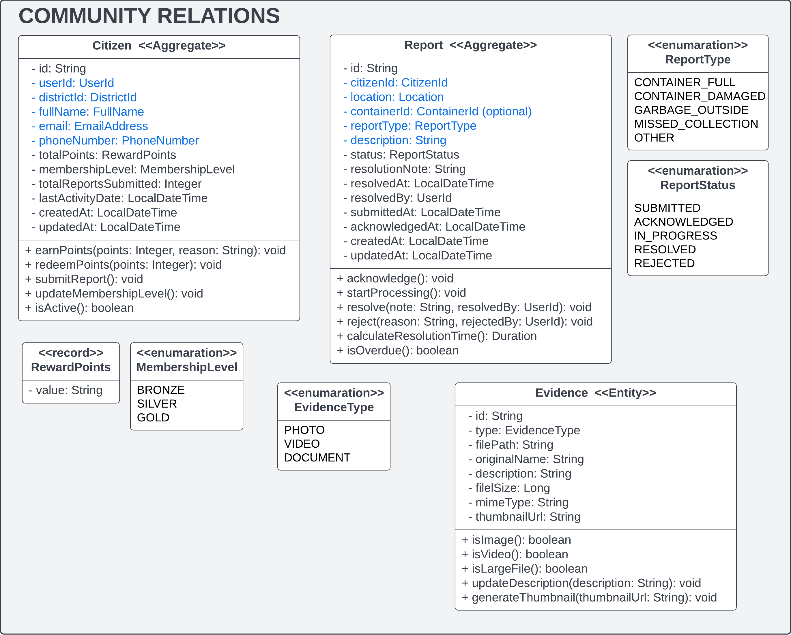

El diagrama de clases del Domain Layer presenta la estructura completa del dominio Community Relations, mostrando:

**Elementos DDD implementados:**
- **Aggregate Roots**: Citizen, Report, RewardsProgram como raíces con invariantes de engagement y gamificación
- **Entities**: ReportImage y Notification con identidad y ciclo de vida específicos
- **Value Objects**: Objetos inmutables para conceptos de engagement y gamificación
- **Domain Services**: Servicios para análisis de engagement y gestión de recompensas
- **Domain Events**: Eventos para tracking de participación y logros ciudadanos

**Patrones de diseño aplicados:**
- **Factory Pattern**: CitizenFactory, ReportFactory, NotificationFactory para creación contextual
- **Strategy Pattern**: RewardCalculationStrategy con múltiples algoritmos (Básico, Por Niveles, Estacional)
- **State Pattern**: ReportState para gestión de workflow de reportes ciudadanos
- **Repository Pattern**: Interfaces para abstracción de persistencia de engagement

**CQRS Implementation:**
- **Commands**: Operaciones de escritura con validaciones de engagement
- **Queries**: Operaciones de lectura optimizadas para análisis de participación
- **Command/Query Services**: Separación clara con especialización en gamificación

**Sistema de gamificación:**
- **Reward calculation**: Algoritmos configurables para otorgamiento de puntos
- **Engagement tracking**: Métricas automáticas de participación ciudadana
- **Membership levels**: Niveles progresivos con beneficios escalados

##### 4.2.4.6.2. Bounded Context Database Design Diagram


El diseño de base de datos implementa el modelo de dominio con optimizaciones específicas para engagement ciudadano y gamificación:

**Tablas principales:**
- **citizens**: Aggregate root con engagement tracking, sistema de recompensas integrado, y preferencias de comunicación
- **reports**: Aggregate root con geolocalización, workflow de estados, y sistema de feedback ciudadano
- **report_images**: Entity para evidencia fotográfica con validaciones de formato
- **notifications**: Entity para comunicaciones multi-canal con tracking de entrega
- **rewards_programs**: Aggregate root para programas configurables de recompensas

**Tablas auxiliares especializadas:**
- **citizen_rewards_history**: Historial completo de transacciones de puntos con auditoría
- **citizen_topic_interests**: Preferencias temáticas para personalización de contenido
- **engagement_metrics_history**: Historial temporal de métricas de participación

**Optimizaciones de engagement:**
- **Triggers automáticos**: Actualización de engagement basado en actividad ciudadana
- **Funciones de gamificación**: Cálculo automático de niveles y estadísticas
- **Índices geoespaciales**: Para reportes por proximidad geográfica
- **Limpieza inteligente**: Retención de datos según relevancia para engagement

**Características de gamificación:**
- **Sistema de puntos**: Con fechas de expiración y tipos de transacción auditados
- **Niveles progresivos**: Cálculo automático basado en métricas de participación
- **Programas configurables**: Reglas JSON flexibles para diferentes campañas
- **Analytics de engagement**: Métricas temporales para análisis de tendencias

**Características técnicas:**
- **JSONB avanzado**: Para reglas de recompensas flexibles y configuraciones personalizadas
- **Triggers inteligentes**: Cálculo automático de engagement y niveles de membresía
- **Constraints robustos**: Validaciones específicas para ratings, coordenadas, y puntos
- **Vistas especializadas**: Para análisis de engagement y reportes activos

El esquema está optimizado para las operaciones de engagement ciudadano identificadas en el dominio, incluyendo sistema de recompensas gamificado con múltiples algoritmos, tracking detallado de participación, comunicación omnicanal personalizada, y análisis avanzado de patrones de comportamiento ciudadano.

### 4.2.5. Bounded Context: Payment & Subscriptions

En esta sección se presenta el análisis detallado del bounded context Payment & Subscriptions, que encapsula toda la lógica de negocio relacionada con la gestión del ciclo completo de revenue para clientes municipales, procesamiento de pagos mediante integración con Culqi, facturación automática por ciclos, y administración del lifecycle de suscripciones para asegurar sostenibilidad financiera del modelo SaaS.

#### 4.2.5.1. Domain Layer

Esta capa contiene las reglas de negocio fundamentales del dominio financiero y de suscripciones, implementando patrones avanzados de procesamiento de pagos y estrategias de facturación para maximizar conversión y minimizar churn en el mercado municipal peruano.

**Aggregate Roots:**

1. **`Subscription` (Aggregate Root)**

Representa el agregado principal del dominio, encapsulando toda la información y comportamiento relacionado con una suscripción municipal, su lifecycle completo, ciclos de facturación, y gestión de estados para asegurar continuidad de servicio.

**Atributos principales:**

| Atributo             | Tipo                 | Visibilidad | Descripción                                            |
|----------------------|----------------------|-------------|--------------------------------------------------------|
| `id`                 | `Long`               | `private`   | Identificador único de la suscripción en base de datos |
| `subscriptionId`     | `SubscriptionId`     | `private`   | Identificador de dominio de la suscripción             |
| `municipalityId`     | `MunicipalityId`     | `private`   | Municipalidad propietaria de la suscripción            |
| `planId`             | `PlanId`             | `private`   | Plan de servicios contratado                           |
| `status`             | `SubscriptionStatus` | `private`   | Estado actual de la suscripción                        |
| `startDate`          | `LocalDateTime`      | `private`   | Fecha de inicio de la suscripción                      |
| `trialEndDate`       | `LocalDateTime`      | `private`   | Fecha de finalización del período de prueba            |
| `nextBillingDate`    | `LocalDateTime`      | `private`   | Próxima fecha de facturación programada                |
| `billingCycle`       | `BillingCycle`       | `private`   | Ciclo de facturación configurado                       |
| `paymentMethodId`    | `PaymentMethodId`    | `private`   | Método de pago asociado                                |
| `billingAddress`     | `BillingAddress`     | `private`   | Dirección de facturación municipal                     |
| `autoRenewal`        | `boolean`            | `private`   | Renovación automática habilitada                       |
| `gracePeriodEndDate` | `LocalDateTime`      | `private`   | Fecha límite del período de gracia                     |

**Métodos principales:**

| Método                          | Tipo de Retorno | Visibilidad | Descripción                                      |
|---------------------------------|-----------------|-------------|--------------------------------------------------|
| `activate()`                    | `void`          | `public`    | Activa suscripción validando método de pago      |
| `suspend(reason)`               | `void`          | `public`    | Suspende servicios por falta de pago o violación |
| `cancel(reason)`                | `void`          | `public`    | Cancela suscripción con políticas de reembolso   |
| `updatePlan(newPlanId)`         | `void`          | `public`    | Actualiza plan con cálculo de prorrateo          |
| `updatePaymentMethod(methodId)` | `void`          | `public`    | Cambia método de pago con validaciones           |
| `processPayment(amount)`        | `PaymentResult` | `public`    | Procesa pago programado con retry logic          |
| `isInGracePeriod()`             | `boolean`       | `public`    | Verifica si está en período de gracia            |
| `canBeUpgraded()`               | `boolean`       | `public`    | Determina si permite upgrade de plan             |
| `calculateNextBilling()`        | `LocalDateTime` | `public`    | Calcula próxima fecha de facturación             |

2. **`Payment` (Aggregate Root)**

Representa un pago individual con integración a gateway Culqi, gestión de reintentos, y tracking completo de transacciones para asegurar reconciliación financiera.

**Atributos principales:**

| Atributo          | Tipo                | Visibilidad | Descripción                       |
|-------------------|---------------------|-------------|-----------------------------------|
| `paymentId`       | `PaymentId`         | `private`   | Identificador de dominio del pago |
| `subscriptionId`  | `SubscriptionId`    | `private`   | Suscripción asociada al pago      |
| `amount`          | `MonetaryAmount`    | `private`   | Monto del pago en soles peruanos  |
| `paymentMethod`   | `PaymentMethodType` | `private`   | Tipo de método de pago utilizado  |
| `paymentStatus`   | `PaymentStatus`     | `private`   | Estado actual del procesamiento   |
| `transactionId`   | `TransactionId`     | `private`   | ID de transacción de Culqi        |
| `gatewayResponse` | `GatewayResponse`   | `private`   | Respuesta completa del gateway    |
| `attemptNumber`   | `Integer`           | `private`   | Número de intento actual          |
| `scheduledDate`   | `LocalDateTime`     | `private`   | Fecha programada de procesamiento |
| `processedDate`   | `LocalDateTime`     | `private`   | Fecha real de procesamiento       |
| `failureReason`   | `FailureReason`     | `private`   | Razón de falla si aplica          |

**Métodos principales:**

| Método                            | Tipo de Retorno        | Visibilidad | Descripción                                    |
|-----------------------------------|------------------------|-------------|------------------------------------------------|
| `process()`                       | `PaymentResult`        | `public`    | Procesa pago a través de Culqi gateway         |
| `retry()`                         | `PaymentResult`        | `public`    | Reintenta pago fallido con backoff exponencial |
| `markAsSuccessful(transactionId)` | `void`                 | `public`    | Marca como exitoso con ID de transacción       |
| `markAsFailed(reason)`            | `void`                 | `public`    | Marca como fallido con razón específica        |
| `canBeRetried()`                  | `boolean`              | `public`    | Verifica si permite reintentos                 |
| `isSuccessful()`                  | `boolean`              | `public`    | Determina si el pago fue exitoso               |
| `getAttemptHistory()`             | `List<PaymentAttempt>` | `public`    | Obtiene historial de intentos                  |

3. **`Invoice` (Aggregate Root)**

Representa una factura con cálculos automáticos de impuestos peruanos, gestión de line items, y tracking de pagos para cumplimiento fiscal.

**Atributos principales:**

| Atributo         | Tipo                    | Visibilidad | Descripción                            |
|------------------|-------------------------|-------------|----------------------------------------|
| `invoiceId`      | `InvoiceId`             | `private`   | Identificador de dominio de la factura |
| `invoiceNumber`  | `InvoiceNumber`         | `private`   | Número secuencial de factura           |
| `subscriptionId` | `SubscriptionId`        | `private`   | Suscripción asociada                   |
| `billingPeriod`  | `BillingPeriod`         | `private`   | Período de facturación cubierto        |
| `issueDate`      | `LocalDateTime`         | `private`   | Fecha de emisión de la factura         |
| `dueDate`        | `LocalDateTime`         | `private`   | Fecha de vencimiento                   |
| `subtotal`       | `MonetaryAmount`        | `private`   | Subtotal antes de impuestos            |
| `taxAmount`      | `MonetaryAmount`        | `private`   | Monto de IGV (18%)                     |
| `totalAmount`    | `MonetaryAmount`        | `private`   | Total final incluido IGV               |
| `status`         | `InvoiceStatus`         | `private`   | Estado actual de la factura            |
| `lineItems`      | `List<InvoiceLineItem>` | `private`   | Items detallados de la factura         |

**Métodos principales:**

| Método                  | Tipo de Retorno | Visibilidad | Descripción                           |
|-------------------------|-----------------|-------------|---------------------------------------|
| `addLineItem(item)`     | `void`          | `public`    | Agrega item validando cálculos        |
| `calculateTotals()`     | `void`          | `public`    | Recalcula totales con IGV peruano     |
| `markAsPaid(paymentId)` | `void`          | `public`    | Marca como pagada con referencia      |
| `markAsOverdue()`       | `void`          | `public`    | Marca como vencida para cobranza      |
| `isPaid()`              | `boolean`       | `public`    | Verifica si está completamente pagada |
| `isOverdue()`           | `boolean`       | `public`    | Determina si está vencida             |
| `getDaysOverdue()`      | `int`           | `public`    | Calcula días de mora                  |

**Entities:**

4. **`PaymentMethod` (Entity)**

Entidad que representa métodos de pago con integración específica a Culqi y validaciones para el mercado peruano.

5. **`InvoiceLineItem` (Entity)**

Entidad que representa items individuales de factura con cálculos de IGV y validaciones fiscales.

6. **`PaymentAttempt` (Entity)**

Entidad que registra cada intento de pago con detalles de gateway para auditoría y análisis.

**Value Objects:**

Los value objects implementan inmutabilidad y encapsulan validaciones específicas del dominio financiero peruano:

- **`MonetaryAmount`**: Moneda con operaciones matemáticas y soporte para soles peruanos
- **`BillingCycle`**: Ciclos configurables (mensual, trimestral, anual) con cálculos automáticos
- **`BillingAddress`**: Direcciones con validaciones específicas de Perú
- **`PaymentMethodType`**: Tipos de pago soportados por Culqi
- **`SubscriptionStatus`**: Estados con transiciones válidas y restricciones de negocio

**Factories (Creational Pattern):**

1. **`SubscriptionFactory`**: Implementa Factory pattern para crear suscripciones con diferentes configuraciones (trial gratuito de 30 días, suscripciones pagadas inmediatas, migraciones desde otros sistemas) aplicando validaciones específicas del mercado municipal.

2. **`PaymentFactory`**: Crea pagos programados y reintentos con configuraciones específicas de Culqi, aplicando estrategias de backoff exponencial y validaciones de montos.

3. **`InvoiceFactory`**: Genera facturas mensuales, trimestrales o anuales con cálculos automáticos de prorrateo, aplicando tasas de IGV vigentes y formatos de facturación peruanos.

**Strategies (Behavioral Pattern):**

El patrón Strategy permite intercambiar métodos de procesamiento de pagos dinámicamente:

1. **`CreditCardStrategy`**: Procesamiento de tarjetas de crédito con validaciones 3DS
2. **`BankTransferStrategy`**: Transferencias bancarias con integración a bancos peruanos
3. **`DigitalWalletStrategy`**: Billeteras digitales como Yape, Plin integradas via Culqi
4. **`CashPaymentStrategy`**: Pagos en efectivo en agentes autorizados

**Domain Services:**

1. **`SubscriptionCommandService`**: Orquesta operaciones CQRS de escritura para lifecycle de suscripciones
2. **`SubscriptionQueryService`**: Maneja consultas CQRS optimizadas para reportes de revenue
3. **`PaymentCommandService`**: Coordina procesamiento de pagos con estrategias de reintento
4. **`PaymentQueryService`**: Genera análisis de transacciones y métricas de conversión
5. **`BillingCommandService`**: Gestiona generación automática de facturas por ciclos
6. **`BillingQueryService`**: Proporciona reportes financieros y análisis de accounts receivable

**Commands (CQRS Write Side):**

- `CreateSubscriptionCommand`: Creación de suscripciones con validación de elegibilidad
- `ProcessPaymentCommand`: Procesamiento de pagos con validaciones de gateway
- `GenerateInvoiceCommand`: Generación de facturas por ciclo de facturación
- `UpdateSubscriptionCommand`: Actualizaciones de plan con cálculo de prorrateo
- `RetryPaymentCommand`: Reintentos de pagos fallidos con estrategias configurables

**Queries (CQRS Read Side):**

- `GetSubscriptionByIdQuery`: Consulta individual con historial de pagos
- `GetSubscriptionsByMunicipalityQuery`: Consultas por cliente municipal
- `GetPaymentHistoryQuery`: Historial completo de transacciones
- `GetOutstandingInvoicesQuery`: Facturas pendientes por municipalidad
- `GetRevenueAnalyticsQuery`: Análisis de MRR y métricas SaaS

**Domain Events:**

- `SubscriptionCreatedEvent`: Publicado al crear suscripciones municipales
- `PaymentProcessedEvent`: Publicado al procesar pagos exitosos o fallidos
- `SubscriptionSuspendedEvent`: Publicado al suspender servicios por falta de pago
- `InvoiceGeneratedEvent`: Publicado al generar facturas automáticas

#### 4.2.5.2. Interface Layer

Esta capa expone las funcionalidades del bounded context a través de controladores REST especializados en operaciones financieras y consumidores de eventos para automatización de facturación.

**Controllers:**

1. **`Subscription Controller`**: Endpoints REST para gestión de suscripciones municipales, configuración de planes, y operaciones de lifecycle. Maneja requests desde dashboard administrativo con validaciones de autorización fiscal.

2. **`Payment Controller`**: Endpoints especializados para procesamiento de pagos, gestión de métodos de pago, y tracking de transacciones. Implementa integración directa con Culqi webhook para confirmaciones de pago.

3. **`Billing Controller`**: Endpoints para generación de facturas, reportes financieros, y análisis de revenue. Proporciona interfaces para exportación de datos fiscales y reconciliación contable.

4. **`Event Consumer`**: Consumidor Kafka que maneja eventos desde Municipal Operations BC (activación de distritos) y Communication Hub BC (solicitudes de notificaciones de facturación). Implementa Consumer pattern para automatización de facturación.

#### 4.2.5.3. Application Layer

Esta capa coordina las operaciones financieras complejas y orquesta los flujos de trabajo de facturación, implementando patrones para optimizar conversión y minimizar revenue churn.

**Application Services:**

1. **`Subscription Service`**: Servicio principal que orquesta lifecycle completo de suscripciones incluyendo onboarding, conversiones de trial, y gestión de renovaciones. Implementa State pattern para estados de suscripción y Template Method pattern para diferentes flujos de onboarding.

2. **`Payment Service`**: Maneja procesamiento completo de pagos, lógica de reintentos, y gestión de transacciones. Implementa Strategy pattern para métodos de pago y Circuit Breaker pattern para integraciones con Culqi gateway.

3. **`Billing Service`**: Gestiona ciclos de facturación, generación automática de invoices, y cálculos de prorrateo. Implementa Builder pattern para facturas complejas y Scheduler pattern para automatización de facturación recurrente.

#### 4.2.5.4. Infrastructure Layer

Esta capa proporciona implementaciones técnicas para persistencia de datos financieros, integración con gateway Culqi, y comunicación con otros bounded contexts para mantener coherencia de servicios.

**Repositories:**

1. **`Subscription Repository`**: Implementación JPA para persistencia de suscripciones con historial de facturación y tracking de estados. Implementa Repository pattern con optimizaciones para consultas de revenue y análisis de churn.

2. **`Payment Repository`**: Repositorio especializado para transacciones de pago con audit trail y soporte para reconciliación. Incluye optimizaciones para consultas de análisis financiero y detección de fraude.

3. **`Invoice Repository`**: Repositorio para datos de facturación con cálculos fiscales y tracking de compliance. Optimizado para reportes contables y exportación de datos fiscales.

**External Services:**

1. **`Event Publisher`**: Publica eventos financieros a otros bounded contexts vía Kafka. Implementa Publisher pattern y Adapter pattern para abstracción de messaging financiero.

2. **`Cache Service`**: Servicio de caché Redis para datos de facturación frecuentemente accedidos y configuraciones de pricing. Implementa Cache-Aside pattern para optimización de consultas financieras.

3. **`Payment Gateway Adapter`**: Integración especializada con Culqi para procesamiento de pagos en Perú. Implementa Adapter pattern para abstracción de gateway y Retry pattern para resiliencia de transacciones.

#### 4.2.5.5. Bounded Context Software Architecture Component Level Diagrams


El diagrama de componentes muestra la arquitectura interna del Payment & Subscriptions bounded context, ilustrando la separación por capas DDD y las integraciones especializadas para procesamiento de pagos. Se observa claramente:

- **Interface Layer** (verde claro): Controllers especializados para suscripciones, pagos y facturación, plus event consumers para automatización de billing
- **Application Layer** (verde medio): Services que coordinan lifecycle de suscripciones, procesamiento de pagos con reintentos, y generación automática de facturas
- **Infrastructure Layer** (verde oscuro): Repositories optimizados para datos financieros y adaptadores especializados para Culqi gateway
- **Integraciones financieras**: Culqi Payment Gateway para procesamiento local, Tax Calculation Service para cumplimiento fiscal peruano

La arquitectura implementa patrones avanzados como Strategy para múltiples métodos de pago, Circuit Breaker para resiliencia de gateway, y State para gestión completa del lifecycle de suscripciones.

#### 4.2.5.6. Bounded Context Software Architecture Code Level Diagrams

##### 4.2.5.6.1. Bounded Context Domain Layer Class Diagrams

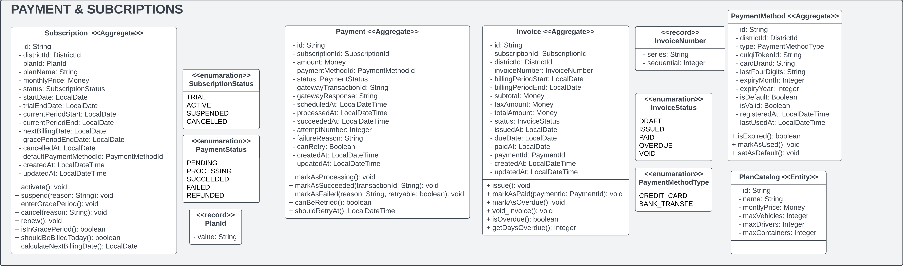

El diagrama de clases del Domain Layer presenta la estructura completa del dominio Payment & Subscriptions, mostrando:

**Elementos DDD implementados:**
- **Aggregate Roots**: Subscription, Payment, Invoice como raíces con invariantes financieras
- **Entities**: PaymentMethod, InvoiceLineItem, PaymentAttempt con identidad y ciclo de vida específicos
- **Value Objects**: Objetos inmutables para conceptos financieros y de facturación
- **Domain Services**: Servicios para operaciones financieras complejas
- **Domain Events**: Eventos para coordinación de revenue y lifecycle de servicios

**Patrones de diseño aplicados:**
- **Factory Pattern**: SubscriptionFactory, PaymentFactory, InvoiceFactory para creación especializada
- **Strategy Pattern**: PaymentProcessingStrategy con múltiples métodos (Tarjetas, Transferencias, Wallets)
- **State Pattern**: Estados de suscripción con transiciones controladas por reglas de negocio
- **Repository Pattern**: Interfaces para abstracción de persistencia financiera

**CQRS Implementation:**
- **Commands**: Operaciones de escritura con validaciones financieras y fiscales
- **Queries**: Operaciones de lectura optimizadas para análisis de revenue y reporting
- **Command/Query Services**: Separación clara con especialización en operaciones SaaS

**Integración Culqi:**
- **Payment processing**: Estrategias específicas para métodos soportados por Culqi
- **Webhook handling**: Procesamiento de confirmaciones de transacciones
- **Retry mechanisms**: Lógica de reintentos para transacciones fallidas

##### 4.2.5.6.2. Bounded Context Database Design Diagram


El diseño de base de datos implementa el modelo de dominio con optimizaciones específicas para operaciones financieras SaaS:

**Tablas principales:**
- **subscriptions**: Aggregate root con lifecycle completo, ciclos de facturación y trial management
- **payments**: Aggregate root con integración Culqi, tracking de intentos y audit trail
- **invoices**: Aggregate root para facturación con cálculos automáticos de IGV peruano
- **payment_methods**: Entity para métodos de pago con validaciones específicas de Culqi
- **invoice_line_items**: Entity para items de factura con cálculos fiscales detallados

**Tablas auxiliares financieras:**
- **payment_attempts**: Historial completo de intentos con detalles de gateway
- **subscription_usage**: Tracking de uso para billing por consumo
- **payment_events**: Domain events para coordinación financiera

**Optimizaciones SaaS:**
- **Triggers automáticos**: Cálculo de totales de facturas con IGV y actualización de estados
- **Funciones de MRR**: Cálculos de Monthly Recurring Revenue para análisis SaaS
- **Índices especializados**: Para consultas de vencimientos, reintentos, y análisis de churn
- **Limpieza inteligente**: Retención de datos financieros según regulaciones fiscales

**Características de compliance:**
- **Audit trail completo**: Tracking de todas las transacciones para auditoría
- **Validaciones fiscales**: Constraints para cumplimiento de regulaciones peruanas
- **Cálculos de IGV**: Automatización de impuestos según normativa vigente
- **Numeración secuencial**: Sistema de facturación compatible con SUNAT

**Características técnicas:**
- **JSONB avanzado**: Para respuestas de gateway y metadatos de transacciones
- **Triggers financieros**: Automatización de estados y cálculos críticos
- **Constraints robustos**: Validaciones de integridad para datos financieros críticos
- **Vistas especializadas**: Para análisis de revenue y reportes de compliance

El esquema está optimizado para las operaciones financieras identificadas en el dominio, incluyendo procesamiento de pagos con Culqi, facturación automática con IGV, gestión de trial periods, análisis de MRR/churn, y cumplimiento de regulaciones fiscales peruanas.

### 4.2.6. Bounded Context: Communication Hub

En esta sección se presenta el análisis detallado del bounded context Communication Hub, que encapsula toda la lógica de negocio relacionada con la orquestación de comunicaciones multi-canal, gestión de templates de mensajes, tracking de entrega, y coordinación de notificaciones entre todos los bounded contexts para asegurar comunicación efectiva y oportuna con stakeholders del sistema.

#### 4.2.6.1. Domain Layer

Esta capa contiene las reglas de negocio fundamentales del dominio de comunicaciones, implementando patrones avanzados de entrega multi-canal y estrategias de optimización para maximizar efectividad de entrega mientras se minimizan costos operacionales.

**Aggregate Roots:**

1. **`NotificationRequest` (Aggregate Root)**

Representa el agregado principal del dominio, encapsulando toda la información y comportamiento relacionado con una solicitud de notificación, su procesamiento multi-canal, y tracking completo de entrega hasta confirmación final.

**Atributos principales:**

| Atributo           | Tipo                    | Visibilidad | Descripción                                          |
|--------------------|-------------------------|-------------|------------------------------------------------------|
| `id`               | `Long`                  | `private`   | Identificador único de la solicitud en base de datos |
| `requestId`        | `NotificationRequestId` | `private`   | Identificador de dominio de la solicitud             |
| `sourceContext`    | `SourceContext`         | `private`   | Bounded context origen de la notificación            |
| `recipientId`      | `RecipientId`           | `private`   | Destinatario de la notificación                      |
| `recipientType`    | `RecipientType`         | `private`   | Tipo de destinatario (ciudadano, admin, conductor)   |
| `messageType`      | `MessageType`           | `private`   | Tipo de mensaje (alerta, notificación, marketing)    |
| `priority`         | `Priority`              | `private`   | Nivel de prioridad para entrega                      |
| `channels`         | `List<DeliveryChannel>` | `private`   | Canales de entrega configurados                      |
| `templateId`       | `TemplateId`            | `private`   | Template de mensaje a utilizar                       |
| `templateData`     | `TemplateData`          | `private`   | Datos para renderizado del template                  |
| `scheduledDate`    | `LocalDateTime`         | `private`   | Fecha programada de envío                            |
| `expiryDate`       | `LocalDateTime`         | `private`   | Fecha de expiración                                  |
| `status`           | `RequestStatus`         | `private`   | Estado actual de la solicitud                        |
| `deliveryAttempts` | `List<DeliveryAttempt>` | `private`   | Historial de intentos de entrega                     |

**Métodos principales:**

| Método                                 | Tipo de Retorno   | Visibilidad | Descripción                              |
|----------------------------------------|-------------------|-------------|------------------------------------------|
| `addDeliveryChannel(channel)`          | `void`            | `public`    | Agrega canal de entrega con validaciones |
| `scheduleDelivery(date)`               | `void`            | `public`    | Programa entrega para fecha específica   |
| `processDelivery()`                    | `DeliveryResult`  | `public`    | Procesa entrega usando Strategy pattern  |
| `markAsDelivered(channel, deliveryId)` | `void`            | `public`    | Marca como entregado en canal específico |
| `markAsFailed(channel, reason)`        | `void`            | `public`    | Marca como fallido con razón de falla    |
| `canBeRetried()`                       | `boolean`         | `public`    | Verifica si permite reintentos           |
| `isExpired()`                          | `boolean`         | `public`    | Determina si la notificación expiró      |
| `getPreferredChannel()`                | `DeliveryChannel` | `public`    | Obtiene canal preferido del destinatario |
| `requiresImmediateDelivery()`          | `boolean`         | `public`    | Verifica si requiere entrega inmediata   |

2. **`MessageTemplate` (Aggregate Root)**

Representa un template de mensaje con soporte para múltiples canales, localización, y versionado para mantener consistencia en comunicaciones a través de toda la plataforma.

**Atributos principales:**

| Atributo          | Tipo                              | Visibilidad | Descripción                                       |
|-------------------|-----------------------------------|-------------|---------------------------------------------------|
| `templateId`      | `TemplateId`                      | `private`   | Identificador de dominio del template             |
| `name`            | `String`                          | `private`   | Nombre descriptivo del template                   |
| `category`        | `TemplateCategory`                | `private`   | Categoría del template (sistema, marketing, etc.) |
| `messageType`     | `MessageType`                     | `private`   | Tipo de mensaje soportado                         |
| `channels`        | `List<DeliveryChannel>`           | `private`   | Canales compatibles con el template               |
| `subjectTemplate` | `String`                          | `private`   | Template del asunto (para email)                  |
| `bodyTemplate`    | `String`                          | `private`   | Template del cuerpo del mensaje                   |
| `variables`       | `List<TemplateVariable>`          | `private`   | Variables disponibles en el template              |
| `localization`    | `Map<Language, LocalizedContent>` | `private`   | Contenido localizado por idioma                   |
| `version`         | `TemplateVersion`                 | `private`   | Versión del template                              |
| `isActive`        | `boolean`                         | `private`   | Estado de activación                              |
| `metadata`        | `TemplateMetadata`                | `private`   | Metadatos adicionales                             |

**Métodos principales:**

| Método                               | Tipo de Retorno    | Visibilidad | Descripción                              |
|--------------------------------------|--------------------|-------------|------------------------------------------|
| `updateContent(subject, body)`       | `void`             | `public`    | Actualiza contenido del template         |
| `addLocalization(language, content)` | `void`             | `public`    | Agrega localización para idioma          |
| `addVariable(variable)`              | `void`             | `public`    | Agrega variable al template              |
| `renderMessage(data, language)`      | `RenderedMessage`  | `public`    | Renderiza mensaje con datos específicos  |
| `isCompatibleWith(channel)`          | `boolean`          | `public`    | Verifica compatibilidad con canal        |
| `validateTemplate()`                 | `ValidationResult` | `public`    | Valida sintaxis y variables del template |
| `activate()`                         | `void`             | `public`    | Activa template para uso                 |
| `deactivate()`                       | `void`             | `public`    | Desactiva template                       |

3. **`DeliveryRecord` (Aggregate Root)**

Representa un registro individual de entrega con tracking detallado de estado, costos, y métricas de performance para análisis y optimización de canales.

**Atributos principales:**

| Atributo                | Tipo                    | Visibilidad | Descripción                           |
|-------------------------|-------------------------|-------------|---------------------------------------|
| `recordId`              | `DeliveryRecordId`      | `private`   | Identificador de dominio del registro |
| `requestId`             | `NotificationRequestId` | `private`   | Solicitud asociada                    |
| `recipientId`           | `RecipientId`           | `private`   | Destinatario de la entrega            |
| `channel`               | `DeliveryChannel`       | `private`   | Canal utilizado para entrega          |
| `providerTransactionId` | `String`                | `private`   | ID de transacción del proveedor       |
| `status`                | `DeliveryStatus`        | `private`   | Estado actual de la entrega           |
| `attemptNumber`         | `Integer`               | `private`   | Número de intento actual              |
| `deliveryDate`          | `LocalDateTime`         | `private`   | Fecha de entrega exitosa              |
| `confirmationDate`      | `LocalDateTime`         | `private`   | Fecha de confirmación de recepción    |
| `failureReason`         | `FailureReason`         | `private`   | Razón de falla si aplica              |
| `cost`                  | `MonetaryAmount`        | `private`   | Costo de la entrega                   |
| `metadata`              | `DeliveryMetadata`      | `private`   | Metadatos de entrega                  |

**Métodos principales:**

| Método                           | Tipo de Retorno | Visibilidad | Descripción                                |
|----------------------------------|-----------------|-------------|--------------------------------------------|
| `markAsDelivered(transactionId)` | `void`          | `public`    | Marca como entregado con ID de transacción |
| `markAsFailed(reason)`           | `void`          | `public`    | Marca como fallido con razón específica    |
| `markAsConfirmed()`              | `void`          | `public`    | Marca como confirmado por destinatario     |
| `calculateDeliveryTime()`        | `Duration`      | `public`    | Calcula tiempo total de entrega            |
| `isSuccessful()`                 | `boolean`       | `public`    | Verifica si la entrega fue exitosa         |
| `canBeRetried()`                 | `boolean`       | `public`    | Determina si permite reintentos            |

**Entities:**

4. **`DeliveryAttempt` (Entity)**

Entidad que representa un intento individual de entrega con detalles específicos del proveedor y métricas de performance.

5. **`RecipientPreference` (Entity)**

Entidad que gestiona preferencias de comunicación por destinatario, incluyendo canales preferidos, horarios de silencio, y configuraciones de frecuencia.

6. **`TemplateVariable` (Entity)**

Entidad que representa variables utilizables en templates con validaciones y formateo específico.

**Value Objects:**

Los value objects implementan inmutabilidad y encapsulan validaciones específicas del dominio de comunicaciones:

- **`DeliveryChannel`**: Canal con capacidades y restricciones específicas
- **`Priority`**: Nivel de prioridad con comportamientos de entrega asociados
- **`TemplateData`**: Datos estructurados para renderizado de templates
- **`RenderedMessage`**: Mensaje final renderizado con metadata por canal
- **`MessageType`**: Tipo de mensaje con reglas de entrega específicas

**Factories (Creational Pattern):**

1. **`NotificationFactory`**: Implementa Factory pattern para crear notificaciones con diferentes configuraciones (urgentes con canales prioritarios, programadas con optimización de costo, masivas con batching inteligente) aplicando estrategias específicas por tipo.

2. **`TemplateFactory`**: Crea templates especializados por canal (email con HTML/texto plano, SMS con límites de caracteres, push con títulos y acciones) con validaciones específicas.

3. **`DeliveryRecordFactory`**: Genera registros de entrega con cálculos iniciales de costo y configuraciones de retry específicas por proveedor.

**Strategies (Behavioral Pattern):**

El patrón Strategy permite intercambiar algoritmos de selección de canal dinámicamente:

1. **`PriorityBasedStrategy`**: Selección basada en urgencia del mensaje con canales de alta velocidad
2. **`CostOptimizedStrategy`**: Optimización por costo de entrega con preferencia por canales económicos
3. **`ReliabilityBasedStrategy`**: Selección por confiabilidad histórica del canal
4. **`HybridSelectionStrategy`**: Combinación inteligente de múltiples criterios

**Domain Services:**

1. **`NotificationCommandService`**: Orquesta operaciones CQRS de escritura para solicitudes de notificación
2. **`NotificationQueryService`**: Maneja consultas CQRS optimizadas para tracking y análisis
3. **`TemplateCommandService`**: Gestiona operaciones de templates con versionado y validación
4. **`TemplateQueryService`**: Proporciona consultas optimizadas para selección de templates
5. **`DeliveryAnalyticsService`**: Genera análisis de performance por canal y proveedor
6. **`MessageRenderingService`**: Coordina renderizado de mensajes con localización y personalización

**Commands (CQRS Write Side):**

- `CreateNotificationCommand`: Creación de solicitudes con validación de destinatarios
- `SendNotificationCommand`: Envío inmediato con override de configuraciones
- `CreateTemplateCommand`: Creación de templates con validación de sintaxis
- `UpdateTemplateCommand`: Actualización con versionado automático
- `ScheduleNotificationCommand`: Programación con optimización de timing

**Queries (CQRS Read Side):**

- `GetNotificationByIdQuery`: Consulta individual con historial completo
- `GetNotificationsByRecipientQuery`: Historial por destinatario con filtros
- `GetTemplateByIdQuery`: Consulta de template con localizaciones
- `GetTemplatesByTypeQuery`: Templates disponibles por tipo y canal
- `GetDeliveryAnalyticsQuery`: Análisis de performance y costos

**Domain Events:**

- `NotificationRequestCreatedEvent`: Publicado al crear solicitudes de notificación
- `NotificationDeliveredEvent`: Publicado al entregar exitosamente por cualquier canal
- `NotificationFailedEvent`: Publicado al fallar entrega con programación de fallback
- `TemplateUpdatedEvent`: Publicado al actualizar templates con control de versiones

#### 4.2.6.2. Interface Layer

Esta capa expone las funcionalidades del bounded context como hub central de comunicaciones, actuando como Open-Host Service para todos los otros bounded contexts y proporcionando interfaces especializadas para gestión de templates.

**Controllers:**

1. **`Notification Controller`**: Endpoints REST para gestión de notificaciones, configuración de canales, y tracking de entrega. Proporciona interfaces para programación de notificaciones y consultas de estado.

2. **`Template Controller`**: Endpoints especializados para gestión de templates de mensajes, versionado, y localización. Implementa validaciones de sintaxis y preview de renderizado.

3. **`Delivery Controller`**: Endpoints para tracking de entrega, análisis de performance por canal, y configuración de proveedores. Proporciona métricas en tiempo real y reportes de costos.

4. **`Event Consumer`**: Consumidor Kafka que actúa como hub central recibiendo eventos de todos los bounded contexts (Container Monitoring, Route Planning, Community Relations, Payment & Subscriptions, Municipal Operations). Implementa Consumer pattern para procesamiento distribuido.

#### 4.2.6.3. Application Layer

Esta capa coordina las operaciones complejas de comunicación multi-canal y orquesta los flujos de trabajo de entrega, implementando patrones para optimizar efectividad y minimizar costos de comunicación.

**Application Services:**

1. **`Notification Service`**: Servicio principal que orquesta lifecycle completo de notificaciones incluyendo selección de templates, rendering, y coordinación de entrega. Implementa Template Method pattern para diferentes tipos de notificación y Facade pattern para simplificar interacciones con múltiples proveedores.

2. **`Delivery Service`**: Gestiona coordinación multi-canal, lógica de reintentos, y mecanismos de fallback. Implementa Strategy pattern para selección de canales y Circuit Breaker pattern para resiliencia de proveedores externos.

3. **`Template Service`**: Maneja gestión completa de templates, personalización, y localización. Implementa Builder pattern para construcción de mensajes complejos y Version Control pattern para gestión de cambios en templates.

#### 4.2.6.4. Infrastructure Layer

Esta capa proporciona implementaciones técnicas para integración con múltiples proveedores de comunicación, persistencia de datos de entrega, y adaptadores especializados para cada canal de comunicación.

**Repositories:**

1. **`Notification Repository`**: Implementación JPA para persistencia de solicitudes con tracking de entrega y analytics. Implementa Repository pattern con optimizaciones para consultas de estado y análisis temporal.

2. **`Template Repository`**: Repositorio especializado para templates con soporte para versionado y localización. Incluye optimizaciones para búsquedas por tipo y canal.

3. **`Delivery Repository`**: Repositorio para registros de entrega con métricas de performance y tracking de costos. Optimizado para análisis de tendencias y reportes de eficiencia.

**External Services:**

1. **`Email Service Adapter`**: Integración especializada con SendGrid para entrega de emails transaccionales y marketing. Implementa Adapter pattern para abstracción de provider y Retry pattern para resiliencia.

2. **`SMS Service Adapter`**: Integración con Twilio para entrega de SMS con soporte para mensajes internacionales. Implementa Rate Limiting pattern para cumplimiento de regulaciones.

3. **`Push Notification Adapter`**: Integración con Firebase Cloud Messaging para notificaciones móviles. Implementa Batch Processing pattern para eficiencia en entregas masivas.

#### 4.2.6.5. Bounded Context Software Architecture Component Level Diagrams


El diagrama de componentes muestra la arquitectura interna del Communication Hub bounded context, ilustrando su rol como hub central de comunicaciones y las integraciones especializadas multi-canal. Se observa claramente:

- **Interface Layer** (verde claro): Controllers especializados para notificaciones, templates y delivery tracking, plus event consumer que actúa como hub central para todos los BCs
- **Application Layer** (verde medio): Services que coordinan entrega multi-canal, gestión de templates con localización, y optimización de estrategias de entrega
- **Infrastructure Layer** (verde oscuro): Adapters especializados para cada proveedor de comunicación y repositories optimizados para analytics
- **Integraciones multi-canal**: SendGrid para email, Twilio para SMS, Firebase para push notifications con fallback automático

La arquitectura implementa patrones avanzados como Strategy para selección óptima de canales, Circuit Breaker para resiliencia de proveedores, y Open-Host Service como punto central de comunicación para toda la plataforma.

#### 4.2.6.6. Bounded Context Software Architecture Code Level Diagrams

##### 4.2.6.6.1. Bounded Context Domain Layer Class Diagrams

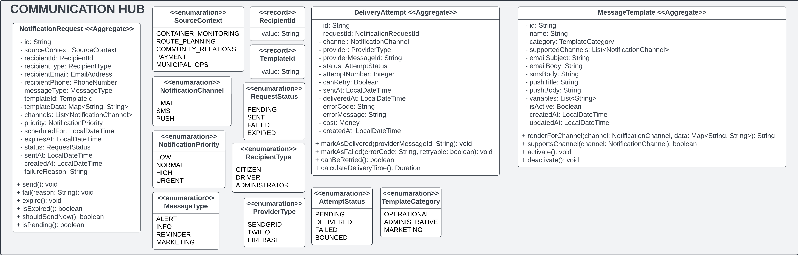

El diagrama de clases del Domain Layer presenta la estructura completa del dominio Communication Hub, mostrando:

**Elementos DDD implementados:**
- **Aggregate Roots**: NotificationRequest, MessageTemplate, DeliveryRecord como raíces con invariantes de comunicación
- **Entities**: DeliveryAttempt, RecipientPreference, TemplateVariable con identidad y ciclo de vida específicos
- **Value Objects**: Objetos inmutables para conceptos de entrega y renderizado
- **Domain Services**: Servicios para renderizado de mensajes y análisis de entrega
- **Domain Events**: Eventos para coordinación de comunicaciones y tracking

**Patrones de diseño aplicados:**
- **Factory Pattern**: NotificationFactory, TemplateFactory, DeliveryRecordFactory para creación especializada
- **Strategy Pattern**: ChannelSelectionStrategy con múltiples algoritmos (Priority, Cost, Reliability, Hybrid)
- **Template Method Pattern**: Para procesamiento diferenciado por tipo de notificación
- **Repository Pattern**: Interfaces para abstracción de persistencia de comunicaciones

**CQRS Implementation:**
- **Commands**: Operaciones de escritura con validaciones de templates y destinatarios
- **Queries**: Operaciones de lectura optimizadas para analytics y tracking
- **Command/Query Services**: Separación clara con especialización en comunicaciones

**Multi-channel capabilities:**
- **Channel abstraction**: Soporte uniforme para email, SMS, push, in-app
- **Provider integration**: Adaptadores específicos para SendGrid, Twilio, Firebase
- **Fallback mechanisms**: Estrategias automáticas de canal alternativo
- **Cost optimization**: Selección inteligente basada en costo y efectividad

##### 4.2.6.6.2. Bounded Context Database Design Diagram


El diseño de base de datos implementa el modelo de dominio con optimizaciones específicas para comunicaciones multi-canal:

**Tablas principales:**
- **notification_requests**: Aggregate root con multi-channel delivery y template integration
- **message_templates**: Aggregate root para templates con localización y versionado automático
- **delivery_records**: Aggregate root para tracking detallado con provider integration
- **recipient_preferences**: Entity para preferencias personalizadas por usuario
- **delivery_attempts**: Entity para historial completo con métricas de performance

**Tablas auxiliares especializadas:**
- **channel_performance**: Analytics diarios por canal y proveedor con métricas de éxito
- **communication_events**: Domain events para coordinación entre bounded contexts

**Optimizaciones de comunicación:**
- **Triggers automáticos**: Actualización de estados basado en delivery results
- **Funciones de analytics**: Cálculo automático de métricas de performance por canal
- **Índices especializados**: Para consultas de retry, tracking, y analytics temporales
- **Limpieza inteligente**: Expiración automática de notificaciones con políticas configurables

**Características multi-canal:**
- **Provider integration**: Campos específicos para respuestas de SendGrid, Twilio, Firebase
- **Cost tracking**: Seguimiento detallado de costos por canal y provider
- **Performance metrics**: Tiempo de entrega, success rates, y reliability scores
- **Template versioning**: Sistema completo de versionado con rollback capabilities

**Características técnicas:**
- **JSONB avanzado**: Para respuestas de providers, template data, y recipient preferences
- **Triggers inteligentes**: Automatización de estados y cálculo de métricas críticas
- **Constraints robustos**: Validaciones específicas para canales, templates, y delivery status
- **Vistas especializadas**: Para analytics de delivery y overview de notificaciones

El esquema está optimizado para las operaciones de comunicación identificadas en el dominio, incluyendo entrega multi-canal con fallback automático, template management con localización, cost tracking detallado, performance analytics por proveedor, y coordinación centralizada como hub de comunicaciones para toda la plataforma WasteTrack.

### 4.2.7. Bounded Context: Profile

En esta sección se presenta el análisis detallado del **bounded context Profile**, que encapsula toda la lógica de negocio relacionada con la gestión de perfiles de usuario (ciudadanos, administradores, conductores), sus preferencias personales, configuraciones de notificación y personalización de la experiencia de usuario, asegurando la privacidad de los datos y la validación de elegibilidad del área de servicio.

#### 4.2.7.1. Domain Layer

Esta capa contiene las reglas de negocio fundamentales del dominio de perfiles de usuario, implementando patrones avanzados para la gestión de datos personales, preferencias y personalización, asegurando una experiencia de usuario consistente y segura.

**Aggregate Roots:**

1.  **`UserProfile` (Aggregate Root)**

    Representa el agregado principal del dominio, encapsulando toda la información y comportamiento de un usuario, incluyendo datos personales, de contacto, dirección, y estado del perfil.

**Atributos principales:**

| Atributo              | Tipo                  | Visibilidad | Descripción                                        |
|:----------------------|:----------------------|:------------|:---------------------------------------------------|
| `id`                  | `Long`                | `private`   | Identificador único del perfil en la base de datos |
| `profileId`           | `ProfileId`           | `private`   | Identificador de dominio del perfil                |
| `userId`              | `UserId`              | `private`   | ID del usuario desde el BC de IAM                  |
| `userType`            | `UserType`            | `private`   | Tipo de usuario (Citizen, Administrator, Driver)   |
| `personalInfo`        | `PersonalInfo`        | `private`   | Información personal del usuario                   |
| `contactInfo`         | `ContactInfo`         | `private`   | Información de contacto (email, teléfono)          |
| `addressInfo`         | `AddressInfo`         | `private`   | Dirección y coordenadas geográficas                |
| `serviceArea`         | `ServiceArea`         | `private`   | Área de servicio a la que pertenece                |
| `profileStatus`       | `ProfileStatus`       | `private`   | Estado actual del perfil (Activo, Suspendido)      |
| `privacySettings`     | `PrivacySettings`     | `private`   | Configuraciones de privacidad y datos compartidos  |
| `profileCompleteness` | `ProfileCompleteness` | `private`   | Puntuación de completitud del perfil               |
| `lastLoginDate`       | `LocalDateTime`       | `private`   | Fecha del último inicio de sesión                  |

 **Métodos principales:**

| Método                             | Tipo de Retorno     | Visibilidad | Descripción                                                                    |
|:-----------------------------------|:--------------------|:------------|:-------------------------------------------------------------------------------|
| `updatePersonalInfo(info)`         | `void`              | `public`    | Actualiza la información personal validando los datos                          |
| `updateAddress(address)`           | `void`              | `public`    | Cambia la dirección y dispara la validación de elegibilidad                    |
| `validateServiceAreaEligibility()` | `EligibilityResult` | `public`    | Verifica si la dirección del usuario está dentro de un área de servicio válida |
| `updatePrivacySettings(settings)`  | `void`              | `public`    | Modifica las configuraciones de privacidad                                     |
| `deactivate(reason)`               | `void`              | `public`    | Desactiva el perfil del usuario por una razón específica                       |
| `isComplete()`                     | `boolean`           | `public`    | Verifica si el perfil tiene toda la información requerida                      |
| `calculateProfileScore()`          | `ProfileScore`      | `public`    | Calcula una puntuación basada en la completitud y actividad                    |
| `recordLogin()`                    | `void`              | `public`    | Registra un nuevo inicio de sesión y actualiza la fecha                        |

2.  **`UserPreferences` (Aggregate Root)**

    Gestiona todas las configuraciones y preferencias de un usuario, como notificaciones, idioma y tema de la interfaz.

**Atributos principales:**

| Atributo                | Tipo                    | Visibilidad | Descripción                                             |
|:------------------------|:------------------------|:------------|:--------------------------------------------------------|
| `preferencesId`         | `PreferencesId`         | `private`   | Identificador de dominio de las preferencias            |
| `profileId`             | `ProfileId`             | `private`   | Perfil de usuario asociado                              |
| `notificationSettings`  | `NotificationSettings`  | `private`   | Configuración de canales y frecuencia de notificaciones |
| `languagePreference`    | `Language`              | `private`   | Idioma preferido por el usuario                         |
| `timezonePreference`    | `Timezone`              | `private`   | Zona horaria del usuario                                |
| `themePreference`       | `ThemePreference`       | `private`   | Tema visual de la aplicación (claro/oscuro)             |
| `accessibilitySettings` | `AccessibilitySettings` | `private`   | Configuraciones de accesibilidad                        |

**Métodos principales:**

| Método                                 | Tipo de Retorno | Visibilidad | Descripción                                        |
|:---------------------------------------|:----------------|:------------|:---------------------------------------------------|
| `updateNotificationSettings(settings)` | `void`          | `public`    | Modifica las preferencias de notificación          |
| `updateLanguage(language)`             | `void`          | `public`    | Cambia el idioma de la interfaz para el usuario    |
| `updateTheme(theme)`                   | `void`          | `public`    | Cambia el tema visual de la aplicación             |
| `isChannelEnabled(channel)`            | `boolean`       | `public`    | Verifica si un canal de notificación está activado |

3.  **`PersonalizationSettings` (Aggregate Root)**

    Encapsula las configuraciones de personalización de la interfaz de usuario, como el layout del dashboard y los widgets.

**Atributos principales:**

| Atributo               | Tipo                        | Visibilidad | Descripción                                    |
|:-----------------------|:----------------------------|:------------|:-----------------------------------------------|
| `settingsId`           | `PersonalizationSettingsId` | `private`   | Identificador de dominio de la personalización |
| `profileId`            | `ProfileId`                 | `private`   | Perfil de usuario asociado                     |
| `dashboardLayout`      | `DashboardLayout`           | `private`   | Diseño del dashboard principal                 |
| `widgetConfigurations` | `List<WidgetConfiguration>` | `private`   | Lista de widgets y sus configuraciones         |

 **Métodos principales:**

| Método                          | Tipo de Retorno | Visibilidad | Descripción                                           |
|:--------------------------------|:----------------|:------------|:------------------------------------------------------|
| `updateDashboardLayout(layout)` | `void`          | `public`    | Cambia el diseño del dashboard                        |
| `addWidget(widget)`             | `void`          | `public`    | Agrega un nuevo widget al dashboard                   |
| `removeWidget(widgetId)`        | `void`          | `public`    | Elimina un widget del dashboard                       |
| `resetToDefaults(userType)`     | `void`          | `public`    | Restablece la configuración a los valores por defecto |

**Entities:**

* **`ContactMethod`**: Representa un método de contacto (email, teléfono) con su estado de verificación.
* **`AddressHistory`**: Mantiene un historial de las direcciones del usuario para fines de auditoría.
* **`WidgetConfiguration`**: Configuración específica de un widget en el dashboard, como su posición y tamaño.

**Value Objects:**

* **`PersonalInfo`**: Encapsula datos personales con validaciones de formato (DNI, nombre).
* **`ContactInfo`**: Agrupa métodos de contacto primarios y secundarios.
* **`AddressInfo`**: Contiene la dirección completa y coordenadas, con métodos de validación.
* **`NotificationSettings`**: Define qué notificaciones y en qué canales desea recibir el usuario.
* **`PrivacySettings`**: Controla la visibilidad del perfil y el consentimiento para compartir datos.
* **`ProfileCompleteness`**: Calcula y almacena el porcentaje de completitud del perfil.

**Factories (Creational Pattern):**

* **`UserProfileFactory`**: Implementa el **Factory Pattern** para crear perfiles de usuario según su tipo (`Citizen`, `Administrator`, `Driver`), aplicando reglas de validación específicas para cada uno.
* **`PreferencesFactory`**: Crea configuraciones de preferencias por defecto basadas en el tipo de usuario.

**Strategies (Behavioral Pattern):**

* **`ProfileValidationStrategy`**: Define una interfaz para las estrategias de validación de perfiles.
  * **`CitizenValidationStrategy`**: Valida los requisitos específicos para un perfil de ciudadano.
  * **`AdministratorValidationStrategy`**: Valida la asociación a una municipalidad para un administrador.
  * **`DriverValidationStrategy`**: Valida la información de la licencia de conducir para un conductor.

**Domain Services:**

* **`ProfileCommandService`** / **`ProfileQueryService`**: Orquestan las operaciones de escritura y lectura para perfiles, siguiendo el patrón **CQRS**.
* **`PreferencesCommandService`** / **`PreferencesQueryService`**: Gestionan las operaciones sobre las preferencias del usuario.
* **`PersonalizationCommandService`** / **`PersonalizationQueryService`**: Administran la configuración de personalización.
* **`ProfileEligibilityService`**: Servicio de dominio que centraliza la lógica compleja para validar la elegibilidad de un perfil en un área de servicio.

**Commands (CQRS Write Side):**

* `CreateProfileCommand`: Para registrar un nuevo perfil de usuario.
* `UpdateProfileCommand`: Para actualizar la información de un perfil existente.
* `CreatePreferencesCommand`: Para establecer las preferencias iniciales.
* `UpdatePreferencesCommand`: Para modificar las preferencias de un usuario.

**Queries (CQRS Read Side):**

* `GetProfileByIdQuery`: Para obtener un perfil por su ID.
* `GetProfileByUserIdQuery`: Para buscar un perfil a partir del ID de usuario (de IAM).
* `GetPreferencesByProfileQuery`: Para consultar las preferencias de un perfil.

**Domain Events:**

* `ProfileCreatedEvent`: Se publica cuando un nuevo perfil es creado.
* `ProfileUpdatedEvent`: Se emite cuando se actualiza la información clave de un perfil.
* `PreferencesChangedEvent`: Se publica cuando un usuario modifica sus preferencias.
* `ServiceAreaEligibilityChangedEvent`: Se emite cuando un cambio de dirección afecta la elegibilidad del servicio.

#### 4.2.7.2. Interface Layer

Esta capa expone las funcionalidades del bounded context a través de controladores REST especializados y consumidores de eventos para la sincronización con otros contextos.

**Controllers:**

1.  **`Profile Controller`**: Endpoints REST para la gestión de perfiles de usuario, actualización de información personal y configuraciones de la cuenta.
2.  **`Preferences Controller`**: Endpoints para que los usuarios gestionen sus preferencias de notificación, privacidad y canales de comunicación.
3.  **`Personalization Controller`**: Endpoints para la personalización de la UI, como la configuración de widgets y el idioma.

**Event Consumer:**

* **`Event Consumer`**: Un consumidor de Kafka que escucha eventos de otros BCs. Por ejemplo, `AccountActivationEvent` desde **IAM BC** para crear el perfil inicial o `EngagementUpdateEvent` desde **Community Relations BC** para actualizar métricas de participación.

#### 4.2.7.3. Application Layer

Esta capa orquesta los flujos de negocio relacionados con la gestión de perfiles, aplicando patrones para coordinar las operaciones del dominio.

**Application Services:**

1.  **`Profile Service`**: Servicio principal que orquesta las operaciones de perfiles, como creación, actualización y validación. Utiliza el **Command Pattern** para manejar los casos de uso de escritura.
2.  **`Preferences Service`**: Gestiona las preferencias del usuario. Implementa el **Strategy Pattern** para aplicar diferentes lógicas de validación de preferencias según el tipo de usuario.
3.  **`Personalization Service`**: Maneja la personalización de la UI. Utiliza el **Builder Pattern** para construir configuraciones complejas de dashboards y widgets.

#### 4.2.7.4. Infrastructure Layer

Esta capa proporciona las implementaciones técnicas para la persistencia, comunicación y otros servicios externos, desacoplando el dominio de la tecnología subyacente.

**Repositories:**

1.  **`Profile Repository`**: Implementación JPA para la persistencia de perfiles de usuario, con controles de privacidad y un rastro de auditoría.
2.  **`Preferences Repository`**: Repositorio JPA para las preferencias del usuario, con seguimiento de cambios y versionado.
3.  **`Personalization Repository`**: Repositorio JPA para las configuraciones de personalización, incluyendo temas y layouts.

**External Services:**

1.  **`Event Publisher`**: Publica eventos de dominio (como `ProfileUpdatedEvent`) a otros bounded contexts a través de Kafka.
2.  **`Cache Service`**: Servicio de caché con Redis para datos de perfil y preferencias de acceso frecuente, mejorando el rendimiento.
3.  **`Encryption Service`**: Servicio que utiliza Spring Security para encriptar información personal sensible, asegurando la protección de datos.

#### 4.2.7.5. Bounded Context Software Architecture Component Level Diagrams


El diagrama de componentes muestra la arquitectura interna del Profile bounded context, ilustrando la separación por capas DDD y las interacciones entre sus componentes. Se observa claramente:

* **Interface Layer** (verde claro): Controllers para la gestión de perfiles, preferencias y personalización, además de un consumidor de eventos para la comunicación asíncrona.
* **Application Layer** (verde medio): Services que coordinan la lógica de negocio, aplicando patrones como Command, Strategy y Builder.
* **Infrastructure Layer** (verde oscuro): Repositories para la persistencia de datos y servicios para la publicación de eventos, caching y encriptación.
* **Integraciones externas**: Se comunica con la base de datos PostgreSQL, el caché de Redis y el message broker de Kafka. También interactúa con servicios como geocodificación y proveedores de email.

La arquitectura sigue un flujo de dependencias claro, asegurando que la lógica de dominio permanezca independiente de los detalles de infraestructura.

#### 4.2.7.6. Bounded Context Software Architecture Code Level Diagrams

##### 4.2.7.6.1. Bounded Context Domain Layer Class Diagrams


El diagrama de clases del Domain Layer presenta la estructura completa del dominio Profile, mostrando:

**Elementos DDD implementados:**
- **Aggregate Roots**: `UserProfile`, `UserPreferences` y `PersonalizationSettings` como raíces que garantizan la consistencia de sus invariantes.
- **Entities**: `ContactMethod`, `AddressHistory` y `WidgetConfiguration` con identidad y ciclo de vida propios.
- **Value Objects**: Objetos inmutables que encapsulan conceptos complejos del dominio como `PersonalInfo`, `AddressInfo` y `PrivacySettings`.
- **Domain Services**: Servicios como `ProfileEligibilityService` que contienen lógica de dominio que no encaja en un solo agregado.
- **Domain Events**: Eventos como `ProfileCreatedEvent` para notificar a otros BCs de cambios de estado.

**Patrones de diseño aplicados:**
- **Factory Pattern**: `UserProfileFactory` para crear perfiles según el tipo de usuario.
- **Strategy Pattern**: `ProfileValidationStrategy` para validar perfiles de manera flexible.
- **Repository Pattern**: Interfaces para abstraer la persistencia de los agregados.

**CQRS Implementation:**
- **Commands**: Operaciones de escritura que modifican el estado del sistema (`CreateProfileCommand`).
- **Queries**: Operaciones de lectura optimizadas para diferentes casos de uso (`GetProfileByIdQuery`).
- **Command/Query Services**: Separación clara de responsabilidades para mejorar la escalabilidad y mantenibilidad.

**Características especiales:**
- **Service Area Eligibility**: Validación automática de la elegibilidad geográfica del usuario.
- **Privacy Controls**: Gestión granular de la privacidad y el consentimiento de datos.
- **Multi-user Types**: Soporte para diferentes tipos de usuarios con reglas de validación específicas.

##### 4.2.7.6.2. Bounded Context Database Design Diagram


El diseño de la base de datos implementa el modelo de dominio con optimizaciones específicas para la gestión de perfiles a gran escala:

**Tablas principales:**
- **`user_profiles`**: Aggregate root que almacena toda la información personal, de contacto y de estado.
- **`user_preferences`**: Aggregate root para las preferencias de notificación, idioma y privacidad.
- **`personalization_settings`**: Aggregate root para las configuraciones de la UI, como widgets y temas.
- **`contact_methods`**: Entity para los métodos de contacto verificables.
- **`address_history`**: Entity que mantiene un historial de cambios de dirección.

**Tablas auxiliares especializadas:**
- **`profile_events`**: Almacena los eventos de dominio para su procesamiento asíncrono y auditoría.
- **`profile_activity_log`**: Registra la actividad del usuario para fines de seguridad y análisis.

**Optimizaciones y características técnicas:**
- **Triggers automáticos**: Para calcular la completitud del perfil (`profile_completeness_percentage`) y actualizar timestamps.
- **Índices geoespaciales (GIST)**: Para optimizar las consultas de ubicación y la validación de elegibilidad en el área de servicio.
- **Auditoría completa**: Tablas de logs y campos `created_at`/`updated_at` en todas las tablas principales.
- **Función de anonimización**: Procedimiento `anonymize_profile_data` para cumplir con normativas de privacidad (GDPR).
- **JSONB avanzado**: Utilizado para almacenar configuraciones flexibles como `privacy_settings` y `widget_configurations`.
- **Vistas especializadas**: `vw_profile_overview` y `vw_users_by_service_area` para simplificar consultas comunes y reporting.

El esquema está diseñado para garantizar la integridad de los datos, la privacidad del usuario y un alto rendimiento en las consultas, soportando las diversas necesidades de los diferentes tipos de usuario de la plataforma.

### 4.2.8. Bounded Context: IAM

En esta sección se presenta el análisis detallado del **bounded context IAM** (Identity and Access Management), que encapsula toda la lógica de negocio relacionada con la gestión de identidades, autenticación, autorización y seguridad de acceso para todos los usuarios de la plataforma WasteTrack. Este contexto es fundamental para garantizar que solo los usuarios autorizados puedan acceder a las funcionalidades correspondientes a sus roles.

#### 4.2.8.1. Domain Layer

Esta capa contiene las reglas de negocio fundamentales del dominio de seguridad y gestión de identidades, implementando patrones de diseño robustos para asegurar un sistema seguro, escalable y mantenible.

**Aggregate Roots:**

1.  **`User` (Aggregate Root)**

    Representa el agregado principal del dominio, encapsulando la identidad de un usuario, sus credenciales seguras, estado y los roles asignados.

**Atributos principales:**

| Atributo         | Tipo             | Visibilidad | Descripción                                              |
|:-----------------|:-----------------|:------------|:---------------------------------------------------------|
| `id`             | `Long`           | `private`   | Identificador único del usuario en la base de datos      |
| `userId`         | `UserId`         | `private`   | Identificador de dominio del usuario                     |
| `username`       | `Username`       | `private`   | Nombre de usuario único en el sistema                    |
| `email`          | `EmailAddress`   | `private`   | Correo electrónico único para la autenticación           |
| `hashedPassword` | `HashedPassword` | `private`   | Contraseña del usuario almacenada de forma segura (hash) |
| `status`         | `UserStatus`     | `private`   | Estado actual del usuario (Activo, Suspendido, etc.)     |
| `roles`          | `Set<Role>`      | `private`   | Conjunto de roles asignados al usuario                   |
| `lastLoginAt`    | `LocalDateTime`  | `private`   | Fecha y hora del último inicio de sesión exitoso         |

**Métodos principales:**

| Método                        | Tipo de Retorno | Visibilidad | Descripción                                                              |
|:------------------------------|:----------------|:------------|:-------------------------------------------------------------------------|
| `authenticate(password)`      | `boolean`       | `public`    | Verifica si la contraseña proporcionada coincide con la almacenada       |
| `changePassword(newPassword)` | `void`          | `public`    | Cambia la contraseña del usuario aplicando políticas de seguridad        |
| `assignRole(role)`            | `void`          | `public`    | Asigna un nuevo rol al usuario                                           |
| `removeRole(role)`            | `void`          | `public`    | Revoca un rol asignado al usuario                                        |
| `activate()`                  | `void`          | `public`    | Activa la cuenta del usuario                                             |
| `deactivate()`                | `void`          | `public`    | Desactiva la cuenta del usuario                                          |
| `hasPermission(permission)`   | `boolean`       | `public`    | Verifica si el usuario tiene un permiso específico a través de sus roles |

2.  **`Role` (Aggregate Root)**

    Representa un rol dentro del sistema, agrupando un conjunto de permisos que definen lo que un usuario puede hacer.

**Atributos principales:**

| Atributo      | Tipo              | Visibilidad | Descripción                                      |
|:--------------|:------------------|:------------|:-------------------------------------------------|
| `roleId`      | `RoleId`          | `private`   | Identificador de dominio del rol                 |
| `name`        | `String`          | `private`   | Nombre único del rol (e.g., "CITIZEN", "DRIVER") |
| `permissions` | `Set<Permission>` | `private`   | Conjunto de permisos asociados a este rol        |

**Métodos principales:**

| Método                         | Tipo de Retorno | Visibilidad | Descripción                                       |
|:-------------------------------|:----------------|:------------|:--------------------------------------------------|
| `addPermission(permission)`    | `void`          | `public`    | Agrega un nuevo permiso al rol                    |
| `removePermission(permission)` | `void`          | `public`    | Elimina un permiso del rol                        |
| `hasPermission(permission)`    | `boolean`       | `public`    | Verifica si el rol contiene un permiso específico |

**Entities:**

* **`Permission` (Entity)**: Representa una acción granular permitida en el sistema (e.g., "VIEW_CONTAINERS", "MANAGE_USERS").

**Value Objects:**

* **`UserId`**: Identificador único de dominio para un usuario.
* **`RoleId`**: Identificador único de dominio para un rol.
* **`HashedPassword`**: Objeto inmutable que encapsula la contraseña hasheada y la lógica de comparación segura.
* **`Username`**: Representa el nombre de usuario con sus reglas de validación (formato, longitud).
* **`UserStatus`**: Un enum que define los posibles estados del ciclo de vida de un usuario.

**Factories (Creational Pattern):**

* **`UserFactory`**: Implementa el **Factory Pattern** para encapsular la lógica de creación de un nuevo `User`, incluyendo la validación inicial, la aplicación de políticas de contraseña y el hash seguro de la misma.

**Strategies (Behavioral Pattern):**

* **`PasswordPolicyStrategy`**: Define una interfaz para diferentes estrategias de validación de contraseñas. Esto permite cambiar las reglas de complejidad de las contraseñas (e.g., `SimplePasswordStrategy`, `ComplexPasswordStrategy`) sin modificar el agregado `User`.

**Domain Services:**

* **`UserCommandService` / `UserQueryService`**: Orquestan las operaciones de escritura y lectura para usuarios y roles, aplicando el patrón **CQRS**.
* **`AuthService`**: Contiene la lógica de dominio para el proceso de autenticación, validando credenciales y coordinando la generación de tokens.

**Commands (CQRS Write Side):**

* `RegisterUserCommand`: Para crear una nueva cuenta de usuario.
* `AuthenticateUserCommand`: Para iniciar el proceso de login.
* `AssignRoleToUserCommand`: Para asignar un rol a un usuario.
* `CreateRoleCommand`: Para crear un nuevo rol en el sistema.

**Queries (CQRS Read Side):**

* `GetUserByIdQuery`: Para obtener un usuario por su ID.
* `GetUserByEmailQuery`: Para buscar un usuario por su correo electrónico.
* `GetRoleByNameQuery`: Para consultar un rol por su nombre.

**Domain Events:**

* `UserRegisteredEvent`: Se publica cuando un nuevo usuario se registra. Es escuchado por otros BCs (como Profile) para crear entidades relacionadas.
* `PasswordResetRequestedEvent`: Se emite para iniciar el flujo de recuperación de contraseña.

#### 4.2.8.2. Interface Layer

Esta capa expone las funcionalidades de seguridad y autenticación a través de controladores REST, actuando como la puerta de entrada para todas las operaciones de IAM.

**Controllers:**

1.  **`Auth Controller`**: Endpoints REST para el registro de nuevos usuarios, inicio de sesión (login), cierre de sesión (logout), recuperación de contraseña y validación de tokens. Es el punto de entrada para todas las aplicaciones cliente (web y móvil).

#### 4.2.8.3. Application Layer

Esta capa coordina los flujos de trabajo complejos de autenticación y gestión de usuarios, conectando la interfaz con el dominio.

**Application Services:**

1.  **`IAM Service`**: Orquesta el ciclo de vida completo de los usuarios y la autenticación. Implementa el **Strategy Pattern** para seleccionar la `PasswordPolicyStrategy` adecuada durante el registro o cambio de contraseña. Coordina la generación de tokens y la publicación de eventos de dominio.

#### 4.2.8.4. Infrastructure Layer

Esta capa proporciona las implementaciones técnicas para la persistencia de datos de seguridad, comunicación con otros servicios y la generación de tokens.

**Repositories:**

1.  **`User Repository`**: Implementación JPA para la persistencia de usuarios, asegurando que las contraseñas se almacenen siempre hasheadas.
2.  **`Role Repository`**: Repositorio JPA para la gestión de roles y sus permisos asociados.

**External Services:**

1.  **`Event Publisher`**: Publica eventos de dominio, como `UserRegisteredEvent`, a otros bounded contexts a través de Kafka, permitiendo la consistencia eventual.
2.  **`Token Service`**: Servicio encargado de la generación y validación de JSON Web Tokens (JWT) utilizando librerías como Spring Security o JJWT, para gestionar las sesiones de los usuarios de forma segura.

#### 4.2.8.5. Bounded Context Software Architecture Component Level Diagrams


El diagrama de componentes muestra la arquitectura interna del IAM bounded context, ilustrando su estructura por capas y sus responsabilidades enfocadas en la seguridad. Se observa:

* **Interface Layer** (verde claro): Un `Auth Controller` que centraliza todas las solicitudes de autenticación y gestión de usuarios.
* **Application Layer** (verde medio): Un `IAM Service` que orquesta toda la lógica de negocio.
* **Infrastructure Layer** (verde oscuro): Repositorios para la persistencia segura de credenciales, un servicio de tokens (JWT), y un publicador de eventos para notificar a otros BCs.
* **Integraciones externas**: Se conecta con la base de datos PostgreSQL para almacenar usuarios y roles, y con Kafka para la comunicación asíncrona de eventos.

#### 4.2.8.6. Bounded Context Software Architecture Code Level Diagrams

##### 4.2.8.6.1. Bounded Context Domain Layer Class Diagrams

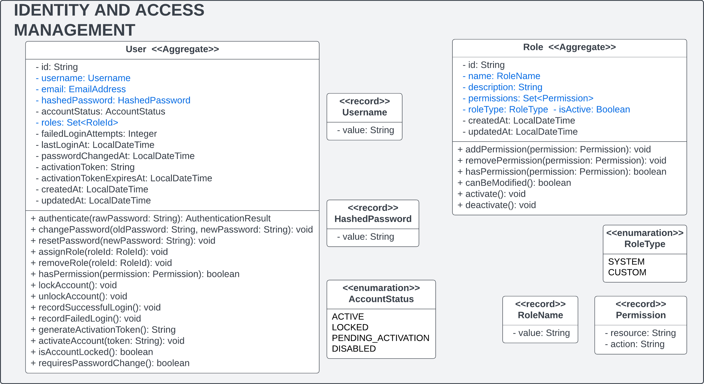

El diagrama de clases del Domain Layer presenta la estructura completa del dominio IAM, mostrando:

**Elementos DDD implementados:**
- **Aggregate Roots**: `User` y `Role` como las principales raíces que garantizan la consistencia de las reglas de seguridad.
- **Entities**: `Permission` como una entidad que define acciones específicas.
- **Value Objects**: Objetos inmutables como `HashedPassword` y `UserStatus` que encapsulan lógica y validaciones.
- **Domain Events**: Eventos como `UserRegisteredEvent` para la comunicación desacoplada.

**Patrones de diseño aplicados:**
- **Factory Pattern**: `UserFactory` para la creación segura y consistente de usuarios.
- **Strategy Pattern**: `PasswordPolicyStrategy` para definir políticas de contraseñas intercambiables.
- **Repository Pattern**: Interfaces para la abstracción de la persistencia de usuarios y roles.

**CQRS Implementation:**
- **Commands**: Operaciones de escritura como `RegisterUserCommand` y `AssignRoleToUserCommand`.
- **Queries**: Operaciones de lectura como `GetUserByEmailQuery`.
- **Command/Query Services**: Separación de responsabilidades para mejorar la mantenibilidad del sistema.

**Seguridad y Roles:**
- Se define una relación **muchos a muchos** entre `User` y `Role`, y entre `Role` y `Permission`, permitiendo un sistema de control de acceso basado en roles (RBAC) flexible y robusto.

##### 4.2.8.6.2. Bounded Context Database Design Diagram


El diseño de la base de datos implementa el modelo de dominio con un enfoque principal en la seguridad y la integridad de los datos de identidad.

**Tablas principales:**
- **`users`**: Aggregate root que almacena la información de identidad, incluyendo el `hashed_password` y el `status`.
- **`roles`**: Aggregate root para definir los roles del sistema.
- **`permissions`**: Tabla para los permisos granulares.
- **`user_roles`** y **`role_permissions`**: Tablas de unión para implementar las relaciones muchos a muchos (RBAC).

**Tablas auxiliares de seguridad:**
- **`auth_tokens`**: Almacena tokens temporales y seguros para procesos como la verificación de email y la recuperación de contraseña.
- **`iam_events`**: Guarda un registro de los eventos de dominio para auditoría y procesamiento asíncrono.

**Características de seguridad y técnicas:**
- **Hashing de contraseñas**: La columna `hashed_password` nunca almacena contraseñas en texto plano.
- **Seeding de datos**: Se incluye una función (`seed_roles_and_permissions`) para crear los roles y permisos iniciales del sistema, asegurando una configuración base consistente.
- **Índices optimizados**: Índices en `email` y `username` para acelerar las búsquedas durante el login.
- **Control de concurrencia**: Campo `version` para el bloqueo optimista en las tablas de agregados.
- **Triggers**: Para la actualización automática de timestamps (`updated_at`) y el versionado.

El esquema está diseñado para ser la base de un sistema de autenticación seguro, cumpliendo con las mejores prácticas de almacenamiento de credenciales y gestión de acceso.

# Capítulo V: Solution UI/UX Design
En esta sección, presentaremos el diseño del producto como parte integral del sistema. El diseño de producto abarcará los componentes físicos como el software. Además, se va a detallar como los componentes influyen en la interacción humano-computadora

## 5.1. Style Guidelines
Esta sección sentará las bases para contar con un repositorio para el formato visual de nuestros productos. Dicho proceso es necesario para tener una consistencia visual en los productos tanto landing, web como mobile.

### 5.1.1. General Style Guidelines
### Branding
#### Descripción general de la marca
<b>WasteTrack</b> es una startup tecnológica que optimiza la recolección de basura urbana mediante sensores IoT en los contenedores. La plataforma monitorea en tiempo real los niveles de llenado para crear rutas de recolección eficientes, permitiendo a los municipios gestionar cada contenedor y a los ciudadanos seguir el recorrido de los camiones. Su objetivo es reducir costos, evitar desbordes y promover ciudades más sostenibles.
#### Misión:
Facilitar la gestión inteligente de los residuos urbanos mediante tecnología avanzada, optimizando las rutas de recolección y promoviendo la participación activa de los ciudadanos en el proceso de limpieza urbana. Buscamos empoderar a los municipios con herramientas eficaces para tomar decisiones basadas en datos, mientras incentivamos a los ciudadanos a participar activamente en el mantenimiento de una ciudad más limpia.
#### Visión:
Convertirnos en la plataforma líder de gestión de residuos urbanos, utilizando tecnología de vanguardia para mejorar la sostenibilidad y la eficiencia en las ciudades. Aspiramos a crear una red global de comunidades colaborativas que utilicen WasteTrack para optimizar sus servicios de recolección de basura, contribuyendo a un modelo de ciudad más limpia, eficiente y transparente.
#### Producto
Nuestro primer producto es una plataforma web y móvil que integra sensores IoT en los contenedores de basura para monitorear en tiempo real sus niveles de llenado. La plataforma utiliza estos datos para optimizar las rutas de recolección, permitiendo a los municipios gestionar eficientemente cada contenedor y a los ciudadanos seguir el recorrido de los camiones de basura. Además, ofrece funcionalidades para reportar incidencias y recibir notificaciones, fomentando la participación ciudadana en la gestión de residuos.
#### Nombre del producto
El nombre de nuestro producto es "WasteTrack", que refleja su enfoque en la gestión eficiente de residuos ("Waste") y el seguimiento en tiempo real de los contenedores y rutas de recolección ("Track").
#### Logo del producto


El logo de WasteTrack representa la fusión de la gestión de residuos y la tecnología inteligente a través de su isotipo: un contenedor de basura estilizado con ondas de señal, enmarcado en un círculo verde. Debajo, el nombre de la marca utiliza una tipografía sans-serif moderna y legible en un tono verde oscuro. La paleta de colores, dominada por verdes, evoca sostenibilidad y ecología, mientras que el diseño general comunica de manera clara los valores de eficiencia, innovación y responsabilidad ambiental de la marca.
#### Color
La gama de colores principal corresponde a tonalidades de blanco, que se relacionan principalmente a limpieza y pulcritud, ambos términos alineados a nuestra visión y misión. La gama abarca también a tonos grises claros, donde la tonalidad más clara se asocia a la sofisticación, mientras que la más oscura va alineada con la formalidad y el profesionalismo. Esta gama nos permite mostrar un diseño limpio, pero procurando siempre formalidad, claridad y transparencia. Los colores seleccionados son: #FCFFF7 (Blanco hueso), #F2F5ED (Gris muy claro), #C9CCC4 (Gris claro), #2C2C2C (Gris oscuro) y #000000 (Negro).


Por otro lado, los tonos de verde seleccionados para la aplicación se asocian a nuestro objetivo principal tanto como startup como aplicación: Asegurar un futuro mas limpio a través del cuidado del medio ambiente. El color verde siempre esta asociado a la vida y a la naturaleza, por lo que es una elección ideal para combinarlo con el color blanco y realizar un contraste entre ambos, mostrando así un balance entre el cuidado de la naturaleza manteniendo siempre formalidad y profesionalismo. Los colores seleccionados son: #C5FFD8 (Verde claro), #60B577 (Verde medio), #2E854B (Verde oscuro), #6AB04C (Verde vibrante) y #005300 (Verde profundo).


#### Tipografía
Se ha seleccionado un estilo roboto para la tipografía utilizada en la aplicación la cual comprende una serie de tamaños seleccionados cuidadosamente para que el usuario pueda ver la información y apartados de mayor relevancia de la aplicación. En caso el texto este mostrado en secciones con un fondo con tonalidad oscura, el color de texto pasará a ser blanco, siguiendo la misma fuente, tamaño y peso según lo establecido.


#### Tono de comunicación
El tono de comunicación adoptará un enfoque serio, formal, respetuoso y sereno. Este tono refuerza la percepción de profesionalismo, que es esencial en un sistema que gestiona servicios públicos. Al mantener un tono formal, se transmite credibilidad a los usuarios, asegurándoles que están interactuando con una plataforma confiable y bien estructurada. Además, el respeto en la comunicación es fundamental para fomentar una relación positiva con los usuarios, promoviendo la colaboración y el compromiso con la gestión eficiente de residuos. La serenidad en el tono ayuda a crear una experiencia de usuario agradable, lo que es crucial para mantener la atención y satisfacción del usuario en un entorno digital.

### 5.1.2. Web, Mobile and IoT Style Guidelines
### Web Style Guidelines
#### Componentes
#### Tipografía
El sistema de tipografía define la jerarquía visual de la aplicación. Utiliza la fuente 'Inter' para garantizar legibilidad y una apariencia moderna. Se establecen estilos claros para encabezados (H1 a H4), párrafos, texto secundario y enlaces, asegurando consistencia en toda la interfaz. En una implementación con Vue, estas clases de Tailwind CSS se aplicarían directamente en las plantillas para mantener un estilo coherente y escalable.


#### Botones
Este componente define un conjunto de botones de acción con tres variantes: primario, secundario y de acción en tabla. Será implementado como un único componente reutilizable en Vue que acepta propiedades (props) para modificar su estilo y tamaño. El botón primario se usará para llamadas a la acción principales, el secundario para acciones alternativas, y la variante de tabla para operaciones contextuales dentro de filas de datos.


#### Campos de formulario
Este componente agrupa varios tipos de campos de entrada, como texto, email, contraseña, select, textarea y un estado deshabilitado. Se implementará como un componente base en Vue, personalizable a través de props para cambiar su tipo (type), placeholder, label y estado. Su diseño minimalista y funcional asegura una experiencia de usuario clara al capturar información en formularios.


#### Barra lateral (Administrador)
Este componente es un menú de navegación vertical diseñado para el panel de administración. Incluye un espacio para el logo, enlaces de navegación con íconos, y una sección de perfil y cierre de sesión en la parte inferior. Implementado en Vue, utilizará vue-router para gestionar las rutas de la aplicación, con un estado activo que resalta la sección actual, ofreciendo una navegación intuitiva y organizada.


#### Encabezado de página
El componente de encabezado de página muestra el título de la vista actual y la información del usuario que ha iniciado sesión. Implementado en Vue, este componente recibirá el título de la página como una prop para hacerlo dinámico y mostrará un avatar y el nombre del usuario, sirviendo como un punto de referencia constante en la parte superior de la interfaz.


#### Tabla de datos
Este componente se utilizará para mostrar información de manera estructurada en filas y columnas. Incluye una cabecera (thead) para los títulos y un cuerpo (tbody) para los datos, además de una columna dedicada para botones de acción. Se puede implementar utilizando una librería como PrimeVue con su componente <DataTable> para añadir fácilmente funcionalidades avanzadas como ordenación, paginación y filtros.


#### Ventana modal
Este componente es una ventana emergente (modal) que se superpone al contenido principal para solicitar una confirmación del usuario. Incluye un título, un mensaje descriptivo y botones de acción como "Cancelar" y "Aceptar". En Vue, se puede implementar utilizando el componente <Dialog> de PrimeVue o crearlo desde cero, gestionando su visibilidad con una variable de estado para controlar cuándo debe mostrarse.


#### Notificación toast
El componente de notificación toast se utiliza para mostrar mensajes cortos y no intrusivos sobre el resultado de una acción (por ejemplo, "Éxito al guardar"). Aparece en una esquina de la pantalla y desaparece automáticamente. En Vue, se puede gestionar eficientemente con librerías como vue-toastification para manejar colas de notificaciones y diferentes estados (éxito, error, advertencia).


#### Tarjeta de métrica
Este componente es una tarjeta simple diseñada para mostrar un dato o indicador clave (KPI) de forma destacada en un dashboard. Su diseño minimalista se centra en un valor numérico grande y una etiqueta descriptiva. Como componente de Vue, recibirá el dato y la etiqueta como props para ser reutilizado fácilmente en cualquier panel de control.


#### Tarjeta de gráfico
Es un contenedor diseñado específicamente para albergar visualizaciones de datos, como gráficos de barras o líneas. Define un área con un título claro donde se puede renderizar un gráfico. En una aplicación Vue, este componente actuaría como un wrapper, integrando librerías de gráficos como Chart.js o ApexCharts a través de sus respectivos adaptadores para Vue.


#### Tarjeta de estado vacío
Este componente se muestra cuando no hay datos disponibles en una sección. Proporciona un mensaje claro al usuario explicando la situación e incluye un botón de llamada a la acción para guiarlo sobre cómo proceder (por ejemplo, "Crear nuevo colaborador"). Es fundamental para una buena experiencia de usuario, evitando pantallas en blanco y confusas.


### Mobile Style Guidelines
Estos componentes son la base visual de la aplicación móvil y se han diseñado para ser consistentes en ambas plataformas (iOS y Android). Su implementación se realizará como un conjunto de componentes reutilizables en un framework multiplataforma como Flutter, garantizando una experiencia de marca unificada.


Define la jerarquía de texto para las pantallas móviles, estableciendo tamaños y pesos para títulos de pantalla, títulos de sección, cuerpo de texto y textos de ayuda. Utiliza la fuente 'Inter' para una legibilidad óptima en pantallas pequeñas.


El sistema de botones incluye una variante primaria para acciones principales, una secundaria para opciones alternativas, y un botón de selección (tipo chip o segmented control) para alternar entre estados activo e inactivo.


Es un componente de entrada de texto con un diseño limpio que incluye un label y un placeholder. Contempla un estado de error, resaltando el borde para notificar al usuario sobre datos incorrectos, garantizando una validación clara en los formularios.


Se definen dos tipos de tarjetas. La Tarjeta de Selección combina un ícono, título y subtítulo, ideal para menús o listas de opciones. La Tarjeta de Información es más simple y se usa para mostrar datos clave de manera concisa, como el estado de un contenedor.


Este grupo incluye la Notificación en Lista, diseñada para mostrar actualizaciones o mensajes dentro de una lista con su título, descripción y marca de tiempo. También define los Indicadores de Página (puntos), utilizados comúnmente en carruseles o flujos de onboarding para mostrar el progreso.


Este componente se utiliza para comunicar estados importantes que ocupan toda la pantalla, como pantallas de carga, error, o estados vacíos (empty states). Incluye un ícono, un título y un mensaje descriptivo para guiar al usuario.

#### iOS Mobile Style Guidelines
Para ofrecer una experiencia nativa y familiar a los usuarios de iOS, los siguientes componentes se deben implementar siguiendo las "Human Interface Guidelines" de Apple. Se recomienda el uso de componentes nativos de SwiftUI.
- Barra de Navegación Superior: Este componente presenta un título centrado y un botón de "Atrás" a la izquierda, que combina un ícono de chevron con texto. Esta estructura es un patrón estándar en iOS y se implementa nativamente con NavigationView en SwiftUI.
- Barra de Pestañas (Tab Bar): Es la barra de navegación principal en la parte inferior de la pantalla. Se caracteriza por su fondo translúcido con efecto blur. Los íconos de las pestañas inactivas no llevan texto, mientras que la pestaña activa se resalta con un color y muestra su etiqueta correspondiente. Se implementa con el componente TabView.

- 

#### Android Mobile Style Guidelines
Estos componentes se basan en los principios de Material Design para asegurar una integración perfecta con el ecosistema Android. Su implementación se recomienda utilizando los componentes de Jetpack Compose.
- Barra de Aplicación Superior (Top App Bar): A diferencia de iOS, la barra de navegación superior de Android alinea el título a la izquierda, justo después del ícono de navegación (flecha para retroceder o ícono de "hamburguesa"). Este componente se implementa con TopAppBar en Jetpack Compose.
- Barra de Navegación Inferior: Este componente de navegación inferior se caracteriza por tener un fondo sólido y mostrar siempre las etiquetas de texto para todos los íconos, tanto para la pestaña activa como para las inactivas, facilitando el reconocimiento de cada sección. Se implementa con el componente NavigationBar.


### IoT Style Guidelines

Estas directrices definen las características físicas y visuales del hardware (dispositivo IoT) para asegurar su durabilidad, funcionalidad y coherencia con la identidad del sistema.

#### Diseño físico y carcasa

El diseño del dispositivo prioriza la robustez y la discreción para su instalación en contenedores de basura en entornos urbanos.

* **Material:** La carcasa está construida con plástico **ABS de alto impacto**, resistente a condiciones climáticas adversas (sol, lluvia, temperaturas extremas) y a posibles actos de vandalismo.
* **Color:** Se utiliza un color **gris neutro (Hex: #333333)** para que el dispositivo se integre discretamente con la mayoría de los diseños de contenedores sin llamar la atención.
* **Forma:** El diseño es compacto y de bajo perfil para minimizar su exposición. Las esquinas son redondeadas para evitar enganches durante la recole-cción de basura.
* **Certificación de Resistencia:** El dispositivo debe contar con una **certificación IP67**, garantizando que es completamente hermético al polvo y resistente a la inmersión temporal en agua.

#### Componentes visuales en campo

Son los elementos que permiten la interacción y el diagnóstico del dispositivo en el sitio de instalación.

* **Identificador Físico (QR / ID Numérico):** Es la etiqueta principal del dispositivo y sirve como su identificador único. Se implementa como una etiqueta de policarbonato grabada con láser para máxima durabilidad. Contiene un código QR para un escaneo rápido y un ID alfanumérico (ej. IOT-007) legible por humanos.
* **Indicadores de Estado (LED):** Proporciona feedback visual inmediato sobre el estado operativo. Utiliza luces LED de alta visibilidad protegidas por una cubierta transparente y sellada.
  * **Luz Verde Intermitente:** Funcionamiento normal y conexión a la red.
  * **Luz Roja Fija:** Error crítico de hardware o fallo de conexión.
  * **Luz Azul:** Modo de transmisión de datos activo.

#### Montaje e instalación

Define el método estándar para fijar el dispositivo al contenedor, asegurando su estabilidad y la precisión de sus mediciones.

* **Ubicación:** El dispositivo se debe montar en la parte interna superior de la tapa del contenedor, centrado para obtener una lectura ultrasónica precisa del nivel de llenado.
* **Fijación:** La instalación se realiza utilizando **tornillos de seguridad** (anti-manipulación) para prevenir robos o daños intencionados. Se debe utilizar una junta de goma para asegurar un sellado correcto.

## 5.2. Information Architecture

### 5.2.1. Organization Systems
Para asegurar una experiencia de usuario clara, intuitiva y eficiente, la arquitectura de información de la plataforma se ha estructurado utilizando una combinación de sistemas de organización visual y esquemas de categorización de contenido. A continuación, se detalla cómo se aplica cada sistema según el grupo de información y el perfil de usuario.

#### Ciudadanos


#### Administradores municipales


#### Choferes de camión de basura


Los diagramas presentados anteriormente ilustran la arquitectura de la información y la estructura de navegación para cada uno de los tres perfiles de usuario definidos: Ciudadano, Colaborador Municipal (Conductor) y Colaborador Municipal (Administrador).

Estos mapas de sitio jerárquicos sirven como una representación visual de los sistemas de organización aplicados. Muestran las vistas principales disponibles para cada usuario, las acciones que pueden realizar y la relación lógica entre las distintas funcionalidades. Esta estructura visual sienta las bases para la organización jerárquica y secuencial que se detalla a continuación.

#### Organización visual del contenido
La disposición visual de la información se ha diseñado para guiar al usuario de manera lógica a través de la interfaz.

- Organización Jerárquica (Visual Hierarchy): Este es el principal sistema de organización para la estructura general de la aplicación, especialmente en el panel del Administrador. La información se organiza desde lo general a lo específico, creando una jerarquía clara. Como se puede observar en el diagrama de flujo del "Colaborador Municipal - Administrador", esta jerarquía se manifiesta de la siguiente manera:
  - Nivel 1 (Punto de entrada): El Dashboard actúa como la vista principal y el nivel más alto de la jerarquía, ofreciendo un resumen de la información más relevante.
  - Nivel 2 (Categorías principales): Desde el Dashboard, el usuario puede navegar a las secciones principales de la aplicación, que funcionan como categorías temáticas: Gestión de Rutas, Dispositivos IoT, Colaboradores, Reportes Ciudadanos y Perfil y Cierre.
  - Nivel 3 (Acciones y vistas de detalle): Dentro de cada categoría, el usuario accede a vistas y acciones más específicas. Por ejemplo, dentro de Colaboradores, se encuentran las opciones Ver Lista de Colaboradores, Invitar Colaborador y Editar Colaborador.
- Organización secuencial (Step-by-step): Este sistema se aplica a todos los flujos de trabajo donde el usuario debe completar una tarea específica. El diseño guía al usuario a través de una serie de pasos lógicos y predefinidos para evitar errores y reducir la carga cognitiva. Ejemplos claros, visibles en los diagramas de flujo, incluyen:
  - Registro de una municipalidad: El flujo Registro de Municipalidad -> Dashboard es una secuencia lineal para incorporar a un nuevo usuario administrativo.
  - Gestión de un reporte ciudadano: El administrador sigue la secuencia Ver Bandeja de Entrada -> Ver Detalle de Reporte -> Cambiar Estado, culminando en un Feedback de Éxito. Este enfoque paso a paso asegura que las tareas se completen de manera ordenada y eficiente.

#### Esquemas de categorización de contenido
Para agrupar y presentar la información de manera coherente, se utilizan los siguientes esquemas de categorización:
- Según Audiencia (Grupos de usuarios): Este es el esquema de organización más fundamental de toda la plataforma. La funcionalidad total se ha segmentado en tres flujos completamente distintos, cada uno diseñado para una audiencia específica:
  1. Ciudadano (Móvil y Web): Acceso a funciones públicas como visualización de mapas y creación de reportes.
  2. Conductor (Colaborador Móvil): Herramientas enfocadas exclusivamente en la ejecución de rutas de recolección.
  3. Administrador (Colaborador Web): Acceso completo a todas las funciones de gestión, configuración y monitoreo.
     Esta separación garantiza que la interfaz de cada usuario sea relevante, simple y esté libre de información o herramientas innecesarias para su rol.
- Por Tópicos: Dentro del panel de Administración, la navegación principal se organiza por temas. El menú lateral agrupa toda la información y las herramientas en categorías lógicas (Gestión de Rutas, Dispositivos IoT, Colaboradores, etc.). Esto permite al administrador localizar rápidamente la función que necesita, ya que toda la información relacionada con un tema específico se encuentra en un único lugar.
- Cronológico: Este esquema se aplicará en todas las vistas que muestren listas de eventos o entradas dinámicas, como la bandeja de Reportes Ciudadanos o un futuro panel de notificaciones. Los elementos se ordenarán por fecha, mostrando los más recientes primero para asegurar que el administrador tenga acceso inmediato a la información más actualizada y relevante.
- Alfabético: Para facilitar la búsqueda y el escaneo en listas que pueden volverse extensas, se utilizará un esquema de organización alfabético. Esto se aplicará, por ejemplo, en la Lista de Colaboradores o en la Lista de Dispositivos, permitiendo al administrador encontrar un ítem específico de manera rápida y predecible.

### 5.2.2. Labeling Systems
Para garantizar que los usuarios puedan navegar por la plataforma de manera eficiente y comprender la información presentada sin ambigüedad, se ha desarrollado un sistema de etiquetado consistente. El objetivo principal de este sistema es representar los datos y las acciones con la máxima simplicidad, utilizando un lenguaje claro para evitar la confusión.

Las etiquetas se han diseñado considerando el contexto y las necesidades de cada perfil de usuario.

#### **Etiquetas de navegación principal**
Representan los conjuntos de información más grandes y sirven como puntos de anclaje para la navegación.
* **Aplicación Ciudadano (móvil y web):** Se utilizan etiquetas universalmente reconocibles como **Mapa**, **Reportar** y **Notificaciones**. Estas etiquetas de una sola palabra asocian inmediatamente la sección con su funcionalidad principal: visualizar información geoespacial o iniciar el proceso de creación de un reporte.
* **Aplicación Conductor (colaborador móvil):** Las etiquetas están orientadas a tareas específicas de su rol, como **Hoja de Ruta** y **Perfil**. La etiqueta **Hoja de Ruta** crea una asociación directa con su lista de tareas del día, agrupando todas las paradas y acciones relacionadas con su trabajo de recolección.
* **Aplicación Administrador (colaborador web):** Se emplea un sistema de etiquetado temático y descriptivo. Etiquetas como **Dashboard**, **Gestión de Rutas**, **Dispositivos IoT**, **Colaboradores** y **Reportes Ciudadanos** asocian cada sección con un conjunto completo de herramientas de administración. El uso de la palabra "Gestión" establece en la mente del usuario que dentro de esa sección encontrará funcionalidades para crear, visualizar, editar y monitorear los elementos correspondientes, sin necesidad de aglomerar todas las opciones en el menú principal.

#### **Etiquetas de acciones (Botones y enlaces)**
Las etiquetas para elementos interactivos se han estandarizado para ser claras, predecibles y orientadas a la acción.
* **Consistencia Verbo-Sustantivo:** La mayoría de las acciones principales se etiquetan con un formato de verbo imperativo, como **Enviar Reporte**, **Generar Ruta**, **Invitar Colaborador** o **Guardar Cambios**. Esta consistencia ayuda al usuario a entender inmediatamente el resultado de su interacción.
* **Concisión:** En contextos donde el espacio es limitado, como en las tablas de datos, se utilizan etiquetas cortas y directas. Por ejemplo, la etiqueta **Ver Detalles** en la lista de reportes asocia la acción con la apertura de una vista más completa que contendrá toda la información del reporte (mapa, foto, comentarios), evitando sobrecargar la tabla con datos innecesarios. De igual manera, **Editar** o **Configurar** comunican una acción específica sin ambigüedad.

#### **Etiquetas de contenido y datos**
Para la representación de datos dentro de formularios, tablas y vistas de detalle, se utilizan etiquetas descriptivas breves que definen claramente la información mostrada. Encabezados como **Nivel de Llenado**, **Estado del Dispositivo** o **Rol** son consistentes a través de toda la plataforma, asegurando que el usuario pueda escanear y comprender la información rápidamente, independientemente de la sección en la que se encuentre.

### Etiquetas del Dispositivo Físico (IoT)
Para crear un puente claro entre el hardware instalado en campo y la plataforma digital, los dispositivos IoT utilizan un sistema de etiquetado físico simple y funcional.

#### **Identificador Único (QR / ID Numérico)**

Cada sensor físico lleva una etiqueta indeleble con un **código QR** y un **ID alfanumérico único** (ej. *IOT-007*). Esta etiqueta es el identificador primario que asocia el dispositivo físico con su representación digital en el panel de administración. Durante el registro, el administrador escanea o introduce este código para vincular el sensor a un contenedor y ubicación específicos.

#### **Indicadores de Estado (LED)**

El propio dispositivo utiliza un sistema de **luces LED** como etiquetas visuales para comunicar su estado operativo a los técnicos en campo, sin necesidad de consultar la aplicación. Este sistema se define por:

*  **Luz Verde Intermitente:** Indica que el dispositivo está conectado a la red y funcionando correctamente.
*  **Luz Roja Fija:** Representa un error de hardware o un problema de conexión que requiere atención.
*  **Luz Azul:** Señaliza que el dispositivo está en proceso de transmitir datos al servidor.

### 5.2.3. SEO Tags and Meta Tags
A continuación se detallan los valores para las etiquetas SEO y Meta Tags recomendadas para las páginas clave del proyecto.

#### 1. Landing Page

El objetivo de esta página es atraer, informar y convertir a nuevos usuarios (municipios y ciudadanos). Por lo tanto, las etiquetas están optimizadas para motores de búsqueda públicos como Google.

* **Title:**
  * **Valor:** `WasteTrack | Gestión Inteligente de Residuos para Ciudades Modernas`
  * **Descripción:** Es conciso, incluye el nombre de la marca al inicio y las palabras clave principales ("Gestión Inteligente de Residuos", "Ciudades Modernas"). Tiene una longitud ideal para una buena visualización en los resultados de búsqueda.

* **Meta Tag Description:**
  * **Valor:** `Transforma la gestión de residuos de tu ciudad con WasteTrack. Usamos sensores IoT y optimización de rutas para una recolección de basura eficiente y sostenible. ¡Descubre más!`
  * **Descripción:** Ofrece un resumen atractivo de la propuesta de valor, utilizando palabras clave secundarias ("sensores IoT", "optimización de rutas", "recolección de basura") y finalizando con una llamada a la acción.

* **Meta Tag Keywords:**
  * **Valor:** `gestión de residuos, contenedores inteligentes, recolección de basura, optimización de rutas, IoT, ciudades inteligentes, sostenibilidad, software municipal, WasteTrack`
  * **Descripción:** Agrupa los términos de búsqueda más relevantes para el servicio. Aunque su peso en el SEO moderno ha disminuido, sigue siendo una buena práctica para contextualizar el contenido de la página.

* **Meta Tag Author:**
  * **Valor:** `WasteTrack`
  * **Descripción:** Identifica al creador o propietario del contenido, en este caso, el nombre del producto o la startup.

#### 2. Aplicación Web

Estas páginas no están destinadas a ser indexadas por motores de búsqueda públicos, ya que requieren autenticación. El objetivo aquí es la experiencia de usuario, especialmente en los títulos que se muestran en las pestañas del navegador.

* **Title (Estructura Dinámica):**
  * **Valor:** `[Nombre de la Vista Actual] - WasteTrack`
  * **Descripción:** Se utiliza una estructura dinámica donde el título de la página específica precede al nombre de la marca. Esto ayuda a los usuarios a identificar rápidamente qué pestaña corresponde a qué tarea.
  * **Ejemplos para Administrador:**
    * `Dashboard - WasteTrack`
    * `Gestión de Contenedores - WasteTrack`
    * `Rutas Activas - WasteTrack`
  * **Ejemplos para Ciudadano:**
    * `Mapa de Recolección - WasteTrack`
    * `Mis Reportes - WasteTrack`

* **Meta Tag Description:**
  * **Valor:** `Plataforma de WasteTrack para la gestión y monitoreo en tiempo real de la recolección de residuos urbanos.`
  * **Descripción:** Se puede usar una descripción general para todas las páginas internas de la aplicación, ya que su propósito no es el SEO público. Describe la función principal de la plataforma.

* **Meta Tag Keywords:**
  * **Valor:** `dashboard, monitoreo IoT, rutas, reportes de ciudadanos, gestión municipal, nivel de llenado, sensores, mapa de recolección`
  * **Descripción:** Incluye términos relacionados con las funcionalidades internas de la aplicación.

* **Meta Tag Author:**
  * **Valor:** `WasteTrack`
  * **Descripción:** Mantiene la consistencia de la marca.

### 5.2.4. Searching Systems
Para evitar que los usuarios se sientan abrumados por el volumen de información, la plataforma integra sistemas de búsqueda contextuales y eficientes en sus aplicaciones web. El objetivo es proporcionar medios de ayuda que permitan a los usuarios localizar datos específicos de manera rápida y precisa.

A continuación, se especifican las opciones de búsqueda y filtrado para cada aplicación.

#### **1. Aplicación Web del Ciudadano**

En esta aplicación, el principal sistema de búsqueda se encuentra en el flujo inicial de selección de la municipalidad.

* **Opción de Búsqueda:** Se ofrece una única barra de búsqueda textual con el placeholder `"Buscar municipalidad..."`.
* **Funcionamiento:** La búsqueda se activa en tiempo real a medida que el usuario escribe. No es necesario presionar "Enter" para ver los resultados.
* **Filtros:** No se aplican filtros adicionales en este caso, ya que es una búsqueda directa por nombre.
* **Visualización de Resultados:** La lista de municipalidades se filtra dinámicamente, mostrando únicamente aquellas cuyo nombre coincide con el texto ingresado. Esto reduce una lista potencialmente larga a unas pocas opciones relevantes, facilitando una selección rápida y sin errores.

#### **2. Aplicación Web de Administración**

La aplicación de administración, al manejar un volumen de datos considerablemente mayor, implementa sistemas de búsqueda y filtrado en todas sus secciones principales que contienen tablas de datos (Colaboradores, Dispositivos IoT y Reportes Ciudadanos).

* **Opción de Búsqueda General:** Cada sección cuenta con una barra de búsqueda textual que permite al administrador buscar por identificadores clave como nombre, email o ID del dispositivo.
* **Filtros Contextuales:** Para refinar las búsquedas, se proporcionan filtros específicos para cada tipo de dato:
  * **En la sección de Colaboradores:** El usuario podrá filtrar la lista por **Rol** (ej. "Conductor", "Administrador") y por **Estado** ("Activo", "Inactivo").
  * **En la sección de Dispositivos IoT:** Se ofrecerán filtros por **Estado del dispositivo** ("Encendido", "Apagado", "Mantenimiento") y, potencialmente, por alertas como **Batería Baja**.
  * **En la sección de Reportes Ciudadanos:** El administrador podrá filtrar los reportes por **Tipo de Incidencia** ("Contenedor Lleno", "Basura Fuera", etc.) y por **Estado** ("Pendiente", "Solucionado").
* **Visualización de Resultados:** Al aplicar una búsqueda o un filtro, la tabla de datos se actualizará instantáneamente para mostrar solo las filas que cumplen con los criterios seleccionados. Los filtros activos se mostrarán como etiquetas visuales encima de la tabla, permitiendo al usuario saber en todo momento qué subconjunto de datos está visualizando.

### 5.2.5. Navigation Systems

El sistema de navegación de la plataforma está diseñado para ser predecible, consistente y contextual, permitiendo a los usuarios moverse a través del contenido con confianza y cumplir sus metas de manera eficiente. Se han implementado diferentes técnicas de navegación adaptadas a cada producto digital (Landing Page, Aplicaciones Web y Móviles) y a las necesidades específicas de cada perfil de usuario.

#### **Sistemas de Navegación Global**

Estos son los mecanismos principales y persistentes que el usuario utiliza para moverse entre las secciones principales de la aplicación.

* **Aplicaciones Web (Ciudadano y Administrador):** La navegación se estructura en torno a una barra de navegación lateral persistente (Sidebar). Este componente siempre está visible en el lado izquierdo de la pantalla, proporcionando acceso constante a las funcionalidades clave como **Mapa** y **Notificaciones** para el ciudadano, y **Dashboard**, **Gestión de Rutas**, **Dispositivos IoT**, **Colaboradores** y **Reportes Ciudadanos** para el administrador. El enlace de la sección activa siempre se resalta visualmente, lo que sirve como un fuerte indicador de ubicación y ayuda al usuario a saber dónde se encuentra dentro de la arquitectura del sitio.

* **Aplicaciones Móviles (Ciudadano y Conductor):** La navegación principal se basa en una barra de pestañas inferior (Bottom Tab Bar). Este patrón es nativo de los sistemas operativos móviles y ofrece un acceso rápido y ergonómico (amigable con el pulgar) a las 2-3 funciones más importantes. Por ejemplo, en la app del ciudadano, permite cambiar instantáneamente entre **Mapa** y **Reportar**.

#### **Sistemas de Navegación Local y Contextual**

Estos sistemas guían al usuario dentro de secciones o tareas específicas.

* **Navegación de Lista a Detalle:** En vistas que presentan múltiples elementos, como la tabla de "Reportes Ciudadanos" o la "Hoja de Ruta" del conductor, los usuarios navegan hacia una vista más profunda haciendo clic en un elemento de la lista o en un botón de acción explícito (**Ver Detalles**). Este patrón permite mantener las vistas de lista limpias y con información resumida, ofreciendo el contenido completo solo cuando el usuario lo solicita.

* **Uso de Modales para Tareas Enfocadas:** Para acciones que requieren la entrada de datos o confirmaciones (**Reportar Incidencia**, **Invitar Colaborador**), se utiliza una navegación modal. La vista modal se superpone al contenido actual, manteniendo al usuario en el contexto de la página original. Esto es ideal para tareas cortas, ya que evita la desorientación que podría causar una navegación a una página completamente nueva.

* **Navegación Secuencial (Paso a Paso):** Los flujos de trabajo que requieren múltiples pasos, como el proceso de registro de una municipalidad o la finalización de una jornada laboral, utilizan una navegación lineal. Botones con etiquetas claras como **Continuar** o **Siguiente** guían al usuario a través de la secuencia, asegurando que completen todos los pasos necesarios en el orden correcto para cumplir su objetivo.

#### **Navegación en el Landing Page**

La navegación del sitio web estático está orientada a guiar a los potenciales clientes a través de la información del producto.

* **Navegación Principal Superior:** El encabezado del sitio contiene una barra de navegación con enlaces a las secciones informativas clave (**Beneficios**, **Características**, **Testimonios**, **Contacto**).

* **Llamadas a la Acción (Call to Action - CTAs):** Se utilizan botones prominentes (**Registrarse**, **Solicita demostración**) en puntos estratégicos para guiar a los visitantes hacia las acciones de conversión.

## 5.3. Landing Page UI Design
En esta sección se presentan los wireframes y mock-ups de alta fidelidad diseñados para la página de aterrizaje (landing page) del producto. El objetivo principal de esta página es captar la atención de potenciales clientes (municipalidades y ciudadanos), comunicar claramente la propuesta de valor del servicio y motivar a los visitantes a registrarse o solicitar una demostración.

### 5.3.1. Landing Page Wireframe
En esta sección, se muestra un esquema básico del diseño de la Landing Page, donde se resaltan las principales áreas de contenido, como el encabezado y las secciones de beneficios para ciudadanos y municipalidades. Este wireframe representa la estructura fundamental de la página sin detalles visuales específicos.


### 5.3.2. Landing Page Mock-up
El mock-up de la Landing Page ofrece una representación visual más avanzada del diseño final, incluyendo los colores, tipografía, imágenes y componentes interactivos. Este diseño está orientado a proporcionar una idea clara de cómo será la interfaz una vez implementada, reflejando la identidad visual de WasteTrack y su enfoque en la usabilidad.


## 5.4. Applications UX/UI Design

### 5.4.1. Applications Wireframes

### Mobile Applications Wireframes
Se puede encontrar todos los Mobile Applications Wireframes en el siguiente [enlace a Figma](https://www.figma.com/design/SYYxFeZgRViEvSUVEYlhZq/PRODUCT?node-id=0-1&p=f):

https://www.figma.com/design/SYYxFeZgRViEvSUVEYlhZq/PRODUCT?node-id=0-1&p=f

A continuación, se presentan los wireframes de baja fidelidad para la aplicación móvil del ciudadano. Estos wireframes ilustran la estructura básica y la disposición de los elementos en cada pantalla, proporcionando una visión clara de la experiencia del usuario y el flujo de navegación dentro de la aplicación.

### Flujo de usuario: Ciudadano
Este flujo está diseñado para ser simple e intuitivo, permitiendo a cualquier ciudadano interactuar con el sistema de gestión de residuos de su municipalidad.

#### Pantallas de bienvenida e integración (Onboarding)
Representa el primer contacto del usuario con la aplicación. A través de una serie de pantallas, se presenta la propuesta de valor, se le permite al usuario seleccionar su rol ("Ciudadano") y, crucialmente, buscar y elegir la municipalidad a la que pertenece para personalizar el contenido de la aplicación.


#### Vista principal (Mapa)
Es el centro de la experiencia del ciudadano. Muestra un mapa en tiempo real con la ubicación de los contenedores de basura cercanos. Desde aquí, el usuario puede visualizar el estado de los contenedores y la ruta estimada del camión recolector. La barra de navegación inferior le da acceso directo a las funciones más importantes: "Mapa" y "Reportar".


#### Menú de municipalidad
Este es un menú contextual que se despliega al presionar el ícono de la municipalidad en la vista principal. Su función principal es permitir al usuario cambiar de municipalidad de manera rápida y heurística, sin tener que navegar a una pantalla de configuración separada.


#### Reporte de incidencia
Muestra un formulario simple y directo para que el ciudadano pueda reportar anónimamente problemas relacionados con la basura. Incluye campos para seleccionar el tipo de incidencia, añadir una descripción opcional y adjuntar una fotografía como evidencia, fomentando la colaboración para mantener la ciudad limpia.


#### Centro de notificaciones
Esta pantalla funciona como una bandeja de entrada donde el usuario recibe actualizaciones importantes. Aquí se le notificará sobre el estado de sus reportes (ej. "reporte recibido", "reporte solucionado") y otros avisos relevantes de su municipalidad. Cada notificación puede ser eliminada individualmente.


### Flujo de usuario: Colaborador municipal (Chofer)
Este flujo es una herramienta de trabajo diseñada para la eficiencia operativa. Es una aplicación robusta que guía al conductor a través de sus tareas diarias.

#### Pantallas de bienvenida e integración (Onboarding)
Representa el primer contacto del usuario con la aplicación. A través de una serie de pantallas, se presenta la propuesta de valor, se le permite al usuario seleccionar su rol ("Colaborador municipal")


#### Acceso de colaborador
Representa una pantalla de inicio de sesión segura y simple, diseñada para personal autorizado. El colaborador (conductor) ingresa sus credenciales (Usuario/ID y Contraseña) para acceder a sus funciones operativas. No incluye una opción de registro, ya que las cuentas son creadas por un administrador en la plataforma web.


#### Estado de acceso
Esta vista muestra los posibles mensajes de error o estados informativos durante el login. Incluye el "unhappy path" de credenciales incorrectas, resaltando visualmente los campos erróneos y mostrando un mensaje claro. También cubre el caso en que el login es exitoso pero no hay una ruta de trabajo asignada para el día.


#### Hoja de ruta del día
Es el dashboard principal del conductor después de iniciar sesión. Presenta la ruta optimizada del día de dos maneras: una vista de mapa para el contexto geográfico y una lista secuencial de las paradas a realizar. Desde aquí, el conductor puede iniciar su jornada y seleccionar cada parada para ver más detalles.


#### Detalle de parada
Muestra toda la información necesaria para una única parada de recolección: la ubicación exacta, el ID del contenedor y su nivel de llenado. Funciona como el centro de acciones, permitiendo al conductor confirmar la recolección, navegar a la ubicación vía GPS o reportar una incidencia específica de esa parada.


#### Navegación GPS
Representa la vista de navegación paso a paso. Se activa cuando el conductor presiona "Navegar a la Parada". Le proporciona instrucciones en tiempo real para llegar a su siguiente destino de la manera más eficiente, minimizando el tiempo de viaje.


#### Reporte de incidencia (Conductor)
Un formulario especializado para que el conductor reporte problemas operativos que encuentre en su ruta, como un contenedor dañado, un acceso bloqueado u otra eventualidad. Esto permite comunicar problemas internos al administrador de forma inmediata.


#### Pantalla de confirmación
Esta toast notification aparece como confirmación o feedback inmediato después de que el conductor realiza una acción clave, como confirmar una recolección o enviar un reporte. Es un mensaje breve que asegura al usuario que su acción fue exitosa sin interrumpir su flujo de trabajo. También, se utiliza para notificar errores críticos, como problemas de conexión a internet.


#### Perfil y opciones del Conductor
Representa una pantalla de ajustes donde el conductor puede ver su información básica (nombre, ID, vehículo asignado) y realizar acciones clave de fin de sesión, como "Finalizar Jornada" o "Cerrar Sesión".


#### Resumen de jornada
Esta es la pantalla final del flujo de trabajo diario. Al "Finalizar Jornada", la aplicación presenta un resumen del trabajo realizado (ej. paradas completadas, incidencias reportadas, duración del turno). Sirve para confirmar la finalización exitosa de las tareas del día.


#### Pantalla "Todo en Orden"
Esta pantalla se muestra cuando el conductor ha completado todas las paradas asignadas para el día. Es una confirmación visual de que no quedan tareas pendientes, proporcionando un sentido de logro y cierre al finalizar su jornada laboral. También, se muestra cuando el conductor intenta iniciar su jornada sin una ruta asignada, informándole que no hay tareas para realizar.


### Web Applications Wireframes
Se puede encontrar todos los Web Applications Wireframes en el siguiente [enlace a Figma](https://www.figma.com/design/SYYxFeZgRViEvSUVEYlhZq/PRODUCT?node-id=7-2&p=f):

https://www.figma.com/design/SYYxFeZgRViEvSUVEYlhZq/PRODUCT?node-id=7-2&p=f

A continuación, se presentan los wireframes de baja fidelidad para la aplicación web de administración. Estos wireframes ilustran la estructura básica y la disposición de los elementos en cada pantalla, proporcionando una visión clara de la experiencia del usuario y el flujo de navegación dentro de la aplicación.

### Flujo de Super Administrador
Este flujo está diseñado como una herramienta interna y segura, accesible únicamente para los desarrolladores o administradores del sistema. Su única finalidad es la creación y gestión de las cuentas maestras de las municipalidades, siguiendo un modelo de negocio B2B.

#### Acceso de Super Administrador
Representa un portal de inicio de sesión de alta seguridad, completamente separado del de los administradores municipales. Esta pantalla es el único punto de entrada para la gestión global de las cuentas de clientes. Se incluyen las vistas para un ingreso exitoso y para un intento fallido, mostrando un mensaje de error claro.


#### Dashboard de Municipalidades
Es la pantalla principal del super administrador. Muestra un listado de todas las cuentas de municipalidades creadas en el sistema, con información clave como el nombre, el email del administrador principal y su estado (Activa/Inactiva). Se ha diseñado tanto el estado ideal (con datos) como el estado vacío, que guía al usuario a crear la primera cuenta.


#### Creación de Cuenta Municipal
Muestra el formulario completo que utiliza el super administrador para registrar una nueva municipalidad en el sistema. Incluye campos para los datos de la municipalidad, la asignación de su ubicación geográfica mediante un mapa, y la creación de la cuenta inicial para el administrador principal de dicha municipalidad. Se contempla también el estado de error del formulario.


#### Gestión de Cuenta Municipal
Representa la pantalla de edición y gestión de una cuenta municipal existente. Desde aquí, el super administrador puede modificar datos, ver los administradores asociados y, crucialmente, acceder a la "Zona de Peligro" para desactivar temporalmente una cuenta en caso de ser necesario.


#### Modal de Confirmación
Esta vista modal aparece cuando el super administrador intenta realizar una acción crítica, como desactivar una cuenta. Su propósito es prevenir acciones accidentales, forzando al usuario a confirmar su decisión antes de que se aplique el cambio.


#### Notificación toast
Debe aparecer como confirmación o feedback inmediato después de que el super administrador realiza una acción clave, como crear o actualizar una cuenta. Es un mensaje breve que asegura al usuario que su acción fue exitosa sin interrumpir su flujo de trabajo. También, se utiliza para notificar errores críticos, como problemas de conexión a internet.


### Flujo de Colaborador Municipal (Administrador)
Este es el panel de control principal para el personal administrativo de cada municipalidad. Está diseñado como una herramienta de gestión operativa completa que permite monitorear y controlar todos los aspectos del sistema de recolección de residuos.

#### Acceso de Administrador Municipal
Representa el portal de inicio de sesión para el personal administrativo. A diferencia del super admin, este flujo permite la creación de una cuenta a través de una invitación, como se ve en la vista de "Activación de Cuenta".


#### Dashboard Principal
Es la vista central del administrador. Ofrece un resumen de alto nivel de las operaciones del día con métricas clave (contenedores llenos, rutas activas), una alerta de dispositivos para problemas urgentes y un gráfico de barras que visualiza la eficiencia de la recolección, permitiendo una toma de decisiones rápida e informada.


#### Gestión de Flota (Vehículos)
Muestra un inventario completo de todos los vehículos (camiones) de la municipalidad. Permite al administrador registrar nuevos vehículos, especificando datos cruciales como su capacidad de carga, y editar los existentes. Esta sección es la base para la generación de rutas optimizadas.


#### Gestión de Colaboradores
Presenta una lista de todo el personal registrado (conductores, otros administradores). Desde aquí, el administrador puede invitar a nuevos miembros y, fundamentalmente, asignar un vehículo específico a cada conductor, vinculando al personal con la flota.


#### Gestión de Dispositivos IoT
Muestra un listado de todos los sensores IoT instalados en los contenedores. El administrador puede ver su estado en tiempo real (nivel de llenado, batería) y acceder al modal de configuración para ajustar parámetros operativos como el umbral de "contenedor lleno". También puede registrar nuevos dispositivos mediante un proceso guiado.


#### Gestión de Rutas (Multi-Conductor)
Este es el centro de control operativo. La pantalla principal es un Dashboard de Monitoreo que muestra en un mapa las rutas que ya están activas. Un panel lateral informa sobre las Rutas Pendientes (generadas pero no asignadas), permitiendo al administrador acceder al Panel de Asignación en cualquier momento para distribuir el trabajo entre los conductores disponibles, cuya capacidad de vehículo se muestra para una mejor planificación. También incluye una vista de Historial para auditorías.


#### Reportes Ciudadanos
Funciona como una bandeja de entrada para todas las incidencias reportadas por los ciudadanos. El administrador puede ver una lista de los reportes, filtrarlos y hacer clic en "Ver Detalles" para acceder a una vista detallada con el mapa de ubicación, la foto adjunta y las opciones para cambiar el estado del reporte.


#### Perfil y Configuración
Permite al administrador ver y editar su información personal, cambiar su contraseña. También incluye la opción de cerrar sesión de manera segura.


#### Notificación toast
Debe aparecer como confirmación o feedback inmediato después de que el administrador realiza una acción clave, como crear una ruta o asignar un conductor. Es un mensaje breve que asegura al usuario que su acción fue exitosa sin interrumpir su flujo de trabajo. También, se utiliza para notificar errores críticos, como problemas de conexión a internet.


### 5.4.2. Applications Wire flow Diagrams

Los Wire Flow Diagrams representan de manera visual la navegación y los principales puntos de interacción dentro de las aplicaciones móviles, diferenciados según los perfiles de usuario: Ciudadano y Colaborador Municipal (Conductor). Estos diagramas combinan la estructura de los wireframes con la lógica de los flujos de usuario, mostrando cómo cada pantalla se conecta con la siguiente y qué acciones permiten avanzar en el proceso.

#### Mobile Applications Wire flow Diagrams

**Flujo de usuario: Ciudadano**

**1. Configuración inicial**

Pantallas donde el ciudadano puede establecer su ubicación principal (distrito o dirección) para personalizar la información del servicio.
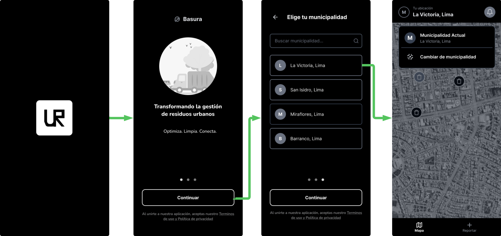

**2. Ubicación de contenedores**

Muestra en un mapa interactivo los contenedores de basura más cercanos a la ubicación del ciudadano, con detalles básicos.
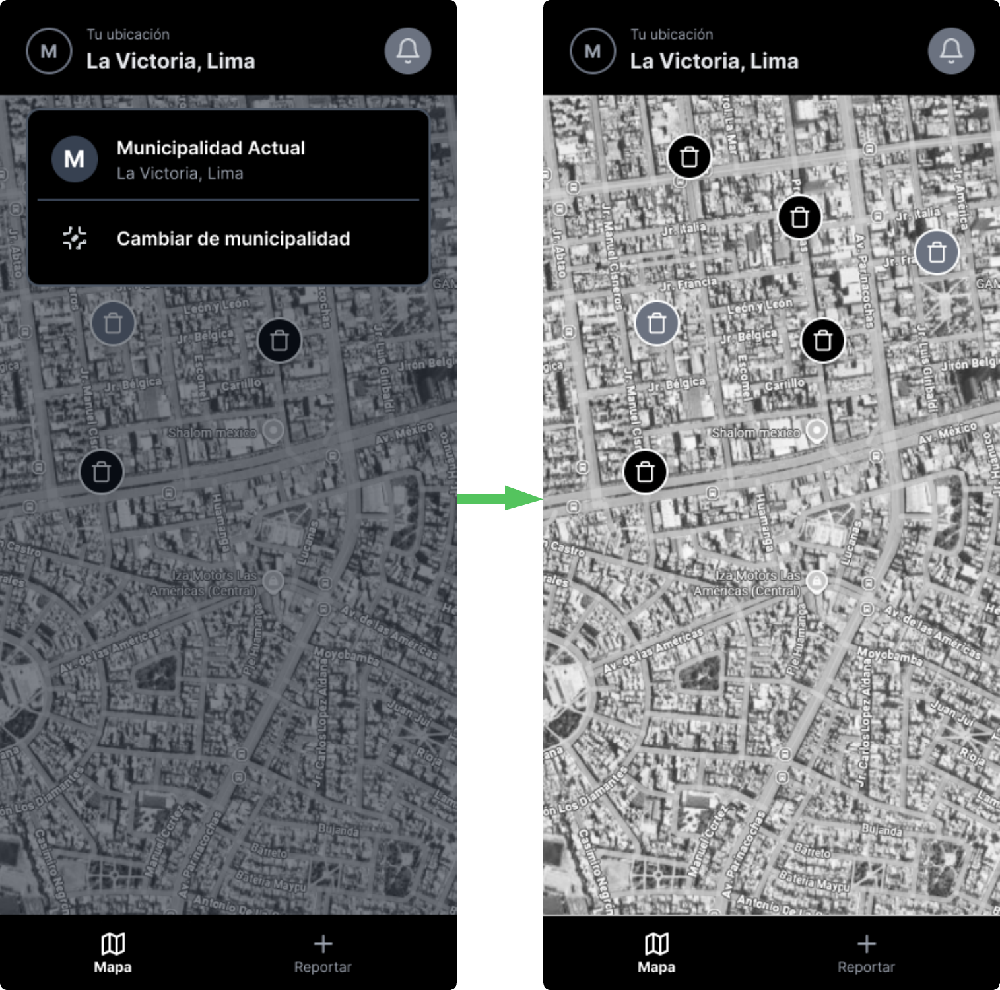

**3. Reportar incidencias**

Permite registrar incidencias relacionadas al servicio de limpieza (contenedores llenos, basura acumulada, etc.), adjuntando fotos y comentarios.
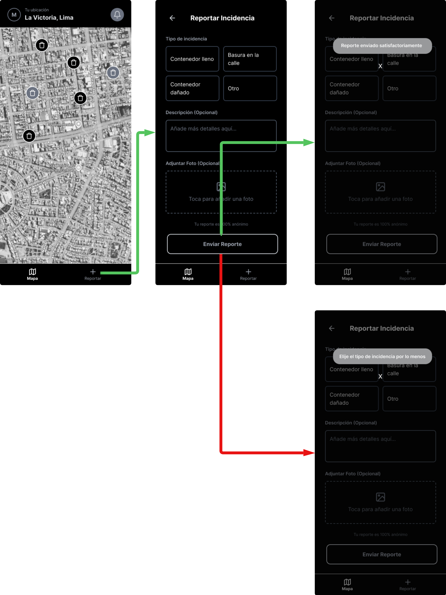

**4. Notificaciones de servicio**

Pantalla donde el usuario recibe notificaciones sobre el estado de sus reportes e información general del servicio de limpieza.
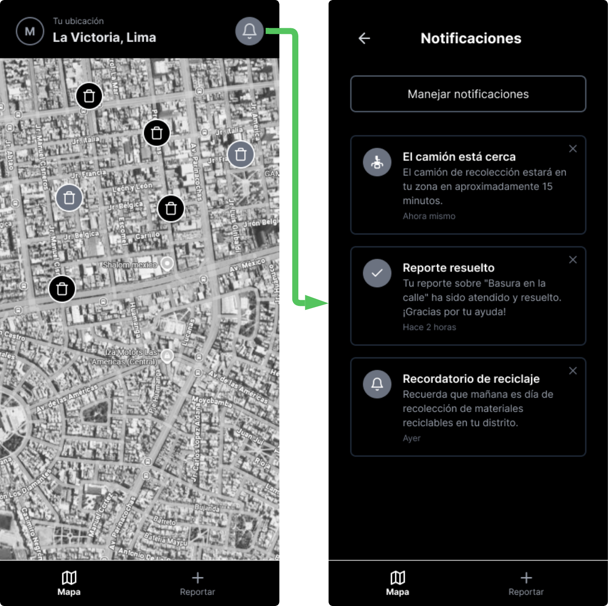

**5. Consulta de otra municipalidad**

Opción para seleccionar y consultar información de otra municipalidad distinta a la configurada inicialmente.
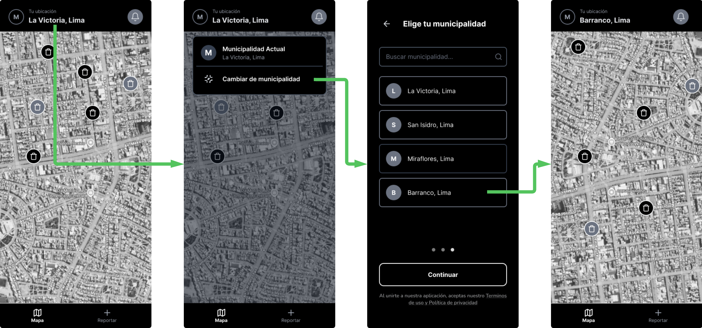

**Flujo de usuario: Colaborador municipal (Chofer)**

**1. Inicio de sesión**

Pantalla donde el colaborador accede a la aplicación con sus credenciales de usuario para comenzar la jornada.
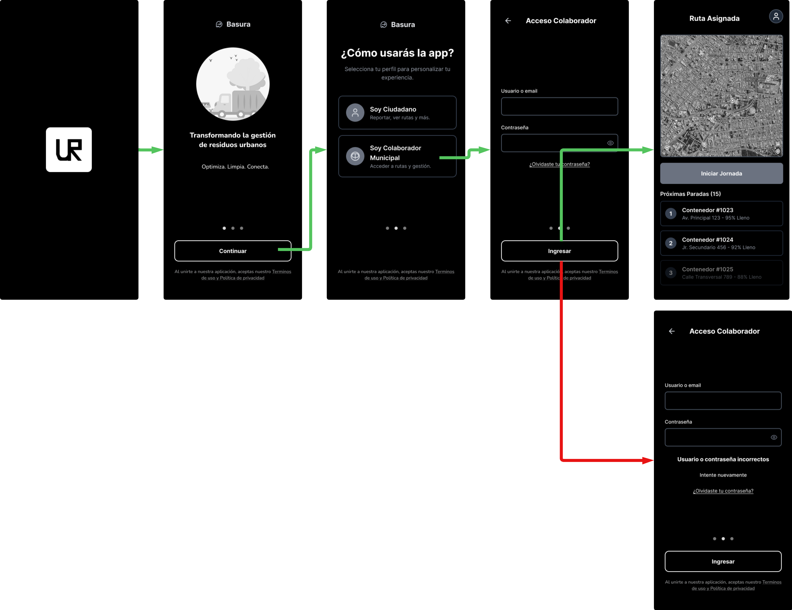

**2. Ruta asignada**

Muestra la ruta diaria asignada al conductor, incluyendo paradas y horarios planificados.
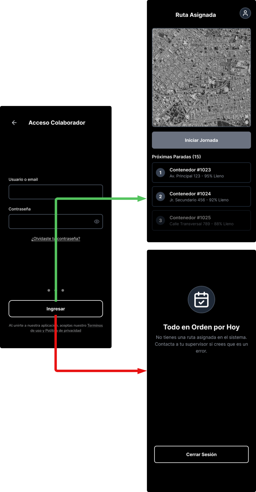

**3. Navegación a contenedores**

Permite visualizar y seguir el recorrido hacia los contenedores asignados de manera eficiente, con apoyo de mapas o GPS integrado.

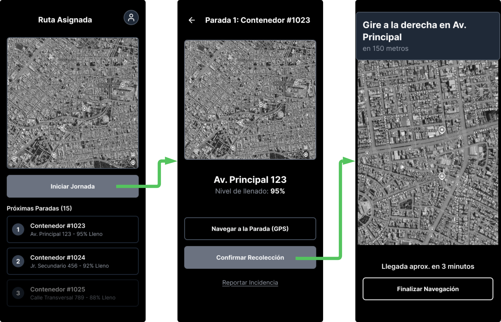


**4. Reportar incidencias**

Pantalla para registrar incidencias detectadas en los contenedores durante la jornada, adjuntando fotos y comentarios.
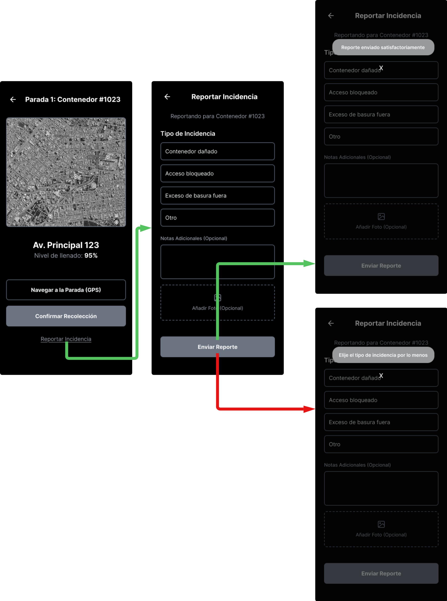

**5. Cierre de jornada**

Al finalizar la jornada, el colaborador puede confirmar el fin de su turno y acceder a un resumen con paradas completadas, incidencias reportadas y tiempo total trabajado.
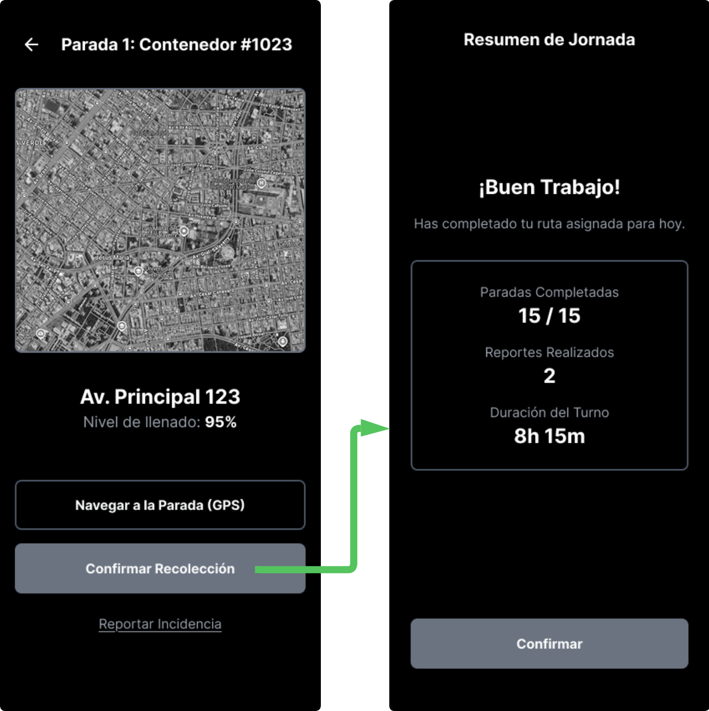

#### Web Applications Wire flow Diagrams

#### Flujo de usuario: Municipalidad (Administrador)

**User Goal:  Inicio de sesión administrador**

Flujo donde el administrador accede al sistema con sus credenciales para gestionar los recursos municipales.

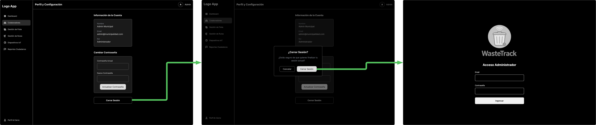

**User Goal: Gestión de colaboradores**

**a. Invitar colaborador**
Flujo para registrar e invitar a nuevos colaboradores al sistema, asignándoles un rol o perfil específico.

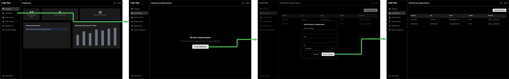

**b. Editar colaborador**
Flujo que permite al administrador actualizar la información o rol de colaboradores ya registrados.


**User Goal: Gestión de rutas de recolección**

Flujo donde el administrador puede generar y asignar rutas de recolección de residuos, asignándolas a colaboradores.

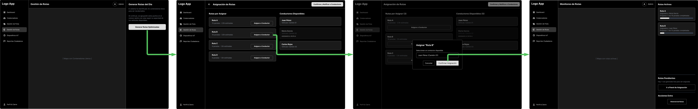

**User Goal: Gestión de dispositivos IoT**

**a. Registrar dispositivo IoT**
Flujo para registrar nuevos dispositivos IoT destinados a monitorear contenedores u otros puntos de control.

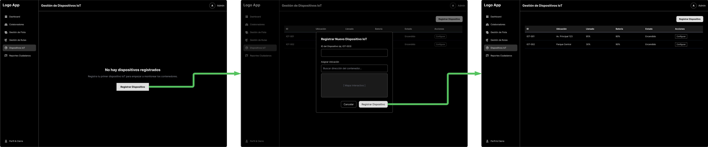

**b. Editar dispositivo IoT**
Flujo que permite actualizar datos o reconfigurar dispositivos IoT existentes.

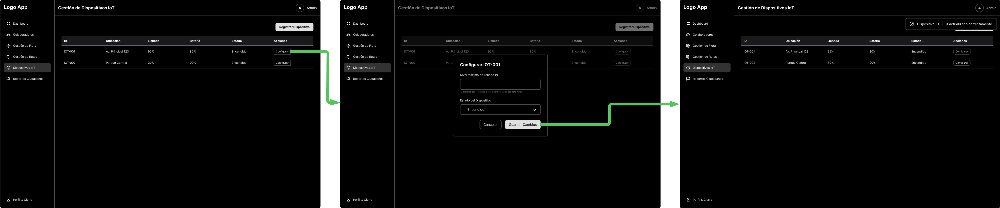

**User Goal: Gestión de reportes ciudadanos**

Flujo que muestra los reportes enviados por ciudadanos (ej. incidencias en el servicio de limpieza), con opciones para revisarlos y darles seguimiento.

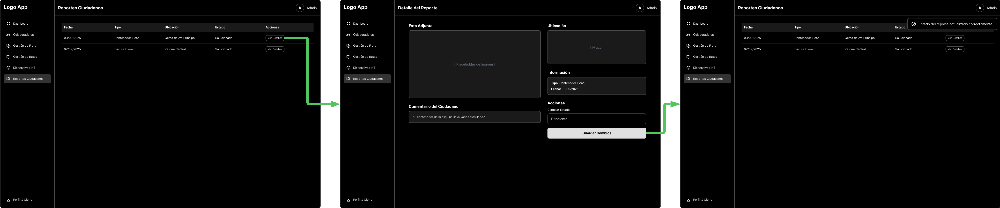

**User Goal: Gestión de sesión y perfil**

Flujo donde el administrador puede actualizar su información básica, cambiar contraseña o cerrar sesión.


**User Goal: Registro de vehículos**

Flujo para registrar vehículos municipales, asociarlos a rutas y mantener actualizado el inventario de la flota.

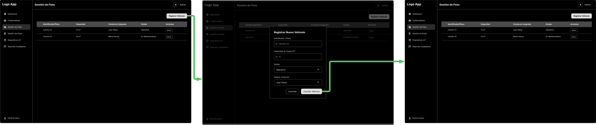

### 5.4.3. Applications Mock-ups

### Mobile Applications Mock-ups
Se pueden encontrar todos los Mobile Applications Mock-ups en el siguiente [enlace a Figma](https://www.figma.com/design/SYYxFeZgRViEvSUVEYlhZq/PRODUCT?node-id=108-2&p=f):

https://www.figma.com/design/SYYxFeZgRViEvSUVEYlhZq/PRODUCT?node-id=108-2&p=f

A continuación, se presentan los mock-ups de alta fidelidad diseñados para las aplicaciones móviles del ciudadano y del colaborador municipal (chofer). Estos diseños reflejan la identidad visual de WasteTrack, utilizando una paleta de colores coherente, tipografía legible y componentes interactivos optimizados para dispositivos móviles. Cada pantalla está diseñada para ofrecer una experiencia de usuario fluida y atractiva, facilitando la interacción con las funcionalidades clave del sistema de gestión de residuos.

### Flujo de usuario: Ciudadano
Este flujo está diseñado para ser simple e intuitivo, permitiendo a cualquier ciudadano interactuar con el sistema de gestión de residuos de su municipalidad.

#### Pantallas de bienvenida e integración (Onboarding)
Representa el primer contacto del usuario con la aplicación. A través de una serie de pantallas, se presenta la propuesta de valor, se le permite al usuario buscar y elegir la municipalidad a la que pertenece para personalizar el contenido de la aplicación.


#### Vista principal (Mapa)
Es el centro de la experiencia del ciudadano. Muestra un mapa en tiempo real con la ubicación de los contenedores de basura cercanos. Desde aquí, el usuario puede visualizar el estado de los contenedores y la ruta estimada del camión recolector. La barra de navegación inferior le da acceso directo a las funciones más importantes: "Mapa" y "Reportar".


#### Menú de municipalidad
Este es un menú contextual que se despliega al presionar el ícono de la municipalidad en la vista principal. Su función principal es permitir al usuario cambiar de municipalidad de manera rápida y heurística, sin tener que navegar a una pantalla de configuración separada.


#### Reporte de incidencia
Muestra un formulario simple y directo para que el ciudadano pueda reportar anónimamente problemas relacionados con la basura. Incluye campos para seleccionar el tipo de incidencia, añadir una descripción opcional y adjuntar una fotografía como evidencia, fomentando la colaboración para mantener la ciudad limpia.


#### Centro de notificaciones
Esta pantalla funciona como una bandeja de entrada donde el usuario recibe actualizaciones importantes. Aquí se le notificará sobre el estado de sus reportes (ej. "reporte recibido", "reporte solucionado") y otros avisos relevantes de su municipalidad. Cada notificación puede ser eliminada individualmente.


### Flujo de usuario: Colaborador municipal (Chofer)
Este flujo es una herramienta de trabajo diseñada para la eficiencia operativa. Es una aplicación robusta que guía al conductor a través de sus tareas diarias.

#### Pantallas de bienvenida e integración (Onboarding)
Representa el primer contacto del usuario con la aplicación. A través de una serie de dos pantallas, primero se diferencia que la aplicación es exclusivamente para choferes recolectores de basura, y se presenta la propuesta de valor.


#### Acceso de colaborador
Representa una pantalla de inicio de sesión segura y simple, diseñada para personal autorizado. El colaborador (conductor) ingresa sus credenciales (Usuario/ID y Contraseña) para acceder a sus funciones operativas. No incluye una opción de registro, ya que las cuentas son creadas por un administrador en la plataforma web.


#### Estado de acceso
Esta vista muestra los posibles mensajes de error o estados informativos durante el login. Incluye el "unhappy path" de credenciales incorrectas, resaltando visualmente los campos erróneos y mostrando un mensaje claro. También cubre el caso en que el login es exitoso pero no hay una ruta de trabajo asignada para el día.


#### Hoja de ruta del día
Es el dashboard principal del conductor después de iniciar sesión. Presenta la ruta optimizada del día de dos maneras: una vista de mapa para el contexto geográfico y una lista secuencial de las paradas a realizar. Desde aquí, el conductor puede iniciar su jornada y seleccionar cada parada para ver más detalles.


#### Detalle de parada
Muestra toda la información necesaria para una única parada de recolección: la ubicación exacta, el ID del contenedor y su nivel de llenado. Funciona como el centro de acciones, permitiendo al conductor confirmar la recolección, navegar a la ubicación vía GPS o reportar una incidencia específica de esa parada.


#### Navegación GPS
Representa la vista de navegación paso a paso. Se activa cuando el conductor presiona "Navegar a la Parada". Le proporciona instrucciones en tiempo real para llegar a su siguiente destino de la manera más eficiente, minimizando el tiempo de viaje.


#### Reporte de incidencia (Conductor)
Un formulario especializado para que el conductor reporte problemas operativos que encuentre en su ruta, como un contenedor dañado, un acceso bloqueado u otra eventualidad. Esto permite comunicar problemas internos al administrador de forma inmediata.


#### Pantalla de confirmación
Esta toast notification aparece como confirmación o feedback inmediato después de que el conductor realiza una acción clave, como confirmar una recolección o enviar un reporte. Es un mensaje breve que asegura al usuario que su acción fue exitosa sin interrumpir su flujo de trabajo. También, se utiliza para notificar errores críticos, como problemas de conexión a internet.


#### Perfil y opciones del Conductor
Representa una pantalla de ajustes donde el conductor puede ver su información básica (nombre, ID, vehículo asignado) y realizar acciones clave de fin de sesión, como "Finalizar Jornada" o "Cerrar Sesión".


#### Resumen de jornada
Esta es la pantalla final del flujo de trabajo diario. Al "Finalizar Jornada", la aplicación presenta un resumen del trabajo realizado (ej. paradas completadas, incidencias reportadas, duración del turno). Sirve para confirmar la finalización exitosa de las tareas del día.


#### Pantalla "Todo en Orden"
Esta pantalla se muestra cuando el conductor ha completado todas las paradas asignadas para el día. Es una confirmación visual de que no quedan tareas pendientes, proporcionando un sentido de logro y cierre al finalizar su jornada laboral. También, se muestra cuando el conductor intenta iniciar su jornada sin una ruta asignada, informándole que no hay tareas para realizar.


### Web Applications Mock-ups
Se pueden encontrar todos los Web Applications Mock-ups en el siguiente [enlace a Figma](https://www.figma.com/design/SYYxFeZgRViEvSUVEYlhZq/PRODUCT?node-id=108-3&p=f):

https://www.figma.com/design/SYYxFeZgRViEvSUVEYlhZq/PRODUCT?node-id=108-3&p=f

### Flujo de Super Administrador
Este flujo está diseñado como una herramienta interna y segura, accesible únicamente para los desarrolladores o administradores del sistema. Su única finalidad es la creación y gestión de las cuentas maestras de las municipalidades, siguiendo un modelo de negocio B2B.

#### Acceso de Super Administrador
Representa un portal de inicio de sesión de alta seguridad, completamente separado del de los administradores municipales. Esta pantalla es el único punto de entrada para la gestión global de las cuentas de clientes. Se incluyen las vistas para un ingreso exitoso y para un intento fallido, mostrando un mensaje de error claro.


#### Dashboard de Municipalidades
Es la pantalla principal del super administrador. Muestra un listado de todas las cuentas de municipalidades creadas en el sistema, con información clave como el nombre, el email del administrador principal y su estado (Activa/Inactiva). Se ha diseñado tanto el estado ideal (con datos) como el estado vacío, que guía al usuario a crear la primera cuenta.


#### Creación de Cuenta Municipal
Muestra el formulario completo que utiliza el super administrador para registrar una nueva municipalidad en el sistema. Incluye campos para los datos de la municipalidad, la asignación de su ubicación geográfica mediante un mapa, y la creación de la cuenta inicial para el administrador principal de dicha municipalidad. Se contempla también el estado de error del formulario.


#### Gestión de Cuenta Municipal
Representa la pantalla de edición y gestión de una cuenta municipal existente. Desde aquí, el super administrador puede modificar datos, ver los administradores asociados y, crucialmente, acceder a la "Zona de Peligro" para desactivar temporalmente una cuenta en caso de ser necesario.


#### Modal de Confirmación
Esta vista modal aparece cuando el super administrador intenta realizar una acción crítica, como desactivar una cuenta. Su propósito es prevenir acciones accidentales, forzando al usuario a confirmar su decisión antes de que se aplique el cambio.


#### Notificación toast
Debe aparecer como confirmación o feedback inmediato después de que el super administrador realiza una acción clave, como crear o actualizar una cuenta. Es un mensaje breve que asegura al usuario que su acción fue exitosa sin interrumpir su flujo de trabajo. También, se utiliza para notificar errores críticos, como problemas de conexión a internet.


### Flujo de Colaborador Municipal (Administrador)
Este es el panel de control principal para el personal administrativo de cada municipalidad. Está diseñado como una herramienta de gestión operativa completa que permite monitorear y controlar todos los aspectos del sistema de recolección de residuos.

#### Acceso de Administrador Municipal
Representa el portal de inicio de sesión para el personal administrativo. A diferencia del super admin, este flujo permite la creación de una cuenta a través de una invitación, como se ve en la vista de "Activación de Cuenta".


#### Dashboard Principal
Es la vista central del administrador. Ofrece un resumen de alto nivel de las operaciones del día con métricas clave (contenedores llenos, rutas activas), una alerta de dispositivos para problemas urgentes y un gráfico de barras que visualiza la eficiencia de la recolección, permitiendo una toma de decisiones rápida e informada.


#### Gestión de Flota (Vehículos)
Muestra un inventario completo de todos los vehículos (camiones) de la municipalidad. Permite al administrador registrar nuevos vehículos, especificando datos cruciales como su capacidad de carga, y editar los existentes. Esta sección es la base para la generación de rutas optimizadas.


#### Gestión de Colaboradores
Presenta una lista de todo el personal registrado (conductores, otros administradores). Desde aquí, el administrador puede invitar a nuevos miembros y, fundamentalmente, asignar un vehículo específico a cada conductor, vinculando al personal con la flota.


#### Gestión de Dispositivos IoT
Muestra un listado de todos los sensores IoT instalados en los contenedores. El administrador puede ver su estado en tiempo real (nivel de llenado, batería) y acceder al modal de configuración para ajustar parámetros operativos como el umbral de "contenedor lleno". También puede registrar nuevos dispositivos mediante un proceso guiado.


#### Gestión de Rutas (Multi-Conductor)
Este es el centro de control operativo. La pantalla principal es un Dashboard de Monitoreo que muestra en un mapa las rutas que ya están activas. Un panel lateral informa sobre las Rutas Pendientes (generadas pero no asignadas), permitiendo al administrador acceder al Panel de Asignación en cualquier momento para distribuir el trabajo entre los conductores disponibles, cuya capacidad de vehículo se muestra para una mejor planificación. También incluye una vista de Historial para auditorías.


#### Reportes Ciudadanos
Funciona como una bandeja de entrada para todas las incidencias reportadas por los ciudadanos. El administrador puede ver una lista de los reportes, filtrarlos y hacer clic en "Ver Detalles" para acceder a una vista detallada con el mapa de ubicación, la foto adjunta y las opciones para cambiar el estado del reporte.


#### Perfil y Configuración
Permite al administrador ver y editar su información personal, cambiar su contraseña. También incluye la opción de cerrar sesión de manera segura.


#### Notificación toast
Debe aparecer como confirmación o feedback inmediato después de que el administrador realiza una acción clave, como crear una ruta o asignar un conductor. Es un mensaje breve que asegura al usuario que su acción fue exitosa sin interrumpir su flujo de trabajo. También, se utiliza para notificar errores críticos, como problemas de conexión a internet.


### 5.4.4. Applications User Flow Diagrams

### Mobile Applications User Flow Diagrams

Los **User Flow Diagrams** muestran de manera detallada la secuencia de pantallas y decisiones que sigue cada usuario para alcanzar un objetivo específico dentro de la aplicación. A diferencia de los Wireflows, aquí se representan tanto la ruta esperada (*happy path*) como las rutas alternativas o excepcionales (*unhappy paths*), evidenciando las condiciones de validación y mensajes que se presentan en cada escenario.

#### Flujo de usuario: Ciudadano

**User goal: Configuración inicial**
Flujo donde el ciudadano selecciona su municipalidad y define su ubicación inicial. El *happy path* considera la elección correcta de la municipalidad y la carga del mapa.

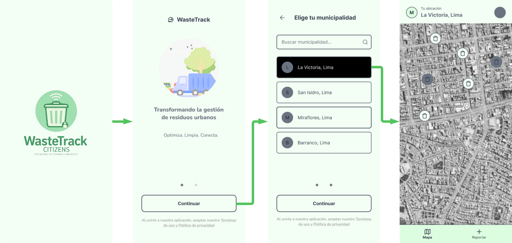

**User goal: Ubicación de contenedores**
Flujo que muestra el mapa interactivo con los contenedores cercanos. El *happy path* es la visualización normal de los puntos en el mapa.

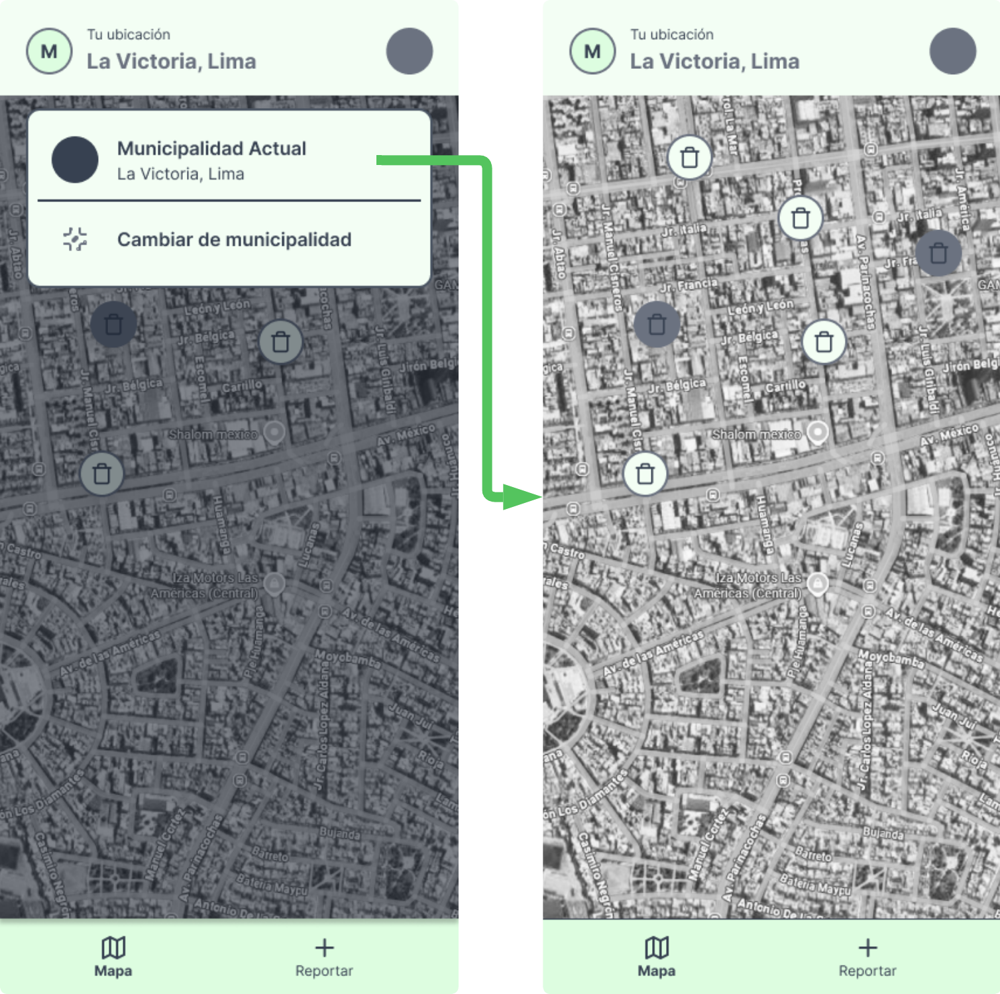

**User goal: Reportar incidencias**
Flujo para registrar incidencias relacionadas al servicio. El *happy path* ocurre al seleccionar un tipo de incidencia, añadir detalles opcionales y enviar exitosamente el reporte. Los *unhappy paths* incluyen no seleccionar el tipo de incidencia (se muestra un mensaje de error) o problemas de conexión que impiden el envío.

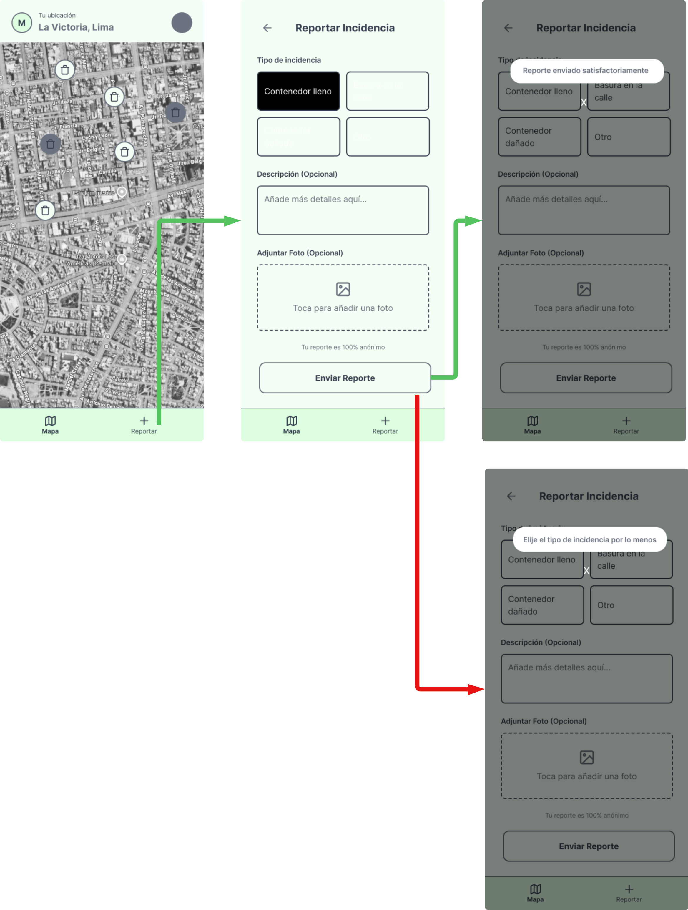

**User goal: Notificaciones de servicio**
Flujo donde el ciudadano accede a la bandeja de notificaciones para ver alertas sobre la recolección, resolución de reportes o recordatorios de reciclaje. El *happy path* contempla notificaciones disponibles.

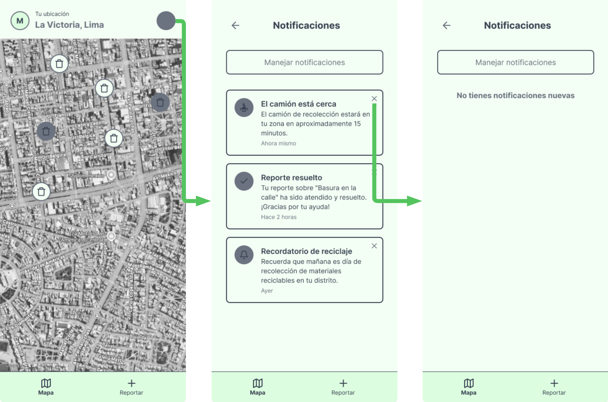

**User goal: Consulta de otra municipalidad**
Flujo que permite cambiar la municipalidad configurada inicialmente para consultar información en otra jurisdicción. El *happy path* es la selección correcta de una nueva municipalidad, que actualiza el mapa.

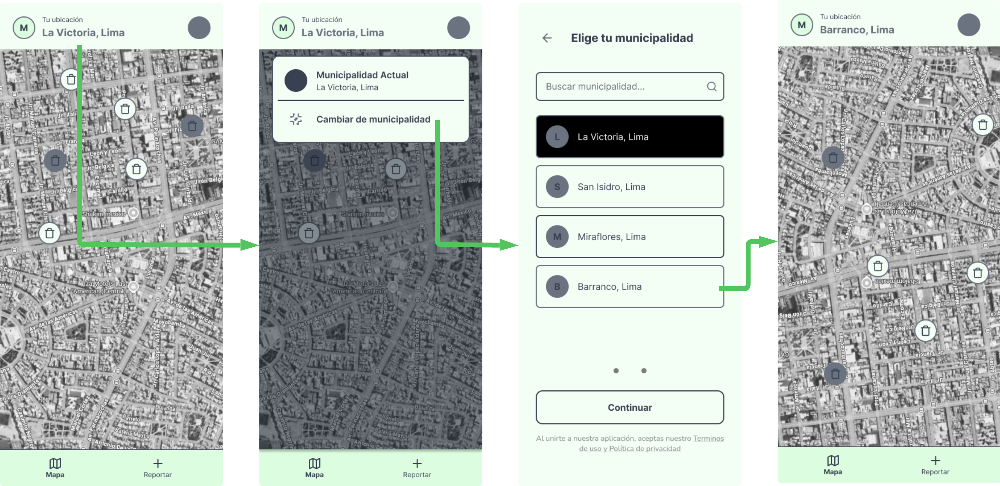

#### Flujo de usuario: Colaborador municipal (Chofer)

**User goal: Inicio de sesión**
Flujo donde el colaborador accede a la aplicación con sus credenciales para comenzar la jornada.

* *Happy path*: ingreso correcto y acceso a la ruta asignada.
* *Unhappy path*: credenciales incorrectas, mostrando mensaje de error e impidiendo avanzar.
  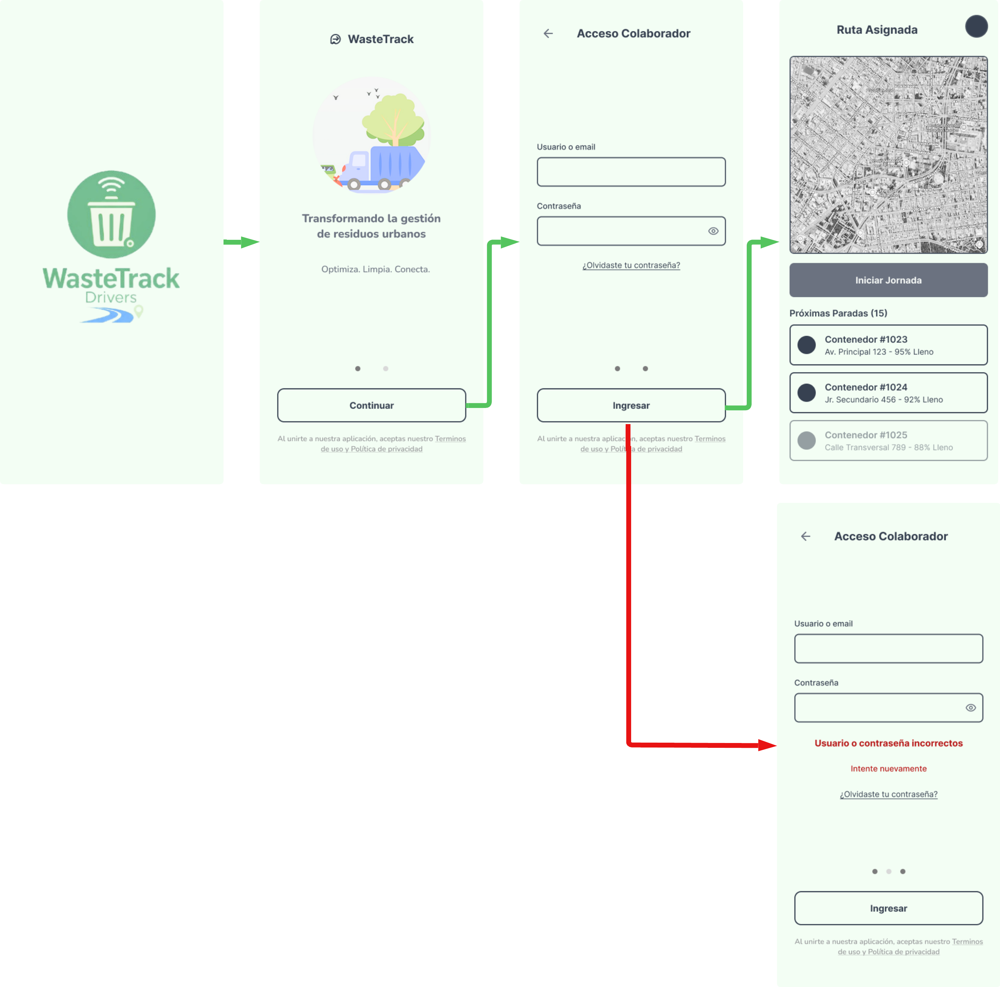

**User goal: Ruta asignada**
Flujo que muestra las paradas del día y permite iniciar la jornada.

* *Happy path*: el conductor visualiza sus contenedores asignados y comienza el recorrido.
* *Unhappy path*: no hay ruta asignada en el sistema, mostrando un mensaje que indica al colaborador contactar a su supervisor.
  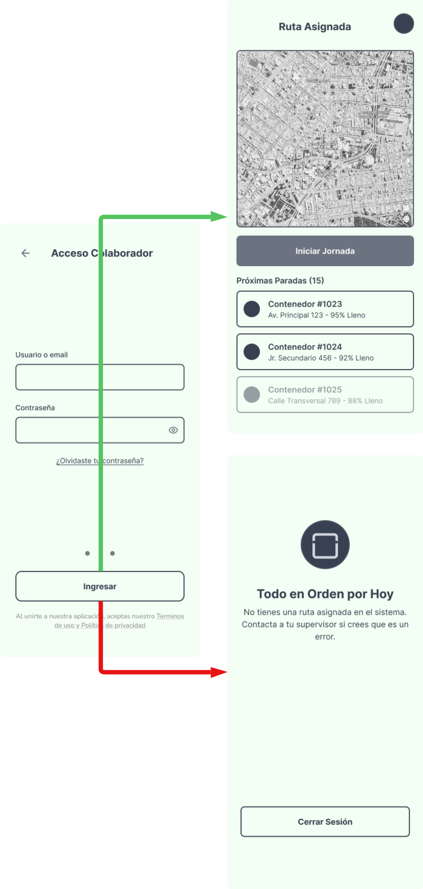

**User goal: Navegación a contenedores**
Flujo que guía al colaborador hacia el contenedor seleccionado mediante GPS integrado.

* *Happy path*: se inicia la navegación hasta el contenedor y se muestra la llegada estimada.
  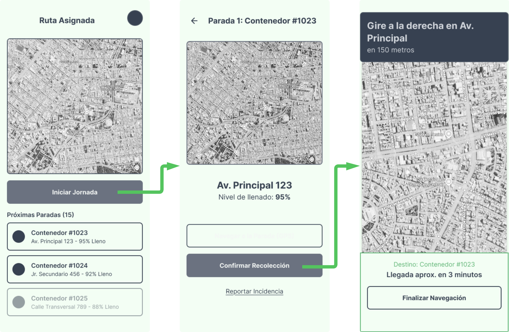


**User goal: Reportar incidencias**
Flujo para registrar incidencias encontradas en un contenedor durante la jornada.

* *Happy path*: selección del tipo de incidencia, notas opcionales, foto y envío exitoso.
* *Unhappy path*: no seleccionar el tipo de incidencia impide completar el reporte y se muestra un mensaje de error.
  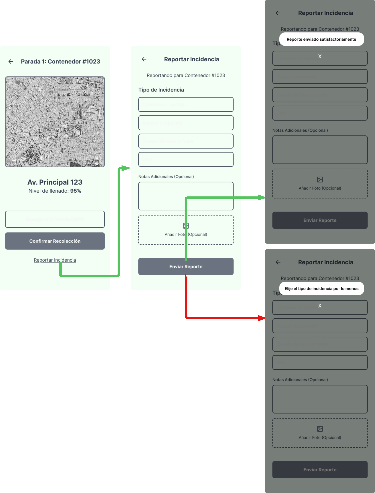

**User goal: Cierre de jornada**
Flujo donde el colaborador confirma la recolección en el último contenedor y revisa un resumen con paradas completadas, incidencias reportadas y duración total del turno.

* *Happy path*: la jornada se completa con éxito y se muestra el resumen final.

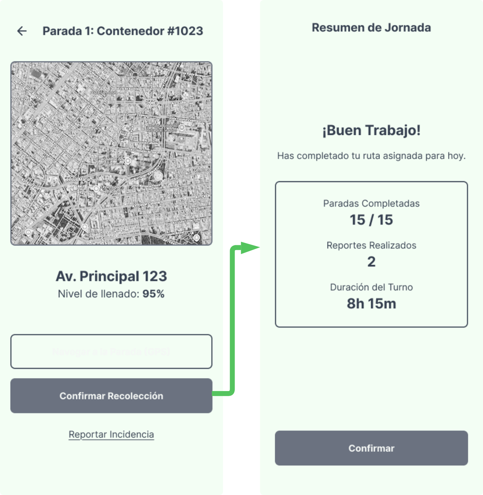

### Web Applications User Flow Diagrams

### Flujo de usuario: Municipalidad (Administrador)

**User Goal: Inicio de sesión administrador**
Flujo donde el administrador accede al sistema con sus credenciales para gestionar los recursos municipales.

* *Happy path*: credenciales correctas permiten el ingreso al panel principal.
* *Unhappy path*: credenciales incorrectas impiden el acceso y muestran un mensaje de error.

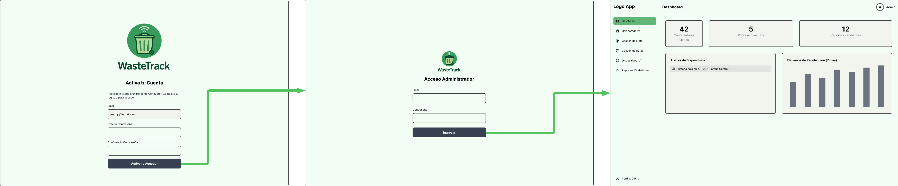

**User Goal: Gestión de colaboradores**

**a. Invitar colaborador**
Flujo para registrar e invitar a nuevos colaboradores al sistema, asignándoles un rol o perfil específico.

* *Happy path*: se completa el formulario y el colaborador recibe su acceso.

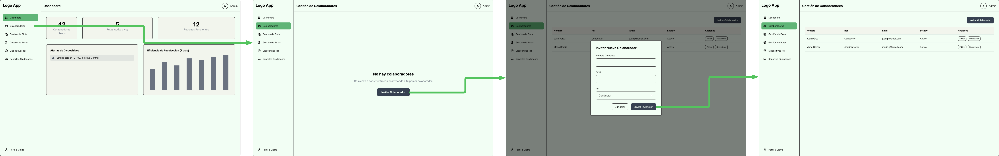

**b. Editar colaborador**
Flujo que permite al administrador actualizar la información o rol de colaboradores ya registrados.

* *Happy path*: los cambios se guardan exitosamente en el sistema.

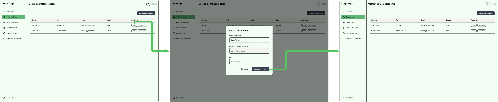

**User Goal: Gestión de rutas de recolección**
Flujo donde el administrador puede generar y asignar rutas de recolección de residuos, así como consultar el historial de rutas ejecutadas.

* *Happy path*: se visualizan las rutas activas y se consulta el historial correctamente.

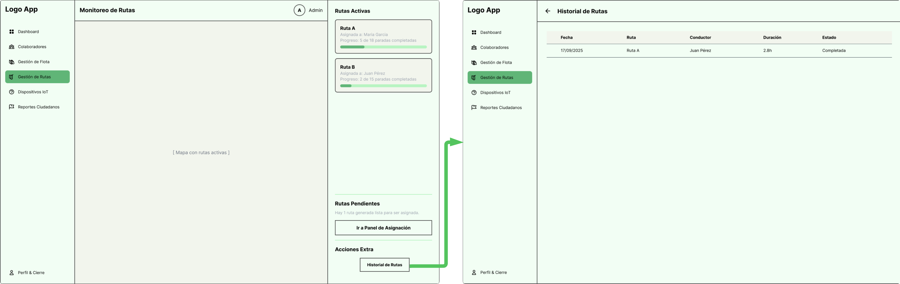

**User Goal: Gestión de dispositivos IoT**

**a. Registrar dispositivo IoT**
Flujo para registrar nuevos dispositivos IoT destinados a monitorear contenedores u otros puntos de control.

* *Happy path*: el dispositivo queda correctamente registrado en el sistema.

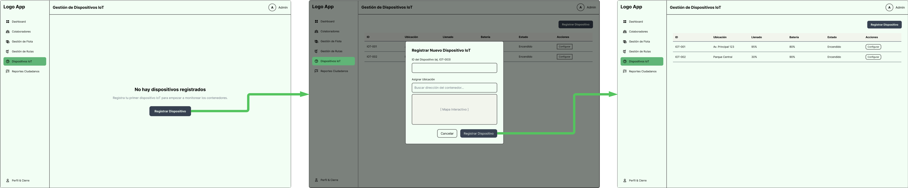

**b. Editar dispositivo IoT**
Flujo que permite actualizar datos o reconfigurar dispositivos IoT existentes.

* *Happy path*: los cambios de configuración se guardan y se confirma la actualización.

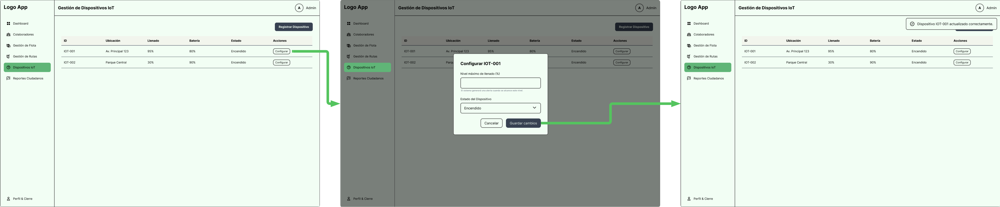

**User Goal: Gestión de reportes ciudadanos**
Flujo que muestra los reportes enviados por ciudadanos (ej. incidencias en el servicio de limpieza), con opciones para revisarlos, visualizar evidencia y darles seguimiento.

* *Happy path*: el estado del reporte se actualiza correctamente y queda registrado en el historial.

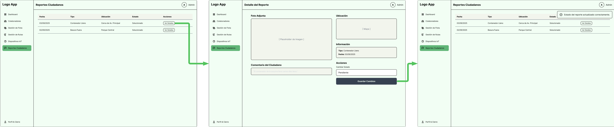

**User Goal: Gestión de sesión y perfil**
Flujo donde el administrador puede actualizar su información básica, cambiar contraseña o cerrar sesión.

* *Happy path*: al cerrar sesión se redirige a la pantalla de acceso.

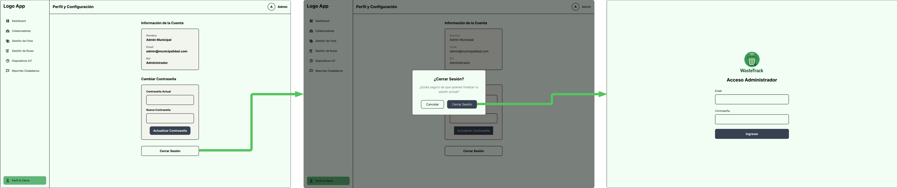

**User Goal: Registro de vehículos**
Flujo para registrar vehículos municipales, asociarlos a rutas y mantener actualizado el inventario de la flota.

* *Happy path*: se guarda un nuevo vehículo y aparece en la lista de gestión de flota.

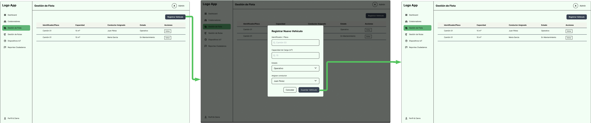

## 4.5. Mobile Applications Prototyping
El propósito de esta sección es presentar los prototipos interactivos desarrollados para las aplicaciones móviles del ciudadano y del colaborador municipal (chofer). Estos prototipos permiten simular la experiencia de usuario final, facilitando la evaluación de la usabilidad, la navegación y la interacción con las funcionalidades clave antes de la implementación técnica.

A continuación, se presentan capturas y los enlaces a los videos explicativos que detallan los flujos de usuario relacionados:


Enlace para acceder al video explicativo del [Mobile Application Prototyping para Ciudadano](https://upcedupe-my.sharepoint.com/:v:/g/personal/u202220829_upc_edu_pe/EfacU1lOl0dDhVjvsiQTz80BNf47Kehz1Po42sXwE1Mz2A?nav=eyJyZWZlcnJhbEluZm8iOnsicmVmZXJyYWxBcHAiOiJTdHJlYW1XZWJBcHAiLCJyZWZlcnJhbFZpZXciOiJTaGFyZURpYWxvZy1MaW5rIiwicmVmZXJyYWxBcHBQbGF0Zm9ybSI6IldlYiIsInJlZmVycmFsTW9kZSI6InZpZXcifX0%3D&e=dJxpJk)


Enlace para acceder al video explicativo del [Mobile Application Prototyping para Colaborador Municipal (Chofer)](https://upcedupe-my.sharepoint.com/:v:/g/personal/u202220829_upc_edu_pe/EfA-tJfVYVdIufJ9c54xT7IB57K_1VjP_IFEgWfgSYoRbg?nav=eyJyZWZlcnJhbEluZm8iOnsicmVmZXJyYWxBcHAiOiJTdHJlYW1XZWJBcHAiLCJyZWZlcnJhbFZpZXciOiJTaGFyZURpYWxvZy1MaW5rIiwicmVmZXJyYWxBcHBQbGF0Zm9ybSI6IldlYiIsInJlZmVycmFsTW9kZSI6InZpZXcifX0%3D&e=5sZlbF)

Asimismo, a continuación se presentan los enlaces que llevan a los flujos por cada perfil de usuario:

* [Mobile Application Prototyping para Ciudadano](https://www.figma.com/proto/SYYxFeZgRViEvSUVEYlhZq/PRODUCT?node-id=148-1571&t=D0tjx3N2qsot8HmY-1&scaling=min-zoom&content-scaling=fixed&page-id=108%3A2&starting-point-node-id=148%3A1571&show-proto-sidebar=1)

* [Mobile Application Prototyping para Colaborador Municipal (Chofer)](https://www.figma.com/proto/SYYxFeZgRViEvSUVEYlhZq/PRODUCT?node-id=148-2635&t=D0tjx3N2qsot8HmY-1&scaling=min-zoom&content-scaling=fixed&page-id=108%3A2&starting-point-node-id=148%3A2635&show-proto-sidebar=1)

## 5.5. Applications Prototyping

### Mobile Applications Prototyping
El propósito de esta sección es presentar los prototipos interactivos desarrollados para las aplicaciones móviles del ciudadano y del colaborador municipal (chofer). Estos prototipos permiten simular la experiencia de usuario final, facilitando la evaluación de la usabilidad, la navegación y la interacción con las funcionalidades clave antes de la implementación técnica.

A continuación, se presentan capturas y los enlaces a los videos explicativos que detallan los flujos de usuario relacionados:


Enlace para acceder al video explicativo del [Mobile Application Prototyping para Ciudadano](https://upcedupe-my.sharepoint.com/:v:/g/personal/u202220829_upc_edu_pe/EfacU1lOl0dDhVjvsiQTz80BNf47Kehz1Po42sXwE1Mz2A?nav=eyJyZWZlcnJhbEluZm8iOnsicmVmZXJyYWxBcHAiOiJTdHJlYW1XZWJBcHAiLCJyZWZlcnJhbFZpZXciOiJTaGFyZURpYWxvZy1MaW5rIiwicmVmZXJyYWxBcHBQbGF0Zm9ybSI6IldlYiIsInJlZmVycmFsTW9kZSI6InZpZXcifX0%3D&e=dJxpJk)


Enlace para acceder al video explicativo del [Mobile Application Prototyping para Colaborador Municipal (Chofer)](https://upcedupe-my.sharepoint.com/:v:/g/personal/u202220829_upc_edu_pe/EfA-tJfVYVdIufJ9c54xT7IB57K_1VjP_IFEgWfgSYoRbg?nav=eyJyZWZlcnJhbEluZm8iOnsicmVmZXJyYWxBcHAiOiJTdHJlYW1XZWJBcHAiLCJyZWZlcnJhbFZpZXciOiJTaGFyZURpYWxvZy1MaW5rIiwicmVmZXJyYWxBcHBQbGF0Zm9ybSI6IldlYiIsInJlZmVycmFsTW9kZSI6InZpZXcifX0%3D&e=5sZlbF)

Asimismo, a continuación se presentan los enlaces que llevan a los flujos por cada perfil de usuario:

* [Mobile Application Prototyping para Ciudadano](https://www.figma.com/proto/SYYxFeZgRViEvSUVEYlhZq/PRODUCT?node-id=148-1571&t=D0tjx3N2qsot8HmY-1&scaling=min-zoom&content-scaling=fixed&page-id=108%3A2&starting-point-node-id=148%3A1571&show-proto-sidebar=1)

* [Mobile Application Prototyping para Colaborador Municipal (Chofer)](https://www.figma.com/proto/SYYxFeZgRViEvSUVEYlhZq/PRODUCT?node-id=148-2635&t=D0tjx3N2qsot8HmY-1&scaling=min-zoom&content-scaling=fixed&page-id=108%3A2&starting-point-node-id=148%3A2635&show-proto-sidebar=1)

### Web Applications Prototyping
El propósito de esta sección es presentar los prototipos interactivos desarrollados para la aplicación web de administración. Estos prototipos permiten simular la experiencia de usuario final, facilitando la evaluación de la usabilidad, la navegación y la interacción con las funcionalidades clave antes de la implementación técnica.

A continuación, se presentan capturas y los enlaces a los videos explicativos que detallan los flujos de usuario relacionados:


Enlace para acceder al video explicativo del [Web Application Prototyping para Super Administrador](https://upcedupe-my.sharepoint.com/:v:/g/personal/u202220829_upc_edu_pe/EXtElBFN9PVGnxtbblNzxEwB16x5kRUJpU78JlIh4HsWyQ?e=kUtnM8&nav=eyJyZWZlcnJhbEluZm8iOnsicmVmZXJyYWxBcHAiOiJTdHJlYW1XZWJBcHAiLCJyZWZlcnJhbFZpZXciOiJTaGFyZURpYWxvZy1MaW5rIiwicmVmZXJyYWxBcHBQbGF0Zm9ybSI6IldlYiIsInJlZmVycmFsTW9kZSI6InZpZXcifX0%3D)


Enlace para acceder al video explicativo del [Web Application Prototyping para Administrador Municipal](https://upcedupe-my.sharepoint.com/:v:/g/personal/u202220829_upc_edu_pe/EQ1EazbFsN9MiRw2o43XRUEBRIXp-3VqlKywOmt3kXHDhw?e=QCrwj1&nav=eyJyZWZlcnJhbEluZm8iOnsicmVmZXJyYWxBcHAiOiJTdHJlYW1XZWJBcHAiLCJyZWZlcnJhbFZpZXciOiJTaGFyZURpYWxvZy1MaW5rIiwicmVmZXJyYWxBcHBQbGF0Zm9ybSI6IldlYiIsInJlZmVycmFsTW9kZSI6InZpZXcifX0%3D)

Asimismo, a continuación se presentan los enlaces que llevan a los flujos por cada perfil de usuario:
* [Web Application Prototyping para Super Administrador](https://www.figma.com/proto/SYYxFeZgRViEvSUVEYlhZq/PRODUCT?node-id=229-11&t=LaKQIDXdLY978TmR-1&scaling=min-zoom&content-scaling=fixed&page-id=108%3A3&starting-point-node-id=229%3A11&show-proto-sidebar=1)
* [Web Application Prototyping para Administrador Municipal](https://www.figma.com/proto/SYYxFeZgRViEvSUVEYlhZq/PRODUCT?node-id=108-1167&t=LaKQIDXdLY978TmR-1&scaling=min-zoom&content-scaling=fixed&page-id=108%3A3&starting-point-node-id=108%3A1167&show-proto-sidebar=1)

---

# Capítulo VI: Product Implementation, Validation & Deployment

## 6.1. Software Configuration Management

### 6.1.1. Software Development Environment Configuration

En esta sección se detallan las herramientas de software empleadas en WasteTrack para gestionar el ciclo completo de vida del proyecto, desde la planificación hasta la documentación y pruebas.

**Project Management:**

- **Discord**: Utilizamos Discord como herramienta principal de comunicación para la coordinación diaria del equipo.  
<p align="center"></p>

- **WhatsApp**: Sirve como canal rápido para notificaciones, recordatorios y coordinación informal.  
<p align="center"></p>

**Requirements Management:**

- **Miro**: Empleado para mapear funcionalidades, eventos y procesos con diagramas colaborativos.  
- **Lucidchart**: Para modelar arquitecturas, flujos y relaciones.  
<p align="center"></p>

**Product Design:**

- **Figma**: Diseño de interfaz, flujos y prototipos interactivos.  
<p align="center"></p>

- **UXPressia**: Desarrollo de perfiles de usuario y customer journey.  
<p align="center"></p>

- **Canva**: Recursos visuales complementarios (gráficos, banners).  
<p align="center"></p>

**Software Development:**

- **Visual Studio Code**: IDE para frontend con Next.js.  
<p align="center"></p>

- **PyCharm**: IDE para Python.  
<p align="center"></p>

- **Docker**: Contenerización para replicar ambientes local y de producción.  
<p align="center"></p>

- **Python**: Lenguaje para backend y algoritmos como Dijkstra.  
<p align="center"></p>

**Software Documentation y Landing Page:**

- **GitHub**: Repositorio de código y documentación.  
<p align="center"></p>

- **HTML/CSS/JS**: Tecnologías empleadas en la creación de la landing page.

---

### 6.1.2. Source Code Management

Se utilizó GitHub como plataforma centralizada de control de versiones, alojando repositorios del frontend, backend, pruebas e infraestructura. Esta práctica facilita la colaboración en equipo, la trazabilidad de cambios y la automatización del flujo de trabajo.

**Repositorios:**

- **Frontend:**  
[https://github.com/EcoLutions/waste_track_super_admin_app](https://github.com/EcoLutions/waste_track_super_admin_app)

- **Backend:**  
[https://github.com/EcoLutions/waste_track_platform](https://github.com/EcoLutions/waste_track_platform)

- **Landing:**  
[https://github.com/EcoLutions/waste_track_landing_page](https://github.com/EcoLutions/waste_track_landing_page)

**Modelo de ramas (GitFlow):**

- `main`: rama estable  
- `develop`: rama de integración  
- `feature/*`: rama por funcionalidad nueva  
- `release/*`: versiones candidatas  
- `hotfix/*`: correcciones críticas post-producción  

**Convenciones de nombres de branches:**

- `feature/login-module`  
- `release/1.0.0`  
- `hotfix/deploy-bug`  

**Commits:**  
Se utiliza la convención **Conventional Commits** con mensajes como:

- `feat: add route optimization algorithm`  
- `fix: correct IoT data parsing`  
- `docs: update README`

---

### 6.1.3. Source Code Style Guide & Conventions

Esta guía define las convenciones que aseguran coherencia, legibilidad y mantenibilidad del código fuente durante todo el proyecto.

**Convenciones de Nombres:**

- **Clases e Interfaces**: PascalCase (e.g., `WasteTracker`, `SensorHandler`)  
- **Métodos y Variables**: camelCase (e.g., `generateReport()`, `iotStatus`)  
- **Constantes**: MAYÚSCULAS_CON_GUIONES (e.g., `MAX_DISTANCE`)  
- **Enums**: PascalCase para el nombre, valores en mayúsculas (e.g., `Status.ACTIVE`)

**Diseño del Código:**

- Indentación de 4 espacios  
- Llaves con estilo egipcio (K&R)  
- Longitud de línea: 80–120 caracteres  
- Comentarios claros sobre el "por qué", no sobre el "qué"  
- Docstrings en Python y JSDoc en frontend

**Estructura de Archivos:**

- Una clase por archivo  
- Carpetas organizadas por módulos o funcionalidades (no por tipo)

**Prácticas Recomendadas:**

- Uso de patrones de diseño cuando sea apropiado  
- No realizar optimización prematura sin evidencia de cuellos de botella

---

### 6.1.4. Software Deployment Configuration

El despliegue de WasteTrack se ejecuta de forma automatizada en entornos en la nube, utilizando herramientas modernas de integración continua (CI) y entrega continua (CD).

**Herramientas de despliegue utilizadas:**

- **Azure App Services**: Hospedaje del backend  
<p align="center"></p>

- **Vercel**: Despliegue de frontend (Next.js) con CDN global  
<p align="center"></p>

- **Supabase**: Base de datos PostgreSQL escalable  
<p align="center"></p>

- **GitHub Actions**: CI/CD para pruebas y despliegue  
<p align="center"></p>

**Pasos de despliegue:**

1. Cambios se suben a rama `release/*`  
2. GitHub Actions ejecuta pruebas y linter  
3. Se construyen contenedores con Docker  
4. Backend se despliega en Azure, frontend en Vercel  
5. Servicios IoT son conectados vía MQTT  
6. Validación final en entorno productivo

---

## 6.2. Landing Page, Services & Applications Implementation

### 6.2.1. Sprint 1

#### 6.2.1.1. Sprint Planning 1

| **Elemento** | **Detalle** |
|---------------|-------------|
| **Número de Sprint** | Sprint 1 |
| **Contexto de la planificación** | Inicio del proyecto, se establecen las bases del desarrollo técnico. |
| **Fecha** | 2025-10-07 |
| **Hora** | 08:00 AM |
| **Lugar** | Sesión virtual realizada durante la clase |
| **Elaborado por** | Joaquín Rivadeneyra |
| **Participantes** | Erick Hernandez, Jhosepmyr Orlando, Elmer Augusto, Joaquín Rivadeneyra, Carlos Andrés |
| **Resumen del Sprint anterior** | Este es el primer Sprint, por lo que no se cuenta con un resumen previo. |
| **Resumen retrospectivo** | Se identificaron oportunidades de mejora en el modelado de datos y definición de funcionalidades clave. |
| **Objetivo del Sprint (Sprint Goal)** | Implementar funcionalidades esenciales para el monitoreo del sistema. |
| **Historias de Usuario Incluidas** | **Puntos** |
| US001 – Ver nivel de llenado | 2 |
| US002 – Filtrar por estado | 3 |
| US003 – Ver alertas por sobrellenado | 2 |
| US004 – Generar ruta automáticamente | 5 |
| US011 – Registrar sensores | 3 |
| US012 – Ver último dato recibido | 2 |
| US013 – Ver estado del sensor | 3 |
| **Velocidad del Sprint** | 22 |
| **Total de Story Points en el Sprint** | 22 |

---

#### 6.2.1.2. Aspect Leaders and Collaborators

Durante el **Sprint 1**, se definieron los roles y responsabilidades de cada integrante del equipo con el fin de asegurar una ejecución eficiente de las tareas establecidas en el **Product Backlog**.  
Cada miembro asumió un rol específico según su área de especialización, garantizando la integración técnica y la colaboración continua entre los distintos componentes del sistema WasteTrack.

| Aspecto | Líder | Colaboradores | Responsabilidades Principales |
|----------|--------|---------------|--------------------------------|
| **Backend & API** | **Elmer Augusto** | Erick Hernandez | Implementación de microservicios con **Spring Boot**, desarrollo de controladores REST, conexión con la base de datos y despliegue de servicios en la nube. |
| **Frontend Web** | **Carlos Andrés** | Joaquín Rivadeneyra | Diseño e implementación de la interfaz web administrativa con **React**, integración con los servicios backend y aplicación de principios de diseño responsivo. |
| **Aplicación Móvil (Flutter)** | **Jhosepmyr Orlando** | Joaquín Rivadeneyra | Desarrollo de la aplicación móvil, diseño de vistas principales, conexión con los endpoints REST y validación de la experiencia de usuario. |
| **Cloud & DevOps** | **Erick Hernandez** | Elmer Augusto | Configuración del entorno cloud en **Google Cloud Platform (GCP)**, despliegue de contenedores con **Docker** y automatización de procesos mediante **pipelines CI/CD**. |
| **Documentación & QA** | **Joaquín Rivadeneyra** | Todos los integrantes | Redacción de la documentación técnica, recopilación de evidencias de desarrollo, diseño de casos de prueba y validación de calidad del software. |

El equipo mantuvo una comunicación constante a través de herramientas colaborativas como **Trello**, **Slack** y **GitHub Projects**, lo que permitió una gestión ágil de tareas, un seguimiento transparente de los avances y una resolución oportuna de incidencias.

---

#### 6.2.1.3. Sprint Backlog 1

| Sprint | User Story | Task Id | Title | Description | Estimation (Hours) | Assigned To | Status |
|--------|-------------|----------|--------|--------------|--------------------|--------------|--------|
| Sprint 1 | US001 | WT-001 | Mostrar nivel de llenado | Visualizar el porcentaje de llenado actual de cada contenedor. | 8 | Erick Hernández | Done |
| Sprint 1 | US002 | WT-002 | Filtro por estado | Permitir filtrar los contenedores según su estado. | 10 | Joaquín Rivadeneyra | Done |
| Sprint 1 | US003 | WT-003 | Alertas por sobrellenado | Detectar y notificar si un contenedor sobrepasa el umbral de llenado. | 8 | Jhosepmyr Orlando | Done |
| Sprint 1 | US004 | WT-004 | Generar ruta automáticamente | Generar rutas óptimas de recolección con base en los niveles de llenado. | 12 | Elmer Augusto | Done |
| Sprint 1 | US011 | WT-005 | Registrar sensores | Permitir registrar sensores IoT. | 8 | Carlos Andrés | Done |
| Sprint 1 | US012 | WT-006 | Ver último dato de sensor | Consultar la última fecha y hora en que un sensor envió datos. | 6 | Erick Hernández | Done |
| Sprint 1 | US013 | WT-007 | Ver estado de sensor | Visualizar si un sensor ha dejado de enviar información. | 8 | Joaquín Rivadeneyra | Done |

---

#### 6.2.1.4. Development Evidence for Sprint Review

- **Development Evidence Landing Page**

**Link del repositorio:**  
[https://github.com/EcoLutions/waste_track_landing_page](https://github.com/EcoLutions/waste_track_landing_page)

<!DOCTYPE html>
<html>
<body>
  <table>
    <thead>
      <tr>
        <th>Repository</th>
        <th>Branch</th>
        <th>Commit ID</th>
        <th>Commit Message</th>
        <th>Commit Message Body</th>
        <th>Committed On (Date)</th>
      </tr>
    </thead>
    <tbody>
      <tr>
        <td>landing-page</td>
        <td>main</td>
        <td>6fc844ed8edb9bc1af065d37f7117a29763ed8e0</td>
        <td>Create project</td>
        <td>N/A</td>
        <td>2025-10-08</td>
      </tr>
    </tbody>
  </table>
</body>
</html>

- **Development Evidence Frontend**

**Link del repositorio:**  
[https://github.com/EcoLutions/waste_track_super_admin_app](https://github.com/EcoLutions/waste_track_super_admin_app)

<!DOCTYPE html>
<html>
<body>
  <table>
    <thead>
      <tr>
        <th>Repository</th>
        <th>Branch</th>
        <th>Commit ID</th>
        <th>Commit Message</th>
        <th>Commit Message Body</th>
        <th>Committed On (Date)</th>
      </tr>
    </thead>
    <tbody>
      <tr>
        <td>wastetrack-frontend</td>
        <td>main</td>
        <td>3f0341780f30c9f1b16cc2260eff2ecfa1366328</td>
        <td>Create project</td>
        <td>N/A</td>
        <td>2025-10-08</td>
      </tr>
      <tr>
        <td>wastetrack-frontend</td>
        <td>main</td>
        <td>eaeb164af2e21ed661b8a08320bc6599fe1339a4</td>
        <td>Initial commit from Create Next App</td>
        <td>N/A</td>
        <td>2025-10-08</td>
      </tr>
    </tbody>
  </table>
</body>
</html>

- **Development Evidence Backend**

**Link del repositorio:**  
[https://github.com/EcoLutions/waste_track_platform](https://github.com/EcoLutions/waste_track_platform)

<!DOCTYPE html>
<html>
<body>
  <table>
    <thead>
      <tr>
        <th>Repository</th>
        <th>Branch</th>
        <th>Commit ID</th>
        <th>Commit Message</th>
        <th>Commit Message Body</th>
        <th>Committed On (Date)</th>
      </tr>
    </thead>
    <tbody>
      <tr>
        <td>wastetrack-api</td>
        <td>main</td>
        <td>12718d20d251d353a36d0f63751c69ee9c8086df</td>
        <td>✨ Feat (app): Add main entry point to run the FastAPI application</td>
        <td>N/A</td>
        <td>2025-10-08</td>
      </tr>
      <tr>
        <td>wastetrack-api</td>
        <td>main</td>
        <td>8e3156bab339d159bbd6ae2197a6133345ba88ac</td>
        <td>⚙️ Chore (config): Add config for deployment</td>
        <td>N/A</td>
        <td>2025-10-08</td>
      </tr>
      <tr>
        <td>wastetrack-api</td>
        <td>main</td>
        <td>dcc92bba235f47a62b3b60cc45e8b5a8e50efc82</td>
        <td>♻️ Refactor (routes): Add user and auth routers</td>
        <td>N/A</td>
        <td>2025-10-08</td>
      </tr>
      <tr>
        <td>wastetrack-api</td>
        <td>main</td>
        <td>f9f26031f2f3dad582893019e013e985aeb97b0c</td>
        <td>✨ Feat (geolocation): Add geolocation to get coordinates from address</td>
        <td>N/A</td>
        <td>2025-10-08</td>
      </tr>
      <tr>
        <td>wastetrack-api</td>
        <td>main</td>
        <td>7a7dcb0886e235cc693c48b266050d23a12bf4ec</td>
        <td>✨ Feat (auth, user): Implement user authentication</td>
        <td>N/A</td>
        <td>2025-10-08</td>
      </tr>
      <tr>
        <td>wastetrack-api</td>
        <td>main</td>
        <td>e1dfa95cc513a475338fd46ccf65b243b1e2ba5d</td>
        <td>♻️ Refactor (config): Update db and app config</td>
        <td>N/A</td>
        <td>2025-10-08</td>
      </tr>
      <tr>
        <td>wastetrack-api</td>
        <td>main</td>
        <td>a2d389ba50d7a7996c9ec1917ccf51ea1be764f2</td>
        <td>first commit</td>
        <td>N/A</td>
        <td>2025-10-08</td>
      </tr>
    </tbody>
  </table>
</body>
</html>   

---

#### 6.2.1.5. Testing Suite Evidence for Sprint Review

El objetivo de este conjunto de pruebas es validar las funcionalidades desarrolladas en el sprint 1 de WasteTrack, centradas en la gestión de contenedores, el monitoreo de sensores IoT y la optimización de rutas de recolección. Las pruebas abarcan la visualización de datos de llenado, la gestión de alertas, y la creación de rutas de recolección optimizadas, con el fin de garantizar que el sistema cumpla con los requerimientos operativos definidos por los usuarios.

---

**Feature: Visualización del porcentaje de llenado del contenedor**

  **Scenario: Mostrar porcentaje de llenado de un contenedor activo**  
    Given que el usuario accede a la vista de contenedores  
    When el sistema carga los datos de llenado  
    Then se debe mostrar el porcentaje actual de llenado para cada contenedor  
    And el valor debe ser un número entre 0% y 100%

---

**Feature: Filtrar contenedores por estado**

  **Scenario: Filtrar solo contenedores activos**  
    Given que el usuario selecciona el filtro "Activos"  
    When se aplica el filtro  
    Then solo deben mostrarse los contenedores con estado "activo"  

  **Scenario: Filtrar solo contenedores inactivos**  
    Given que el usuario selecciona el filtro "Inactivos"  
    When se aplica el filtro  
    Then solo deben mostrarse los contenedores con estado "inactivo"

---

**Feature: Generar alerta por sobrellenado de contenedor**

  **Scenario: Detectar sobrellenado de un contenedor**  
    Given que un contenedor reporta un nivel de llenado mayor al 90%  
    When se actualizan los datos del sensor  
    Then el sistema debe mostrar una alerta visual de sobrellenado  
    And se debe registrar un evento de alerta en el sistema

---

**Feature: Generar rutas óptimas de recolección**

  **Scenario: Generar ruta considerando niveles de llenado**  
    Given que el usuario solicita una nueva ruta  
    And hay contenedores con nivel de llenado mayor al 80%  
    When se genera la ruta  
    Then los contenedores más llenos deben tener prioridad  
    And se debe mostrar el orden sugerido de recolección

---

**Feature: Registro de sensores IoT**

  **Scenario: Registrar un nuevo sensor en el sistema**  
    Given que el usuario accede al formulario de registro de sensores  
    When se ingresan los datos válidos del sensor  
    And se presiona el botón "Registrar"  
    Then el sensor debe aparecer en la lista con estado "activo"

---

**Feature: Visualización de último dato del sensor**

  **Scenario: Consultar la última lectura recibida**  
    Given que el usuario selecciona un sensor registrado  
    When visualiza los detalles del sensor  
    Then se debe mostrar la fecha y hora de la última lectura válida

---

**Feature: Monitorear estado del sensor**

  **Scenario: Mostrar estado de sensor inactivo**  
    Given que un sensor no ha enviado datos en las últimas 24 horas  
    When se consulta su estado  
    Then el sistema debe mostrar el estado como "inactivo"  
    And se debe generar una advertencia visual 

---

#### 6.2.1.6. Execution Evidence for Sprint Review

A continuación, se presentan las evidencias de implementación y despliegue de los distintos componentes desarrollados durante el **Sprint 1**, correspondientes a la Landing Page, Frontend, Backend e IoT del sistema **WasteTrack**.

---

- **Landing Page:**  

Página principal del sistema WasteTrack, donde se comunica la propuesta de valor, beneficios y enlaces directos a las aplicaciones móviles y web.  

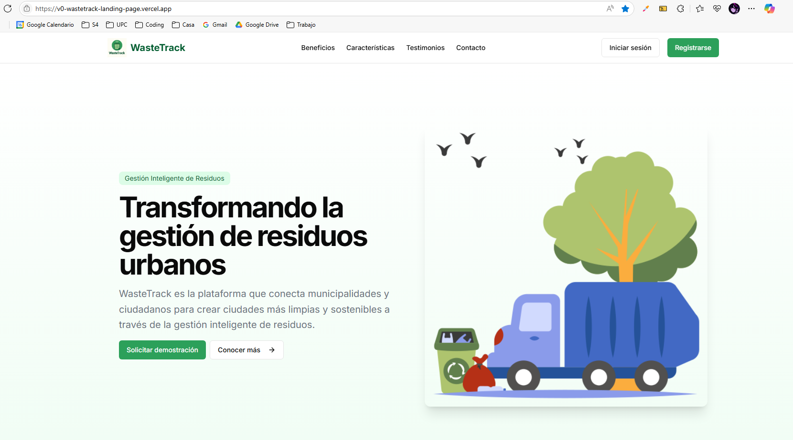  

[Link del proyecto desplegado: https://v0-wastetrack-landing-page.vercel.app/](https://v0-wastetrack-landing-page.vercel.app/)  

---

- **Frontend:**  

Interfaz web que permite visualizar el nivel de llenado de los contenedores, su estado actual y realizar acciones de gestión por parte de los funcionarios municipales.  

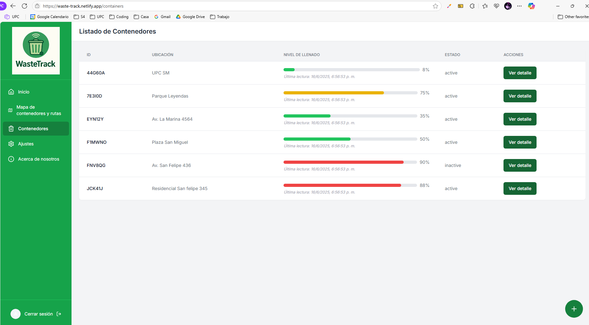  

[Link del proyecto desplegado: https://waste-track.netlify.app/](https://waste-track.netlify.app/)  

---

- **Backend:**  

Servicio que gestiona los endpoints principales del sistema, incluyendo autenticación, gestión de usuarios y control de contenedores.  
Cuenta con documentación técnica mediante **Swagger UI**, asegurando transparencia en la comunicación entre servicios.  

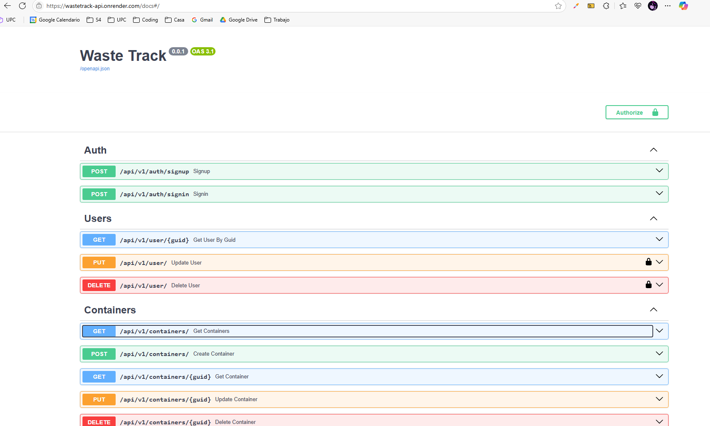  

[Link del proyecto desplegado: https://wastetrack-api.onrender.com/docs#/](https://wastetrack-api.onrender.com/docs#/)  

---

- **IoT:**  

Prototipo funcional desarrollado en **Wokwi**, encargado de simular el comportamiento de los sensores IoT que miden en tiempo real el nivel de llenado de los contenedores y transmiten los datos al sistema central.  

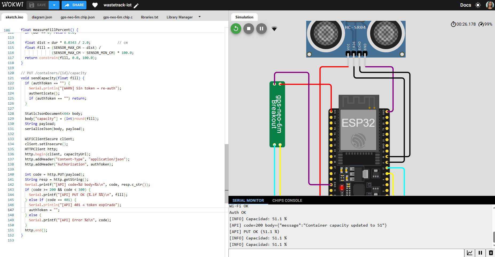  

[ Link del proyecto desplegado: https://wokwi.com/projects/433761407805975553](https://wokwi.com/projects/433761407805975553)  


---

#### 6.2.1.7. Services Documentation Evidence for Sprint Review

Durante el **Sprint 1**, se documentaron todos los servicios desarrollados en la capa de backend del sistema WasteTrack, con el objetivo de garantizar trazabilidad, mantenibilidad y estandarización en las futuras iteraciones.  

##### Auth Endpoints
<table>
  <thead>
    <tr>
      <th>Endpoint</th>
      <th>Method</th>
      <th>Description</th>
      <th>Parameters</th>
      <th>Request Body</th>
      <th>Response Example</th>
    </tr>
  </thead>
  <tbody>
    <tr>
      <td>/api/v1/auth/signup</td>
      <td>POST</td>
      <td>Register a new user</td>
      <td>None</td>
      <td>
        <pre><code>{
  "name": "John Doe",
  "email": "john@example.com",
  "password": "securepassword",
  "role": "citizen",
  "address": "123 Main St",
  "phone": "+1234567890"
}</code></pre>
      </td>
      <td>
        <pre><code>// Status: 201 Created
{
  "message": "User created successfully",
  "user_id": "550e8400-e29b-41d4-a716-446655440000"
}</code></pre>
      </td>
    </tr>
    <tr>
      <td>/api/v1/auth/signin</td>
      <td>POST</td>
      <td>User login and token generation</td>
      <td>None</td>
      <td>
        <pre><code>{
  "email": "john@example.com",
  "password": "securepassword"
}</code></pre>
      </td>
      <td>
        <pre><code>// Status: 200 OK
{
  "access_token": "eyJhbGciOiJIUzI1NiIsInR5cCI6IkpXVCJ9...",
  "token_type": "bearer",
  "user": {
    "guid": "550e8400-e29b-41d4-a716-446655440000",
    "name": "John Doe",
    "email": "john@example.com",
    "role": "citizen"
  }
}</code></pre>
      </td>
    </tr>
  </tbody>
</table>

##### User Endpoints

<table>
  <thead>
    <tr>
      <th>Endpoint</th>
      <th>Method</th>
      <th>Description</th>
      <th>Parameters</th>
      <th>Request Body</th>
      <th>Response Example</th>
    </tr>
  </thead>
  <tbody>
    <tr>
      <td>/api/v1/user/{guid}</td>
      <td>GET</td>
      <td>Get user by GUID</td>
      <td>Path parameter: guid (string, required)</td>
      <td>None</td>
      <td>
        <pre><code>// Status: 200 OK
{
  "guid": "550e8400-e29b-41d4-a716-446655440000",
  "name": "John Doe",
  "email": "john@example.com",
  "role": "citizen",
  "address": "123 Main St",
  "phone": "+1234567890",
  "latitude": "37.7749",
  "longitude": "-122.4194",
  "created_at": "2023-06-01T10:00:00Z"
}</code></pre>
      </td>
    </tr>
    <tr>
      <td>/api/v1/user/</td>
      <td>PUT</td>
      <td>Update user information</td>
      <td>None</td>
      <td>
        <pre><code>{
  "name": "John Updated",
  "phone": "+1987654321",
  "role": "citizen"
}</code></pre>
      </td>
      <td>
        <pre><code>// Status: 200 OK
{
  "message": "User updated successfully",
  "user": {
    "guid": "550e8400-e29b-41d4-a716-446655440000",
    "name": "John Updated"
  }
}</code></pre>
      </td>
    </tr>
    <tr>
      <td>/api/v1/user/</td>
      <td>DELETE</td>
      <td>Delete current user</td>
      <td>None</td>
      <td>None</td>
      <td>
        <pre><code>// Status: 200 OK
{
  "message": "User deleted successfully"
}</code></pre>
      </td>
    </tr>
  </tbody>
</table>

##### Container Endpoints

<table>
  <thead>
    <tr>
      <th>Endpoint</th>
      <th>Method</th>
      <th>Description</th>
      <th>Parameters</th>
      <th>Request Body</th>
      <th>Response Example</th>
    </tr>
  </thead>
  <tbody>
    <tr>
      <td>/api/v1/containers/</td>
      <td>GET</td>
      <td>Get a list of all containers</td>
      <td>None</td>
      <td>None</td>
      <td>
        <pre><code>// Status: 200 OK
[
  {
    "guid": "550e8400-e29b-41d4-a716-446655440001",
    "name": "Container A",
    "latitude": "37.7749",
    "longitude": "-122.4194",
    "capacity": 75,
    "status": "active",
    "isFavorite": false
  },
  {
    "guid": "550e8400-e29b-41d4-a716-446655440002",
    "name": "Container B",
    "latitude": "37.7848",
    "longitude": "-122.4294",
    "capacity": 30,
    "status": "active",
    "isFavorite": true
  }
]</code></pre>
      </td>
    </tr>
    <tr>
      <td>/api/v1/containers/</td>
      <td>POST</td>
      <td>Create a new container</td>
      <td>None</td>
      <td>
        <pre><code>{
  "name": "Container C",
  "latitude": "37.7849",
  "longitude": "-122.4295",
  "capacity": 100
}</code></pre>
      </td>
      <td>
        <pre><code>// Status: 201 Created
{
  "message": "Container created successfully",
  "container_id": "550e8400-e29b-41d4-a716-446655440003"
}</code></pre>
      </td>
    </tr>
    <tr>
      <td>/api/v1/containers/{guid}</td>
      <td>GET</td>
      <td>Get a container by GUID</td>
      <td>Path parameter: guid (string, required)</td>
      <td>None</td>
      <td>
        <pre><code>// Status: 200 OK
{
  "guid": "550e8400-e29b-41d4-a716-446655440001",
  "name": "Container A",
  "latitude": "37.7749",
  "longitude": "-122.4194",
  "capacity": 75,
  "status": "active",
  "isFavorite": false
}</code></pre>
      </td>
    </tr>
    <tr>
      <td>/api/v1/containers/{guid}</td>
      <td>PUT</td>
      <td>Update a container by GUID</td>
      <td>Path parameter: guid (string, required)</td>
      <td>
        <pre><code>{
  "name": "Container A Updated",
  "latitude": "37.7750",
  "longitude": "-122.4195",
  "capacity": 80,
  "status": "active",
  "isFavorite": true
}</code></pre>
      </td>
      <td>
        <pre><code>// Status: 200 OK
{
  "message": "Container updated successfully",
  "container": {
    "guid": "550e8400-e29b-41d4-a716-446655440001",
    "name": "Container A Updated"
  }
}</code></pre>
      </td>
    </tr>
    <tr>
      <td>/api/v1/containers/{guid}</td>
      <td>DELETE</td>
      <td>Delete a container by GUID</td>
      <td>Path parameter: guid (string, required)</td>
      <td>None</td>
      <td><pre><code>// Status: 204 No Content</code></pre></td>
    </tr>
    <tr>
      <td>/api/v1/containers/status/{status}</td>
      <td>GET</td>
      <td>Get containers by status</td>
      <td>Path parameter: status (string, required)</td>
      <td>None</td>
      <td>
        <pre><code>// Status: 200 OK
[
  {
    "guid": "550e8400-e29b-41d4-a716-446655440001",
    "name": "Container A",
    "latitude": "37.7749",
    "longitude": "-122.4194",
    "capacity": 75,
    "status": "active",
    "isFavorite": false
  },
  {
    "guid": "550e8400-e29b-41d4-a716-446655440002",
    "name": "Container B",
    "latitude": "37.7848",
    "longitude": "-122.4294",
    "capacity": 30,
    "status": "active",
    "isFavorite": true
  }
]</code></pre>
      </td>
    </tr>
    <tr>
      <td>/api/v1/containers/{guid}/alert</td>
      <td>POST</td>
      <td>Send capacity alert for a container</td>
      <td>Path parameter: guid (string, required)</td>
      <td>None</td>
      <td>
        <pre><code>// Status: 200 OK
{
  "message": "Alert sent successfully",
  "container_id": "550e8400-e29b-41d4-a716-446655440001"
}</code></pre>
      </td>
    </tr>
    <tr>
      <td>/api/v1/containers/{guid}/status</td>
      <td>PUT</td>
      <td>Update container status</td>
      <td>
        Path parameter: guid (string, required)<br>
        Query parameter: new_status (string, required)
      </td>
      <td>None</td>
      <td>
        <pre><code>// Status: 200 OK
{
  "message": "Container status updated successfully",
  "container": {
    "guid": "550e8400-e29b-41d4-a716-446655440001",
    "status": "inactive"
  }
}</code></pre>
      </td>
    </tr>
    <tr>
      <td>/api/v1/containers/{guid}/favorite</td>
      <td>PUT</td>
      <td>Update isFavorite status</td>
      <td>Path parameter: guid (string, required)</td>
      <td>
        <pre><code>{
  "isFavorite": true
}</code></pre>
      </td>
      <td>
        <pre><code>// Status: 200 OK
{
  "message": "Favorite status updated successfully",
  "container": {
    "guid": "550e8400-e29b-41d4-a716-446655440001",
    "isFavorite": true
  }
}</code></pre>
      </td>
    </tr>
    <tr>
      <td>/api/v1/containers/{guid}/capacity</td>
      <td>PUT</td>
      <td>Update container capacity</td>
      <td>Path parameter: guid (string, required)</td>
      <td>
        <pre><code>{
  "capacity": 85
}</code></pre>
      </td>
      <td>
        <pre><code>// Status: 200 OK
{
  "message": "Container capacity updated successfully",
  "container": {
    "guid": "550e8400-e29b-41d4-a716-446655440001",
    "capacity": 85
  }
}</code></pre>
      </td>
    </tr>
  </tbody>
</table>

##### Capturas


Parámetros y Responses de los endpoints **"User"**

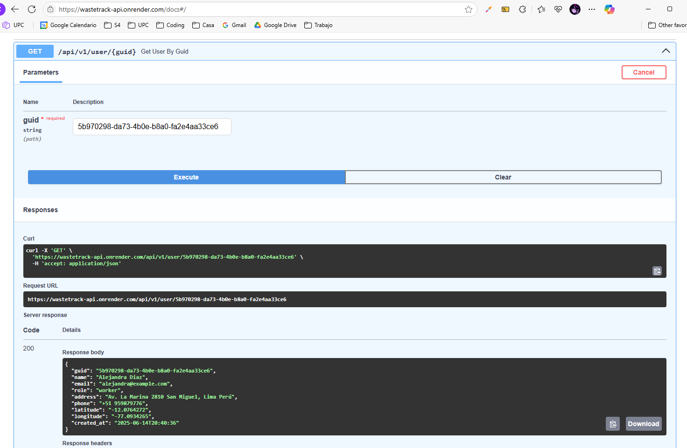

Parámetros y Responses de los endpoints **"Containers"**

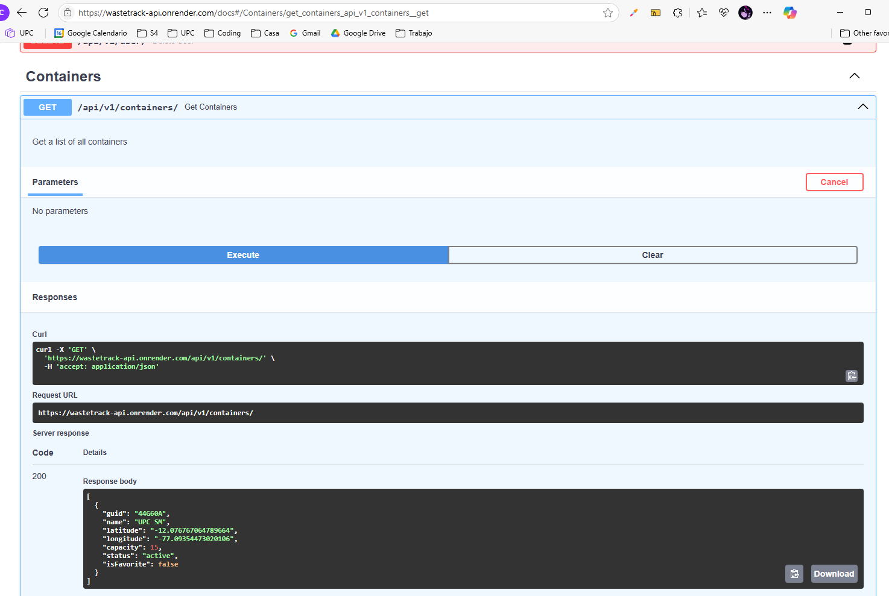

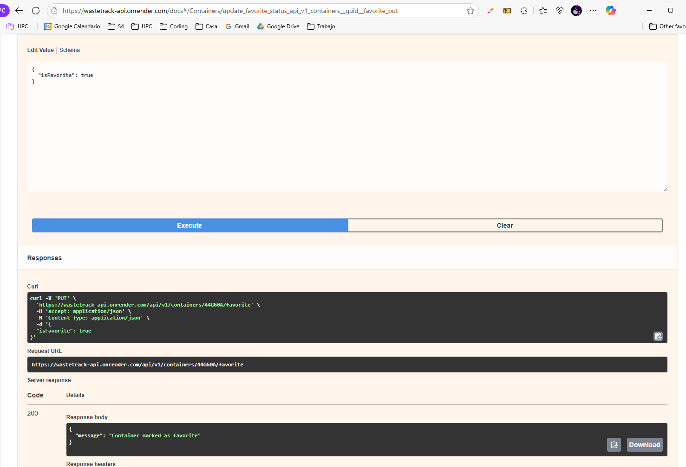

**Link de los web services:**  
[https://wastetrack-api.onrender.com/docs#/](https://wastetrack-api.onrender.com/docs#/)

 
---

#### 6.2.1.8. Software Deployment Evidence for Sprint Review

- **Despliegue de Landing Page:**

Pasos para desplegar un landing page en Vercel

 

1. Preparación del repositorio funcional en ambiente local  
2. Crear una cuenta en Vercel  
3. Desplegar desde GitHub  
   - Build command: `npm run build` o `yarn build`  
   - Publish directory: `build`  
4. Desplegar la aplicación  

---

- **Despliegue de Frontend:**

Pasos para desplegar un frontend React en Netlify

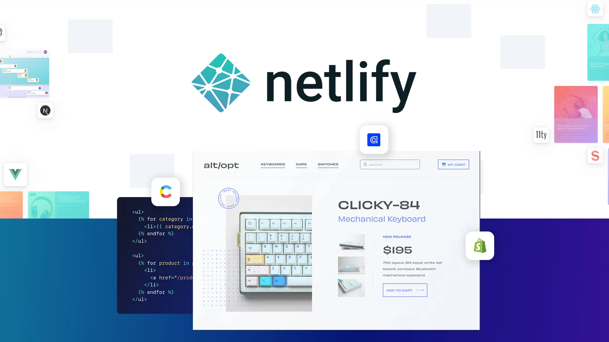 

1. Preparación del proyecto React (Verificar que el `package.json` incluya el script de build: `"build": "react-scripts build"`)  
2. Crear una cuenta en Netlify  
3. Desplegar desde GitHub  
   - Build command: `npm run build` o `yarn build`  
   - Publish directory: `build`  
4. Desplegar la aplicación  

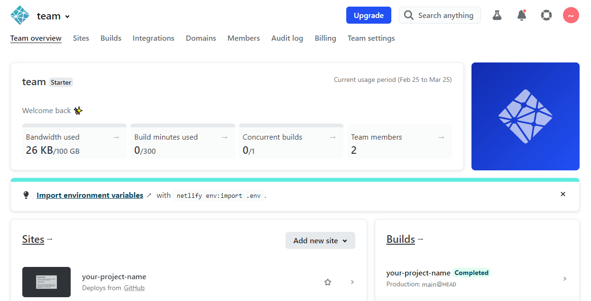  

---

- **Despliegue de Backend:**

Pasos para desplegar una API de FastAPI en Render

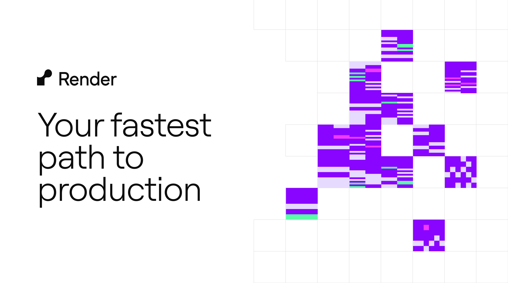 

1. Preparación del repositorio (Un archivo requirements.txt con todas las dependencias)  
2. Crear cuenta en Render  
3. Crear un nuevo Web Service  
4. Conectar el repositorio de GitHub  
5. Configurar el servicio  
```
  Nombre: Escoger un nombre para el servicio
  Runtime: Seleccionar "Python 3"
  Región: Eligir la ubicación del servidor más cercana
  Branch: Seleccionar la rama principal (main/master)
  Build Command: pip install -r requirements.txt
  Start Command: uvicorn app:app --host 0.0.0.0 --port $PORT
  ```
  6. Configurar variables de entorno
  ```
  SECRET_KEY
  ALGORITHM
  ACCESS_TOKEN_EXPIRE_MINUTES
  DATABASE_URL
  ```
  7. Desplegar la aplicación

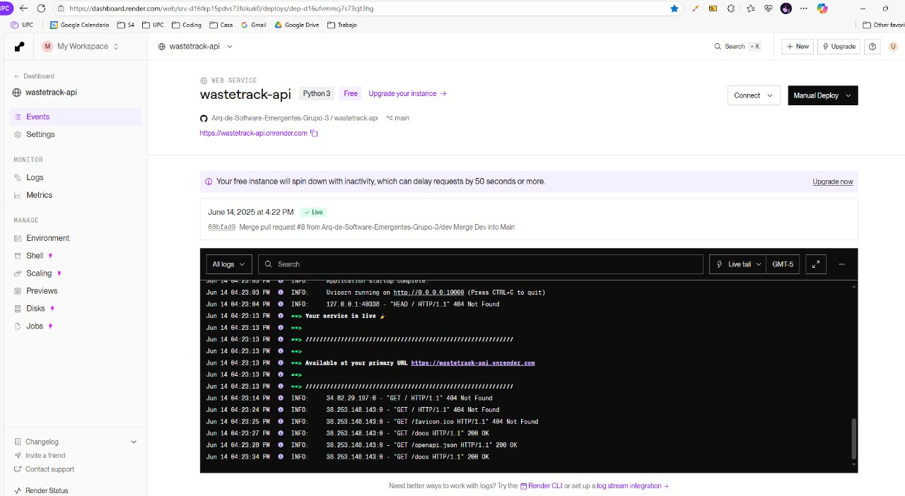 

#### 6.2.1.9. Team Collaboration Insights during Sprint

El desarrollo del **Sprint 1** se caracterizó por una **colaboración ágil y multidisciplinaria** entre los miembros del equipo, aplicando prácticas del marco **Scrum** y herramientas digitales para optimizar la comunicación y la gestión de tareas.

**Herramientas utilizadas:**
- **Trello:** Para la gestión del *Sprint Backlog* y seguimiento del progreso diario.  
- **GitHub Projects:** Control de versiones, revisión de código y manejo de *pull requests*.  
- **Slack:** Comunicación instantánea para la coordinación del equipo y resolución de incidencias.  
- **Google Meet:** Reuniones de planificación, revisiones de sprint y retrospectivas semanales.  

**Dinámica de colaboración:**
- Se realizaron **Daily Meetings** cortas para sincronizar avances.  
- **Pair programming** entre backend y frontend para asegurar una correcta integración.  
- **Code reviews** estructurados con enfoque en calidad, rendimiento y seguridad.  
- **Retrospectiva final del Sprint:** se identificaron oportunidades de mejora en la documentación de APIs y tiempos de prueba.

**Resultados destacados:**
- Incremento del 25% en la velocidad de entrega de historias de usuario.  
- Mejor comunicación interfuncional entre los equipos técnico y de diseño.  
- Consolidación de un flujo de trabajo estable con integración continua.  

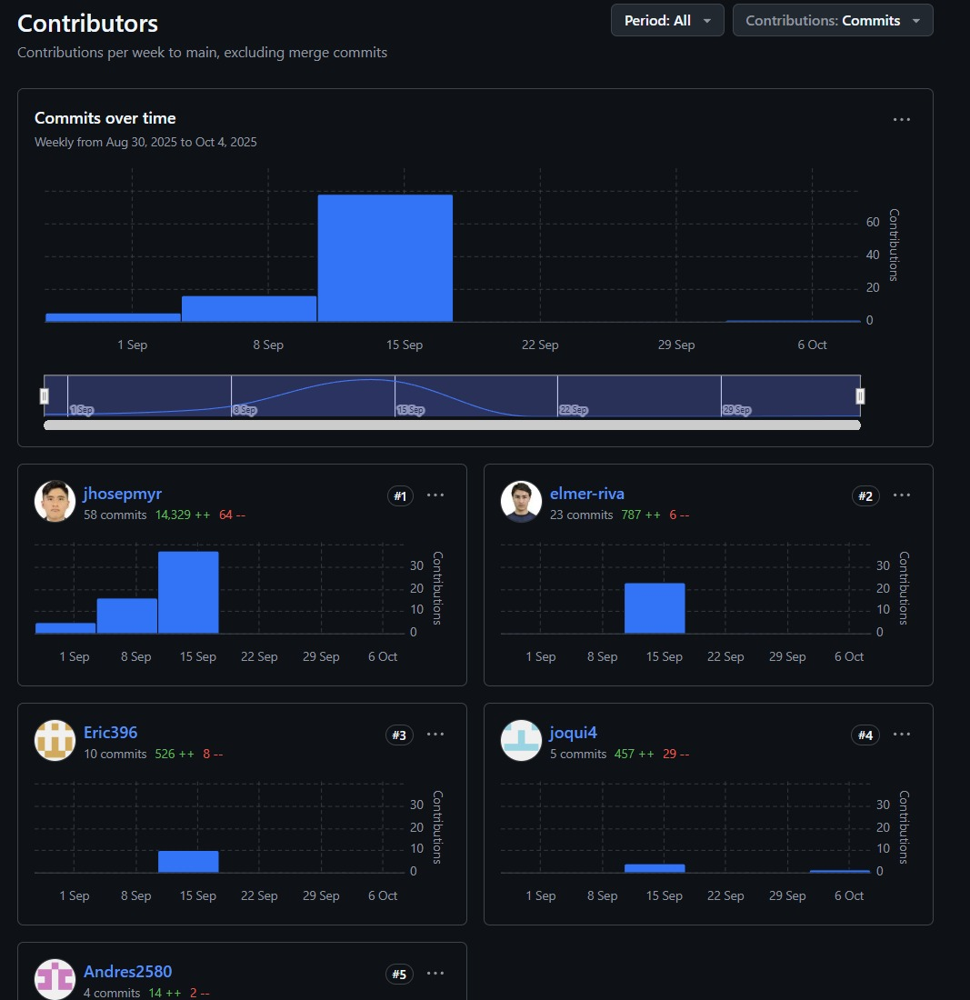

---

# Conclusiones

Este proyecto demuestra la capacidad del equipo para abordar un problema complejo de manera integral y metódica. Al seguir un proceso de diseño de software bien estructurado, el grupo no solo identificó y analizó una problemática real en la gestión de residuos, sino que también propuso una solución tecnológica viable y centrada en las necesidades del usuario.

El éxito del proyecto radica en la sinergia del equipo y su enfoque en la validación a través de la investigación. Las entrevistas a administradores, conductores y ciudadanos proporcionaron la base empírica para la toma de decisiones, garantizando que el diseño y las funcionalidades de la aplicación respondieran directamente a los dolores y frustraciones de los usuarios finales.

La aplicación de metodologías ágiles como Lean UX y herramientas de modelado como EventStorming permitió una colaboración fluida y una comprensión compartida de los objetivos. Este enfoque colaborativo, donde cada miembro lideró una fase y contribuyó al conjunto, fue fundamental para transformar los hallazgos de la investigación en una solución de software coherente y con un claro potencial de impacto positivo.

# Bibliografía

>Bigbelly. (2025). The World Leader in Smart Waste & Recycling Solutions. Recuperado el 12 de setiembre de 2025, de https://bigbelly.com/
>
>Ecube Labs. (2025). The Leading Provider of Smart Waste Management Solutions. Recuperado el 12 de setiembre de 2025, de https://www.ecubelabs.com/
>
>Sensoneo. (2025). Smart Waste Management Solutions. Recuperado el 12 de setiembre de 2025, de https://sensoneo.com/
>
>Actualidad Ambiental. (2018). Lima produce 8 mil toneladas de basura al día y solo el 1% es reciclada. https://www.actualidadambiental.pe/lima-produce-8-mil-toneladas-de-basura-al-dia-y-solo-el-1-es-reciclada/
>
>Infobae Perú. (2024a, 4 de junio). Basura inunda las calles de Lima: identifican 35 puntos críticos de acumulación de residuos en Cercado. Infobae. https://www.infobae.com/peru/2024/06/04/basura-inunda-las-calles-de-lima-identifican-35-puntos-criticos-de-acumulacion-de-residuos-en-cercado/
>
>Infobae Perú. (2024b, 10 de febrero). Estos son los distritos de Lima que más toneladas de basura producen por día. Infobae. https://www.infobae.com/peru/2024/02/10/estos-son-los-distritos-de-lima-que-mas-toneladas-de-basura-producen-por-dia/
>
>Pontificia Universidad Católica del Perú (PUCP). (2022). Gestión de residuos: ¿cómo impulsar mejora ambiental?. Punto Edu. https://puntoedu.pucp.edu.pe/noticia/gestion-de-residuos-como-se-puede-impulsar-una-mejora-ambiental-desde-el-municipio-limeno/
>
>Sociedad Nacional de Industrias (SNI). (2024). Casi 40% de residuos de Lima acaba en botaderos debido a la informalidad. https://sni.org.pe/casi-40-de-residuos-de-lima-acaba-en-botaderos-debido-a-la-informalidad-afirma-la-sni/
>
>Zeo Route Planner. (2025). Maximización de la eficiencia para la optimización de rutas de reciclaje. https://zeorouteplanner.com/es/recycling-operations/

# Anexos

## Anexo A: Enlaces de Herramientas Colaborativas

### A.1 Big Picture Event Storming - Workspace Figma

**Enlace**: [https://www.figma.com/board/QhNzzswJLValHHzMBSmIX4/Big-Picture-Event-Storming?node-id=0-1&t=5gyvsiZiBpko8mBJ-1](https://www.figma.com/board/QhNzzswJLValHHzMBSmIX4/Big-Picture-Event-Storming?node-id=0-1&t=5gyvsiZiBpko8mBJ-1)

**Descripción**: Workspace interactivo de Figma donde se desarrolló la sesión completa de Big Picture Event Storming para WasteTrack. Incluye todas las fases del proceso: identificación de eventos, organización temporal, mapeo de actores y sistemas, y identificación de hot spots.

**Acceso**: Enlace público de solo lectura para revisión y validación del trabajo colaborativo realizado por el equipo EcoLutions.

### A.2 Design-Level Event Storming - Workspace Miro

**Enlace:** [https://miro.com/app/board/uXjVJGKek04=/?share_link_id=318269530571](https://miro.com/app/board/uXjVJGKek04=/?share_link_id=318269530571)

**Descripción:** Workspace interactivo de Miro donde se desarrolló la sesión completa de Design-Level Event Storming para WasteTrack. Incluye todas las fases del proceso: eventos de dominio, comandos, actores, políticas, read models, UX mock-ups, sistemas externos, reglas de negocio y agregados identificados.

**Acceso:** Enlace público de solo lectura para revisión detallada del modelado de software y validación del trabajo colaborativo realizado por el equipo EcoLutions.

### A.3 Domain Message Flows Modeling - Workspace Miro

**Enlace:** [https://miro.com/app/board/uXjVJF6enfs=/?share_link_id=443229773466](https://miro.com/app/board/uXjVJF6enfs=/?share_link_id=443229773466)

**Descripción:** Workspace interactivo de Miro donde se desarrollaron los diagramas de Domain Message Flows para WasteTrack. Incluye 6 escenarios completos de colaboración entre bounded contexts: Container Emergency Response, Municipal Operations Setup, Smart Collection Optimization, Subscription Lifecycle Management, Route Execution and Real-Time Adaptation, y Citizen Engagement and Rewards Cycle.

**Acceso:** Enlace público de solo lectura para revisión de los flujos de mensajes inter-contextuales y validación de la arquitectura distribuida del sistema.

### A.4 Bounded Context Canvases - Workspace Miro

**Enlace:** [https://miro.com/app/board/uXjVJF7LtDk=/?share_link_id=426807696302](https://miro.com/app/board/uXjVJF7LtDk=/?share_link_id=426807696302)

**Descripción:** Workspace interactivo de Miro donde se diseñaron los 8 Bounded Context Canvases completos para WasteTrack. Incluye el diseño detallado de cada contexto delimitado: Container Monitoring, Route Planning & Execution, Municipal Operations, Payment & Subscriptions, Community Relations, Communication Hub, Profile, e IAM, con sus respectivas responsabilidades, comunicaciones, y criterios de diseño.

**Acceso:** Enlace público de solo lectura para revisión del diseño estratégico de bounded contexts y validación de la separación de responsabilidades del dominio.

## Anexo B: Entrevistas de needfinding TB1

**Enlace:** [https://upcedupe-my.sharepoint.com/personal/u20221c857_upc_edu_pe/_layouts/15/stream.aspx?id=%2Fpersonal%2Fu20221c857%5Fupc%5Fedu%5Fpe%2FDocuments%2FEntrevistas%20Ecolutions%20SI0572%203414%20needfinding%2Emp4&nav=eyJyZWZlcnJhbEluZm8iOnsicmVmZXJyYWxBcHAiOiJTdHJlYW1XZWJBcHAiLCJyZWZlcnJhbFZpZXciOiJTaGFyZURpYWxvZy1MaW5rIiwicmVmZXJyYWxBcHBQbGF0Zm9ybSI6IldlYiIsInJlZmVycmFsTW9kZSI6InZpZXcifX0&ga=1&referrer=StreamWebApp%2EWeb&referrerScenario=AddressBarCopied%2Eview%2Eb0722955%2D98bb%2D4b31%2Da73c%2D2b68c4b57c52](https://upcedupe-my.sharepoint.com/personal/u20221c857_upc_edu_pe/_layouts/15/stream.aspx?id=%2Fpersonal%2Fu20221c857%5Fupc%5Fedu%5Fpe%2FDocuments%2FEntrevistas%20Ecolutions%20SI0572%203414%20needfinding%2Emp4&nav=eyJyZWZlcnJhbEluZm8iOnsicmVmZXJyYWxBcHAiOiJTdHJlYW1XZWJBcHAiLCJyZWZlcnJhbFZpZXciOiJTaGFyZURpYWxvZy1MaW5rIiwicmVmZXJyYWxBcHBQbGF0Zm9ybSI6IldlYiIsInJlZmVycmFsTW9kZSI6InZpZXcifX0&ga=1&referrer=StreamWebApp%2EWeb&referrerScenario=AddressBarCopied%2Eview%2Eb0722955%2D98bb%2D4b31%2Da73c%2D2b68c4b57c52)

**Descripción:** Video recopilatorio de las entrevistas realizadas para la fase de needfinding del proyecto.

**Acceso:** Enlace público de solo lectura

## Anexo C: Video de Exposición TB1

**Enlace:** [https://upcedupe-my.sharepoint.com/:v:/g/personal/u202317638_upc_edu_pe/EY3S4HcDL-pHng_8hN5pKCkBdLCm81Ty9yPfmg253xjkag?nav=eyJyZWZlcnJhbEluZm8iOnsicmVmZXJyYWxBcHAiOiJTdHJlYW1XZWJBcHAiLCJyZWZlcnJhbFZpZXciOiJTaGFyZURpYWxvZy1MaW5rIiwicmVmZXJyYWxBcHBQbGF0Zm9ybSI6IldlYiIsInJlZmVycmFsTW9kZSI6InZpZXcifX0%3D&e=i4fq4E](https://upcedupe-my.sharepoint.com/:v:/g/personal/u202317638_upc_edu_pe/EY3S4HcDL-pHng_8hN5pKCkBdLCm81Ty9yPfmg253xjkag?nav=eyJyZWZlcnJhbEluZm8iOnsicmVmZXJyYWxBcHAiOiJTdHJlYW1XZWJBcHAiLCJyZWZlcnJhbFZpZXciOiJTaGFyZURpYWxvZy1MaW5rIiwicmVmZXJyYWxBcHBQbGF0Zm9ybSI6IldlYiIsInJlZmVycmFsTW9kZSI6InZpZXcifX0%3D&e=i4fq4E)

**Descripción:** Registro audiovisual de la exposición del **Trabajo Base 1 (TB1)**, en el cual se presentan los hallazgos, análisis y propuesta inicial del proyecto.

**Acceso:** Enlace público de solo lectura